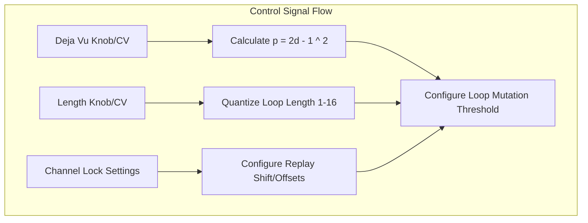
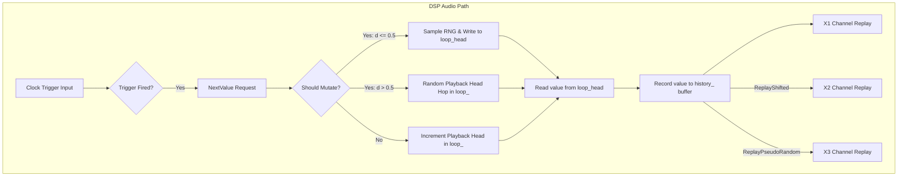

# Deja Vu Memory (Looping Shift Register)

This document covers the **Deja Vu Memory** engine of the [Marbles](https://github.com/arachnegl/eurorack/tree/master/marbles) module. 
This section controls pattern loops, memory shift registers, and sequence mutations.

---

## 1. Rhythmic & CV Principles: Deja Vu Looping

The Deja Vu section acts as a circular shift register that captures and loops sequences of gates and control 
voltages.

### The Deja Vu Control Knob
The **DEJA VU** parameter controls the probability of replaying the loop vs. mutating:
* **Fully CCW (deja_vu = 0.0)**: Random walk. Generates continuous, non-repeating random values.
* **Centered (deja_vu = 0.5)**: Locked state. Loops the existing buffer of values indefinitely.
* **Fully CW (deja_vu = 1.0)**: Replays values from the buffer, but hops randomly between different indices, 
  creating variation without adding new values.

### Loop Length
The **deja_vu_length** setting quantizes loop sizes. Loop length determines the count of values (typically 1 to 16) 
stored in the loop.

### Correlated Phase Shift
X1, X2, and X3 can be locked to the *same* master Deja Vu loop, but are offset or
transformed (locked chordal structures, phase shifts, or mirror patterns).

---

## 2. Code Implementation

The looping memory is implemented in the [RandomSequence](https://github.com/arachnegl/eurorack/blob/master/marbles/random/random_sequence.h) class.

### Mutation Probability Formula
Inside [RandomSequence::NextValue()](https://github.com/arachnegl/eurorack/blob/master/marbles/random/random_sequence.h#L160):
- The probability of mutation is computed as:
  ```cpp
  const float p_sqrt = 2.0f * deja_vu_ - 1.0f;
  const float p = p_sqrt * p_sqrt;
  const bool mutate = random_stream_->GetFloat() < p;
  ```
  - If `deja_vu = 0.5`, then `p = 0` (no mutation, loop is locked).
  - If `deja_vu = 0` or `1`, then `p = 1` (maximum mutation probability).

### Loop Traversal
- If `mutate` is true and `deja_vu <= 0.5`, a new random value is recorded into the loop buffer `loop_`:
  ```cpp
  redo_write_ptr_ = &loop_[loop_write_head_];
  *redo_write_ptr_ = random_stream_->GetFloat();
  ```
- If `mutate` is true and `deja_vu > 0.5`, the playback head hops randomly within the buffer:
  ```cpp
  step_ = static_cast<int>(random_stream_->GetFloat() * static_cast<float>(length_));
  ```
- Otherwise, the playback head increments sequentially:
  ```cpp
  step_ = (step_ + 1) % length_;
  ```

### Correlation & History Replay
Inside [XYGenerator::Process()](https://github.com/arachnegl/eurorack/blob/master/marbles/random/x_y_generator.cc#L186):
* When all channels follow the same clock, channels X2 and X3 read from X1's sequence but with phase shifts:
  ```cpp
  sequence->ReplayShifted(i);
  ```

---

## 3. Structural Flow Diagrams

### Control Path Diagram


### DSP Audio Path Diagram


---

<!-- KaTeX support for mathematical formulas -->
<link rel="stylesheet" href="https://cdn.jsdelivr.net/npm/katex@0.16.8/dist/katex.min.css">
<script defer src="https://cdn.jsdelivr.net/npm/katex@0.16.8/dist/katex.min.js"></script>
<script defer src="https://cdn.jsdelivr.net/npm/katex@0.16.8/dist/contrib/auto-render.min.js"
        onload="renderMathInElement(document.body, {
          delimiters: [
            {left: '$$', right: '$$', display: true},
            {left: '$', right: '$', display: false}
          ]
        });"></script>

<!-- Mermaid JS support for rendering diagrams with Click-to-Zoom Lightbox -->
<script type="module">
  import mermaid from 'https://cdn.jsdelivr.net/npm/mermaid@10/dist/mermaid.esm.min.mjs';
  mermaid.initialize({ startOnLoad: false });
  
  // Inject lightbox styling
  const style = document.createElement('style');
  style.textContent = `
    .mermaid-lightbox {
      position: fixed;
      top: 0;
      left: 0;
      width: 100vw;
      height: 100vh;
      background: rgba(15, 15, 15, 0.9);
      backdrop-filter: blur(8px);
      -webkit-backdrop-filter: blur(8px);
      display: flex;
      align-items: center;
      justify-content: center;
      z-index: 10000;
      opacity: 0;
      transition: opacity 0.2s ease;
      pointer-events: none;
    }
    .mermaid-lightbox.active {
      opacity: 1;
      pointer-events: auto;
    }
    .mermaid-lightbox svg {
      max-width: 90%;
      max-height: 90%;
      width: auto;
      height: auto;
      background: rgba(255, 255, 255, 0.95);
      padding: 20px;
      border-radius: 8px;
      box-shadow: 0 20px 50px rgba(0, 0, 0, 0.3);
    }
    .mermaid-lightbox .close-btn {
      position: absolute;
      top: 20px;
      right: 30px;
      font-size: 40px;
      color: #fff;
      cursor: pointer;
      user-select: none;
      font-family: sans-serif;
    }
    .mermaid-trigger {
      cursor: zoom-in;
      transition: transform 0.2s ease;
    }
    .mermaid-trigger:hover {
      transform: scale(1.01);
    }
  `;
  document.head.appendChild(style);

  // Inject lightbox modal elements
  const lightbox = document.createElement('div');
  lightbox.className = 'mermaid-lightbox';
  lightbox.innerHTML = '<span class="close-btn">&times;</span><div class="content"></div>';
  document.body.appendChild(lightbox);

  lightbox.addEventListener('click', () => {
    lightbox.classList.remove('active');
  });

  // Convert Mermaid code blocks to styled divs
  const codeBlocks = document.querySelectorAll('.language-mermaid code, pre code.language-mermaid');
  codeBlocks.forEach((block) => {
    const container = block.closest('.language-mermaid') || block.parentElement;
    const el = document.createElement('div');
    el.className = 'mermaid mermaid-trigger';
    el.textContent = block.textContent;
    container.replaceWith(el);
  });
  
  // Render and handle lightbox events
  mermaid.run().then(() => {
    document.querySelectorAll('.mermaid-trigger').forEach((trigger) => {
      trigger.addEventListener('click', () => {
        const content = lightbox.querySelector('.content');
        content.innerHTML = trigger.innerHTML;
        lightbox.classList.add('active');
      });
    });
  });
</script>
