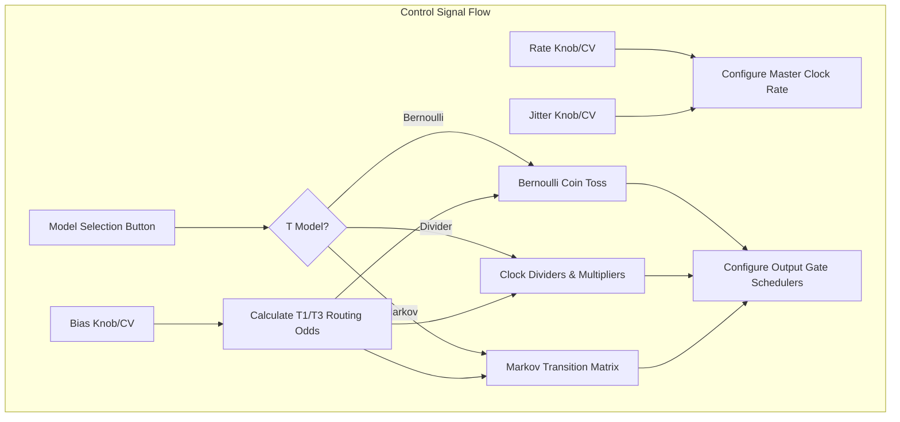
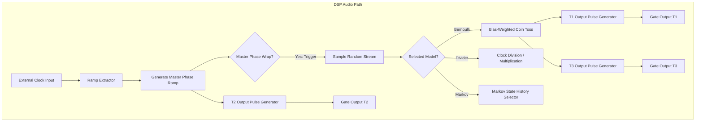

# t Generator (Rhythmic Gate Engine)

This document covers the **t Generator** engine of the [Marbles](https://github.com/arachnegl/eurorack/tree/master/marbles) module. 
This section generates random trigger and gate outputs at channels T1, T2, and T3.

---

## 1. Rhythmic Principles: Random Gates & Clocks

The `t` section generates gate sequences by combining clock dividers, probability-based coin tosses (Bernoulli gates), 
and historical state models.

### t2 Master Clock & Jitter
T2 is the master clock source.
* **Internal Mode**: Runs at a frequency set by the **RATE** knob.
* **External Mode**: Locks to the external clock input.
* **Jitter**: The **JITTER** control shifts clock edges by adding random timing perturbations. Fully CW creates 
  extremely unstable, fluctuating clocks.

### Output Channels (T1 & T3)
T1 and T3 are derived from the master clock based on the **BIAS** knob and selected model:
1. **Bernoulli Gates (t1/t3 complementary)**: T2 triggers are routed to T1 or T3 based on a virtual coin toss. 
   **BIAS** controls the odds (fully CCW only routes to T1, fully CW only to T3, centered is 50/50).
2. **Dividers/Multipliers (t1/t3 clock ratios)**: T1 and T3 are divisions or multiplications of the T2 clock rate.
3. **Markov Alternate**: Rhythmic transitions occur based on transition probabilities, creating "drum groove" state 
   transitions.

---

## 2. Code Implementation

The gate generator is implemented in the [TGenerator](https://github.com/arachnegl/eurorack/blob/master/marbles/random/t_generator.h) class.

### Clock Extraction & Phase
Inside [TGenerator::Process()](https://github.com/arachnegl/eurorack/blob/master/marbles/random/t_generator.cc#L98):
- If using an external clock, the [RampExtractor](https://github.com/arachnegl/eurorack/blob/master/marbles/ramp/ramp_extractor.h) measures the interval between
  incoming pulses and generates a phase ramp `ramps.master`:
  ```cpp
  ramp_extractor_.Process(r, false, reset, external_clock, ramps.master, size);
  ```
- **Jitter Generation**: Jitter is applied by scaling the phase increment by a random timing offset:
  ```cpp
  float jitter_sample = random_stream_->GetFloat() * jitter_;
  master_phase_ += (1.0f + jitter_sample) * rate_;
  ```

### Bernoulli Coin Toss Logic
Inside [TGenerator::GenerateComplementaryBernoulli()](https://github.com/arachnegl/eurorack/blob/master/marbles/random/t_generator.cc#L154):
* When a master clock pulse fires, a random value `p` determines the routing:
  ```cpp
  float p = random_stream_->GetFloat();
  bool route_to_t3 = p >= bias_;
  ```
* Output pulse width is calculated using a Beta distribution to add organic variations:
  ```cpp
  float pw = BetaDistributionSample(u, pulse_width_std_, pulse_width_mean_);
  ```

---

## 3. Structural Flow Diagrams

### Control Path Diagram


### DSP Audio Path Diagram


---

<!-- KaTeX support for mathematical formulas -->
<link rel="stylesheet" href="https://cdn.jsdelivr.net/npm/katex@0.16.8/dist/katex.min.css">
<script defer src="https://cdn.jsdelivr.net/npm/katex@0.16.8/dist/katex.min.js"></script>
<script defer src="https://cdn.jsdelivr.net/npm/katex@0.16.8/dist/contrib/auto-render.min.js"
        onload="renderMathInElement(document.body, {
          delimiters: [
            {left: '$$', right: '$$', display: true},
            {left: '$', right: '$', display: false}
          ]
        });"></script>

<!-- Mermaid JS support for rendering diagrams with Click-to-Zoom Lightbox -->
<script type="module">
  import mermaid from 'https://cdn.jsdelivr.net/npm/mermaid@10/dist/mermaid.esm.min.mjs';
  mermaid.initialize({ startOnLoad: false });
  
  // Inject lightbox styling
  const style = document.createElement('style');
  style.textContent = `
    .mermaid-lightbox {
      position: fixed;
      top: 0;
      left: 0;
      width: 100vw;
      height: 100vh;
      background: rgba(15, 15, 15, 0.9);
      backdrop-filter: blur(8px);
      -webkit-backdrop-filter: blur(8px);
      display: flex;
      align-items: center;
      justify-content: center;
      z-index: 10000;
      opacity: 0;
      transition: opacity 0.2s ease;
      pointer-events: none;
    }
    .mermaid-lightbox.active {
      opacity: 1;
      pointer-events: auto;
    }
    .mermaid-lightbox svg {
      max-width: 90%;
      max-height: 90%;
      width: auto;
      height: auto;
      background: rgba(255, 255, 255, 0.95);
      padding: 20px;
      border-radius: 8px;
      box-shadow: 0 20px 50px rgba(0, 0, 0, 0.3);
    }
    .mermaid-lightbox .close-btn {
      position: absolute;
      top: 20px;
      right: 30px;
      font-size: 40px;
      color: #fff;
      cursor: pointer;
      user-select: none;
      font-family: sans-serif;
    }
    .mermaid-trigger {
      cursor: zoom-in;
      transition: transform 0.2s ease;
    }
    .mermaid-trigger:hover {
      transform: scale(1.01);
    }
  `;
  document.head.appendChild(style);

  // Inject lightbox modal elements
  const lightbox = document.createElement('div');
  lightbox.className = 'mermaid-lightbox';
  lightbox.innerHTML = '<span class="close-btn">&times;</span><div class="content"></div>';
  document.body.appendChild(lightbox);

  lightbox.addEventListener('click', () => {
    lightbox.classList.remove('active');
  });

  // Convert Mermaid code blocks to styled divs
  const codeBlocks = document.querySelectorAll('.language-mermaid code, pre code.language-mermaid');
  codeBlocks.forEach((block) => {
    const container = block.closest('.language-mermaid') || block.parentElement;
    const el = document.createElement('div');
    el.className = 'mermaid mermaid-trigger';
    el.textContent = block.textContent;
    container.replaceWith(el);
  });
  
  // Render and handle lightbox events
  mermaid.run().then(() => {
    document.querySelectorAll('.mermaid-trigger').forEach((trigger) => {
      trigger.addEventListener('click', () => {
        const content = lightbox.querySelector('.content');
        content.innerHTML = trigger.innerHTML;
        lightbox.classList.add('active');
      });
    });
  });
</script>
