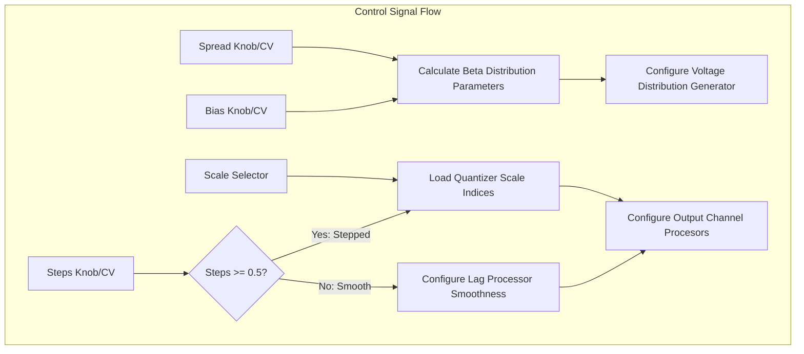
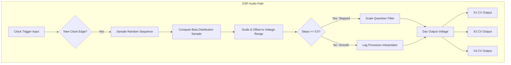

# X & Y Generators (Random CV Engine)

This document covers the **X & Y Generators** of the [Marbles](https://github.com/arachnegl/eurorack/tree/master/marbles) module. 
This section generates random CV outputs at channels X1, X2, X3, and Y.

---

## 1. Audio & CV Principles: Voltage Shaping & Quantization

The `X` and `Y` sections generate random control voltages by combining probability distribution shaping, step 
quantization, and scale matching.

### Probability Distribution (Spread & Bias)
The **SPREAD** and **BIAS** knobs shape the statistical distribution of the generated voltages using a **Beta 
distribution**:
- **Spread at Center (12 o'clock)**: Standard bell-curve (Gaussian/normal) distribution. Samples cluster around 
  the center.
- **Spread Fully CW**: Bimodal (Bernoulli) distribution. Samples jump between extreme minimum and maximum values 
  (binary state).
- **Spread Fully CCW**: Degenerate distribution. Samples are locked to a single constant value.
- **Bias**: Controls the skew of the distribution (biasing values towards the positive or negative direction).

### Quantization & Smoothness (Steps)
The **STEPS** knob controls the interpolation and quantization of the voltages:
* **Stepped Mode (Steps > 0.5)**: Voltages are quantized. From 0.5 (fully chromatic/quantized to selected scale) 
  to 1.0 (continuous stepped voltages).
* **Smooth Mode (Steps < 0.5)**: Voltages are interpolated. From 0.5 (rigid steps) to 0.0 (slewed, fluctuating 
  random walk).

---

## 2. Code Implementation

Voltages are processed by the [XYGenerator](https://github.com/arachnegl/eurorack/blob/master/marbles/random/x_y_generator.h) and generated for each output 
channel in [OutputChannel](https://github.com/arachnegl/eurorack/blob/master/marbles/random/output_channel.h).

### Beta Distribution Sampling
Inside [OutputChannel::GenerateNewVoltage()](https://github.com/arachnegl/eurorack/blob/master/marbles/random/output_channel.cc#L73):
1. A random seed `u` is pulled from the `RandomSequence`.
2. The raw sample is processed using `BetaDistributionSample`:
   ```cpp
   float value = BetaDistributionSample(u, spread_, bias_);
   ```
3. The sample is blended between degenerate (constant bias) and binary (Bernoulli) states:
   ```cpp
   value += degenerate_amount * (bias_ - value);
   value += bernoulli_amount * (bernoulli_value - value);
   ```

### Steps, Quantization & Lag Processing
Inside [OutputChannel::Process()](https://github.com/arachnegl/eurorack/blob/master/marbles/random/output_channel.cc#L94):
- When a clock transition occurs, a new voltage is sampled and quantized using the
  [Quantizer](https://github.com/arachnegl/eurorack/blob/master/marbles/random/quantizer.h):
  ```cpp
  quantized_voltage_ = Quantize(voltage_, 2.0f * steps - 1.0f);
  ```
- If `steps < 0.5f`, the voltage is smoothed using the [LagProcessor](https://github.com/arachnegl/eurorack/blob/master/marbles/random/lag_processor.h):
  ```cpp
  const float smoothness = 1.0f - 2.0f * steps;
  *output = lag_processor_.Process(voltage_, smoothness, *phase);
  ```
- If `steps >= 0.5f`, the output is the direct quantized step value.

---

## 3. Structural Flow Diagrams

### Control Path Diagram


### DSP Audio Path Diagram


---

<!-- KaTeX support for mathematical formulas -->
<link rel="stylesheet" href="https://cdn.jsdelivr.net/npm/katex@0.16.8/dist/katex.min.css">
<script defer src="https://cdn.jsdelivr.net/npm/katex@0.16.8/dist/katex.min.js"></script>
<script defer src="https://cdn.jsdelivr.net/npm/katex@0.16.8/dist/contrib/auto-render.min.js"
        onload="renderMathInElement(document.body, {
          delimiters: [
            {left: '$$', right: '$$', display: true},
            {left: '$', right: '$', display: false}
          ]
        });"></script>

<!-- Mermaid JS support for rendering diagrams with Click-to-Zoom Lightbox -->
<script type="module">
  import mermaid from 'https://cdn.jsdelivr.net/npm/mermaid@10/dist/mermaid.esm.min.mjs';
  mermaid.initialize({ startOnLoad: false });
  
  // Inject lightbox styling
  const style = document.createElement('style');
  style.textContent = `
    .mermaid-lightbox {
      position: fixed;
      top: 0;
      left: 0;
      width: 100vw;
      height: 100vh;
      background: rgba(15, 15, 15, 0.9);
      backdrop-filter: blur(8px);
      -webkit-backdrop-filter: blur(8px);
      display: flex;
      align-items: center;
      justify-content: center;
      z-index: 10000;
      opacity: 0;
      transition: opacity 0.2s ease;
      pointer-events: none;
    }
    .mermaid-lightbox.active {
      opacity: 1;
      pointer-events: auto;
    }
    .mermaid-lightbox svg {
      max-width: 90%;
      max-height: 90%;
      width: auto;
      height: auto;
      background: rgba(255, 255, 255, 0.95);
      padding: 20px;
      border-radius: 8px;
      box-shadow: 0 20px 50px rgba(0, 0, 0, 0.3);
    }
    .mermaid-lightbox .close-btn {
      position: absolute;
      top: 20px;
      right: 30px;
      font-size: 40px;
      color: #fff;
      cursor: pointer;
      user-select: none;
      font-family: sans-serif;
    }
    .mermaid-trigger {
      cursor: zoom-in;
      transition: transform 0.2s ease;
    }
    .mermaid-trigger:hover {
      transform: scale(1.01);
    }
  `;
  document.head.appendChild(style);

  // Inject lightbox modal elements
  const lightbox = document.createElement('div');
  lightbox.className = 'mermaid-lightbox';
  lightbox.innerHTML = '<span class="close-btn">&times;</span><div class="content"></div>';
  document.body.appendChild(lightbox);

  lightbox.addEventListener('click', () => {
    lightbox.classList.remove('active');
  });

  // Convert Mermaid code blocks to styled divs
  const codeBlocks = document.querySelectorAll('.language-mermaid code, pre code.language-mermaid');
  codeBlocks.forEach((block) => {
    const container = block.closest('.language-mermaid') || block.parentElement;
    const el = document.createElement('div');
    el.className = 'mermaid mermaid-trigger';
    el.textContent = block.textContent;
    container.replaceWith(el);
  });
  
  // Render and handle lightbox events
  mermaid.run().then(() => {
    document.querySelectorAll('.mermaid-trigger').forEach((trigger) => {
      trigger.addEventListener('click', () => {
        const content = lightbox.querySelector('.content');
        content.innerHTML = trigger.innerHTML;
        lightbox.classList.add('active');
      });
    });
  });
</script>
