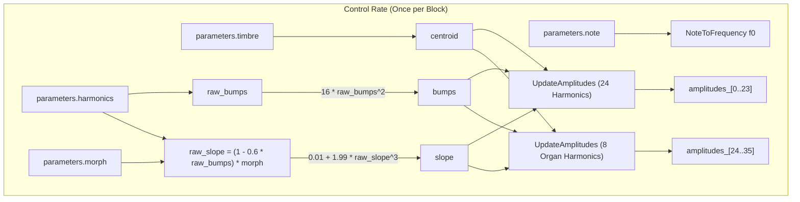

# Additive Engine

This document covers the DSP analysis of the
[AdditiveEngine](https://github.com/arachnegl/eurorack/blob/master/plaits/dsp/engine/additive_engine.h) class.

---

### Control Rate Flow Diagram



### DSP Loop Flow Diagram

```mermaid
graph TD
    subgraph dsp_loop ["DSP Render Loop (Per Sample)"]
        fm[fm: frequency interpolator] -->|f0| Osc1["harmonic_oscillator_[0] (k=1)"]
        fm -->|f0| Osc2["harmonic_oscillator_[1] (k=13)"]
        fm -->|f0| Osc3["harmonic_oscillator_[2] (k=1)"]
        
        am1["am[0..11]: amplitude interpolators"] -->|amplitudes_[0..11]| Osc1
        am2["am[12..23]: amplitude interpolators"] -->|amplitudes_[12..23]| Osc2
        am3["am[24..35]: amplitude interpolators"] -->|amplitudes_[24..35] (sparse)| Osc3
        
        phase_["phase_ accumulator"] -->|SineNoWrap| two_x["2 * sin(phase_)"]
        
        two_x --> Osc1
        two_x --> Osc2
        two_x --> Osc3
        
        Osc1 -->|Render / Overwrite| main_out[out: Main Output]
        Osc2 -->|Render / Accumulate| main_out
        Osc3 -->|Render / Overwrite| aux_out[aux: Organ Output]
    end
```

---

### Core DSP & Synthesis Techniques

#### 1. Spectral Envelope & Formant Generation
The spectral envelope of the additive engine is determined by three main parameter mappings: `centroid`, `slope`, and `bumps`.
These are derived from the module's controls:

*   **Centroid ($c$):** Governed directly by `parameters.timbre`. It determines the center frequency (or spectral peak) of the harmonic spectrum.
*   **Slope ($S$):** Governed by `parameters.morph` and adjusted by `parameters.harmonics`. It dictates the width and roll-off rate of the spectral envelope:
    $$S_{\text{raw}} = (1.0 - 0.6 \cdot B_{\text{raw}}) \cdot \text{morph}$$
    $$S = 0.01 + 1.99 \cdot S_{\text{raw}}^3$$
    A small $S$ (close to $0.01$) results in a wide, bright spectrum with many harmonics. A large $S$ (up to $2.0$) produces a steep envelope, concentrating energy around the center frequency to create a dark sound.
*   **Bumps ($B$):** Governed by `parameters.harmonics`. It introduces periodic ripples or combs into the spectral distribution:
    $$B = 16.0 \cdot B_{\text{raw}}^2$$

##### Amplitude Calculation:
For $N$ harmonics, a virtual margin $M$ is defined to allow the envelope center to sweep smoothly past the edges of the frequency range:
$$M = \frac{1/S - 1}{1 + B}$$
$$c = \text{centroid} \cdot (N - 1 + M) - 0.5 M$$

For each harmonic index $i \in [0, N-1]$, its distance from the envelope center $c$ is scaled by the slope:
$$d_i = |i - c| \cdot S$$

The base gain window $w_i$ is parabolic and vanishes when $d_i \ge 1$:
$$w_i = \max(0, 2(1 - d_i))$$

A cosine ripple is then modulated onto this window using the bumps parameter:
$$r_i = 1 + \cos(2\pi \cdot d_i \cdot B)$$
$$g_i = \left( w_i \cdot r_i \right)^4$$

The final exponent of $8$ (derived from squaring $w_i$ and $r_i$ twice) creates extremely sharp peaks and deep valleys in the spectrum, mimicking vocal formants or comb-filtered resonances.

#### 2. Chebyshev Recurrence Relation
Generating dozens of sine waves individually is computationally prohibitive. To optimize this, the `HarmonicOscillator` class utilizes a recurrence relation based on Chebyshev polynomials.

The standard Chebyshev recurrence relation is:
$$T_{n+1}(x) = 2x T_n(x) - T_{n-1}(x)$$
where $x = \cos(\theta)$ and $T_n(x) = \cos(n\theta)$.

To avoid computing cosines, `HarmonicOscillator` implements a modified recurrence utilizing the sine lookup value of the fundamental phase $\theta = 2\pi \cdot \text{phase}$:
$$2x = 2\sin(\theta)$$
Letting $y_n$ be the recurrence sequence defined by:
$$y_n = 2\sin(\theta) y_{n-1} - y_{n-2}$$

If the series starts at harmonic $1$ (fundamental):
*   $y_0 = 1.0 = \cos(0\theta)$
*   $y_1 = \sin(\theta)$

By applying the product-to-sum trigonometric identities, the sequence evaluates to:
*   $y_0 = \cos(0\theta)$
*   $y_1 = \sin(\theta)$
*   $y_2 = 2\sin(\theta)\sin(\theta) - 1.0 = -\cos(2\theta)$
*   $y_3 = 2\sin(\theta)(-\cos(2\theta)) - \sin(\theta) = -\sin(3\theta)$
*   $y_4 = 2\sin(\theta)(-\sin(3\theta)) - (-\cos(2\theta)) = \cos(4\theta)$

This results in a 4-step periodic phase pattern:
$$\{\sin(\theta), \, -\cos(2\theta), \, -\sin(3\theta), \, \cos(4\theta), \, \sin(5\theta), \, \dots\}$$

Because the human ear is insensitive to the relative phases of steady-state harmonics, these phase shifts are musically equivalent to pure sines, enabling the generation of all harmonics in a batch with only **one multiplication and one subtraction per harmonic** per sample.

##### Recurrence Resetting:
Accumulation of floating-point errors makes Chebyshev recurrence unstable over long sequences. `AdditiveEngine` resolves this by rendering harmonics in batches of 12 (using template parameter `kHarmonicBatchSize = 12`).
For batches starting at harmonic index $k > 1$, the recurrence is initialized by calculating the starting boundary phases directly:
*   $y_{k-1} = \sin(2\pi \cdot \text{phase} \cdot (k-1) + \pi/2) = \cos((k-1)\theta)$
*   $y_k = \sin(2\pi \cdot \text{phase} \cdot k) = \sin(k\theta)$

The recurrence then propagates the same phase-shifted sequence starting at $k$.

#### 3. Sparse Drawbar Organ Mode
While the main output `out` renders a dense spectrum of 24 contiguous integer harmonics, the auxiliary output `aux` renders a sparse set of 8 partials designed to emulate the drawbars of a tonewheel organ:

$$\text{organ\_harmonics} = \{f_0, \, 2f_0, \, 3f_0, \, 4f_0, \, 6f_0, \, 8f_0, \, 10f_0, \, 12f_0\}$$

These map to the standard organ intervals (Fundamental, Octave, 12th, 15th, 19th, 22nd, 24th, 26th).
To compute this efficiently, `UpdateAmplitudes` updates only these specific indices in the amplitude buffer, leaving the skipped indices at $0.0$. The Chebyshev recurrence still runs for all 12 harmonics, but the skipped harmonics are multiplied by zero amplitude, saving processing overhead.

#### 4. Bandwidth Limiting & Anti-Aliasing
To prevent high-order partials from aliasing above the Nyquist limit, `HarmonicOscillator` applies a linear fade-out as individual harmonic frequencies approach Nyquist:
$$A_{i, \text{anti-alias}} = A_i \cdot \max(0.0, \, 1.0 - 2f_i)$$
where $f_i = f_0 \cdot (k + i)$ is the normalized frequency (where $0.5$ represents the Nyquist frequency $Fs/2$). Any harmonic frequency at or above Nyquist ($f_i \ge 0.5$) is completely silenced.

#### 5. Temporal Smoothing & Normalization
Amplitudes are smoothed over time using a one-pole low-pass filter:
$$A_j[n] = A_j[n-1] + \alpha (g_i - A_j[n-1])$$
where $\alpha = 0.001$.

After filtering, the spectrum is normalized so that the sum of the active amplitudes equals $1.0$:
$$A_j \leftarrow \frac{A_j}{\sum_{k} A_k}$$

Because the one-pole filter is applied *before* normalization, dynamic parameter changes are smoothed, and the overall output level remains constant. The non-linear interaction between smoothing and normalization prevents clicking and keeps the volume stable when partials cross the Nyquist boundary or fade out.

---

### Code Analysis

#### A. Header Structure & Engine State ([additive_engine.h](file:///Users/greg/src/eurorack/plaits/dsp/engine/additive_engine.h))
The state of the engine includes the `HarmonicOscillator` instances and the shared amplitude buffer:

```cpp
namespace plaits {
  
const int kHarmonicBatchSize = 12;
const int kNumHarmonics = 36;
const int kNumHarmonicOscillators = kNumHarmonics / kHarmonicBatchSize;

class AdditiveEngine : public Engine {
  ...
 private:
  void UpdateAmplitudes(
      float centroid,
      float slope,
      float bumps,
      float* amplitudes,
      const int* harmonic_indices,
      size_t num_harmonics);
      
  HarmonicOscillator<kHarmonicBatchSize> harmonic_oscillator_[kNumHarmonicOscillators];
  
  float* amplitudes_;
  
  DISALLOW_COPY_AND_ASSIGN(AdditiveEngine);
};
```

*   `harmonic_oscillator_`: An array of three [HarmonicOscillator](file:///Users/greg/src/eurorack/plaits/dsp/oscillator/harmonic_oscillator.h) instances, each managing a batch of 12 partials.
*   `amplitudes_`: A dynamically allocated buffer of size 36 containing the smoothed amplitudes for the partials (24 for the main engine, 12 for the organ engine).

#### B. Render Loop Breakdown ([additive_engine.cc](file:///Users/greg/src/eurorack/plaits/dsp/engine/additive_engine.cc))

##### Parameter Mapping and Amplitude Updating:
```cpp
void AdditiveEngine::Render(
    const EngineParameters& parameters,
    float* out,
    float* aux,
    size_t size,
    bool* already_enveloped) {
  const float f0 = NoteToFrequency(parameters.note);

  const float centroid = parameters.timbre;
  const float raw_bumps = parameters.harmonics;
  const float raw_slope = (1.0f - 0.6f * raw_bumps) * parameters.morph;
  const float slope = 0.01f + 1.99f * raw_slope * raw_slope * raw_slope;
  const float bumps = 16.0f * raw_bumps * raw_bumps;
  
  UpdateAmplitudes(
      centroid,
      slope,
      bumps,
      &amplitudes_[0],
      integer_harmonics,
      24);
  harmonic_oscillator_[0].Render<1>(f0, &amplitudes_[0], out, size);
  harmonic_oscillator_[1].Render<13>(f0, &amplitudes_[12], out, size);

  UpdateAmplitudes(
      centroid,
      slope,
      bumps,
      &amplitudes_[24],
      organ_harmonics,
      8);

  harmonic_oscillator_[2].Render<1>(f0, &amplitudes_[24], aux, size);
}
```
*   `harmonic_oscillator_[0].Render<1>` writes directly to `out` (overwriting the buffer).
*   `harmonic_oscillator_[1].Render<13>` accumulates its results into `out` (adding to the buffer).
*   `harmonic_oscillator_[2].Render<1>` writes directly to `aux` (overwriting the buffer).

##### Amplitude Envelope Calculation:
```cpp
void AdditiveEngine::UpdateAmplitudes(
    float centroid,
    float slope,
    float bumps,
    float* amplitudes,
    const int* harmonic_indices,
    size_t num_harmonics) {
  const float n = (static_cast<float>(num_harmonics) - 1.0f);
  const float margin = (1.0f / slope - 1.0f) / (1.0f + bumps);
  const float center = centroid * (n + margin) - 0.5f * margin;

  float sum = 0.001f;

  for (size_t i = 0; i < num_harmonics; ++i) {
    float order = fabsf(static_cast<float>(i) - center) * slope;
    float gain = 1.0f - order;
    gain += fabsf(gain);
    gain *= gain;

    float b = 0.25f + order * bumps;
    float bump_factor = 1.0f + Sine(b);

    gain *= bump_factor;
    gain *= gain;
    gain *= gain;
    
    int j = harmonic_indices[i];
    ONE_POLE(amplitudes[j], gain, 0.001f);
    sum += amplitudes[j];
  }

  sum = 1.0f / sum;

  for (size_t i = 0; i < num_harmonics; ++i) {
    amplitudes[harmonic_indices[i]] *= sum;
  }
}
```

##### Chebyshev Recurrence and Render Loop ([harmonic_oscillator.h](file:///Users/greg/src/eurorack/plaits/dsp/oscillator/harmonic_oscillator.h#L55)):
```cpp
  template<int first_harmonic_index>
  void Render(
      float frequency,
      const float* amplitudes,
      float* out,
      size_t size) {
    if (frequency >= 0.5f) {
      frequency = 0.5f;
    }
    
    stmlib::ParameterInterpolator am[num_harmonics];
    stmlib::ParameterInterpolator fm(&frequency_, frequency, size);
    
    for (int i = 0; i < num_harmonics; ++i) {
      float f = frequency * static_cast<float>(first_harmonic_index + i);
      if (f >= 0.5f) {
        f = 0.5f;
      }
      am[i].Init(&amplitude_[i], amplitudes[i] * (1.0f - f * 2.0f), size);
    }

    while (size--) {
      phase_ += fm.Next();
      if (phase_ >= 1.0f) {
        phase_ -= 1.0f;
      }
      const float two_x = 2.0f * SineNoWrap(phase_);
      float previous, current;
      if (first_harmonic_index == 1) {
        previous = 1.0f;
        current = two_x * 0.5f;
      } else {
        const float k = first_harmonic_index;
        previous = Sine(phase_ * (k - 1.0f) + 0.25f);
        current = Sine(phase_ * k);
      }
      
      float sum = 0.0f;
      for (int i = 0; i < num_harmonics; ++i) {
        sum += am[i].Next() * current;
        float temp = current;
        current = two_x * current - previous;
        previous = temp;
      }
      if (first_harmonic_index == 1) {
        *out++ = sum;
      } else {
        *out++ += sum;
      }
    }
  }
```

---

<!-- KaTeX support for mathematical formulas -->
<link rel="stylesheet" href="https://cdn.jsdelivr.net/npm/katex@0.16.8/dist/katex.min.css">
<script defer src="https://cdn.jsdelivr.net/npm/katex@0.16.8/dist/katex.min.js"></script>
<script defer src="https://cdn.jsdelivr.net/npm/katex@0.16.8/dist/contrib/auto-render.min.js"
        onload="renderMathInElement(document.body, {
          delimiters: [
            {left: '$$', right: '$$', display: true},
            {left: '$', right: '$', display: false}
          ]
        });"></script>

<!-- Mermaid JS support for rendering diagrams with Click-to-Zoom Lightbox -->
<script type="module">
  import mermaid from 'https://cdn.jsdelivr.net/npm/mermaid@10/dist/mermaid.esm.min.mjs';
  mermaid.initialize({ startOnLoad: false });
  
  // Inject lightbox styling
  const style = document.createElement('style');
  style.textContent = `
    .mermaid-lightbox {
      position: fixed;
      top: 0;
      left: 0;
      width: 100vw;
      height: 100vh;
      background: rgba(15, 15, 15, 0.9);
      backdrop-filter: blur(8px);
      -webkit-backdrop-filter: blur(8px);
      display: flex;
      align-items: center;
      justify-content: center;
      z-index: 10000;
      opacity: 0;
      transition: opacity 0.2s ease;
      pointer-events: none;
    }
    .mermaid-lightbox.active {
      opacity: 1;
      pointer-events: auto;
    }
    .mermaid-lightbox svg {
      max-width: 90%;
      max-height: 90%;
      width: auto;
      height: auto;
      background: rgba(255, 255, 255, 0.95);
      padding: 20px;
      border-radius: 8px;
      box-shadow: 0 20px 50px rgba(0, 0, 0, 0.3);
    }
    .mermaid-lightbox .close-btn {
      position: absolute;
      top: 20px;
      right: 30px;
      font-size: 40px;
      color: #fff;
      cursor: pointer;
      user-select: none;
      font-family: sans-serif;
    }
    .mermaid-trigger {
      cursor: zoom-in;
      transition: transform 0.2s ease;
    }
    .mermaid-trigger:hover {
      transform: scale(1.01);
    }
  `;
  document.head.appendChild(style);

  // Inject lightbox modal elements
  const lightbox = document.createElement('div');
  lightbox.className = 'mermaid-lightbox';
  lightbox.innerHTML = '<span class="close-btn">&times;</span><div class="content"></div>';
  document.body.appendChild(lightbox);

  lightbox.addEventListener('click', () => {
    lightbox.classList.remove('active');
  });

  // Convert Mermaid code blocks to styled divs
  const codeBlocks = document.querySelectorAll('.language-mermaid code, pre code.language-mermaid');
  codeBlocks.forEach((block) => {
    const container = block.closest('.language-mermaid') || block.parentElement;
    const el = document.createElement('div');
    el.className = 'mermaid mermaid-trigger';
    el.textContent = block.textContent;
    container.replaceWith(el);
  });
  
  // Render and handle lightbox events
  mermaid.run().then(() => {
    document.querySelectorAll('.mermaid-trigger').forEach((trigger) => {
      trigger.addEventListener('click', () => {
        const content = lightbox.querySelector('.content');
        content.innerHTML = trigger.innerHTML;
        lightbox.classList.add('active');
      });
    });
  });
</script>
