# Bass Drum Engine

This document covers the DSP analysis of the
[BassDrumEngine](https://github.com/arachnegl/eurorack/blob/master/plaits/dsp/engine/bass_drum_engine.h) class.

---

### Control Rate Flow Diagram

```mermaid
graph TD
    subgraph inputs ["Input Parameters"]
        Note[parameters.note]
        Harmonics[parameters.harmonics]
        Timbre[parameters.timbre]
        Morph[parameters.morph]
        Accent[parameters.accent]
        Trigger[parameters.trigger]
    end

    subgraph control_rate ["Control Rate Parameter Mapping"]
        Note -->|NoteToFrequency| F0[f0 / Base Frequency]
        
        Harmonics -->|min x*4, 1| AttackFM[attack_fm_amount]
        Harmonics -->|max min x*4-1, 1, 0| SelfFM[self_fm_amount]
        Harmonics -->|max x*2-1, 0| DriveA[drive factor A]
        Note -->|f0 Frequency| DriveB[drive factor B]
        DriveA --> Drive[drive]
        DriveB --> Drive
        
        Timbre -->|Direct Pass| Tone[tone / Timbre]
        Morph -->|Direct Pass| Decay[decay / Morph]
        
        Trigger -->|& TRIGGER_UNPATCHED| Sustain[sustain flag]
        Trigger -->|& TRIGGER_RISING_EDGE| TrigEdge[trigger flag]
        
        Harmonics --> Dirtiness[Synthetic dirtiness]
        Morph --> Dirtiness
        Sustain --> Dirtiness
        
        Harmonics -->|min x*2, 1| FM_Env_Amt[Synthetic fm_envelope_amount]
        Harmonics -->|max x*2-1, 0| FM_Env_Decay[Synthetic fm_envelope_decay]
    end
    
    AnalogChannel["AnalogBassDrum::Render()"]
    SyntheticChannel["SyntheticBassDrum::Render()"]
    OverdriveBlock["Overdrive::Process()"]

    F0 --> AnalogChannel
    Tone --> AnalogChannel
    Decay --> AnalogChannel
    AttackFM --> AnalogChannel
    SelfFM --> AnalogChannel
    Accent --> AnalogChannel
    Sustain --> AnalogChannel
    TrigEdge --> AnalogChannel

    F0 --> SyntheticChannel
    Tone --> SyntheticChannel
    Decay --> SyntheticChannel
    Dirtiness --> SyntheticChannel
    FM_Env_Amt --> SyntheticChannel
    FM_Env_Decay --> SyntheticChannel
    Accent --> SyntheticChannel
    Sustain --> SyntheticChannel
    TrigEdge --> SyntheticChannel

    Drive --> OverdriveBlock
```



### DSP Loop Flow Diagram

```mermaid
graph TD
    subgraph analog_kick ["Analog Bass Drum Channel (out)"]
        TrigInA[Trigger / Accent Input] -->|1ms Pulse| Exciter[Excitation Pulse Generator]
        TrigInA -->|6ms Pulse| FMPulse[FM Pulse Generator]
        
        Exciter -->|pulse| OnePolePulse[One-Pole Filter]
        Exciter --> Diode
        OnePolePulse --> Diode[Diode Shaper]
        
        Diode -->|shaped pulse| Resonator[SVF Resonator / Bridged-T Model]
        
        FMPulse -->|fm_pulse_lp| F_Calc[Frequency Calculation]
        Punch[Punch Detector] -->|self_fm_amount| F_Calc
        F0_In[f0 Base Frequency] --> F_Calc
        
        F_Calc -->|Modulated Frequency f| Resonator
        Resonator -->|Low-Pass Output| Punch
        
        SustainA[Sustain Mode ?] -->|Yes| Oscillator[Sine Oscillator]
        SustainA -->|No| Resonator
        
        Resonator --> ToneFilterA[Tone Low-Pass Filter]
        Oscillator --> ToneFilterA
        
        ToneFilterA -->|Filtered Signal| OD[Overdrive Block]
        OD -->|out| OutBuffer["out: Analog Kick"]
    end

    subgraph synthetic_kick ["Synthetic Bass Drum Channel (aux)"]
        TrigInS[Trigger / Accent Input] -->|Init body_env & fm_| EnvGen[Envelope & State Generator]
        
        EnvGen -->|fm_ envelope| FM_Calc[FM Frequency scaling]
        F0_InS[f0 Base Frequency] --> FM_Calc
        
        FM_Calc -->|Phase Increment| PhaseAcc[Phase Accumulator]
        PhaseNoise[Phase Noise Generator] --> PhaseAcc
        
        PhaseAcc -->|phase| DistSine[Distorted Sine Waveshaper]
        DistSine -->|body signal| BodyVCA[Transistor VCA Model]
        
        EnvGen -->|body_env_lp| BodyVCA
        
        TrigInS -->|1ms Pulse| ClickGen[Click Generator]
        NoiseGen[Attack Noise Generator] -->|noise| TransientMix[Transient Sum]
        ClickGen -->|click| TransientMix
        
        TransientMix -->|transient| TransientVCA[Transient VCA]
        EnvGen -->|transient_env_lp| TransientVCA
        
        BodyVCA --> SumS[Summing Junction]
        TransientVCA --> SumS
        SumS --> ToneFilterS[Tone Low-Pass Filter]
        ToneFilterS -->|aux| AuxBuffer["aux: Synthetic Kick"]
    end
```



---

### Core DSP & Synthesis Techniques

The `BassDrumEngine` executes two parallel kick-drum channels representing different generations of electronic music hardware:
1. **Analog Channel (`out`)**: An analog-modeling replication of the Roland TR-808 kick drum circuit.
2. **Synthetic Channel (`aux`)**: A digital/analog hybrid model reminiscent of the Roland TR-909 pitch envelope and transistor VCA behavior.

#### 1. Analog TR-808 Emulation (Bridged-T Resonator)
The classic TR-808 kick drum circuit utilizes an active bridged-T bandpass filter configured to run close to self-oscillation. When triggered, a short pulse excites this filter, causing it to ring at its resonant frequency.

In [AnalogBassDrum](file:///Users/greg/src/eurorack/plaits/dsp/drums/analog_bass_drum.h), this is modeled using a State Variable Filter (`stmlib::Svf`) configured in bandpass and lowpass modes:
* **Excitation Pulse**: A $1\text{ ms}$ pulse is generated upon a trigger event:
  $$T_{\text{pulse}} = 0.001 \cdot F_s$$
  The pulse height is proportional to the accent level:
  $$V_{\text{pulse}} = 3.0 + 7.0 \times \text{accent}$$
* **Sustained Mode**: If the engine is in sustain mode (unpatched trigger input), the pulse excitation and SVF resonator are bypassed. Instead, a free-running [SineOscillator](file:///Users/greg/src/eurorack/plaits/oscillator/sine_oscillator.h) is used to generate a continuous tone:
  ```cpp
  oscillator_.Next(f, sustain_gain.Next(), &resonator_out, &lp_out_);
  ```

#### 2. Diode Waveshaping
To emulate the non-linear charging and asymmetric loading behavior of the trigger coupling diodes in the TR-808, the excitation pulse passes through a custom diode shaper.

The `Diode` model implements an asymmetric soft-clipper:
$$\text{Diode}(x) = \begin{cases} x & \text{if } x \ge 0 \\ \frac{1.4x}{1 + 2|x|} & \text{if } x < 0 \end{cases}$$

The input to the diode shaper is the difference between the raw pulse and its low-pass filtered version, with a slight leakage of the raw pulse added:
$$\text{pulse}_{\text{shaped}} = \text{Diode}((V_{\text{pulse}} - V_{\text{pulse\_lp}}) + 0.044 \cdot V_{\text{pulse}})$$
Where $V_{\text{pulse\_lp}}$ is filtered with a time constant $T_{\text{filter}} = 0.1\text{ ms}$. This yields a sharp, asymmetric spike that kicks the SVF resonator.

#### 3. Amplitude-Dependent Pitch Sweep (Self-FM "Knock")
Real vintage drum circuits display pitch modulation induced by the signal amplitude. High signal levels pull the virtual ground of the bridged-T circuit, temporarily shifting the resonance frequency upwards. This dynamic pitch drop provides the kick drum with its characteristic "knock".

`AnalogBassDrum` models this via a feedback loop from the resonator's low-pass output `lp_out_`:
* **Punch Factor**: A non-linear diode shaper extracts the positive excursions of `lp_out_`:
  $$\text{punch} = 0.7 + \text{Diode}(10.0 \cdot y_{\text{LP}} - 1.0)$$
* **Frequency Modulation**: The final operating frequency $f$ is computed using the base frequency $f_0$, an exponential FM attack pulse envelope, and the self-FM punch signal:
  $$f = f_0 \cdot \left(1.0 + \text{attack\_fm} + \text{self\_fm}\right)$$
  $$\text{attack\_fm} = 1.7 \cdot \text{attack\_fm\_amount} \cdot \text{env}_{\text{FM\_LP}}$$
  $$\text{self\_fm} = 0.08 \cdot \text{self\_fm\_amount} \cdot \text{punch}$$
  The frequency $f$ is constrained to the range $[0.0, 0.4] \times F_s$ to ensure filter stability.

#### 4. Synthetic TR-909 Emulation & Phase Locking
The synthetic engine in [SyntheticBassDrum](file:///Users/greg/src/eurorack/plaits/dsp/drums/synthetic_bass_drum.h) generates a punchy, clicky digital kick.
* **Phase Alignment**: In digital oscillators, random trigger timing leads to phase inconsistency, which makes the kick transient sound weak or variable. To ensure a solid, repeatable attack transient, the oscillator phase is locked to `0.25f` (the peak of the sine wave) during the first $1.3\text{ ms}$ (`fm_pulse_width_` duration).
* **Exponential Pitch Sweep**: Once the phase lock expires, the frequency is swept using an exponential FM envelope `fm_` that decays according to:
  $$\alpha_{\text{FM}} = 1.0 - \frac{1}{0.008 \cdot (1.0 + 4.0 \cdot \text{decay}_{\text{FM\_env}}) \cdot F_s}$$
  The pitch multiplier is:
  $$\text{fm\_factor} = 1.0 + 3.5 \cdot \text{fm\_envelope\_amount} \cdot \text{env}_{\text{FM\_LP}}$$
  The phase increment is constrained to $\le 0.5$ (Nyquist).

#### 5. Distorted Sine Waveshaping
To add harmonic complexity, the phase accumulator is modified by filtered white noise and shaped into a distorted sine.

* **Noise Modulation**:
  $$\text{phase\_noise} = \text{OnePole}(\text{Random}() - 0.5, 0.002)$$
  $$\phi_{\text{mod}} = \phi + \text{phase\_noise} \cdot \text{dirtiness}$$
* **Waveshaper**:
  First, a triangle wave is generated from the fractional phase:
  $$T(\phi_{\text{mod}}) = \begin{cases} 4\phi_{\text{mod}} - 1 & \text{if } \phi_{\text{mod}} < 0.5 \\ 3 - 4\phi_{\text{mod}} & \text{if } \phi_{\text{mod}} \ge 0.5 \end{cases}$$
  The triangle wave is soft-clipped:
  $$S_{\text{dirty}} = \frac{2 \cdot T(\phi_{\text{mod}})}{1 + |T(\phi_{\text{mod}})|}$$
  This is crossfaded with a pure sine wave $S_{\text{clean}} = \sin(2\pi(\phi_{\text{mod}} + 0.75))$ based on `dirtiness`:
  $$y_{\text{osc}} = S_{\text{dirty}} + (1.0 - \text{dirtiness}) \cdot (S_{\text{clean}} - S_{\text{dirty}})$$

#### 6. Discrete Transistor VCA Model
The waveshaped oscillator output is passed through a model of a long-tailed transistor differential amplifier VCA. This introduces asymmetric clipping and dynamic DC offset shifting.
$$y_{\text{VCA}}(s, g) = \frac{3 \cdot (s - 0.6) \cdot g}{2 + |(s - 0.6) \cdot g|} + 0.3g$$
Where $s$ is the audio input and $g$ is the gain envelope. The bias point of $-0.6$ and offset addition of $+0.3g$ simulate the physical behavior of vintage transistor VCAs.

#### 7. Overdrive Circuit
The analog kick drum output is passed through an [Overdrive](file:///Users/greg/src/eurorack/plaits/dsp/fx/overdrive.h) block. The overdrive amount scales with `harmonics` and is attenuated for high notes to avoid excessive high-frequency distortion:
$$\text{drive} = \max(2.0 \cdot \text{harmonics} - 1.0, 0) \times \max(1.0 - 16.0 \cdot f_0, 0)$$

To maintain a consistent loudness level as drive increases, the pre-gain and post-gain values are dynamically calculated:
$$\text{pre\_gain\_a} = 0.5 \cdot \text{drive}$$
$$\text{pre\_gain\_b} = 24.0 \cdot \text{drive}^5$$
$$\text{pre\_gain} = \text{pre\_gain\_a} + (\text{pre\_gain\_b} - \text{pre\_gain\_a}) \cdot \text{drive}^2$$
$$\text{drive\_squashed} = \text{drive} \cdot (2.0 - \text{drive})$$
$$\text{post\_gain} = \frac{1}{\text{SoftClip}(0.33 + \text{drive\_squashed} \cdot (\text{pre\_gain} - 0.33))}$$

---

### Code Analysis

#### A. Header Structure & Engine State ([bass_drum_engine.h](file:///Users/greg/src/eurorack/plaits/dsp/engine/bass_drum_engine.h))

The engine class encapsulates the state of the two drum models and the output overdrive effect:

```cpp
class BassDrumEngine : public Engine {
 public:
  // ... Init, Reset, Render virtual overrides
 private:
  AnalogBassDrum analog_bass_drum_;
  SyntheticBassDrum synthetic_bass_drum_;
  
  Overdrive overdrive_;
  
  DISALLOW_COPY_AND_ASSIGN(BassDrumEngine);
};
```

Within the subclasses, key state elements are kept in member variables:
* **AnalogBassDrum State**:
  * `pulse_remaining_samples_`, `fm_pulse_remaining_samples_`: Counters for the duration of the trigger and FM envelope pulses.
  * `pulse_`, `pulse_lp_`: States of the excitation pulse filter.
  * `fm_pulse_lp_`, `retrig_pulse_`: States of the pitch envelope filter and negative re-trigger correction.
  * `lp_out_`: Feedback state from the low-pass SVF output, used for self-FM.
  * `resonator_`: The `stmlib::Svf` filter instance modeling the active bridged-T resonator.
  * `oscillator_`: A `SineOscillator` used when running in sustain (unpatched trigger) mode.

* **SyntheticBassDrum State**:
  * `phase_`: The floating-point phase accumulator of the main oscillator.
  * `phase_noise_`: A low-pass filtered random noise offset added to the phase.
  * `fm_`, `fm_lp_`: State of the pitch sweep envelope.
  * `body_env_`, `body_env_lp_`: State of the VCA envelope.
  * `transient_env_`, `transient_env_lp_`: State of the transient envelope.
  * `click_`: A `SyntheticBassDrumClick` object filtering step transients.
  * `noise_`: A `SyntheticBassDrumAttackNoise` object generating filtered white noise for the kick attack.

#### B. Render Loop Breakdown ([bass_drum_engine.cc](file:///Users/greg/src/eurorack/plaits/dsp/engine/bass_drum_engine.cc))

##### 1. Parameter Mapping & Routing
At the start of `BassDrumEngine::Render`, parameters are scaled to create the control parameters:
```cpp
const float f0 = NoteToFrequency(parameters.note);

const float attack_fm_amount = min(parameters.harmonics * 4.0f, 1.0f);
const float self_fm_amount = max(min(parameters.harmonics * 4.0f - 1.0f, 1.0f), 0.0f);
const float drive = max(parameters.harmonics * 2.0f - 1.0f, 0.0f) * \
    max(1.0f - 16.0f * f0, 0.0f);

const bool sustain = parameters.trigger & TRIGGER_UNPATCHED;
```
* The `harmonics` knob is split into two regions: the first half controls the attack FM envelope speed/amount, and the second half controls the self-FM amount.
* If `harmonics` exceeds 0.5, overdrive is engaged (but scaled down at high frequencies).

##### 2. Analog Bass Drum Excitation & Resonator Loop
Inside the [AnalogBassDrum::Render](file:///Users/greg/src/eurorack/plaits/dsp/drums/analog_bass_drum.h#L74) loop, the excitation pulse and diode-shaper run on every sample:
```cpp
// Q39 / Q40 excitation pulse generation
float pulse = 0.0f;
if (pulse_remaining_samples_) {
  --pulse_remaining_samples_;
  pulse = pulse_remaining_samples_ ? pulse_height_ : pulse_height_ - 1.0f;
  pulse_ = pulse;
} else {
  pulse_ *= 1.0f - 1.0f / kPulseDecayTime;
  pulse = pulse_;
}
if (sustain) {
  pulse = 0.0f;
}

// C40 / R163 / R162 / D83 Diode shaping simulation
ONE_POLE(pulse_lp_, pulse, 1.0f / kPulseFilterTime);
pulse = Diode((pulse - pulse_lp_) + pulse * 0.044f);
```

Then, the frequency is calculated using the FM envelopes and the low-pass feedback:
```cpp
// Q43 and R170 leakage modeling for self-FM
float punch = 0.7f + Diode(10.0f * lp_out_ - 1.0f);

// Q43 / R165 frequency modulation
float attack_fm = fm_pulse_lp_ * 1.7f * attack_fm_amount;
float self_fm = punch * 0.08f * self_fm_amount;
float f = f0 * (1.0f + attack_fm + self_fm);
CONSTRAIN(f, 0.0f, 0.4f);
```

Finally, the filter processes the input excitation:
```cpp
float resonator_out;
if (sustain) {
  oscillator_.Next(f, sustain_gain.Next(), &resonator_out, &lp_out_);
} else {
  resonator_.set_f_q<stmlib::FREQUENCY_DIRTY>(f, 1.0f + q * f);
  resonator_.Process<stmlib::FILTER_MODE_BAND_PASS,
                     stmlib::FILTER_MODE_LOW_PASS>(
      (pulse - retrig_pulse_ * 0.2f) * scale,
      &resonator_out,
      &lp_out_);
}

ONE_POLE(tone_lp_, pulse * exciter_leak + resonator_out, tone_f);

*out++ = tone_lp_;
```

##### 3. Overdrive Processing
Once the analog drum renders to `out`, it is processed by the overdrive block:
```cpp
overdrive_.Process(
    0.5f + 0.5f * drive,
    out,
    size);
```

##### 4. Synthetic Bass Drum Loop
Inside the [SyntheticBassDrum::Render](file:///Users/greg/src/eurorack/plaits/dsp/drums/synthetic_bass_drum.h#L129) loop, if not in sustain, the phase locking and pitch sweep are run:
```cpp
if (fm_pulse_width_) {
  --fm_pulse_width_;
  phase_ = 0.25f; // Phase lock to peak of sine wave
} else {
  fm_ *= fm_decay;
  float fm = 1.0f + fm_envelope_amount * 3.5f * fm_lp_;
  phase_ += std::min(f0_mod.Next() * fm, 0.5f);
  if (phase_ >= 1.0f) {
    phase_ -= 1.0f;
  }
}
```

The body signal is generated by waveshaping and transistor VCA:
```cpp
float body = DistortedSine(phase_, phase_noise_, dirtiness);
mix -= TransistorVCA(body, body_env_lp_);
```

The transient click and noise are added and filtered by the tone control:
```cpp
float transient = click_.Process(
    body_env_pulse_width_ ? 0.0f : 1.0f) + noise_.Render();

mix -= transient * transient_env_lp_ * transient_level;

ONE_POLE(tone_lp_, mix, tone_f);
*out++ = tone_lp_; // out parameter here points to aux buffer
```

---

<!-- KaTeX support for mathematical formulas -->
<link rel="stylesheet" href="https://cdn.jsdelivr.net/npm/katex@0.16.8/dist/katex.min.css">
<script defer src="https://cdn.jsdelivr.net/npm/katex@0.16.8/dist/katex.min.js"></script>
<script defer src="https://cdn.jsdelivr.net/npm/katex@0.16.8/dist/auto-render.min.js"
        onload="renderMathInElement(document.body, {
          delimiters: [
            {left: '$$', right: '$$', display: true},
            {left: '$', right: '$', display: false}
          ]
        });"></script>

<!-- Mermaid JS support for rendering diagrams with Click-to-Zoom Lightbox -->
<script type="module">
  import mermaid from 'https://cdn.jsdelivr.net/npm/mermaid@10/dist/mermaid.esm.min.mjs';
  mermaid.initialize({ startOnLoad: false });
  
  // Inject lightbox styling
  const style = document.createElement('style');
  style.textContent = `
    .mermaid-lightbox {
      position: fixed;
      top: 0;
      left: 0;
      width: 100vw;
      height: 100vh;
      background: rgba(15, 15, 15, 0.9);
      backdrop-filter: blur(8px);
      -webkit-backdrop-filter: blur(8px);
      display: flex;
      align-items: center;
      justify-content: center;
      z-index: 10000;
      opacity: 0;
      transition: opacity 0.2s ease;
      pointer-events: none;
    }
    .mermaid-lightbox.active {
      opacity: 1;
      pointer-events: auto;
    }
    .mermaid-lightbox svg {
      max-width: 90%;
      max-height: 90%;
      width: auto;
      height: auto;
      background: rgba(255, 255, 255, 0.95);
      padding: 20px;
      border-radius: 8px;
      box-shadow: 0 20px 50px rgba(0, 0, 0, 0.3);
    }
    .mermaid-lightbox .close-btn {
      position: absolute;
      top: 20px;
      right: 30px;
      font-size: 40px;
      color: #fff;
      cursor: pointer;
      user-select: none;
      font-family: sans-serif;
    }
    .mermaid-trigger {
      cursor: zoom-in;
      transition: transform 0.2s ease;
    }
    .mermaid-trigger:hover {
      transform: scale(1.01);
    }
  `;
  document.head.appendChild(style);

  // Inject lightbox modal elements
  const lightbox = document.createElement('div');
  lightbox.className = 'mermaid-lightbox';
  lightbox.innerHTML = '<span class="close-btn">&times;</span><div class="content"></div>';
  document.body.appendChild(lightbox);

  lightbox.addEventListener('click', () => {
    lightbox.classList.remove('active');
  });

  // Convert Mermaid code blocks to styled divs
  const codeBlocks = document.querySelectorAll('.language-mermaid code, pre code.language-mermaid');
  codeBlocks.forEach((block) => {
    const container = block.closest('.language-mermaid') || block.parentElement;
    const el = document.createElement('div');
    el.className = 'mermaid mermaid-trigger';
    el.textContent = block.textContent;
    container.replaceWith(el);
  });
  
  // Render and handle lightbox events
  mermaid.run().then(() => {
    document.querySelectorAll('.mermaid-trigger').forEach((trigger) => {
      trigger.addEventListener('click', () => {
        const content = lightbox.querySelector('.content');
        content.innerHTML = trigger.innerHTML;
        lightbox.classList.add('active');
      });
    });
  });
</script>
