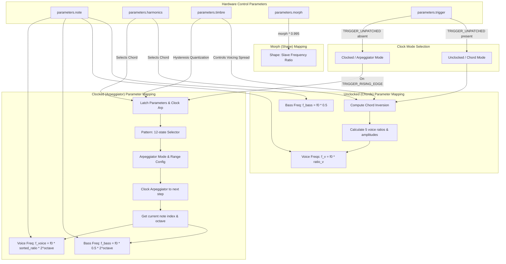

# Chiptune Engine

This document provides a comprehensive DSP analysis of the [ChiptuneEngine](https://github.com/arachnegl/eurorack/blob/master/plaits/dsp/engine2/chiptune_engine.h) class ([chiptune_engine.h](file:///Users/greg/src/eurorack/plaits/dsp/engine2/chiptune_engine.h)), which is responsible for rendering retro chiptune sounds. It synthesizes a combination of dual master-slave synchronized square waves (faking Pulse Width Modulation) and a 16-level stepped NES-style triangle sub-bass.

---

### Control Rate Flow Diagram

The control rate processing occurs once per audio block (typically 16 or 24 samples). The block diagram below illustrates how hardware CV and knob inputs map to internal synthesizer parameters under both clocked (arpeggiator) and unclocked (chord) modes:



---

### DSP Loop Flow Diagram

The sample rate loop runs for every sample in the block. It renders the square oscillators, sums them together (with phase inversions in chord mode), renders the NES-style triangle sub-bass, and optionally applies the internal envelope decay:

```mermaid
graph TD
    subgraph dsp_loop ["Oversampled DSP Render Loop (per-sample)"]
        subgraph sq_oscillators ["Square Voice Generators"]
            V0["voice_[0] (Clocked or Chord)"]
            V1_4["voice_[1..4] (Chord Mode only)"]
        end

        subgraph sum_junction ["Summing Junction"]
            OutSum[out[i] = Sum of active voice_[v] * amplitude_[v]]
        end

        subgraph bass_oscillator ["Sub-Bass Generator"]
            Bass["bass_: NESTriangleOscillator"]
        end

        subgraph envelope_block ["Envelope Shaper (if envelope_shape_ != NO_ENVELOPE)"]
            EnvGen[Decay Multiplier: state *= decay]
            OutEnv[out[i] *= envelope_state_]
            AuxEnv[aux[i] *= 1.0 + aux_envelope_amount_ * (envelope_state_ - 1.0)]
            EnvGen --> OutEnv
            EnvGen --> AuxEnv
        end
    end

    F_voice -->|Freq| V0
    F_voices -->|Freqs| sq_oscillators
    Shape -->|Shape Parameter| sq_oscillators

    F_bass -->|Freq| Bass
    F_bass_unclock -->|Freq| Bass

    V0 -->|Renders to out| OutSum
    V1_4 -->|Renders to aux (scratch) & accumulated| OutSum

    OutSum -->|out_raw| OutEnv
    Bass -->|aux_raw| AuxEnv

    OutEnv -->|Main Out| FinalOut["out: Pulse Wave Train (Arp/Chord)"]
    AuxEnv -->|Aux Out| FinalAux["aux: Triangle Bass Sub-Oscillator"]
```

> [!NOTE]
> In unclocked mode, the `aux` output buffer is temporarily recycled as scratch space to store the rendering of each individual square voice before being fully overwritten by the final sub-bass triangle rendering. This represents a critical memory footprint optimization.

---

### Core DSP & Synthesis Techniques

#### 1. Master-Slave Hard Sync & "Faked" PWM
The primary synthesizer voices are generated by the [SuperSquareOscillator](file:///Users/greg/src/eurorack/plaits/dsp/oscillator/super_square_oscillator.h) class. Rather than a standard square wave, it uses a master-slave configuration to produce classic hard sync sweeps:
- **Master Oscillator:** Increments at frequency $f_{\text{master}} = f_{\text{voice}}$ derived from the notes.
- **Slave Oscillator:** Increments at frequency $f_{\text{slave}}$ scaled by the `shape` parameter (mapped from `parameters.morph`):

$$\text{shape} = \text{parameters.morph} \times 0.995$$

If $\text{shape} < 0.5$:
$$f_{\text{slave}} = f_{\text{master}} \times (0.51 + 0.98 \times \text{shape})$$

If $\text{shape} \geq 0.5$:
$$f_{\text{slave}} = f_{\text{master}} \times \left(1.0 + 16.0 \times (\text{shape} - 0.5)^2\right)$$

Every time the master phase completes a cycle ($\phi_{\text{master}} \ge 1.0$), it wraps around and forces the slave phase to reset ($\phi_{\text{slave}} \to 0.0$). 
Because both oscillators have a fixed 50% duty cycle, hard syncing them alters the duration of the slave's high and low states dynamically as $f_{\text{slave}}$ is swept. The result is a nasal, sweeping timber variation that closely mimics **Pulse Width Modulation (PWM)**, commonly referred to as "faked PWM" on retro hardware. To prevent harsh aliasing from the phase resets and square transitions, the engine injects bandlimiting step residuals via the **PolyBLEP** (Band-Limited Step) algorithm.

#### 2. NES-Style Stepped Triangle Sub-Bass
The sub-bass channel is generated by the [NESTriangleOscillator](file:///Users/greg/src/eurorack/plaits/dsp/oscillator/nes_triangle_oscillator.h) class. It mimics the Nintendo Entertainment System's triangle channel, which utilized a 4-bit digital-to-analog converter (DAC) cycled through a 32-step sequence.
The 16 discrete amplitude levels are sequenced as:
$$v(s) = \begin{cases} s & \text{if } s < 16 \\ 31 - s & \text{if } s \geq 16 \end{cases}$$
where $s \in [0, 31]$ is the current sequence step.

To prevent the step transitions from causing high-frequency aliasing, two techniques are blended depending on the pitch:
* **Stepped PolyBLEP:** At low frequencies, a bandlimited BLEP residual is added at each step transition.
* **Transition to Naive Continuous Triangle:** As the frequency rises, step transitions happen too fast. To save CPU and avoid aliasing near the Nyquist frequency, the stepped wave fades into a continuous naive triangle wave.
Let $f$ be the normalized frequency (cycles per sample) and $N_{\text{steps}} = 32$. The blend coefficient is:

$$fade\_to\_tri = \text{clip}\left(\left(f - \frac{0.5}{N_{\text{steps}}}\right) \times 2 \times N_{\text{steps}}, \, 0.0, \, 1.0\right)$$

The respective gains of the stepped (NES) and continuous (naive) triangle wave components are:
$$G_{\text{NES}} = 1.0 - fade\_to\_tri$$
$$G_{\text{tri}} = 15.0 \times fade\_to\_tri$$

For the continuous naive triangle component, slope discontinuities at the peaks and troughs are bandlimited using **Integrated BLEP** (residual of the integrated step function).

#### 3. Arpeggiation and Chord Selection
In clocked mode, `parameters.timbre` determines the arpeggiator mode and octave range. First, the value is quantized to 12 states by the [HysteresisQuantizer2](file:///Users/greg/src/eurorack/stmlib/dsp/hysteresis_quantizer.h) pattern selector. The state mappings are:

| Quantized Value | Arpeggiator Mode | Octave Range |
|:---:|:---|:---:|
| **0** | Up | 1 |
| **1** | Up | 2 |
| **2** | Up | 4 |
| **3** | Down | 1 |
| **4** | Down | 2 |
| **5** | Down | 4 |
| **6** | Up-Down | 1 |
| **7** | Up-Down | 2 |
| **8** | Up-Down | 4 |
| **9** | Random | 1 |
| **10** | Random | 2 |
| **11** | Random | 4 |

The base chords are chosen from the [ChordBank](file:///Users/greg/src/eurorack/plaits/dsp/chords/chord_bank.h) (containing 11 classic chord profiles like Octave, Sus4, Minor, Major, Minor 7th, Major 9th, etc.) using the `parameters.harmonics` parameter.

#### 4. Decay Envelope Shaping
If `envelope_shape_` is not equal to `NO_ENVELOPE` (which defaults to $2.0$), a digital envelope generator is updated per-sample:
$$\text{decay} = 1.0 - \frac{2}{F_s} \cdot 2^{5 \cdot \text{shape}} \cdot \text{shape}$$
where $\text{shape} = |\text{envelope\_shape\_}|$ and $F_s = \text{kSampleRate}$.

The envelope decays exponentially:
$$\text{envelope\_state\_}[t] = \text{envelope\_state\_}[t-1] \times \text{decay}$$

* **Main Output Channel (`out`):** Always multiplied directly by the decay envelope.
* **Aux Output Channel (`aux`):** Subject to conditional envelope shaping:

$$\text{aux}[i] = \text{aux}[i] \times \left(1.0 + \text{aux\_envelope\_amount\_} \times (\text{envelope\_state\_} - 1.0)\right)$$

Where $\text{aux\_envelope\_amount\_}$ is low-pass filtered towards $\text{clip}(\text{envelope\_shape\_} \times 20.0, 0.0, 1.0)$.
- **Positive `envelope_shape_`:** The aux channel (sub-bass) is fully enveloped and decays to $0$ along with the main voice.
- **Negative `envelope_shape_`:** The aux envelope amount clips to $0.0$, allowing the sub-bass triangle wave to sustain indefinitely (ignoring the decay envelope).

---

### Code Analysis

#### A. Header Structure & Engine State
The [ChiptuneEngine](file:///Users/greg/src/eurorack/plaits/dsp/engine2/chiptune_engine.h#L40) class encapsulates its active state using members:
```cpp
  SuperSquareOscillator voice_[kChordNumVoices];
  NESTriangleOscillator<> bass_;
  
  ChordBank chords_;
  Arpeggiator arpeggiator_;
  stmlib::HysteresisQuantizer2 arpeggiator_pattern_selector_;
  
  float envelope_shape_;
  float envelope_state_;
  float aux_envelope_amount_;
```
> [!IMPORTANT]
> There is a minor initialization discrepancy in [chiptune_engine.cc](file:///Users/greg/src/eurorack/plaits/dsp/engine2/chiptune_engine.cc#L40): the initialization loop only executes up to `kChordNumNotes` (which is $4$):
> ```cpp
> for (int i = 0; i < kChordNumNotes; ++i) {
>   voice_[i].Init();
> }
> ```
> However, `voice_` has a size of `kChordNumVoices` (which is $5$) and all $5$ voice elements can be rendered in unclocked chord mode.

#### B. Render Loop Breakdown
The core of the render process is [ChiptuneEngine::Render](file:///Users/greg/src/eurorack/plaits/dsp/engine2/chiptune_engine.cc#L59):

```cpp
void ChiptuneEngine::Render(
    const EngineParameters& parameters,
    float* out,
    float* aux,
    size_t size,
    bool* already_enveloped) {
  const float f0 = NoteToFrequency(parameters.note);
  const float shape = parameters.morph * 0.995f;
  const bool clocked = !(parameters.trigger & TRIGGER_UNPATCHED);
  float root_transposition = 1.0f;
  
  *already_enveloped = clocked;
```
The pitch-to-frequency conversion handles the root pitch, and the clocked state determines if Plaits is patched to a sequencer/clock source.

```cpp
  if (clocked) {
    if (parameters.trigger & TRIGGER_RISING_EDGE) {
      chords_.set_chord(parameters.harmonics);
      chords_.Sort();

      int pattern = arpeggiator_pattern_selector_.Process(parameters.timbre);
      arpeggiator_.set_mode(ArpeggiatorMode(pattern / 3));
      arpeggiator_.set_range(1 << (pattern % 3));
      arpeggiator_.Clock(chords_.num_notes());
      envelope_state_ = 1.0f;
    }
    const float octave = float(1 << arpeggiator_.octave());
    const float note_f0 = f0 * chords_.sorted_ratio(
        arpeggiator_.note()) * octave;
    root_transposition = octave;
    voice_[0].Render(note_f0, shape, out, size);
```
In clocked mode, when a clock trigger occurs, parameters are latched and the chord notes are sorted. The arpeggiator computes the target pitch ratio and octave multiplier, rendering the arpeggiated line using only `voice_[0]`.

```cpp
  } else {
    float ratios[kChordNumVoices];
    float amplitudes[kChordNumVoices];

    chords_.set_chord(parameters.harmonics);
    chords_.ComputeChordInversion(parameters.timbre, ratios, amplitudes);
    for (int j = 1; j < kChordNumVoices; j += 2) {
      amplitudes[j] = -amplitudes[j];
    }
  
    fill(&out[0], &out[size], 0.0f);
    for (int voice = 0; voice < kChordNumVoices; ++voice) {
      const float voice_f0 = f0 * ratios[voice];
      voice_[voice].Render(voice_f0, shape, aux, size);
      for (size_t j = 0; j < size; ++j) {
        out[j] += aux[j] * amplitudes[voice];
      }
    }
  }
```
In unclocked mode, the engine uses the chord inversion matrix. Inverting the phase of alternate voices (`amplitudes[j] = -amplitudes[j]`) balances the DC bias. The `aux` buffer is recycled to render each voice's waveform before they are accumulated into `out`.

```cpp
  // Render bass note.
  bass_.Render(f0 * 0.5f * root_transposition, aux, size);
```
The sub-bass triangle oscillator is rendered directly into the `aux` buffer, operating one octave below the voice's transposition.

```cpp
  // Apply envelope if necessary.
  if (envelope_shape_ != NO_ENVELOPE) {
    const float shape = fabsf(envelope_shape_);
    const float decay = 1.0f - \
        2.0f / kSampleRate * SemitonesToRatio(60.0f * shape) * shape;
    float aux_envelope_amount = envelope_shape_ * 20.0f;
    CONSTRAIN(aux_envelope_amount, 0.0f, 1.0f);
    
    for (size_t i = 0; i < size; ++i) {
      ONE_POLE(aux_envelope_amount_, aux_envelope_amount, 0.01f);
      envelope_state_ *= decay;
      out[i] *= envelope_state_;
      aux[i] *= 1.0f + aux_envelope_amount_ * (envelope_state_ - 1.0f);
    }
  }
}
```
Here, the sample loop updates the envelope state. The one-pole filter (`ONE_POLE`) smooths the aux envelope target to prevent transient clicks.

---

<!-- KaTeX support for mathematical formulas -->
<link rel="stylesheet" href="https://cdn.jsdelivr.net/npm/katex@0.16.8/dist/katex.min.css">
<script defer src="https://cdn.jsdelivr.net/npm/katex@0.16.8/dist/katex.min.js"></script>
<script defer src="https://cdn.jsdelivr.net/npm/katex@0.16.8/dist/contrib/auto-render.min.js"
        onload="renderMathInElement(document.body, {
          delimiters: [
            {left: '$$', right: '$$', display: true},
            {left: '$', right: '$', display: false}
          ]
        });"></script>

<!-- Mermaid JS support for rendering diagrams with Click-to-Zoom Lightbox -->
<script type="module">
  import mermaid from 'https://cdn.jsdelivr.net/npm/mermaid@10/dist/mermaid.esm.min.mjs';
  mermaid.initialize({ startOnLoad: false });
  
  // Inject lightbox styling
  const style = document.createElement('style');
  style.textContent = `
    .mermaid-lightbox {
      position: fixed;
      top: 0;
      left: 0;
      width: 100vw;
      height: 100vh;
      background: rgba(15, 15, 15, 0.9);
      backdrop-filter: blur(8px);
      -webkit-backdrop-filter: blur(8px);
      display: flex;
      align-items: center;
      justify-content: center;
      z-index: 10000;
      opacity: 0;
      transition: opacity 0.2s ease;
      pointer-events: none;
    }
    .mermaid-lightbox.active {
      opacity: 1;
      pointer-events: auto;
    }
    .mermaid-lightbox svg {
      max-width: 90%;
      max-height: 90%;
      width: auto;
      height: auto;
      background: rgba(255, 255, 255, 0.95);
      padding: 20px;
      border-radius: 8px;
      box-shadow: 0 20px 50px rgba(0, 0, 0, 0.3);
    }
    .mermaid-lightbox .close-btn {
      position: absolute;
      top: 20px;
      right: 30px;
      font-size: 40px;
      color: #fff;
      cursor: pointer;
      user-select: none;
      font-family: sans-serif;
    }
    .mermaid-trigger {
      cursor: zoom-in;
      transition: transform 0.2s ease;
    }
    .mermaid-trigger:hover {
      transform: scale(1.01);
    }
  `;
  document.head.appendChild(style);

  // Inject lightbox modal elements
  const lightbox = document.createElement('div');
  lightbox.className = 'mermaid-lightbox';
  lightbox.innerHTML = '<span class="close-btn">&times;</span><div class="content"></div>';
  document.body.appendChild(lightbox);

  lightbox.addEventListener('click', () => {
    lightbox.classList.remove('active');
  });

  // Convert Mermaid code blocks to styled divs
  const codeBlocks = document.querySelectorAll('.language-mermaid code, pre code.language-mermaid');
  codeBlocks.forEach((block) => {
    const container = block.closest('.language-mermaid') || block.parentElement;
    const el = document.createElement('div');
    el.className = 'mermaid mermaid-trigger';
    el.textContent = block.textContent;
    container.replaceWith(el);
  });
  
  // Render and handle lightbox events
  mermaid.run().then(() => {
    document.querySelectorAll('.mermaid-trigger').forEach((trigger) => {
      trigger.addEventListener('click', () => {
        const content = lightbox.querySelector('.content');
        content.innerHTML = trigger.innerHTML;
        lightbox.classList.add('active');
      });
    });
  });
</script>
