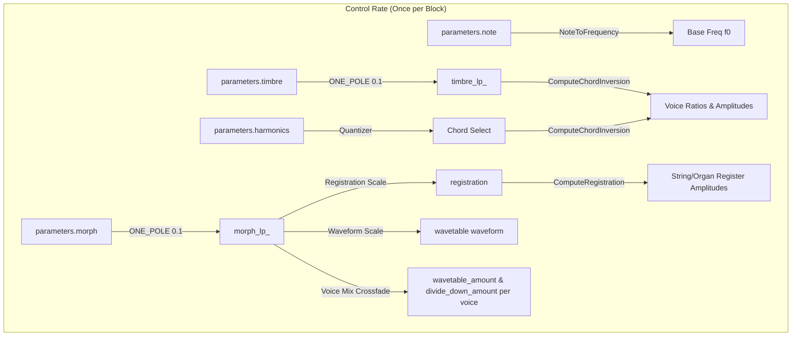
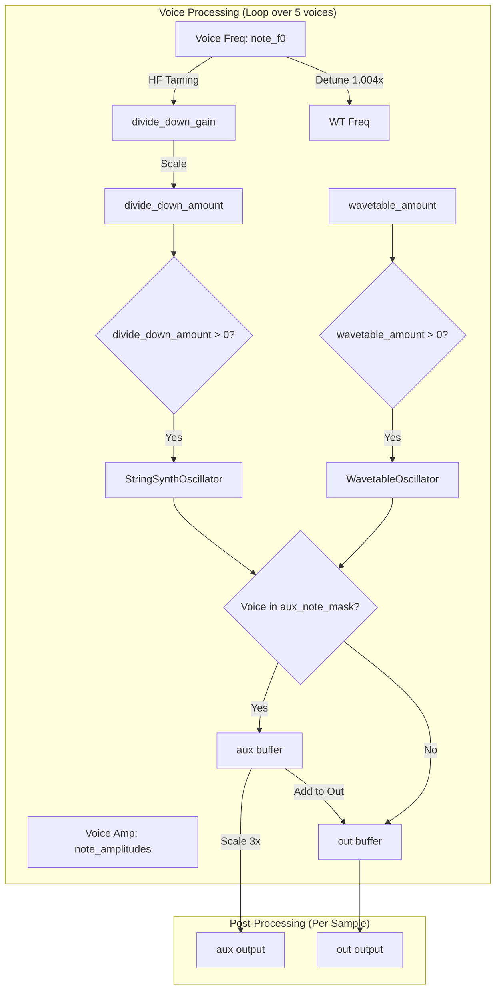

# Chord Engine

This document covers the DSP analysis of the
[ChordEngine](https://github.com/arachnegl/eurorack/blob/master/plaits/dsp/engine/chord_engine.h) class.

---

### Control Rate Flow Diagram



### DSP Loop Flow Diagram



---

### Core DSP & Synthesis Techniques

#### 1. Divide-Down Organ / String Machine Synthesis
The [StringSynthOscillator](https://github.com/arachnegl/eurorack/blob/master/plaits/dsp/oscillator/string_synth_oscillator.h) implements a divide-down organ synthesis model. It generates a mixture of up to 7 registration registers: Saw 8', Square 8', Saw 4', Square 4', Saw 2', Square 2', and Saw 1'.

Instead of running separate phase accumulators for all 7 waves, it runs a single phase counter at the highest octave ($8 \times f_0$) and derives the lower octaves from it. The square waves are generated algebraically from the sawtooth waves.

##### Mathematical Derivation of Square Waves from Sawtooth Waves
A normalized sawtooth wave $S_f(\theta)$ of frequency $f$ has a range of $[-0.5, 0.5]$ over the phase $\theta \in [0, 1)$:
$$S_f(\theta) = \theta - 0.5$$

For a sawtooth wave of double frequency $S_{2f}(\theta)$ (period $0.5$), the phase wraps twice:
$$S_{2f}(\theta) = \begin{cases} 2\theta - 0.5 & \text{for } 0 \le \theta < 0.5 \\ 2\theta - 1.5 & \text{for } 0.5 \le \theta < 1 \end{cases}$$

If we subtract the double-frequency sawtooth $S_{2f}(\theta)$ from twice the single-frequency sawtooth $2S_f(\theta)$, we obtain a square wave $Sq_f(\theta)$ of frequency $f$:
* For $0 \le \theta < 0.5$:
  $$2S_f(\theta) - S_{2f}(\theta) = 2(\theta - 0.5) - (2\theta - 0.5) = -0.5$$
* For $0.5 \le \theta < 1$:
  $$2S_f(\theta) - S_{2f}(\theta) = 2(\theta - 0.5) - (2\theta - 1.5) = +0.5$$

Thus, we have:
$$Sq_f(\theta) = 2S_f(\theta) - S_{2f}(\theta)$$

In the implementation, the gains for the 4 sawtooth oscillators ($g_8, g_4, g_2, g_1$) are mapped from the 7 registration parameters ($r_0, \dots, r_6$) as follows:
$$\begin{aligned}
g_8 &= r_0 + 2r_1 \\
g_4 &= r_2 - r_1 + 2r_3 \\
g_2 &= r_4 - r_3 + 2r_5 \\
g_1 &= r_6 - r_5
\end{aligned}$$

Summing the sawtooth waves weighted by these gains yields:
$$\begin{aligned}
\text{Output} &= g_8 S_8 + g_4 S_4 + g_2 S_2 + g_1 S_1 \\
&= (r_0 + 2r_1) S_8 + (r_2 - r_1 + 2r_3) S_4 + (r_4 - r_3 + 2r_5) S_2 + (r_6 - r_5) S_1 \\
&= r_0 S_8 + r_1 (2 S_8 - S_4) + r_2 S_4 + r_3 (2 S_4 - S_2) + r_4 S_2 + r_5 (2 S_2 - S_1) + r_6 S_1
\end{aligned}$$
This generates the exact desired mixture of sawtooths and square waves! Band-limiting is achieved by applying PolyBLEP to the phase discontinuities.

#### 2. Integrated Wavetable Synthesis
The [WavetableOscillator](https://github.com/arachnegl/eurorack/blob/master/plaits/dsp/oscillator/wavetable_oscillator.h) employs **Integrated Wavetable Synthesis** (DPW family) to achieve anti-aliased wavetable playback with very low CPU usage.

Normally, reading a wavetable with a phase step $\Delta\theta = f_0$ causes aliasing because high-frequency components fold back. In integrated wavetable synthesis, the wavetables store the **integral** of the waveform:
$$W(t) = \int_0^t w(\tau) d\tau$$

By looking up the integrated waveform at phase $\theta_n$ and $\theta_{n-1}$, and computing the discrete-time derivative:
$$s(n) = \frac{W(\theta_n) - W(\theta_{n-1})}{f_0}$$
we perform a continuous-time boxcar filtering (averaging) over the phase increment interval. This acts as a low-pass filter with a sinc-like response.

To complete the anti-aliasing and attenuate high-frequency side lobes, the output of the differentiator is filtered by a one-pole low-pass filter whose cutoff frequency track the voice frequency:
$$\text{Cutoff} = \min(128 \cdot f_0, 1.0)$$

#### 3. Chord Voicing and Inversion Crossfading
The [ChordBank](https://github.com/arachnegl/eurorack/blob/master/plaits/dsp/chords/chord_bank.h) contains 11 chords, each consisting of up to 4 notes.
The `timbre` parameter controls the chord inversion. To prevent clicks and abrupt jumps when changing inversions, the engine continuously cross-fades the voice amplitude between its current octave and its transposed octave.

The transposition scale is:
$$T = 0.25 \cdot 2^{\lfloor (N - 1 + I - i) / N \rfloor}$$
where $N$ is the number of notes (4), $I$ is the continuous inversion value, and $i$ is the note index. If a note is transitioning, its amplitude is cross-faded between its target voice and previous voice using the fractional part of the inversion index:
$$\begin{aligned}
A_{\text{previous}} &= 0.25 \cdot I_{\text{fractional}} \\
A_{\text{target}} &= 0.25 \cdot (1 - I_{\text{fractional}})
\end{aligned}$$

#### 4. Root Note Separation (Auxiliary Routing)
The voice corresponding to the root note of the chord is identified via `aux_note_mask`. The engine routes this voice to the `aux` output buffer, while all other chord voices are routed to the `out` output buffer.
At the end of rendering:
$$\begin{aligned}
\text{out}[i] &\leftarrow \text{out}[i] + \text{aux}[i] \\
\text{aux}[i] &\leftarrow 3.0 \cdot \text{aux}[i]
\end{aligned}$$
This provides a full mix of the chord on `OUT` and a boosted, separate bass voice on `AUX`.

#### 5. Morphing & Detuning (Chorus Ensemble Effect)
The `morph` parameter scales between the string machine model and the wavetable engine. The transition is staggered per voice using individual threshold constants:
$$\text{fade\_point} = \{0.55, 0.47, 0.49, 0.51, 0.53\}$$
To enrich the transition, the wavetable voice frequency is detuned by $0.4\%$ ($1.004 \times f_{voice}$) from the string machine oscillator, simulating a chorused ensemble.

#### 6. High-Frequency Taming
The divide-down organ model contains significant high-frequency content. To prevent aliasing at high pitches, its gain is tapered off above $\approx 4500\text{ Hz}$ and silenced completely at $\approx 6000\text{ Hz}$ using a frequency-dependent gain factor:
$$g_{dd\_gain} = \text{clamp}(4.0 - 32.0 \cdot f_0, 0.0, 1.0)$$

---

### Code Analysis

#### A. Header Structure & Engine State ([chord_engine.h](https://github.com/arachnegl/eurorack/blob/master/plaits/dsp/engine/chord_engine.h))

The engine class encapsulates:
* **divide_down_voice_**: An array of 5 `StringSynthOscillator` objects.
* **wavetable_voice_**: An array of 5 `WavetableOscillator<128, 15>` objects.
* **chords_**: A `ChordBank` instance handling chord selection and inversion logic.
* **morph_lp_ / timbre_lp_**: One-pole low-pass filters to smooth input parameters.

```cpp
class ChordEngine : public Engine {
  ...
 private:
  void ComputeRegistration(float registration, float* amplitudes);
  int ComputeChordInversion(
      float inversion,
      float* ratios,
      float* amplitudes);
  
  StringSynthOscillator divide_down_voice_[kChordNumVoices];
  WavetableOscillator<128, 15> wavetable_voice_[kChordNumVoices];
  ChordBank chords_;
  
  float morph_lp_;
  float timbre_lp_;
  ...
};
```

#### B. Render Loop Breakdown ([chord_engine.cc](https://github.com/arachnegl/eurorack/blob/master/plaits/dsp/engine/chord_engine.cc))

##### Parameter Smoothing & Registration Selection
```cpp
ONE_POLE(morph_lp_, parameters.morph, 0.1f);
ONE_POLE(timbre_lp_, parameters.timbre, 0.1f);

chords_.set_chord(parameters.harmonics);

float harmonics[kChordNumHarmonics * 2 + 2];
float note_amplitudes[kChordNumVoices];
float registration = max(1.0f - morph_lp_ * 2.15f, 0.0f);

ComputeRegistration(registration, harmonics);
harmonics[kChordNumHarmonics * 2] = 0.0f;
```
The first-order filters smooth the timbre and morph controls. The organ registration index is computed from `morph_lp_` such that the string machine is active at lower morph values.

##### Inversion and Routing Computation
```cpp
float ratios[kChordNumVoices];
int aux_note_mask = chords_.ComputeChordInversion(
    timbre_lp_,
    ratios,
    note_amplitudes);

fill(&out[0], &out[size], 0.0f);
fill(&aux[0], &aux[size], 0.0f);

const float f0 = NoteToFrequency(parameters.note) * 0.998f;
const float waveform = max((morph_lp_ - 0.535f) * 2.15f, 0.0f);
```
The inversion ratios and amplitudes for all 5 voices are retrieved from the chord bank. The `aux_note_mask` determines which voices play the root note to isolate them.

##### Voice Synthesis Loop
```cpp
for (int note = 0; note < kChordNumVoices; ++note) {
  float wavetable_amount = 50.0f * (morph_lp_ - fade_point[note]);
  CONSTRAIN(wavetable_amount, 0.0f, 1.0f);

  float divide_down_amount = 1.0f - wavetable_amount;
  float* destination = (1 << note) & aux_note_mask ? aux : out;
  
  const float note_f0 = f0 * ratios[note];
  float divide_down_gain = 4.0f - note_f0 * 32.0f;
  CONSTRAIN(divide_down_gain, 0.0f, 1.0f);
  divide_down_amount *= divide_down_gain;
  
  if (wavetable_amount) {
    wavetable_voice_[note].Render(
        note_f0 * 1.004f,
        note_amplitudes[note] * wavetable_amount,
        waveform,
        wavetable,
        destination,
        size);
  }
  
  if (divide_down_amount) {
    divide_down_voice_[note].Render(
        note_f0,
        harmonics,
        note_amplitudes[note] * divide_down_amount,
        destination,
        size);
  }
}
```
For each voice:
1. `wavetable_amount` and `divide_down_amount` are computed using a staggered fade point.
2. The voice destination is chosen as `aux` (if root) or `out` (otherwise).
3. Frequency-dependent gain taming (`divide_down_gain`) is applied to the organ model.
4. The wavetable voice is rendered with a $0.4\%$ frequency offset (`note_f0 * 1.004f`) to create a chorus ensemble effect with the organ model.

##### Output Re-Mixing and Scaling
```cpp
for (size_t i = 0; i < size; ++i) {
  out[i] += aux[i];
  aux[i] *= 3.0f;
}
```
The individual auxiliary root channel is mixed back into the main output so that `out` contains the full chord. The separate `aux` channel is boosted by 3x (approx. +9.5 dB) for standard modular signal level scaling.

---

<!-- KaTeX support for mathematical formulas -->
<link rel="stylesheet" href="https://cdn.jsdelivr.net/npm/katex@0.16.8/dist/katex.min.css">
<script defer src="https://cdn.jsdelivr.net/npm/katex@0.16.8/dist/katex.min.js"></script>
<script defer src="https://cdn.jsdelivr.net/npm/katex@0.16.8/dist/contrib/auto-render.min.js"
        onload="renderMathInElement(document.body, {
          delimiters: [
            {left: '$$', right: '$$', display: true},
            {left: '$', right: '$', display: false}
          ]
        });"></script>

<!-- Mermaid JS support for rendering diagrams with Click-to-Zoom Lightbox -->
<script type="module">
  import mermaid from 'https://cdn.jsdelivr.net/npm/mermaid@10/dist/mermaid.esm.min.mjs';
  mermaid.initialize({ startOnLoad: false });
  
  // Inject lightbox styling
  const style = document.createElement('style');
  style.textContent = `
    .mermaid-lightbox {
      position: fixed;
      top: 0;
      left: 0;
      width: 100vw;
      height: 100vh;
      background: rgba(15, 15, 15, 0.9);
      backdrop-filter: blur(8px);
      -webkit-backdrop-filter: blur(8px);
      display: flex;
      align-items: center;
      justify-content: center;
      z-index: 10000;
      opacity: 0;
      transition: opacity 0.2s ease;
      pointer-events: none;
    }
    .mermaid-lightbox.active {
      opacity: 1;
      pointer-events: auto;
    }
    .mermaid-lightbox svg {
      max-width: 90%;
      max-height: 90%;
      width: auto;
      height: auto;
      background: rgba(255, 255, 255, 0.95);
      padding: 20px;
      border-radius: 8px;
      box-shadow: 0 20px 50px rgba(0, 0, 0, 0.3);
    }
    .mermaid-lightbox .close-btn {
      position: absolute;
      top: 20px;
      right: 30px;
      font-size: 40px;
      color: #fff;
      cursor: pointer;
      user-select: none;
      font-family: sans-serif;
    }
    .mermaid-trigger {
      cursor: zoom-in;
      transition: transform 0.2s ease;
    }
    .mermaid-trigger:hover {
      transform: scale(1.01);
    }
  `;
  document.head.appendChild(style);

  // Inject lightbox modal elements
  const lightbox = document.createElement('div');
  lightbox.className = 'mermaid-lightbox';
  lightbox.innerHTML = '<span class="close-btn">&times;</span><div class="content"></div>';
  document.body.appendChild(lightbox);

  lightbox.addEventListener('click', () => {
    lightbox.classList.remove('active');
  });

  // Convert Mermaid code blocks to styled divs
  const codeBlocks = document.querySelectorAll('.language-mermaid code, pre code.language-mermaid');
  codeBlocks.forEach((block) => {
    const container = block.closest('.language-mermaid') || block.parentElement;
    const el = document.createElement('div');
    el.className = 'mermaid mermaid-trigger';
    el.textContent = block.textContent;
    container.replaceWith(el);
  });
  
  // Render and handle lightbox events
  mermaid.run().then(() => {
    document.querySelectorAll('.mermaid-trigger').forEach((trigger) => {
      trigger.addEventListener('click', () => {
        const content = lightbox.querySelector('.content');
        content.innerHTML = trigger.innerHTML;
        lightbox.classList.add('active');
      });
    });
  });
</script>
