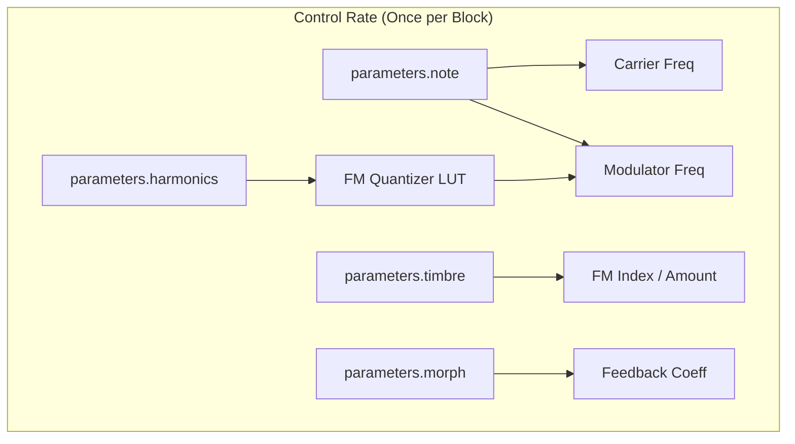
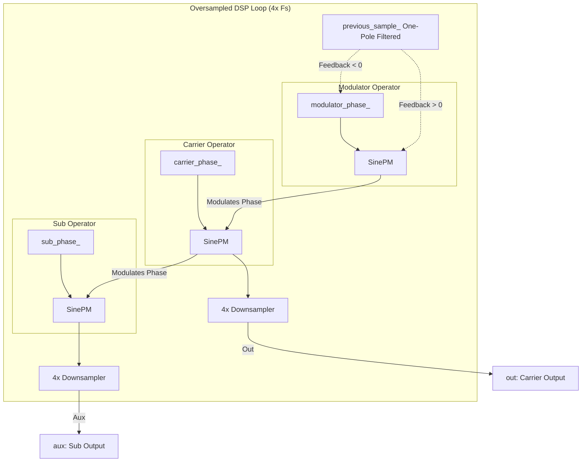

# FM Engine

This document covers the DSP analysis of the
[FMEngine](https://github.com/arachnegl/eurorack/blob/master/plaits/dsp/engine/fm_engine.h) class.

---

### Control Rate Flow Diagram



### DSP Loop Flow Diagram



---

### Core DSP & Synthesis Techniques

#### 1. Phase Modulation (PM) vs. True FM
True FM modulates frequency directly: $\frac{d\theta}{dt} = \omega_c + x(t)$. PM modulates the phase offset:
$\theta(t) = \omega_c t + I \cdot x(t)$. `FMEngine` implements PM via the `SinePM` helper function:
```cpp
float carrier = SinePM(carrier_phase_, amount * modulator);
```
Where `amount` represents the Modulation Index ($I_{FM}$). This prevents numerical integration drift in the carrier
phase and yields a stable, predictable spectrum.

#### 2. Dual-Mode Morphable Feedback Loop
The `parameters.morph` control scales feedback from $-1.0$ to $+1.0$, enabling two distinct feedback modes:

* **Positive Morph (Feedback > 0): Self-Feedback on Modulator Phase**
  ```cpp
  float modulator_fb = 0.25f * feedback * feedback;
  float modulator = SinePM(modulator_phase_, modulator_fb * previous_sample_);
  ```
  The previous (low-pass filtered) carrier sample is fed back directly into the modulator's phase input. This
  creates cross-modulation between operators, collapsing into white-noise-like chaos or metallic sidebands at high
  settings.
  
* **Negative Morph (Feedback < 0): Carrier-to-Modulator Frequency Modulation**
  ```cpp
  float phase_feedback = 0.5f * feedback * feedback;
  modulator_phase_ += static_cast<uint32_t>(max_uint32 * _modulator_frequency * (1.0f + previous_sample_ * phase_feedback));
  ```
  Here, the feedback term directly scales the phase increment of the modulator. This yields true Frequency Modulation
  of the modulator by the carrier, generating complex, non-linear harmonic paths.

#### 3. Bandwidth Limiting & Anti-Aliasing
FM synthesis naturally produces infinite sidebands ($f_c \pm n f_m$). To prevent harsh digital folding (aliasing),
`FMEngine` employs two protection layers:
* **4x Oversampling:** The internal DSP synthesis loop runs at $4 \times F_s$ (e.g., $192\text{ kHz}$ if the system
  rate is $48\text{ kHz}$).
* **Decimation Filtering:** Output samples are accumulated through `Downsampler` classes using symmetric FIR decimation
  filters to attenuate images above Nyquist.
* **High-Frequency Taming:** As the modulator pitch goes above MIDI note 72 (C5), the modulation index is throttled back
  dynamically:
  ```cpp
  float hf_taming = 1.0f - (modulator_note - 72.0f) * 0.025f;
  CONSTRAIN(hf_taming, 0.0f, 1.0f);
  hf_taming *= hf_taming;
  ```

---

### Code Analysis

#### A. Header Structure & Engine State ([fm_engine.h](https://github.com/arachnegl/eurorack/blob/master/plaits/dsp/engine/fm_engine.h))
The state of the engine is kept minimal to fit within the module's dynamic buffer allocation system:
* **32-Bit Fixed-Point Phase Accumulators:** `carrier_phase_`, `modulator_phase_`, and `sub_phase_`.
* **State Filters:** `sub_fir_` and `carrier_fir_` act as buffers for the 4x FIR downsamplers.
* **Smoothing State:** Memory of previous parameter states (frequencies, index, feedback) to facilitate interpolation.

#### B. Render Loop Breakdown ([fm_engine.cc](https://github.com/arachnegl/eurorack/blob/master/plaits/dsp/engine/fm_engine.cc#L56))

```cpp
const float ratio = Interpolate(lut_fm_frequency_quantizer, parameters.harmonics, 128.0f);
```
* **Harmonic Quantizer:** The `harmonics` parameter maps to modulator-to-carrier frequency ratios using a lookup table
  (`lut_fm_frequency_quantizer`). This table features plateaus at integer ratios (1:1, 1:2, 2:1, etc.) and
  fifths/fourths to make it easy to tune musically.

```cpp
ParameterInterpolator carrier_frequency(&previous_carrier_frequency_, NoteToFrequency(note), size);
```
* **Control Rate Smoothing:** Modulator and carrier parameters are smoothed across the block (`size`) using a
  first-order linear `ParameterInterpolator` to prevent zipper noise and clicking.

```cpp
for (size_t j = 0; j < kOversampling; ++j) { ... }
```
* **Fixed-Point Phase Integration:** 
  The phase accumulator variables are unsigned 32-bit integers (`uint32_t`). When they overflow, they wrap around to
  `0`. This native CPU behavior executes a perfect modulo operation ($2^{32} \equiv 2\pi$), removing the need for
  branching or float wrapping logic.
  
* **Phase Modulation Math:**
  ```cpp
  float sub = SinePM(sub_phase_, amount * carrier * 0.25f);
  ```
  The auxiliary channel renders a sub-oscillator (`sub_phase_` incrementing at half the carrier speed). It is phase
  modulated by the main `carrier` output, generating a warm, complex sub-octave tone.

* **Feedback Smoothing:**
  ```cpp
  ONE_POLE(previous_sample_, carrier, 0.05f);
  ```
  Before routing the carrier back to the modulator phase or frequency increment, it passes through a one-pole low-pass
  filter (`ONE_POLE`). This acts as a dampening filter in the feedback path, stabilizing the chaotic loop and rounding
  off high-frequency spikes.

---

<!-- KaTeX support for mathematical formulas -->
<link rel="stylesheet" href="https://cdn.jsdelivr.net/npm/katex@0.16.8/dist/katex.min.css">
<script defer src="https://cdn.jsdelivr.net/npm/katex@0.16.8/dist/katex.min.js"></script>
<script defer src="https://cdn.jsdelivr.net/npm/katex@0.16.8/dist/contrib/auto-render.min.js"
        onload="renderMathInElement(document.body, {
          delimiters: [
            {left: '$$', right: '$$', display: true},
            {left: '$', right: '$', display: false}
          ]
        });"></script>

<!-- Mermaid JS support for rendering diagrams with Click-to-Zoom Lightbox -->
<script type="module">
  import mermaid from 'https://cdn.jsdelivr.net/npm/mermaid@10/dist/mermaid.esm.min.mjs';
  mermaid.initialize({ startOnLoad: false });
  
  // Inject lightbox styling
  const style = document.createElement('style');
  style.textContent = `
    .mermaid-lightbox {
      position: fixed;
      top: 0;
      left: 0;
      width: 100vw;
      height: 100vh;
      background: rgba(15, 15, 15, 0.9);
      backdrop-filter: blur(8px);
      -webkit-backdrop-filter: blur(8px);
      display: flex;
      align-items: center;
      justify-content: center;
      z-index: 10000;
      opacity: 0;
      transition: opacity 0.2s ease;
      pointer-events: none;
    }
    .mermaid-lightbox.active {
      opacity: 1;
      pointer-events: auto;
    }
    .mermaid-lightbox svg {
      max-width: 90%;
      max-height: 90%;
      width: auto;
      height: auto;
      background: rgba(255, 255, 255, 0.95);
      padding: 20px;
      border-radius: 8px;
      box-shadow: 0 20px 50px rgba(0, 0, 0, 0.3);
    }
    .mermaid-lightbox .close-btn {
      position: absolute;
      top: 20px;
      right: 30px;
      font-size: 40px;
      color: #fff;
      cursor: pointer;
      user-select: none;
      font-family: sans-serif;
    }
    .mermaid-trigger {
      cursor: zoom-in;
      transition: transform 0.2s ease;
    }
    .mermaid-trigger:hover {
      transform: scale(1.01);
    }
  `;
  document.head.appendChild(style);

  // Inject lightbox modal elements
  const lightbox = document.createElement('div');
  lightbox.className = 'mermaid-lightbox';
  lightbox.innerHTML = '<span class="close-btn">&times;</span><div class="content"></div>';
  document.body.appendChild(lightbox);

  lightbox.addEventListener('click', () => {
    lightbox.classList.remove('active');
  });

  // Convert Mermaid code blocks to styled divs
  const codeBlocks = document.querySelectorAll('.language-mermaid code, pre code.language-mermaid');
  codeBlocks.forEach((block) => {
    const container = block.closest('.language-mermaid') || block.parentElement;
    const el = document.createElement('div');
    el.className = 'mermaid mermaid-trigger';
    el.textContent = block.textContent;
    container.replaceWith(el);
  });
  
  // Render and handle lightbox events
  mermaid.run().then(() => {
    document.querySelectorAll('.mermaid-trigger').forEach((trigger) => {
      trigger.addEventListener('click', () => {
        const content = lightbox.querySelector('.content');
        content.innerHTML = trigger.innerHTML;
        lightbox.classList.add('active');
      });
    });
  });
</script>
