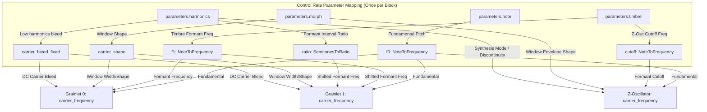
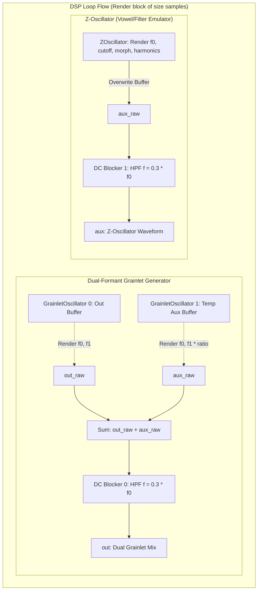

# Grain Engine

This document covers the DSP analysis of the [GrainEngine](https://github.com/arachnegl/eurorack/blob/master/plaits/dsp/engine/grain_engine.h) class.

---

### Control Rate Flow Diagram



### DSP Loop Flow Diagram



---

### Core DSP & Synthesis Techniques

The `GrainEngine` implements formant synthesis using two distinct methods: a dual-formant **Grainlet Oscillator** on the main output (`out`), and a **Z-Oscillator** (inspired by Z-synthesis and VOSIM) on the auxiliary output (`aux`). Both methods synthesize vowel-like sounds and resonant structures by generating grains of formant frequencies synced to a fundamental carrier rate.

#### 1. Grainlet Formant Synthesis & Phase-Distorted Windowing

A single grainlet consists of a carrier window function modulating a formant oscillator. The formant oscillator is a simple sine wave running at the formant frequency $f_1$. The carrier window function $C(\phi_c, s)$ defines the grain's envelope. It is generated by distorting the phase of the carrier accumulator $\phi_c \in [0.0, 1.0]$ based on the morph parameter $s \in [0.0, 3.0]$ (which represents `morph` scaled by 3):

Let $s_i = \lfloor s \rfloor$ (integral part), $s_f = s - s_i$ (fractional part), and $t = 1 - s_f$. The phase is distorted to $\phi'_c$:
* **Segment 1 ($s_i = 0$): Narrow to Wide Symmetric Window**
  $$\phi'_c = \phi_c (1 + 15 t^3) \quad \text{clamped to } 1.0$$
  $$\phi''_c = \phi'_c + 0.75$$
  This creates a window that rises quickly, flatlines at the peak, and decays. As morph increases, the window widens from a narrow pulse (1/16th of a cycle) to the full fundamental cycle.

* **Segment 2 ($s_i = 1$): Asymmetric Distortion (Attack/Decay Skew)**
  Let $b = 0.001 + 0.499 t^3$ be a phase breakpoint:
  $$\phi'_c = \begin{cases} \phi_c \cdot \frac{0.5}{b} & \text{if } \phi_c < b \\ 0.5 + (\phi_c - b) \frac{0.5}{1.0 - b} & \text{otherwise} \end{cases}$$
  $$\phi''_c = \phi'_c + 0.75$$
  This phase-distortion shifts the peak of the window from the center ($b = 0.5$) to the very beginning ($b \to 0$), skewing the window from symmetric to a rapid attack and long decay profile.

* **Segment 3 ($s_i = 2$): Reversed Asymmetric Window**
  Let $t' = s_f$:
  $$\phi'_c = 0.25 + \phi_c (0.5 + 14.5 t'^3) \quad \text{clamped to } 0.75$$
  $$\phi''_c = \phi'_c$$
  This creates a reversed profile, rising slowly and decaying rapidly.

The final window envelope is evaluated via:
$$\text{Carrier}(\phi_c, s) = \frac{\sin(2\pi \phi''_c) + 1.0}{4.0}$$

To allow the window's own fundamental component to bleed into the output (adding low-end warmth and reinforcing the pitch), a carrier bleed parameter $b$ is blended with the formant oscillator:
$$\text{Grainlet}(\phi_c, \phi_f, s, b) = \text{Carrier}(\phi_c, s) \cdot \frac{\sin(2\pi \phi_f) + b}{1.0 + b}$$

#### 2. The Z-Oscillator (VOSIM/Z-Synthesis)

The auxiliary channel runs a Z-Oscillator that simulates vocal formants using a classic VOSIM-like method. It multiplies a formant wave by a carrier wave contour, with a cosine window that decays over the half-cycle $1/(2f_0)$ of the carrier, resetting twice per carrier cycle.

Let $d \in [0.0, 1.0]$ be the discontinuity phase resetting at $2 f_0$. The window envelope is defined by:
$$\text{ramp\_down}(d) = 0.5 \cdot (1.0 + \sin(2\pi (0.5 d + 0.25)))$$
This cosine envelope smoothly ramps down from $1.0$ at $d=0.0$ to $0.0$ at $d=1.0$.

The harmonics parameter $m \in [0.0, 1.0]$ controls the phase shift $\theta_{\text{shift}}$ and DC offset $O$ of the formant sine $\text{discontinuity}(\phi_f, \theta_{\text{shift}}) = \sin(2\pi (\phi_f + \theta_{\text{shift}}))$:
* **Discontinuous Mode ($m < 0.333$):**
  $$O = 1.0, \quad \theta_{\text{shift}} = 0.25 + 1.50 m$$
  This creates a sharp discontinuity at the boundary of each half-cycle, resulting in a bright, buzzy spectrum with strong high-frequency formant harmonics.
* **Continuous Mode ($0.333 \le m < 0.666$):**
  $$\theta_{\text{shift}} = 0.7495 - (m - 0.33) \cdot 0.75, \quad O = -\sin(2\pi \theta_{\text{shift}})$$
  This eliminates the discontinuity at the boundary, producing a smooth, warm formant sound.
* **Raw Sine Mode ($m \ge 0.666$):**
  $$\theta_{\text{shift}} = 0.7495 - (m - 0.33) \cdot 0.75, \quad O = 0.001$$
  This removes the DC offset correction, resulting in a windowed sine wave.

The carrier contour $C(\phi_c, w)$ where $w$ is the morph shape:
* **First Half-Cycle Only ($w < 0.5$):**
  Let $w' = 2w$. If $\phi_c \ge 0.5$, then $\text{ramp\_down} \leftarrow \text{ramp\_down} \cdot w'$.
  $$C(\phi_c, w') = 1.0 + (\sin(2\pi (\phi_c + 0.25)) - 1.0) \cdot w'$$
  This morphs the contour from only triggering one grain per fundamental period to triggering two grains per period with amplitude modulation.
* **Phase Shifted Contour ($w \ge 0.5$):**
  $$C(\phi_c, w) = \sin(2\pi (\phi_c + 0.5w))$$
  This shifts the phase of the carrier window.

The final Z-Oscillator output is:
$$Z(\phi_c, d, \phi_f, w, m) = \left( \text{ramp\_down}(d) \cdot (O + \text{discontinuity}(\phi_f, \theta_{\text{shift}})) - O \right) \cdot C(\phi_c, w)$$

#### 3. Band-Limiting via PolyBLEP Resets

To prevent aliasing due to the sharp resets of the carrier phase and window boundaries, both oscillators use the PolyBLEP (Polynomial Band-Limited Step) method. At each sample where the carrier phase resets, the exact fractional time of the reset is calculated:
$$\Delta t_{\text{reset}} = \frac{\phi_{\text{overflow}}}{\Delta \phi}$$
The amplitude step discontinuity is calculated as:
$$\text{discontinuity} = \text{sample}_{\text{after\_reset}} - \text{sample}_{\text{before\_reset}}$$
This discontinuity is then scaled by the PolyBLEP residuals and added to the current and next samples:
$$\text{output}_t \leftarrow \text{output}_t + \text{discontinuity} \cdot \text{ThisBlepSample}(\Delta t_{\text{reset}})$$
$$\text{output}_{t+1} \leftarrow \text{output}_{t+1} + \text{discontinuity} \cdot \text{NextBlepSample}(\Delta t_{\text{reset}})$$

---

### Code Analysis

#### A. Header Structure & Engine State ([grain_engine.h](https://github.com/arachnegl/eurorack/blob/master/plaits/dsp/engine/grain_engine.h))

The engine state is declared as follows:
```cpp
class GrainEngine : public Engine {
 public:
  GrainEngine() { }
  ~GrainEngine() { }
  
  virtual void Init(stmlib::BufferAllocator* allocator);
  virtual void Reset();
  virtual void LoadUserData(const uint8_t* user_data) { }
  virtual void Render(const EngineParameters& parameters,
      float* out,
      float* aux,
      size_t size,
      bool* already_enveloped);
    
 private:
  GrainletOscillator grainlet_[2];
  ZOscillator z_oscillator_;
  stmlib::OnePole dc_blocker_[2];
  
  float grain_balance_; // Declared in header but not used in the render code.
  
  DISALLOW_COPY_AND_ASSIGN(GrainEngine);
};
```

* **`grainlet_[2]`**: Two instances of `GrainletOscillator` to generate the dual-formant spectrum.
* **`z_oscillator_`**: The single instance of `ZOscillator` for vowel-like formant synthesis.
* **`dc_blocker_[2]`**: Two high-pass filters (`stmlib::OnePole`) to block sub-fundamental DC offsets.
* **`grain_balance_`**: Leftover variable from development, unused in the final code.

#### B. Render Loop Breakdown ([grain_engine.cc](https://github.com/arachnegl/eurorack/blob/master/plaits/dsp/engine/grain_engine.cc))

```cpp
void GrainEngine::Render(
    const EngineParameters& parameters,
    float* out,
    float* aux,
    size_t size,
    bool* already_enveloped) {
  const float root = parameters.note;
  const float f0 = NoteToFrequency(root);
```
* **Fundamental Frequency ($f_0$):** Extracted directly from `parameters.note`.

```cpp
  const float f1 = NoteToFrequency(24.0f + 84.0f * parameters.timbre);
  const float ratio = SemitonesToRatio(-24.0f + 48.0f * parameters.harmonics);
```
* **Formant Frequencies:** The primary formant frequency $f_1$ maps to the `timbre` parameter over an 84-semitone range. The second grainlet's formant frequency is scaled by `ratio`, which is mapped to the `harmonics` parameter over a $\pm 24$-semitone range.

```cpp
  const float carrier_bleed = parameters.harmonics < 0.5f
      ? 1.0f - 2.0f * parameters.harmonics
      : 0.0f;
  const float carrier_bleed_fixed = carrier_bleed * (2.0f - carrier_bleed);
```
* **Carrier Bleed:** When `harmonics` is less than $0.5$, a carrier component is bled into the grainlets, applying a quadratic scaling curve to smooth the transition.

```cpp
  const float carrier_shape = 0.33f + (parameters.morph - 0.33f) * \
      max(1.0f - f0 * 24.0f, 0.0f);
```
* **Carrier Window Width:** The window width is controlled by `parameters.morph`. At high fundamental frequencies, $f_0 \cdot 24.0 \ge 1.0$, which forces the term to $0.33$ to prevent aliasing and click artifacts.

```cpp
  grainlet_[0].Render(f0, f1, carrier_shape, carrier_bleed_fixed, out, size);
  grainlet_[1].Render(f0, f1 * ratio, carrier_shape, carrier_bleed_fixed, aux, size);
```
* **Grainlet Rendering:** Renders `grainlet_[0]` into the `out` buffer and `grainlet_[1]` into the `aux` buffer.

```cpp
  dc_blocker_[0].set_f<FREQUENCY_DIRTY>(0.3f * f0);
  for (size_t i = 0; i < size; ++i) {
    out[i] = dc_blocker_[0].Process<FILTER_MODE_HIGH_PASS>(out[i] + aux[i]);
  }
```
* **Dual Formant Mixing & HPF:** The two grainlets are summed into the `out` buffer and passed through a tracking one-pole high-pass filter to block sub-fundamental DC offsets. The cutoff tracks the fundamental pitch at $0.3 \cdot f_0$.

```cpp
  const float cutoff = NoteToFrequency(root + 96.0f * parameters.timbre);
  z_oscillator_.Render(
      f0,
      cutoff,
      parameters.morph,
      parameters.harmonics,
      aux,
      size);
  
  dc_blocker_[1].set_f<FREQUENCY_DIRTY>(0.3f * f0);
  dc_blocker_[1].Process<FILTER_MODE_HIGH_PASS>(aux, size);
}
```
* **Aux Channel (Z-Oscillator):** Renders the Z-Oscillator into the `aux` buffer (overwriting the second grainlet output) and passes it through the second DC blocker. The formant frequency `cutoff` tracks the fundamental pitch plus up to 96 semitones depending on `timbre`.

---

<!-- KaTeX support for mathematical formulas -->
<link rel="stylesheet" href="https://cdn.jsdelivr.net/npm/katex@0.16.8/dist/katex.min.css">
<script defer src="https://cdn.jsdelivr.net/npm/katex@0.16.8/dist/katex.min.js"></script>
<script defer src="https://cdn.jsdelivr.net/npm/katex@0.16.8/dist/contrib/auto-render.min.js"
        onload="renderMathInElement(document.body, {
          delimiters: [
            {left: '$$', right: '$$', display: true},
            {left: '$', right: '$', display: false}
          ]
        });"></script>

<!-- Mermaid JS support for rendering diagrams with Click-to-Zoom Lightbox -->
<script type="module">
  import mermaid from 'https://cdn.jsdelivr.net/npm/mermaid@10/dist/mermaid.esm.min.mjs';
  mermaid.initialize({ startOnLoad: false });
  
  // Inject lightbox styling
  const style = document.createElement('style');
  style.textContent = `
    .mermaid-lightbox {
      position: fixed;
      top: 0;
      left: 0;
      width: 100vw;
      height: 100vh;
      background: rgba(15, 15, 15, 0.9);
      backdrop-filter: blur(8px);
      -webkit-backdrop-filter: blur(8px);
      display: flex;
      align-items: center;
      justify-content: center;
      z-index: 10000;
      opacity: 0;
      transition: opacity 0.2s ease;
      pointer-events: none;
    }
    .mermaid-lightbox.active {
      opacity: 1;
      pointer-events: auto;
    }
    .mermaid-lightbox svg {
      max-width: 90%;
      max-height: 90%;
      width: auto;
      height: auto;
      background: rgba(255, 255, 255, 0.95);
      padding: 20px;
      border-radius: 8px;
      box-shadow: 0 20px 50px rgba(0, 0, 0, 0.3);
    }
    .mermaid-lightbox .close-btn {
      position: absolute;
      top: 20px;
      right: 30px;
      font-size: 40px;
      color: #fff;
      cursor: pointer;
      user-select: none;
      font-family: sans-serif;
    }
    .mermaid-trigger {
      cursor: zoom-in;
      transition: transform 0.2s ease;
    }
    .mermaid-trigger:hover {
      transform: scale(1.01);
    }
  `;
  document.head.appendChild(style);

  // Inject lightbox modal elements
  const lightbox = document.createElement('div');
  lightbox.className = 'mermaid-lightbox';
  lightbox.innerHTML = '<span class="close-btn">&times;</span><div class="content"></div>';
  document.body.appendChild(lightbox);

  lightbox.addEventListener('click', () => {
    lightbox.classList.remove('active');
  });

  // Convert Mermaid code blocks to styled divs
  const codeBlocks = document.querySelectorAll('.language-mermaid code, pre code.language-mermaid');
  codeBlocks.forEach((block) => {
    const container = block.closest('.language-mermaid') || block.parentElement;
    const el = document.createElement('div');
    el.className = 'mermaid mermaid-trigger';
    el.textContent = block.textContent;
    container.replaceWith(el);
  });
  
  // Render and handle lightbox events
  mermaid.run().then(() => {
    document.querySelectorAll('.mermaid-trigger').forEach((trigger) => {
      trigger.addEventListener('click', () => {
        const content = lightbox.querySelector('.content');
        content.innerHTML = trigger.innerHTML;
        lightbox.classList.add('active');
      });
    });
  });
</script>
