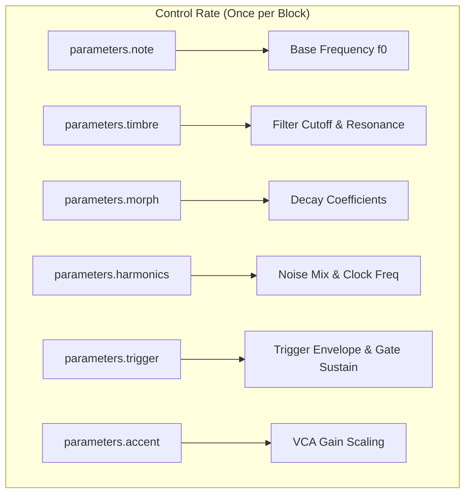
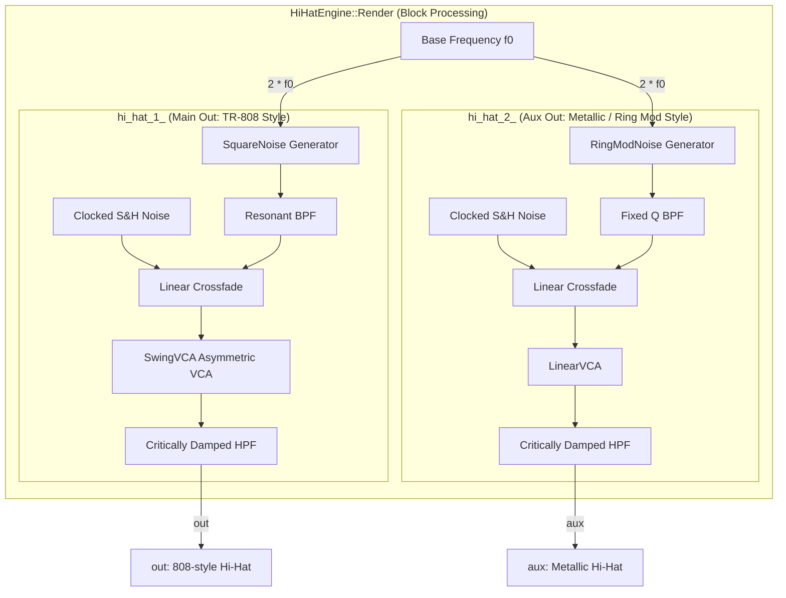

# Hi-Hat Engine

This document covers the DSP analysis of the
[HiHatEngine](https://github.com/arachnegl/eurorack/blob/master/plaits/dsp/engine/hi_hat_engine.h) class.

---

### Control Rate Flow Diagram



### DSP Loop Flow Diagram



---

### Core DSP & Synthesis Techniques

The `HiHatEngine` contains two independent hi-hat voices, utilizing a template class `HiHat` configured with different metallic noise generators and VCA models:
1. **`hi_hat_1_` (Main Out)**: Faithful TR-808 emulation using 6 square oscillators, an asymmetric non-linear VCA (`SwingVCA`), and a resonant bandpass filter.
2. **`hi_hat_2_` (Aux Out)**: A modern metallic sound source using ring-modulated oscillators, a linear VCA (`LinearVCA`), a non-resonant bandpass filter, and a two-stage choke decay envelope.

#### 1. TR-808 Metallic Noise Source (`SquareNoise`)
The core of the TR-808 hi-hat sound is a bank of six square-wave oscillators mixed together. The nominal fundamental frequency is $f_0 \approx 414\text{ Hz}$, and the oscillators are tuned to specific inharmonic ratios:
$$\text{ratios} = [1.0, 1.304, 1.466, 1.787, 1.932, 2.536]$$

The phase accumulators are updated using 32-bit fixed-point unsigned integers (`uint32_t`). The phase increments are computed as:
$$f_i = 2 f_0 \times \text{ratio}_i$$
If $f_i$ exceeds the Nyquist limit, it is clamped to $0.499 \cdot F_s$. 
The outputs of the six oscillators are summed. By checking the most significant bit (MSB) via `phase >> 31`, each square wave yields either $0$ or $1$. The summed result is mapped to the range $[-1.0, 1.0]$:
$$y_{\text{square}}[n] = 0.33 \times \sum_{i=0}^{5} \text{step}(\theta_i[n] - \pi) - 1.0$$
where $\theta_i[n] \in [0, 2\pi)$ represents the phase of the $i$-th oscillator.

#### 2. Ring Modulation Metallic Noise Source (`RingModNoise`)
The secondary engine uses three pairs of square and saw oscillators multiplied together to produce sidebands (ring modulation). This generates a dense, metallic texture resembling cymbals from early drum machines like the Korg KR-55 or FM cymbals.

The oscillators are tuned to high frequencies, and scaled by a note-tracking compression factor:
$$\text{ratio} = \frac{f_0}{0.01 + f_0}$$
This tracking ensures the cymbals retain their bright high-frequency profile across the keyboard range. The three pairs are configured with the following nominal frequencies:
* **Pair 0**: Square wave $S_0$ ($200\text{ Hz} \times \text{ratio}$), Saw wave $W_0$ ($7530\text{ Hz} \times \text{ratio}$)
* **Pair 1**: Square wave $S_1$ ($510\text{ Hz} \times \text{ratio}$), Saw wave $W_1$ ($8075\text{ Hz} \times \text{ratio}$)
* **Pair 2**: Square wave $S_2$ ($730\text{ Hz} \times \text{ratio}$), Saw wave $W_2$ ($10500\text{ Hz} \times \text{ratio}$)

The outputs are multiplied per pair and accumulated:
$$y_{\text{ring}}[n] = \sum_{i=0}^{2} S_i(f_{i, \text{sq}})[n] \times W_i(f_{i, \text{saw}})[n]$$

#### 3. Linear Crossfaded Clocked Noise
To add grit and grain to the noise profile, a variable amount of clocked sample-and-hold (S&H) white noise is mixed into the output of the metallic noise generator. The frequency of the noise clock scales inversely with the `harmonics` parameter ($\text{noisiness}$):
$$f_{\text{noise}} = f_0 \times (16.0 + 16.0 \times (1.0 - \text{noisiness}))$$
constrained to $[0.0, 0.5]$ (Nyquist).

When the clock wraps around ($\ge 1.0$), a new random value $r[n] \in [-0.5, 0.5]$ is generated. The mix between the filtered metallic noise $y_{\text{filt}}[n]$ and the S&H noise $r[n]$ is controlled by the squared $\text{noisiness}$ parameter:
$$y_{\text{mixed}}[n] = (1 - \text{noisiness}^2) \times y_{\text{filt}}[n] + \text{noisiness}^2 \times r[n]$$

#### 4. Filter System (SVF)
The engine utilizes two State Variable Filters (SVF) per voice:
1. **Coloration Band-Pass Filter**: Applied immediately after noise generation. The cutoff frequency scales exponentially over 6 octaves based on the `timbre` ($\text{tone}$) parameter:
   $$f_c = \frac{150}{F_s} \times 2^{6 \times \text{tone}}$$
   * For the 808 model (`hi_hat_1_`), the BPF resonance is dynamic: $Q = 3.0 + 3.0 \times \text{tone}$, creating a ringing resonant peak.
   * For the ring mod model (`hi_hat_2_`), the BPF resonance is fixed: $Q = 1.0$.
2. **High-Pass Filter**: Applied at the output of the VCA. It shares the same cutoff frequency $f_c$ but has a fixed $Q = 0.5$ (critically damped) to roll off low frequencies and remove DC offsets.

#### 5. Envelopes & VCA Processing
The VCA gain is controlled by either a gate-based sustain level (when the trigger is unpatched) or an exponential decay envelope.
At trigger times, the envelope is initialized to:
$$A_0 = (1.5 + 0.5 \times (1.0 - \text{decay})) \times (0.3 + 0.7 \times \text{accent})$$

The envelope decays exponentially:
$$A[n] = A[n-1] \times g_{\text{decay}}$$
where the decay coefficients are determined by the `morph` ($\text{decay}$) parameter:
$$g_{\text{envelope\_decay}} = 1.0 - 0.003 \times 2^{-7 \times \text{decay}}$$
$$g_{\text{cut\_decay}} = 1.0 - 0.0025 \times 2^{-3 \times \text{decay}}$$

* **Single Stage Envelope (`hi_hat_1_`)**: Always decays at the rate $g_{\text{envelope\_decay}}$.
* **Two-Stage Envelope (`hi_hat_2_`)**: Simulates a closed hi-hat choking circuit. When $A[n] > 0.5$, it decays at the slower $g_{\text{envelope\_decay}}$ rate. Once it falls to $\le 0.5$, it switches to the faster $g_{\text{cut\_decay}}$ rate to truncate the tail.

The VCAs shape the amplitude of the mixed noise:
* **`SwingVCA` (`hi_hat_1_`)**: Implements an asymmetric soft clipper to model transistor VCA saturation:
  $$s_{\text{scaled}} = \begin{cases} 4.0s & \text{if } s > 0 \\ 0.1s & \text{if } s \le 0 \end{cases}$$
  $$s_{\text{swing}} = \frac{s_{\text{scaled}}}{1 + |s_{\text{scaled}}|}$$
  $$y_{\text{vca}}[n] = (s_{\text{swing}} + 0.1) \times \text{gain}[n]$$
* **`LinearVCA` (`hi_hat_2_`)**: Standard linear gain multiplication:
  $$y_{\text{vca}}[n] = s \times \text{gain}[n]$$

---

### Code Analysis

#### A. Header Structure & Engine State ([hi_hat_engine.h](https://github.com/arachnegl/eurorack/blob/master/plaits/dsp/engine/hi_hat_engine.h))

The engine implements two private instances of the template class `HiHat`:
```cpp
HiHat<SquareNoise, SwingVCA, true, false> hi_hat_1_;
HiHat<RingModNoise, LinearVCA, false, true> hi_hat_2_;
```

The state variables inside the template class `HiHat` (in [hi_hat.h](https://github.com/arachnegl/eurorack/blob/master/plaits/dsp/drums/hi_hat.h)) store the filters, noise generators, and envelope/sustain coefficients:
* `envelope_`: Accumulates the current decay gain value.
* `noise_clock_` / `noise_sample_`: Track the phase accumulator and current sample value of the clocked noise generator.
* `sustain_gain_`: Smoothed gain variable for sustain/gate mode.
* `metallic_noise_`: Instance of the metallic noise generator type.
* `noise_coloration_svf_`: SVF band-pass filter.
* `hpf_`: SVF high-pass filter.

#### B. Render Loop Breakdown ([hi_hat_engine.cc](https://github.com/arachnegl/eurorack/blob/master/plaits/dsp/engine/hi_hat_engine.cc#L46))

The `HiHatEngine::Render` method converts parameters and delegates rendering to both hi-hat instances:
```cpp
void HiHatEngine::Render(
    const EngineParameters& parameters,
    float* out,
    float* aux,
    size_t size,
    bool* already_enveloped) {
  const float f0 = NoteToFrequency(parameters.note);
  
  hi_hat_1_.Render(
      parameters.trigger & TRIGGER_UNPATCHED,
      parameters.trigger & TRIGGER_RISING_EDGE,
      parameters.accent,
      f0,
      parameters.timbre,
      parameters.morph,
      parameters.harmonics,
      temp_buffer_,
      temp_buffer_ + size,
      out,
      size);
  
  hi_hat_2_.Render(
      parameters.trigger & TRIGGER_UNPATCHED,
      parameters.trigger & TRIGGER_RISING_EDGE,
      parameters.accent,
      f0,
      parameters.timbre,
      parameters.morph,
      parameters.harmonics,
      temp_buffer_,
      temp_buffer_ + size,
      aux,
      size);
}
```

The core steps within `HiHat::Render` (in [hi_hat.h](https://github.com/arachnegl/eurorack/blob/master/plaits/dsp/drums/hi_hat.h#L184)) are described below:

##### 1. Fixed-Point Square Noise Update Loop
Inside `SquareNoise::Render`, six phase increments are computed based on the ratio array. Unsigned integer overflow automatically handles the modulo wrap-around. The signs are accumulated to yield the metallic signal:
```cpp
while (size--) {
  phase[0] += increment[0];
  phase[1] += increment[1];
  phase[2] += increment[2];
  phase[3] += increment[3];
  phase[4] += increment[4];
  phase[5] += increment[5];
  uint32_t noise = 0;
  noise += (phase[0] >> 31);
  noise += (phase[1] >> 31);
  noise += (phase[2] >> 31);
  noise += (phase[3] >> 31);
  noise += (phase[4] >> 31);
  noise += (phase[5] >> 31);
  *out++ = 0.33f * static_cast<float>(noise) - 1.0f;
}
```

##### 2. Clocked Noise Cross-fade Loop
The band-pass filtered metallic noise is cross-faded with sample-and-hold noise:
```cpp
noisiness *= noisiness;
float noise_f = f0 * (16.0f + 16.0f * (1.0f - noisiness));
CONSTRAIN(noise_f, 0.0f, 0.5f);

for (size_t i = 0; i < size; ++i) {
  noise_clock_ += noise_f;
  if (noise_clock_ >= 1.0f) {
    noise_clock_ -= 1.0f;
    noise_sample_ = stmlib::Random::GetFloat() - 0.5f;
  }
  out[i] += noisiness * (noise_sample_ - out[i]);
}
```

##### 3. Envelope Decay and VCA Multiplication Loop
The envelope decay factors are applied. If `two_stage_envelope` is enabled, the decay rate accelerates below the 0.5 threshold:
```cpp
stmlib::ParameterInterpolator sustain_gain(
    &sustain_gain_,
    accent * decay,
    size);
for (size_t i = 0; i < size; ++i) {
  VCA vca;
  envelope_ *= envelope_ > 0.5f || !two_stage_envelope
      ? envelope_decay
      : cut_decay;
  out[i] = vca(out[i], sustain ? sustain_gain.Next() : envelope_);
}
```

---

<!-- KaTeX support for mathematical formulas -->
<link rel="stylesheet" href="https://cdn.jsdelivr.net/npm/katex@0.16.8/dist/katex.min.css">
<script defer src="https://cdn.jsdelivr.net/npm/katex@0.16.8/dist/katex.min.js"></script>
<script defer src="https://cdn.jsdelivr.net/npm/katex@0.16.8/dist/contrib/auto-render.min.js"
        onload="renderMathInElement(document.body, {
          delimiters: [
            {left: '$$', right: '$$', display: true},
            {left: '$', right: '$', display: false}
          ]
        });"></script>

<!-- Mermaid JS support for rendering diagrams with Click-to-Zoom Lightbox -->
<script type="module">
  import mermaid from 'https://cdn.jsdelivr.net/npm/mermaid@10/dist/mermaid.esm.min.mjs';
  mermaid.initialize({ startOnLoad: false });
  
  // Inject lightbox styling
  const style = document.createElement('style');
  style.textContent = `
    .mermaid-lightbox {
      position: fixed;
      top: 0;
      left: 0;
      width: 100vw;
      height: 100vh;
      background: rgba(15, 15, 15, 0.9);
      backdrop-filter: blur(8px);
      -webkit-backdrop-filter: blur(8px);
      display: flex;
      align-items: center;
      justify-content: center;
      z-index: 10000;
      opacity: 0;
      transition: opacity 0.2s ease;
      pointer-events: none;
    }
    .mermaid-lightbox.active {
      opacity: 1;
      pointer-events: auto;
    }
    .mermaid-lightbox svg {
      max-width: 90%;
      max-height: 90%;
      width: auto;
      height: auto;
      background: rgba(255, 255, 255, 0.95);
      padding: 20px;
      border-radius: 8px;
      box-shadow: 0 20px 50px rgba(0, 0, 0, 0.3);
    }
    .mermaid-lightbox .close-btn {
      position: absolute;
      top: 20px;
      right: 30px;
      font-size: 40px;
      color: #fff;
      cursor: pointer;
      user-select: none;
      font-family: sans-serif;
    }
    .mermaid-trigger {
      cursor: zoom-in;
      transition: transform 0.2s ease;
    }
    .mermaid-trigger:hover {
      transform: scale(1.01);
    }
  `;
  document.head.appendChild(style);
 
  // Inject lightbox modal elements
  const lightbox = document.createElement('div');
  lightbox.className = 'mermaid-lightbox';
  lightbox.innerHTML = '<span class="close-btn">&times;</span><div class="content"></div>';
  document.body.appendChild(lightbox);
 
  lightbox.addEventListener('click', () => {
    lightbox.classList.remove('active');
  });
 
  // Convert Mermaid code blocks to styled divs
  const codeBlocks = document.querySelectorAll('.language-mermaid code, pre code.language-mermaid');
  codeBlocks.forEach((block) => {
    const container = block.closest('.language-mermaid') || block.parentElement;
    const el = document.createElement('div');
    el.className = 'mermaid mermaid-trigger';
    el.textContent = block.textContent;
    container.replaceWith(el);
  });
  
  // Render and handle lightbox events
  mermaid.run().then(() => {
    document.querySelectorAll('.mermaid-trigger').forEach((trigger) => {
      trigger.addEventListener('click', () => {
        const content = lightbox.querySelector('.content');
        content.innerHTML = trigger.innerHTML;
        lightbox.classList.add('active');
      });
    });
  });
</script>
