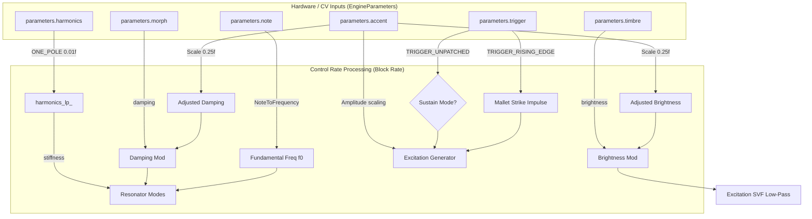
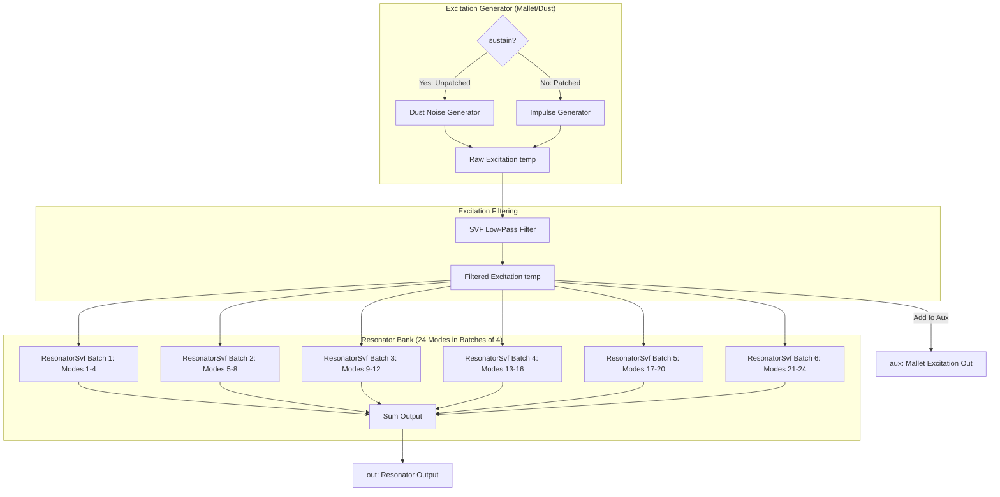

# Modal Engine

This document covers the DSP analysis of the [ModalEngine](https://github.com/arachnegl/eurorack/blob/master/plaits/dsp/engine/modal_engine.h) class, which implements one voice of modal synthesis in Plaits.

---

### Control Rate Flow Diagram



### DSP Loop Flow Diagram



---

### Core DSP & Synthesis Techniques

#### 1. Acoustic Principles of Modal Synthesis
Unlike physical modeling methods such as digital waveguides (which simulate the propagation of waves in a medium), modal synthesis models the vibrational properties of an object directly in the frequency domain. An acoustic structure (such as a string, plate, bar, or drumhead) is treated as a bank of resonant bandpass filters (modes), each representing an individual vibrational mode of the object. 

When excited by an input signal $e(t)$, the total acoustic response $y(t)$ is a summation of $N$ decaying sinusoids:
$$y(t) = \sum_{i=1}^{N} A_i e^{-d_i t} \sin(\omega_i t + \phi_i)$$
Where:
* $N$ is the number of modes ($N \le 24$ in `ModalEngine`).
* $A_i$ represents the mode amplitude, determined by the strike position and the geometry of the object.
* $d_i$ represents the damping factor (decay rate) of the mode.
* $\omega_i = 2 \pi f_i$ is the resonant frequency of the mode.
* $\phi_i$ is the initial phase offset.

#### 2. Mallet Excitation Signal Generator
The excitation signal models the physical strike of a mallet, drumstick, or continuous friction (like bowing or scraping). It is generated in the `temp` buffer and filtered before driving the resonator bank:

* **Sustained Mode (Trigger Unpatched):**
  If the trigger input is unpatched (`sustain` is true), the exciter produces continuous particle clicks (Dust noise). The click generation probability is determined by the `brightness` parameter:
  $$\text{dust\_f} = 0.00005 + 0.99995 \cdot \text{brightness}^4$$
  For each sample, if a random float $U \in [0, 1)$ is less than $\text{dust\_f}$, an impulse is produced:
  $$\text{temp}[i] = \frac{U}{\text{dust\_f}} \cdot (4.0 - 3.0 \cdot \text{dust\_f}) \cdot \text{accent}$$
  This models continuous surface roughness or rain-like friction.

* **Triggered Mode (Trigger Patched):**
  When a trigger rising edge is detected, a single pulse is generated at index $0$:
  $$\text{amplitude} = (0.12 + 0.08 \cdot \text{accent}) \cdot (1.0 - 0.5 \cdot \text{damping})$$
  To keep the energy constant across different filter cutoffs, the impulse is scaled by the cutoff value:
  $$\text{temp}[0] = \text{amplitude} \cdot \frac{\text{SemitonesToRatio}(\text{cutoff}^2 \cdot 24)}{\text{cutoff}}$$
  All other samples in the block are set to $0$.

* **Excitation Filter:**
  The raw excitation signal passes through a one-channel SVF configured as a low-pass filter with cutoff frequency:
  $$\text{cutoff} = \min\left( f \cdot 2^{\frac{(\text{brightness} \cdot (2.0 - \text{brightness}) - 0.5) \cdot \text{range}}{12}}, 0.499 \right)$$
  Where $f = 4 f_0$ (sustained) or $2 f_0$ (triggered), and $\text{range} = 36$ semitones (sustained) or $60$ semitones (triggered). A low cutoff produces a soft rubber mallet strike, while a high cutoff yields a hard wood or metal mallet click. The filtered excitation is output directly on the `aux` channel.

#### 3. Stiffness & Dispersion Modeling (String vs. Plate vs. Bar)
In an ideal string, the mode frequencies are integer multiples of the fundamental: $f_i = (i+1)f_0$. In real-world objects, stiffness and physical dimensions cause dispersion, shifting the partials away from integer relationships. 

`ModalEngine` maps the `structure` parameter (`harmonics`) to stiffness using the lookup table `lut_stiffness`:
$$\text{stiffness} = \text{Interpolate}(\text{lut\_stiffness}, \text{structure}, 64.0)$$
To prevent the perceived pitch from shifting as stiffness changes, the fundamental frequency is adjusted by:
$$f_0' = f_0 \cdot \text{NthHarmonicCompensation}(3, \text{stiffness})$$
Where the compensation factor is calculated based on the third harmonic:
$$\text{stretch\_factor}_3 = 1.0 + \text{stiffness} + \text{stiffness} \cdot \delta$$
$$\text{compensation} = \frac{1.0}{\text{stretch\_factor}_3}$$
With $\delta = 0.93$ if $\text{stiffness} < 0$, or $\delta = 0.98$ if $\text{stiffness} \ge 0$.

For each mode $i = 0, \dots, N-1$, the mode frequency is calculated iteratively:
$$f_i = \min\left( (i+1) f_0' \cdot \text{stretch\_factor}_i, 0.499 \right)$$
Where the stiffness and stretch factors evolve at each step:
$$\text{stretch\_factor}_{i} = \text{stretch\_factor}_{i-1} + \text{stiffness}_i$$
$$\text{stiffness}_i = \text{stiffness}_{i-1} \cdot (\text{stiffness} < 0 ? 0.93 : 0.98)$$
This allows a smooth transition across three physical structures:
* **Harmonic Series ($\text{stiffness} \approx 0$):** Partials are integer multiples, modeling strings or open pipes.
* **Compressed Series ($\text{stiffness} < 0$):** Partials are compressed ($f_i < (i+1)f_0'$), modeling membranes or compact cavities.
* **Stretched Series ($\text{stiffness} > 0$):** Partials are stretched ($f_i > (i+1)f_0'$), modeling stiff bars (marimba, glockenspiel) or metal plates.

#### 4. Decay Damping
The base decay rate $Q$ is exponentially mapped from the `damping` (`morph`) parameter:
$$q_{\text{base}} = 500 \cdot \left(\text{SemitonesToRatio}(\text{damping} \cdot 79.7)\right)^2 = 500 \cdot 2^{\frac{2 \cdot \text{damping} \cdot 79.7}{12}} = 500 \cdot 2^{\text{damping} \cdot 13.283}$$
To model natural acoustic damping, higher-frequency partials must decay faster than the fundamental. A Q-loss factor is calculated:
$$\text{brightness}' = \text{brightness} \cdot (1.0 - \text{structure} \cdot 0.3) \cdot (1.0 - \text{damping} \cdot 0.3)$$
$$Q_{\text{loss}} = \text{brightness}' \cdot (2.0 - \text{brightness}') \cdot 0.85 + 0.15$$
For each mode $i$, the resonator decay is decayed:
$$q_i = q_{i-1} \cdot Q_{\text{loss}}$$
The quality factor $Q_i$ for mode $i$ is:
$$Q_i = 1.0 + f_i \cdot q_i$$
Since $Q_{\text{loss}} \le 1.0$, higher-frequency partials decay exponentially faster, mimicking real acoustic materials.

#### 5. Chamberlin State Variable Filter (SVF)
The resonator bank uses 24 bandpass State Variable Filters processed in parallel batches of 4.
For each mode, the coefficients are:
$$g = \tan(\pi f)$$
$$r = \frac{1}{Q}$$
$$h = \frac{1}{1 + r g + g^2}$$
For each sample input $x$, the filter state updates as:
$$v_{\text{hp}} = h \cdot (x - (r+g) \cdot s_1 - s_2)$$
$$v_{\text{bp}} = g \cdot v_{\text{hp}} + s_1$$
$$s_1 \leftarrow g \cdot v_{\text{hp}} + v_{\text{bp}}$$
$$v_{\text{lp}} = g \cdot v_{\text{bp}} + s_2$$
$$s_2 \leftarrow g \cdot v_{\text{bp}} + v_{\text{lp}}$$
The output is computed as:
$$y_i[n] = A_i \cdot (1.0 - 2.0 f_i) \cdot v_{\text{bp}}[n]$$
Where $A_i$ is the mode amplitude. The term $(1.0 - 2.0 f_i)$ attenuates modes near the Nyquist limit ($0.5$) to prevent aliasing.

---

### Code Analysis

#### A. Header Structure & Engine State ([modal_engine.h](https://github.com/arachnegl/eurorack/blob/master/plaits/dsp/engine/modal_engine.h))
The state of the engine is kept minimal to fit within the module's dynamic buffer allocation system:
* **`ModalVoice voice_`:** Encapsulates the physical modeling excitation filter and resonator bank.
* **`float* temp_buffer_`:** Dynamic workspace buffer of size `kMaxBlockSize` to store the excitation signal.
* **`float harmonics_lp_`:** One-pole filter state to smooth parameter changes on the `harmonics` control.

Inside `ModalVoice` ([modal_voice.h](https://github.com/arachnegl/eurorack/blob/master/plaits/dsp/physical_modelling/modal_voice.h)):
* **`ResonatorSvf<1> excitation_filter_`:** A single-channel SVF for shaping the exciter signal.
* **`Resonator resonator_`:** The resonator bank managing mode amplitudes and SVF filters.

Inside `Resonator` ([resonator.h](https://github.com/arachnegl/eurorack/blob/master/plaits/dsp/physical_modelling/resonator.h)):
* **`float mode_amplitude_[kMaxNumModes]`:** Amplitude profile of the modes. During initialization, this is evaluated using a `CosineOscillator` with a fixed pluck position of $0.015$. This pluck position represents an excitation close to the boundary, yielding a rich harmonic response.
* **`ResonatorSvf<kModeBatchSize> mode_filters_`:** An array of `ResonatorSvf<4>` filter blocks. Processing 4 modes in parallel fits perfectly within ARM Cortex-M4 registers, allowing for high performance.

#### B. Render Loop Breakdown ([modal_engine.cc](https://github.com/arachnegl/eurorack/blob/master/plaits/dsp/engine/modal_engine.cc))

##### 1. Parameter Smoothing & Routing
The main engine render block zeroes out outputs, filters the harmonics parameter, and delegates to the voice:
```cpp
void ModalEngine::Render(
    const EngineParameters& parameters,
    float* out,
    float* aux,
    size_t size,
    bool* already_enveloped) {
  fill(&out[0], &out[size], 0.0f);
  fill(&aux[0], &aux[size], 0.0f);
  
  ONE_POLE(harmonics_lp_, parameters.harmonics, 0.01f);
  
  voice_.Render(
      parameters.trigger & TRIGGER_UNPATCHED,
      parameters.trigger & TRIGGER_RISING_EDGE,
      parameters.accent,
      NoteToFrequency(parameters.note),
      harmonics_lp_,
      parameters.timbre,
      parameters.morph,
      temp_buffer_,
      out,
      aux,
      size);
}
```

##### 2. Excitation Signal Synthesis
In `ModalVoice::Render` ([modal_voice.cc](https://github.com/arachnegl/eurorack/blob/master/plaits/dsp/physical_modelling/modal_voice.cc#L52)), the excitation signal is written to the `temp` buffer:
```cpp
  // Synthesize excitation signal.
  if (sustain) {
    const float dust_f = 0.00005f + 0.99995f * density * density;
    for (size_t i = 0; i < size; ++i) {
      temp[i] = Dust(dust_f) * (4.0f - dust_f * 3.0f) * accent;
    }
  } else {
    fill(&temp[0], &temp[size], 0.0f);
    if (trigger) {
      const float attenuation = 1.0f - damping * 0.5f;
      const float amplitude = (0.12f + 0.08f * accent) * attenuation;
      temp[0] = amplitude * SemitonesToRatio(cutoff * cutoff * 24.0f) / cutoff;
    }
  }
```
* **Dirac Impulse Scaling:** In triggered mode, the first sample contains the full energy of the mallet strike. The division by `cutoff` compensates for the low-pass filter's attenuation at high frequencies, maintaining uniform perceived loudness.

##### 3. Filtering & Routing to Aux
The raw excitation is filtered using the SVF lowpass filter and added to the `aux` output:
```cpp
  const float one = 1.0f;
  excitation_filter_.Process<FILTER_MODE_LOW_PASS, false>(
      &cutoff, &q, &one, temp, temp, size);
  for (size_t i = 0; i < size; ++i) {
    aux[i] += temp[i];
  }
```

##### 4. Resonator Dispersion & Batch Processing
In `Resonator::Process` ([resonator.cc](https://github.com/arachnegl/eurorack/blob/master/plaits/dsp/physical_modelling/resonator.cc#L72)), the modes are updated and processed in batches:
```cpp
  for (int i = 0; i < resolution_; ++i) {
    float mode_frequency = harmonic * stretch_factor;
    if (mode_frequency >= 0.499f) {
      mode_frequency = 0.499f;
    }
    const float mode_attenuation = 1.0f - mode_frequency * 2.0f;
    
    mode_f[batch_counter] = mode_frequency;
    mode_q[batch_counter] = 1.0f + mode_frequency * q;
    mode_a[batch_counter] = mode_amplitude_[i] * mode_attenuation;
    ++batch_counter;
    
    if (batch_counter == kModeBatchSize) {
      batch_counter = 0;
      batch_processor->Process<FILTER_MODE_BAND_PASS, true>(
          mode_f,
          mode_q,
          mode_a,
          in,
          out,
          size);
      ++batch_processor;
    }
    
    stretch_factor += stiffness;
    if (stiffness < 0.0f) {
      stiffness *= 0.93f;
    } else {
      stiffness *= 0.98f;
    }
    harmonic += f0;
    q *= q_loss;
  }
```
* **`Process<FILTER_MODE_BAND_PASS, true>`**: The template argument `true` specifies that the outputs of the modes are accumulated directly into the output buffer (`out`), summing up all 24 resonances to reconstruct the full acoustic body of the simulated object.

---

<!-- KaTeX support for mathematical formulas -->
<link rel="stylesheet" href="https://cdn.jsdelivr.net/npm/katex@0.16.8/dist/katex.min.css">
<script defer src="https://cdn.jsdelivr.net/npm/katex@0.16.8/dist/katex.min.js"></script>
<script defer src="https://cdn.jsdelivr.net/npm/katex@0.16.8/dist/contrib/auto-render.min.js"
        onload="renderMathInElement(document.body, {
          delimiters: [
            {left: '$$', right: '$$', display: true},
            {left: '$', right: '$', display: false}
          ]
        });"></script>

<!-- Mermaid JS support for rendering diagrams with Click-to-Zoom Lightbox -->
<script type="module">
  import mermaid from 'https://cdn.jsdelivr.net/npm/mermaid@10/dist/mermaid.esm.min.mjs';
  mermaid.initialize({ startOnLoad: false });
  
  // Inject lightbox styling
  const style = document.createElement('style');
  style.textContent = `
    .mermaid-lightbox {
      position: fixed;
      top: 0;
      left: 0;
      width: 100vw;
      height: 100vh;
      background: rgba(15, 15, 15, 0.9);
      backdrop-filter: blur(8px);
      -webkit-backdrop-filter: blur(8px);
      display: flex;
      align-items: center;
      justify-content: center;
      z-index: 10000;
      opacity: 0;
      transition: opacity 0.2s ease;
      pointer-events: none;
    }
    .mermaid-lightbox.active {
      opacity: 1;
      pointer-events: auto;
    }
    .mermaid-lightbox svg {
      max-width: 90%;
      max-height: 90%;
      width: auto;
      height: auto;
      background: rgba(255, 255, 255, 0.95);
      padding: 20px;
      border-radius: 8px;
      box-shadow: 0 20px 50px rgba(0, 0, 0, 0.3);
    }
    .mermaid-lightbox .close-btn {
      position: absolute;
      top: 20px;
      right: 30px;
      font-size: 40px;
      color: #fff;
      cursor: pointer;
      user-select: none;
      font-family: sans-serif;
    }
    .mermaid-trigger {
      cursor: zoom-in;
      transition: transform 0.2s ease;
    }
    .mermaid-trigger:hover {
      transform: scale(1.01);
    }
  `;
  document.head.appendChild(style);

  // Inject lightbox modal elements
  const lightbox = document.createElement('div');
  lightbox.className = 'mermaid-lightbox';
  lightbox.innerHTML = '<span class="close-btn">&times;</span><div class="content"></div>';
  document.body.appendChild(lightbox);

  lightbox.addEventListener('click', () => {
    lightbox.classList.remove('active');
  });

  // Convert Mermaid code blocks to styled divs
  const codeBlocks = document.querySelectorAll('.language-mermaid code, pre code.language-mermaid');
  codeBlocks.forEach((block) => {
    const container = block.closest('.language-mermaid') || block.parentElement;
    const el = document.createElement('div');
    el.className = 'mermaid mermaid-trigger';
    el.textContent = block.textContent;
    container.replaceWith(el);
  });
  
  // Render and handle lightbox events
  mermaid.run().then(() => {
    document.querySelectorAll('.mermaid-trigger').forEach((trigger) => {
      trigger.addEventListener('click', () => {
        const content = lightbox.querySelector('.content');
        content.innerHTML = trigger.innerHTML;
        lightbox.classList.add('active');
      });
    });
  });
</script>
