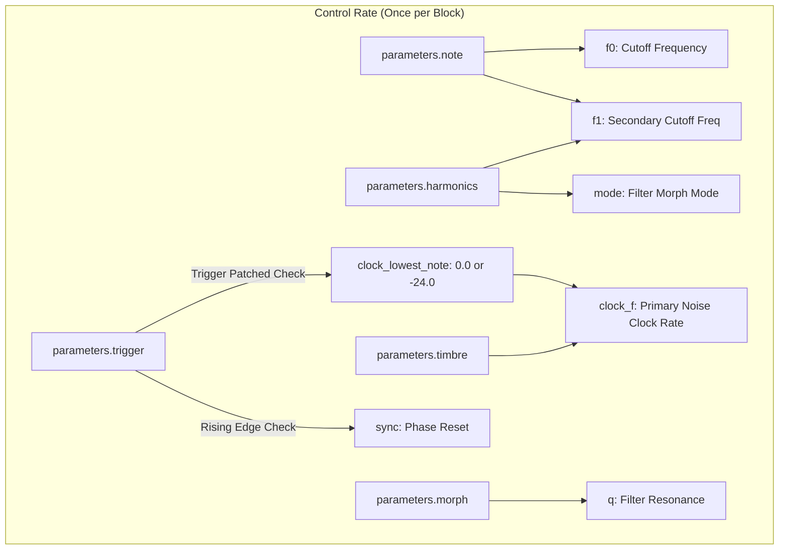
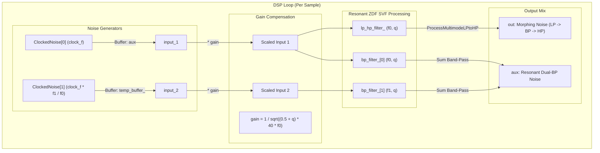

# Noise Engine

This document covers the DSP analysis of the
[NoiseEngine](https://github.com/arachnegl/eurorack/blob/master/plaits/dsp/engine/noise_engine.h) class.

---

### Control Rate Flow Diagram



### DSP Loop Flow Diagram



---

### Core DSP & Synthesis Techniques

#### 1. Band-Limited Clocked Noise (PolyBLEP Sample & Hold)
The engine produces clocked random noise rather than simple white noise. This replicates a clocked Sample & Hold (S&H) generator. Because the clock rate is variable and can be modulated, direct step transitions between random levels would introduce aliasing harmonics. To prevent this, the `ClockedNoise` class implements **PolyBLEP (Polynomial Band-Limited Step)** interpolation to anti-alias step transitions.

A step transition of height $D = x_{\text{new}} - x_{\text{old}}$ occurring at a fractional sample offset $t \in [0, 1)$ introduces high-frequency aliasing. PolyBLEP corrects the discontinuity by applying a localized quadratic correction to the current and subsequent samples:
$$x[n] \leftarrow x[n] + D \cdot h_{\text{blep}}(t)$$
$$x[n+1] \leftarrow x[n+1] + D \cdot h_{\text{blep}}(t - 1)$$
Where the PolyBLEP residuals are defined as:
$$\text{ThisBlepSample}(t) = \frac{1}{2} t^2$$
$$\text{NextBlepSample}(t) = -\frac{1}{2} (1 - t)^2$$

As the clock rate approaches Nyquist, the discrete step structure becomes less meaningful. To avoid loss of high-frequency energy, the engine crossfades to raw white noise at high frequencies:
$$\text{raw\_amount} = \text{clamp}(4 \times (f_{\text{clock}} - 0.25), 0, 1)$$
$$\text{output} = \text{this\_sample} + \text{raw\_amount} \times (\text{raw\_sample} - \text{this\_sample})$$

#### 2. Zero-Delay Feedback (ZDF) State Variable Filter (SVF)
The filters used for shaping the noise are Zero-Delay Feedback (ZDF) State Variable Filters, based on the trapezoidal integration scheme. The ZDF SVF resolves the algebraic loop equation at the current sample step, eliminating the one-sample delay that degrades high-frequency behavior in naive digital filter models.

For a cutoff frequency $f_c$ and quality factor $Q$, the coefficients are calculated as:
$$g = \tan\left(\pi \frac{f_c}{F_s}\right)$$
$$r = \frac{1}{Q}$$
$$h = \frac{1}{1 + r \cdot g + g^2}$$

To avoid evaluating the computationally heavy `tanf` function, `OnePole::tan<FREQUENCY_ACCURATE>` uses an optimized Taylor series approximation:
$$\tan(\pi f) \approx f \left(\pi + a f^2 + b f^4 + c f^6 + d f^8\right)$$
Where the coefficients are tuned to minimize error in the audio range:
*   $a = 0.3333314036 \cdot \pi^3$
*   $b = 0.1333923995 \cdot \pi^5$
*   $c = 0.0533740603 \cdot \pi^7$
*   $d = 0.0029005250 \cdot \pi^9$

The filter process updates the high-pass ($hp$), band-pass ($bp$), and low-pass ($lp$) outputs from the input $x[n]$ and internal state integrators $s_1$, $s_2$:
$$hp[n] = (x[n] - (r + g) s_1[n-1] - s_2[n-1]) \cdot h$$
$$bp[n] = g \cdot hp[n] + s_1[n-1]$$
$$lp[n] = g \cdot bp[n] + s_2[n-1]$$

After computing the outputs, the integrator states are updated for the next iteration:
$$s_1[n] = 2 \cdot g \cdot hp[n] + s_1[n-1]$$
$$s_2[n] = 2 \cdot g \cdot bp[n] + s_2[n-1]$$

#### 3. Multimode Filter Morphing
The main output filter `lp_hp_filter_` supports continuous morphing from Low-Pass to Band-Pass to High-Pass based on the `harmonics` parameter. The gains are calculated as:
$$\text{lp\_gain} = \max(1.0 - 2 \cdot \text{mode}, 0.0)$$
$$\text{bp\_gain} = 1.0 - 2 \cdot |\text{mode} - 0.5|$$
$$\text{hp\_gain} = \min(1.0 - 2 \cdot \text{mode}, 0.0)$$

Note that $\text{hp\_gain}$ becomes negative (reaching $-1.0$ at $\text{mode} = 1.0$). This phase inversion aligns the high-pass response with the low-pass and band-pass components, ensuring phase-coherent summation and smooth crossfading without frequency cancellation.

#### 4. Formant & Dual Bandpass Resonator (Aux Output)
The auxiliary channel combines two bandpass filters (`bp_filter_[0]` and `bp_filter_[1]`) fed by two separate noise generators. The primary filter is tuned to $f_0$ and the secondary filter is tuned to $f_1$. The clock rate of the second noise generator is scaled by the ratio $f_1 / f_0$, matching the spectral shift of the filter. This creates dual-resonant bandpass peaks, generating formants or metallic resonator textures.

#### 5. Automatic Gain Compensation
To keep the output level consistent across wide ranges of frequency and resonance, the engine scales the input noise signals by a gain compensation factor:
$$\text{gain} = \frac{1}{\sqrt{(0.5 + Q) \cdot 40 \cdot f_0}}$$
This prevents the volume from spiking excessively at high resonance settings or dropping off at lower cutoff frequencies.

---

### Code Analysis

#### A. Header Structure & Engine State ([noise_engine.h](https://github.com/arachnegl/eurorack/blob/master/plaits/dsp/engine/noise_engine.h))
The class keeps its state minimal to allow dynamic allocation in Plaits' workspace buffer:
*   `ClockedNoise clocked_noise_[2]`: Two separate clocked noise generators.
*   `stmlib::Svf lp_hp_filter_`: Multi-mode morphing filter.
*   `stmlib::Svf bp_filter_[2]`: Two band-pass filters for the dual-resonant aux output.
*   `previous_f0_`, `previous_f1_`, `previous_q_`, `previous_mode_`: Parameter history used for control-rate smoothing.
*   `temp_buffer_`: Allocated dynamically via `stmlib::BufferAllocator` to store the output of the second clocked noise generator.

#### B. Render Loop Breakdown ([noise_engine.cc](https://github.com/arachnegl/eurorack/blob/master/plaits/dsp/engine/noise_engine.cc#L57))

##### 1. Parameter Mapping & Pitch Interpolation
```cpp
const float f0 = NoteToFrequency(parameters.note);
const float f1 = NoteToFrequency(
    parameters.note + parameters.harmonics * 48.0f - 24.0f);
const float clock_lowest_note = parameters.trigger & TRIGGER_UNPATCHED
    ? 0.0f
    : -24.0f;
const float clock_f = NoteToFrequency(
    parameters.timbre * (128.0f - clock_lowest_note) + clock_lowest_note);
const float q = 0.5f * SemitonesToRatio(parameters.morph * 120.0f);
const bool sync = parameters.trigger & TRIGGER_RISING_EDGE;
```
*   `f0` scales with note pitch.
*   `f1` is shifted by $\pm 24$ semitones depending on `parameters.harmonics`.
*   `clock_lowest_note` changes depending on the trigger input patch state, allowing slow clock rates down to $-24$ semitones when a trigger is connected.
*   `q` scales exponentially up to a ratio of 512, providing high resonance.

##### 2. Clocked Noise Generation
```cpp
clocked_noise_[0].Render(sync, clock_f, aux, size);
clocked_noise_[1].Render(sync, clock_f * f1 / f0, temp_buffer_, size);
```
*   Noise generator 0 renders directly into the `aux` buffer (acting as a temporary scratchpad before being overwritten).
*   Noise generator 1 is clocked at a scaled frequency $f_{\text{clock}} \cdot \frac{f_1}{f_0}$ and renders into `temp_buffer_`.

##### 3. Processing and Parameter Smoothing
```cpp
ParameterInterpolator f0_modulation(&previous_f0_, f0, size);
ParameterInterpolator f1_modulation(&previous_f1_, f1, size);
ParameterInterpolator q_modulation(&previous_q_, q, size);
ParameterInterpolator mode_modulation(
    &previous_mode_, parameters.harmonics, size);

const float* in_1 = aux;
const float* in_2 = temp_buffer_;
while (size--) {
  const float f0 = f0_modulation.Next();
  const float f1 = f1_modulation.Next();
  const float q = q_modulation.Next();
  const float gain = 1.0f / Sqrt((0.5f + q) * 40.0f * f0);
  lp_hp_filter_.set_f_q<FREQUENCY_ACCURATE>(f0, q);
  bp_filter_[0].set_f_q<FREQUENCY_ACCURATE>(f0, q);
  bp_filter_[1].set_f_q<FREQUENCY_ACCURATE>(f1, q);
  
  float input_1 = *in_1++ * gain;
  float input_2 = *in_2++ * gain;
  lp_hp_filter_.ProcessMultimodeLPtoHP(
      &input_1, out++, 1, mode_modulation.Next());
  *aux++ = bp_filter_[0].Process<FILTER_MODE_BAND_PASS>(input_1) + \
      bp_filter_[1].Process<FILTER_MODE_BAND_PASS>(input_2);
}
```
*   `ParameterInterpolator`: Smooths parameter updates across the audio block.
*   `gain`: Computes the automatic gain compensation factor for each sample.
*   `set_f_q<FREQUENCY_ACCURATE>`: Evaluates coefficients using the Taylor tangent series approximation.
*   `ProcessMultimodeLPtoHP`: Morphs the main output channel's filter type dynamically using `mode_modulation` (mapped from `harmonics`).
*   `*aux++ = ...`: Computes the sum of the two bandpass outputs to build the dual-resonant aux signal.

---

<!-- KaTeX support for mathematical formulas -->
<link rel="stylesheet" href="https://cdn.jsdelivr.net/npm/katex@0.16.8/dist/katex.min.css">
<script defer src="https://cdn.jsdelivr.net/npm/katex@0.16.8/dist/katex.min.js"></script>
<script defer src="https://cdn.jsdelivr.net/npm/katex@0.16.8/dist/contrib/auto-render.min.js"
        onload="renderMathInElement(document.body, {
          delimiters: [
            {left: '$$', right: '$$', display: true},
            {left: '$', right: '$', display: false}
          ]
        });"></script>

<!-- Mermaid JS support for rendering diagrams with Click-to-Zoom Lightbox -->
<script type="module">
  import mermaid from 'https://cdn.jsdelivr.net/npm/mermaid@10/dist/mermaid.esm.min.mjs';
  mermaid.initialize({ startOnLoad: false });
  
  // Inject lightbox styling
  const style = document.createElement('style');
  style.textContent = `
    .mermaid-lightbox {
      position: fixed;
      top: 0;
      left: 0;
      width: 100vw;
      height: 100vh;
      background: rgba(15, 15, 15, 0.9);
      backdrop-filter: blur(8px);
      -webkit-backdrop-filter: blur(8px);
      display: flex;
      align-items: center;
      justify-content: center;
      z-index: 10000;
      opacity: 0;
      transition: opacity 0.2s ease;
      pointer-events: none;
    }
    .mermaid-lightbox.active {
      opacity: 1;
      pointer-events: auto;
    }
    .mermaid-lightbox svg {
      max-width: 90%;
      max-height: 90%;
      width: auto;
      height: auto;
      background: rgba(255, 255, 255, 0.95);
      padding: 20px;
      border-radius: 8px;
      box-shadow: 0 20px 50px rgba(0, 0, 0, 0.3);
    }
    .mermaid-lightbox .close-btn {
      position: absolute;
      top: 20px;
      right: 30px;
      font-size: 40px;
      color: #fff;
      cursor: pointer;
      user-select: none;
      font-family: sans-serif;
    }
    .mermaid-trigger {
      cursor: zoom-in;
      transition: transform 0.2s ease;
    }
    .mermaid-trigger:hover {
      transform: scale(1.01);
    }
  `;
  document.head.appendChild(style);

  // Inject lightbox modal elements
  const lightbox = document.createElement('div');
  lightbox.className = 'mermaid-lightbox';
  lightbox.innerHTML = '<span class="close-btn">&times;</span><div class="content"></div>';
  document.body.appendChild(lightbox);

  lightbox.addEventListener('click', () => {
    lightbox.classList.remove('active');
  });

  // Convert Mermaid code blocks to styled divs
  const codeBlocks = document.querySelectorAll('.language-mermaid code, pre code.language-mermaid');
  codeBlocks.forEach((block) => {
    const container = block.closest('.language-mermaid') || block.parentElement;
    const el = document.createElement('div');
    el.className = 'mermaid mermaid-trigger';
    el.textContent = block.textContent;
    container.replaceWith(el);
  });
  
  // Render and handle lightbox events
  mermaid.run().then(() => {
    document.querySelectorAll('.mermaid-trigger').forEach((trigger) => {
      trigger.addEventListener('click', () => {
        const content = lightbox.querySelector('.content');
        content.innerHTML = trigger.innerHTML;
        lightbox.classList.add('active');
      });
    });
  });
</script>
