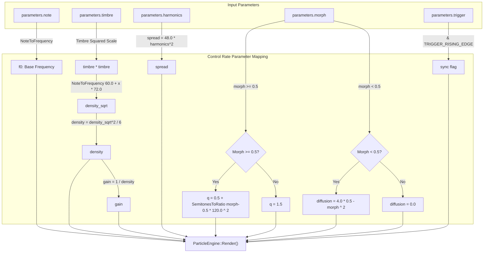
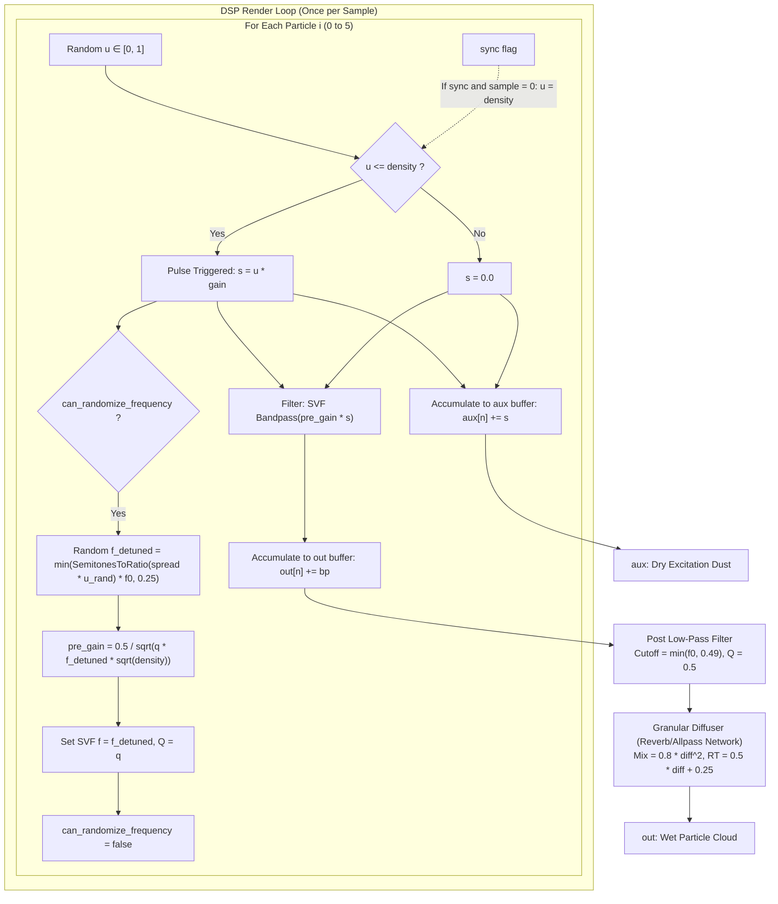

# Particle Engine

This document covers the DSP analysis of the
[ParticleEngine](https://github.com/arachnegl/eurorack/blob/master/plaits/dsp/engine/particle_engine.h) class.

---

### Control Rate Flow Diagram



### DSP Loop Flow Diagram



---

### Core DSP & Synthesis Techniques

#### 1. Granular Particle Cloud Generation
The `ParticleEngine` implements a particle generator that models **filtered random pulses** (often called "dust" or "crackling noise" in granular synthesis). The sound source consists of $N_{\text{particles}} = 6$ independent particle generators. Each particle operates by generating random, sparse impulses at a rate governed by the trigger probability per sample (the density parameter).

For each sample, a uniform random variable $u \sim \mathcal{U}(0, 1)$ is compared to the normalized trigger density:
* If $u \le \text{density}$, a pulse is triggered with amplitude $s = u \cdot \text{gain}$.
* If $u > \text{density}$, no pulse is generated ($s = 0$).

#### 2. Parameter Mappings & Exponential Density
The trigger density scales exponentially with `parameters.timbre` ($T \in [0, 1]$) over a wide dynamic range:
1. First, a MIDI pitch-like density parameter is computed:
   $$p_{\text{density}} = 60.0 + T^2 \cdot 72.0 \quad \text{(in semitones)}$$
2. This is converted to a frequency representation:
   $$f_{\text{density}} = \text{NoteToFrequency}(p_{\text{density}}) = f_{\text{ref}} \cdot 2^{\frac{p_{\text{density}} - 69}{12}}$$
3. The final trigger probability per sample per particle is:
   $$\text{density} = \frac{f_{\text{density}}^2}{N_{\text{particles}}}$$
4. The matching scaling factor is:
   $$\text{gain} = \frac{1.0}{\text{density}}$$

Since $p_{\text{density}}$ spans $72$ semitones (6 octaves), $f_{\text{density}}$ scales by $2^6 = 64$.
Because density is proportional to $f_{\text{density}}^2$, the final probability $\text{density}$ scales by $64^2 = 4096$.
This maps `timbre` from a sparse crackle (a few triggers per second) to a dense, continuous cloud of overlapping particles.

#### 3. Acoustic Power & Gain Normalization
When an impulse triggers, it is scaled by a dynamic pre-gain factor $G_{\text{pre}}$:
$$G_{\text{pre}} = \frac{0.5}{\sqrt{Q \cdot f \cdot \sqrt{\text{density}}}}$$
Where $Q$ is the quality factor, $f$ is the randomized cutoff frequency, and $\text{density}$ is the trigger density.
This normalization ensures that:
* **Resonance Compensation**: When $Q$ increases, the filter rings longer, adding energy to the signal. The $1/\sqrt{Q}$ term compensates for this increase in peak and RMS energy.
* **Frequency Compensation**: At higher frequencies $f$, the SVF filter decays faster (since the decay time constant is proportional to $Q/f$). The $1/\sqrt{f}$ term scales the amplitude to maintain consistent perceived loudness.
* **Density Compensation**: At lower trigger densities, pulses are sparse, resulting in a quiet signal. The $1/\text{density}^{1/4}$ term boosts the amplitude of sparse pulses, ensuring a balanced volume from sparse crackling to dense noise.

The expected amplitude of the raw impulse train (before filtering) is also normalized:
$$E[s] = P(\text{trigger}) \cdot E[s \mid \text{trigger}] = \text{density} \cdot \left( \frac{1}{\text{density}} \cdot \int_0^{\text{density}} \frac{x}{\text{density}} dx \right) = \text{density} \cdot 0.5 \cdot \frac{1}{\text{density}} = 0.5$$
This guarantees that the auxiliary output `aux` (raw impulses) maintains a constant mean amplitude of $0.5$ regardless of the density setting.

#### 4. Harmonics & Spectral Spread
The `parameters.harmonics` ($H \in [0, 1]$) control determines the pitch/frequency spread of the particles:
$$\Delta = 48.0 \cdot H^2 \quad \text{(in semitones)}$$
When a pulse triggers, the center frequency of the particle's band-pass filter is randomized:
$$u_{\text{spread}} \sim \mathcal{U}(-1, 1)$$
$$f_{\text{rand}} = \min\left( f_0 \cdot 2^{\frac{\Delta \cdot u_{\text{spread}}}{12}}, 0.25 \right)$$
Where $f_0$ is the base frequency derived from `parameters.note`.
* When $H = 0$, the spread is 0, and all particles resonate at the exact same base frequency $f_0$, producing a clean, pitched sound.
* As $H \to 1.0$, the frequency spread widens up to $\pm 4$ octaves ($\pm 48$ semitones), creating a wide, diffuse, multi-pitch or noise-like acoustic cloud.

To avoid excessive filter coefficient updating (which causes clicking and numerical noise), the filter coefficients are only updated on the first trigger event in a block, remaining constant for the remainder of that block:
```cpp
// Set flag to false so we only randomize once per block on trigger
can_randomize_frequency = false;
```

#### 5. Dual-Action Morph Parameter
The `parameters.morph` ($M \in [0, 1]$) acts as a split controller dividing the engine's behavior into two zones at $M = 0.5$:

##### Zone A (Morph < 0.5): Variable Diffusion with Fixed Resonance
When $M < 0.5$, filter resonance is locked at a moderate value:
$$Q = 1.5$$
The remaining range controls allpass diffusion. An increase in diffusion smears the granular clicks in time, transforming them into a smooth, ambient reverb wash.
$$\text{diffusion} = \left(2.0 \cdot |M - 0.5|\right)^2 = 4.0 \cdot (0.5 - M)^2$$
As $M$ goes from $0.5$ down to $0.0$, the diffusion coefficient scales from $0.0$ to $1.0$.

##### Zone B (Morph $\ge$ 0.5): Variable Resonance with Zero Diffusion
When $M \ge 0.5$, diffusion is disabled ($D = 0$), and the filter resonance $Q$ is scaled exponentially to create long, ringing, physical-modeling-like resonant tones (such as chimes or marimbas):
$$Q_{\text{ratio}} = 2^{\frac{(M - 0.5) \cdot 120.0}{12}} = 2^{10(M - 0.5)}$$
$$Q = 0.5 + Q_{\text{ratio}}^2$$
At $M = 0.5$, $Q = 1.5$. At $M = 1.0$, $Q_{\text{ratio}} = 32.0$, and $Q = 1024.5$ (extreme ringing).

#### 6. Feedback-Allpass Diffuser Network
The `Diffuser` is a modulated feedback delay network (reverb) implemented using an `FxEngine` wrapper over an 8192-sample buffer. It consists of:
* Four series Schroeder allpass filters (`ap1`, `ap2`, `ap3`, `ap4`), with `ap4` modulated by LFO 1.
* A modulated delay line (`del`) modulated by LFO 1.
* A one-pole lowpass damping filter (`lp`) with a damping coefficient of $g_{\text{lp}} = 0.75$.
* Two feedback loop allpass filters (`dapa`, `dapb`).

The Schroeder allpass filter is implemented in delay lines using the following difference equations:
$$w[n] = x[n] + g \cdot v[n]$$
$$y[n] = -g \cdot x[n] + (1 - g^2) \cdot v[n]$$
Where $x[n]$ is the input, $w[n]$ is written to the delay line, $v[n]$ is read from the end of the delay line, and $y[n]$ is the allpass output.

The dry/wet mix $\beta$ and loop feedback $\gamma$ scale with the diffusion coefficient $D$:
$$\beta = 0.8 \cdot D^2$$
$$\gamma = 0.5 \cdot D + 0.25$$

---

### Code Analysis

#### A. Header Structure & Engine State ([particle_engine.h](https://github.com/arachnegl/eurorack/blob/master/plaits/dsp/engine/particle_engine.h))

The engine keeps a minimal footprint by dividing the state into particles, a diffuser, and a post-filter:
```cpp
class ParticleEngine : public Engine {
  // ...
 private:
  Particle particle_[kNumParticles]; // 6 independent particle generators
  Diffuser diffuser_;                // Allpass reverb diffuser
  stmlib::Svf post_filter_;          // Dynamic low-pass tracking filter
  
  DISALLOW_COPY_AND_ASSIGN(ParticleEngine);
};
```

Within the `Particle` helper class:
* `pre_gain_`: Normalization gain factor $G_{\text{pre}}$ computed on trigger.
* `filter_`: An `stmlib::Svf` filter instance representing the band-pass resonator.

The `Diffuser` manages:
* `engine_`: An `FxEngine<8192, FORMAT_12_BIT>` instance.
* `lp_decay_`: State accumulator for the internal lowpass damping filter.

#### B. Render Loop Breakdown ([particle_engine.cc](https://github.com/arachnegl/eurorack/blob/master/plaits/dsp/engine/particle_engine.cc))

##### 1. Parameter Scaling and Mapping
At the start of `ParticleEngine::Render`, parameters are scaled to create the control coefficients:
```cpp
const float f0 = NoteToFrequency(parameters.note);
const float density_sqrt = NoteToFrequency(
    60.0f + parameters.timbre * parameters.timbre * 72.0f);
const float density = density_sqrt * density_sqrt * (1.0f / kNumParticles);
const float gain = 1.0f / density;

const float q_sqrt = SemitonesToRatio(parameters.morph >= 0.5f
    ? (parameters.morph - 0.5f) * 120.0f
    : 0.0f);
const float q = 0.5f + q_sqrt * q_sqrt;
const float spread = 48.0f * parameters.harmonics * parameters.harmonics;

const float raw_diffusion_sqrt = 2.0f * fabsf(parameters.morph - 0.5f);
const float raw_diffusion = raw_diffusion_sqrt * raw_diffusion_sqrt;
const float diffusion = parameters.morph < 0.5f
    ? raw_diffusion
    : 0.0f;
const bool sync = parameters.trigger & TRIGGER_RISING_EDGE;
```
* `density_sqrt` uses `NoteToFrequency` to map the timbre quadratically.
* `q` and `diffusion` implement the dual-action `morph` logic.

##### 2. Rendering and Post-Filtering
The output and aux buffers are initialized to zero, and the 6 particles render their outputs:
```cpp
fill(&out[0], &out[size], 0.0f);
fill(&aux[0], &aux[size], 0.0f);

for (int i = 0; i < kNumParticles; ++i) {
  particle_[i].Render(
      sync,
      density,
      gain,
      f0,
      spread,
      q,
      out,
      aux,
      size);
}
```

The output `out` is then processed by the post-filter to damp high-frequency resonance sidebands, followed by the diffuser:
```cpp
post_filter_.set_f_q<FREQUENCY_DIRTY>(min(f0, 0.49f), 0.5f);
post_filter_.Process<FILTER_MODE_LOW_PASS>(out, out, size);

diffuser_.Process(
    0.8f * diffusion * diffusion,
    0.5f * diffusion + 0.25f,
    out,
    size);
```

##### 3. Particle Render Loop ([particle.h](https://github.com/arachnegl/eurorack/blob/master/plaits/dsp/noise/particle.h#L48))
Inside each particle's render function:
```cpp
float u = stmlib::Random::GetFloat();
if (sync) {
  u = density; // Force trigger on sync edge
}
bool can_radomize_frequency = true;
while (size--) {
  float s = 0.0f;
  if (u <= density) {
    s = u * gain;
    if (can_radomize_frequency) {
      const float u = 2.0f * stmlib::Random::GetFloat() - 1.0f;
      const float f = std::min(
          stmlib::SemitonesToRatio(spread * u) * frequency,
          0.25f);
      pre_gain_ = 0.5f / stmlib::Sqrt(q * f * stmlib::Sqrt(density));
      filter_.set_f_q<stmlib::FREQUENCY_DIRTY>(f, q);
      // Keep the cutoff constant for this whole block.
      can_radomize_frequency = false;
    }
  }
  *aux++ += s;
  *out++ += filter_.Process<stmlib::FILTER_MODE_BAND_PASS>(pre_gain_ * s);
  u = stmlib::Random::GetFloat();
}
```
* A comparison `u <= density` checks if a pulse is triggered.
* The SVF filter coefficients and normalization pre-gain are updated on the first trigger event of the block.
* Output `out` receives the bandpass filtered, normalized signal, while `aux` receives the raw excitation pulse train.

##### 4. Granular Diffuser Loop ([diffuser.h](https://github.com/arachnegl/eurorack/blob/master/plaits/dsp/fx/diffuser.h#L53))
The diffuser processes the `out` buffer using delay lines managed by `FxEngine::Context`:
```cpp
void Process(float amount, float rt, float* in_out, size_t size) {
  // Delay line reservations and definitions ...
  E::Context c;
  const float kap = 0.625f;
  const float klp = 0.75f;
  float lp = lp_decay_;
  while (size--) {
    float wet;
    engine_.Start(&c);
    c.Read(*in_out);
    c.Read(ap1 TAIL, kap);
    c.WriteAllPass(ap1, -kap);
    c.Read(ap2 TAIL, kap);
    c.WriteAllPass(ap2, -kap);
    c.Read(ap3 TAIL, kap);
    c.WriteAllPass(ap3, -kap);
    c.Interpolate(ap4, 400.0f, LFO_1, 43.0f, kap);
    c.WriteAllPass(ap4, -kap);
    c.Interpolate(del, 3070.0f, LFO_1, 340.0f, rt);
    c.Lp(lp, klp);
    c.Read(dapa TAIL, -kap);
    c.WriteAllPass(dapa, kap);
    c.Read(dapb TAIL, kap);
    c.WriteAllPass(dapb, -kap);
    c.Write(del, 2.0f);
    c.Write(wet, 0.0f);
    *in_out += amount * (wet - *in_out);
    ++in_out;
  }
  lp_decay_ = lp;
}
```
* The dry input is read into the context, passed through the series allpass filters `ap1-4` and feedback loops, lowpass filtered by `lp`, and mixed back with the dry signal.

---

<!-- KaTeX support for mathematical formulas -->
<link rel="stylesheet" href="https://cdn.jsdelivr.net/npm/katex@0.16.8/dist/katex.min.css">
<script defer src="https://cdn.jsdelivr.net/npm/katex@0.16.8/dist/katex.min.js"></script>
<script defer src="https://cdn.jsdelivr.net/npm/katex@0.16.8/dist/contrib/auto-render.min.js"
        onload="renderMathInElement(document.body, {
          delimiters: [
            {left: '$$', right: '$$', display: true},
            {left: '$', right: '$', display: false}
          ]
        });"></script>

<!-- Mermaid JS support for rendering diagrams with Click-to-Zoom Lightbox -->
<script type="module">
  import mermaid from 'https://cdn.jsdelivr.net/npm/mermaid@10/dist/mermaid.esm.min.mjs';
  mermaid.initialize({ startOnLoad: false });
  
  // Inject lightbox styling
  const style = document.createElement('style');
  style.textContent = `
    .mermaid-lightbox {
      position: fixed;
      top: 0;
      left: 0;
      width: 100vw;
      height: 100vh;
      background: rgba(15, 15, 15, 0.9);
      backdrop-filter: blur(8px);
      -webkit-backdrop-filter: blur(8px);
      display: flex;
      align-items: center;
      justify-content: center;
      z-index: 10000;
      opacity: 0;
      transition: opacity 0.2s ease;
      pointer-events: none;
    }
    .mermaid-lightbox.active {
      opacity: 1;
      pointer-events: auto;
    }
    .mermaid-lightbox svg {
      max-width: 90%;
      max-height: 90%;
      width: auto;
      height: auto;
      background: rgba(255, 255, 255, 0.95);
      padding: 20px;
      border-radius: 8px;
      box-shadow: 0 20px 50px rgba(0, 0, 0, 0.3);
    }
    .mermaid-lightbox .close-btn {
      position: absolute;
      top: 20px;
      right: 30px;
      font-size: 40px;
      color: #fff;
      cursor: pointer;
      user-select: none;
      font-family: sans-serif;
    }
    .mermaid-trigger {
      cursor: zoom-in;
      transition: transform 0.2s ease;
    }
    .mermaid-trigger:hover {
      transform: scale(1.01);
    }
  `;
  document.head.appendChild(style);

  // Inject lightbox modal elements
  const lightbox = document.createElement('div');
  lightbox.className = 'mermaid-lightbox';
  lightbox.innerHTML = '<span class="close-btn">&times;</span><div class="content"></div>';
  document.body.appendChild(lightbox);

  lightbox.addEventListener('click', () => {
    lightbox.classList.remove('active');
  });

  // Convert Mermaid code blocks to styled divs
  const codeBlocks = document.querySelectorAll('.language-mermaid code, pre code.language-mermaid');
  codeBlocks.forEach((block) => {
    const container = block.closest('.language-mermaid') || block.parentElement;
    const el = document.createElement('div');
    el.className = 'mermaid mermaid-trigger';
    el.textContent = block.textContent;
    container.replaceWith(el);
  });
  
  // Render and handle lightbox events
  mermaid.run().then(() => {
    document.querySelectorAll('.mermaid-trigger').forEach((trigger) => {
      trigger.addEventListener('click', () => {
        const content = lightbox.querySelector('.content');
        content.innerHTML = trigger.innerHTML;
        lightbox.classList.add('active');
      });
    });
  });
</script>
