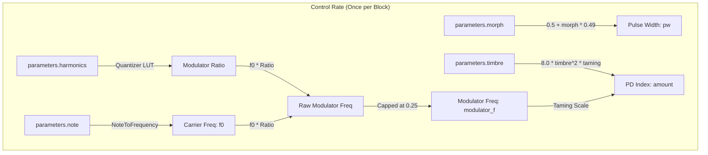

# Phase Distortion Engine

This document covers the DSP analysis of the
[PhaseDistortionEngine](https://github.com/arachnegl/eurorack/blob/master/plaits/dsp/engine2/phase_distortion_engine.h) class.

---

### Control Rate Flow Diagram



### DSP Loop Flow Diagram

```mermaid
graph TD
    subgraph dsp_loop ["Oversampled DSP Loop (2x Fs)"]
        subgraph shaper_op ["Synced Shaper (shaper_)"]
            S_Master[Master Phase: f0]
            S_Slave[Slave Phase: modulator_f]
            S_Tri[Asymmetric Triangle]
            S_Master -->|Sync Reset| S_Slave
            S_Slave --> S_Tri
            S_Master -->|Windowing / Bending| S_Out[Synced Phase Output]
            S_Tri -->|Modulate| S_Out
        end

        subgraph modulator_op ["Free-running Modulator (modulator_)"]
            M_Master[Master Phase: f0]
            M_Slave[Slave Phase: modulator_f]
            M_Tri[Asymmetric Triangle]
            M_Slave --> M_Tri
            M_Master --> M_Out[Free-running Phase Output]
            M_Tri -->|Modulate| M_Out
        end
    end

    S_Out -->|synced buffer| Out_Cos[Cosine Waveshaper]
    M_Out -->|free_running buffer| Aux_Cos[Cosine Waveshaper]
    
    Out_Cos -->|2x Oversampled samples| Out_Filter[2-Point Moving Average Filter]
    Aux_Cos -->|2x Oversampled samples| Aux_Filter[2-Point Moving Average Filter]
    
    Out_Filter -->|Out (1x Fs)| main_out[out: Synced Phase Distortion]
    Aux_Filter -->|Aux (1x Fs)| aux_out[aux: Free-running Phase Distortion]
```

---

### Core DSP & Synthesis Techniques

#### 1. Phase Distortion Synthesis Concept
Phase Distortion (PD) synthesis is a method where a master carrier phase $\phi_c(t)$ is modulated (or distorted) by a secondary waveform $m(t)$ before being passed to a sinusoidal lookup table.

$$\Phi(t) = \phi_c(t) + I_{PD} \cdot m(t)$$

$$y(t) = \cos(2\pi \Phi(t))$$

In `PhaseDistortionEngine`, the carrier phase is represented by a linear master phasor ramping from $0$ to $1$, and the modulator $m(t)$ is generated from a band-limited asymmetric triangle wave. By distorting the lookup phase, the resulting sine wave exhibits complex harmonic shifts, mimicking the resonant behavior of a multi-pole analog low-pass or band-pass filter without the computational cost or instability of physical filters.

#### 2. Asymmetric Triangle Modulator
The modulator $m(t)$ is synthesized using the `VariableShapeOscillator` helper class. The waveshape is forced to $0.0$, disabling square/saw morphing and configuring it to render a triangle wave. 

The asymmetry is controlled via the `pw` (pulse width) parameter, derived from `parameters.morph` as:

$$pw = 0.5 + 0.49 \cdot \text{morph}$$

This skews the triangle wave $T(\phi_m)$ asymmetrically:
* **morph = -1.0 ($pw = 0.01$):** Sharp falling sawtooth.
* **morph = 0.0 ($pw = 0.5$):** Perfectly symmetric triangle wave.
* **morph = +1.0 ($pw = 0.99$):** Sharp rising sawtooth.

Mathematically, the naive asymmetric triangle $T(\phi_m)$ at a given modulator phase $\phi_m \in [0, 1)$ is formulated as:

$$T(\phi_m) = \begin{cases} \frac{\phi_m}{pw}, & \text{if } \phi_m < pw \\ 1 - \frac{\phi_m - pw}{1 - pw}, & \text{if } \phi_m \ge pw \end{cases}$$

In the C++ implementation, this naive waveform is smoothed dynamically using PolyBLEP/Integrated PolyBLEP steps at the transition points $\phi_m = 0$ and $\phi_m = pw$ to attenuate high-frequency aliasing.

#### 3. Parabolic Windowing for Discontinuity Prevention
In the synced shaper (`shaper_`), the modulator phase $\phi_m$ is hard-synchronized (reset to $0$) every time the carrier phasor $\phi_{\text{master}}$ wraps around from $1.0$ to $0.0$. Naive hard synchronization creates phase discontinuities in the composite lookup phase, causing harsh, unharmonic high-frequency click artifacts.

To solve this, `PhaseDistortionEngine` applies a parabolic windowing function $w(\phi_{\text{master}})$ over the duration of the carrier cycle:

$$w(\phi_{\text{master}}) = 4(1 - \phi_{\text{master}})\phi_{\text{master}}$$

The windowed modulator signal is then computed as:

$$m_{\text{windowed}}(t) = T(\phi_m) \cdot w(\phi_{\text{master}}) \cdot (2 - w(\phi_{\text{master}}))$$

Since $w(0) = 0$ and $w(1) = 0$, the modulator term is forced to $0$ at the exact boundaries of the carrier period. Consequently, the composite phase $\Phi(t)$ remains perfectly continuous at the boundary:

$$\Phi(0) = 0 \pmod 1 \implies \cos(2\pi \Phi(0)) = 1$$
$$\Phi(1) = 1 \pmod 1 \implies \cos(2\pi \Phi(1)) = 1$$

This windowing technique ensures that the output waveform is continuous, preventing aliasing and clicks while preserving the bright, sweeping resonance-like spectral characteristics.

#### 4. Carrier Phasor Bending
To introduce additional complex harmonics even at low modulation indexes, a form of carrier phase bending is applied to the synced phasor when `enable_sync` is true. The master phase $\phi_{\text{master}}$ is modified as a function of the pulse width skew:

$$\phi_{\text{bent}} = \phi_{\text{master}} + \left(\phi_{\text{master}}^4 - \phi_{\text{master}}\right) \cdot 2|pw - 0.5|$$

When $pw = 0.5$ (symmetric triangle), the bending term is $0$. When $pw \ne 0.5$, the phasor is bent downwards, introducing an inherent wave folding effect to the carrier cosine itself.

#### 5. Bandwidth Limiting & Downsampling
To combat aliasing under high modulation rates, `PhaseDistortionEngine` utilizes a two-tier anti-aliasing design:
1. **2x Oversampling:** The internal synthesis engines (`shaper_` and `modulator_`) run at $2 \times F_s$ (rendering $2 \times \text{size}$ samples).
2. **High-Frequency Taming:** The modulation index `amount` ($I_{PD}$) is scaled down as the modulator frequency $f_m$ approaches the oversampled Nyquist limit:
   
   $$I_{PD} = 8.0 \cdot \text{timbre}^2 \cdot (1 - 3.8 \cdot f_m)$$
   
   This limits the generation of high-frequency sidebands that would otherwise fold back into the audible spectrum.
3. **2-Point Moving Average Decimation:** Output samples are converted to audio via a cosine waveshaper and downsampled back to $1 \times F_s$ using a naive 2-point moving average filter:
   
   $$y_{\text{down}}[i] = \frac{y[2i] + y[2i+1]}{2}$$
   
   This filter acts as a simple FIR low-pass filter with a transmission zero at the Nyquist frequency of the $1 \times F_s$ domain.

---

### Code Analysis

#### A. Header Structure & Engine State ([phase_distortion_engine.h](https://github.com/arachnegl/eurorack/blob/master/plaits/dsp/engine2/phase_distortion_engine.h))
The state variables of the engine are declared as follows:
* `VariableShapeOscillator shaper_`: Renders the phase for the synced/windowed primary channel (`out`).
* `VariableShapeOscillator modulator_`: Renders the phase for the free-running auxiliary channel (`aux`).
* `float* temp_buffer_`: Points to a transient buffer of size `kMaxBlockSize * 4` allocated via the module's static buffer allocation mechanism to store the $2 \times F_s$ oversampled phase signals.

#### B. Render Loop Breakdown ([phase_distortion_engine.cc](https://github.com/arachnegl/eurorack/blob/master/plaits/dsp/engine2/phase_distortion_engine.cc))

##### 1. Parameter Interpretation and Control Rate Mapping
The control rate parameters are translated into frequency and phase scaling terms at the beginning of the `Render` method:

```cpp
const float f0 = 0.5f * NoteToFrequency(parameters.note);
const float modulator_f = min(0.25f, f0 * SemitonesToRatio(Interpolate(
    lut_fm_frequency_quantizer,
    parameters.harmonics,
    128.0f)));
const float pw = 0.5f + parameters.morph * 0.49f;
const float amount = 8.0f * parameters.timbre * parameters.timbre * \
    (1.0f - modulator_f * 3.8f);
```
* **Oversampling adjustment:** `f0` is scaled by `0.5f` because the block length is doubled for the 2x oversampled oscillators.
* **Modulator frequency capping:** `modulator_f` is capped at `0.25f` (which corresponds to Nyquist, i.e., $0.5 \times F_s$ in the oversampled domain).

##### 2. Oversampled Phase Rendering
The oversampled phase signals are rendered into `temp_buffer_`:

```cpp
float* synced = &temp_buffer_[0];
float* free_running = &temp_buffer_[2 * size];
shaper_.Render<true, true>(
    f0, modulator_f, pw, 0.0f, amount, synced, 2 * size);
modulator_.Render<false, true>(
    f0, modulator_f, pw, 0.0f, amount, free_running, 2 * size);
```
* `shaper_.Render<true, true>`: Synced carrier + modulator phase generator (`enable_sync = true`, `output_phase = true`).
* `modulator_.Render<false, true>`: Free-running carrier + modulator phase generator (`enable_sync = false`, `output_phase = true`).

##### 3. Inside the VariableShapeOscillator Phase Generator
Inside `VariableShapeOscillator::Render` when `output_phase` is enabled, the phase outputs are constructed sample-by-sample:

```cpp
if (output_phase) {
  float phasor = master_phase_;
  if (enable_sync) {
    // A trick to prevent discontinuities when the phase wraps around.
    const float w = 4.0f * (1.0f - master_phase_) * master_phase_;
    this_sample *= w * (2.0f - w);
    
    // Apply some asymmetry on the main phasor too.
    const float p2 = phasor * phasor;
    phasor += (p2 * p2 - phasor) * fabsf(pw - 0.5f) * 2.0f;
  }
  *out++ = phasor + phase_modulation.Next() * this_sample;
}
```
* The `this_sample` variable represents the current band-limited asymmetric triangle value.
* Parabolic windowing `w * (2.0f - w)` is applied to `this_sample` under the `enable_sync` condition to suppress phase jump discontinuities.

##### 4. Wavetable Mapping and Decimation Loop
Finally, the oversampled phase buffers are read, passed through a cosine waveshaper, and downsampled to the output buffers:

```cpp
for (size_t i = 0; i < size; ++i) {
  // Naive 0.5x downsampling.
  out[i] = 0.5f * Sine(*synced++ + 0.25f);
  out[i] += 0.5f * Sine(*synced++ + 0.25f);
  
  aux[i] = 0.5f * Sine(*free_running++ + 0.25f);
  aux[i] += 0.5f * Sine(*free_running++ + 0.25f);
}
```
* `Sine(phase + 0.25f)` translates the phase value $\Phi$ to a cosine function: $\sin(2\pi(\Phi + 0.25)) = \cos(2\pi\Phi)$.
* Averaging two consecutive points implements the decimation filter, converting the oversampled rate to the output sampling rate.

---

<!-- KaTeX support for mathematical formulas -->
<link rel="stylesheet" href="https://cdn.jsdelivr.net/npm/katex@0.16.8/dist/katex.min.css">
<script defer src="https://cdn.jsdelivr.net/npm/katex@0.16.8/dist/katex.min.js"></script>
<script defer src="https://cdn.jsdelivr.net/npm/katex@0.16.8/dist/contrib/auto-render.min.js"
        onload="renderMathInElement(document.body, {
          delimiters: [
            {left: '$$', right: '$$', display: true},
            {left: '$', right: '$', display: false}
          ]
        });"></script>

<!-- Mermaid JS support for rendering diagrams with Click-to-Zoom Lightbox -->
<script type="module">
  import mermaid from 'https://cdn.jsdelivr.net/npm/mermaid@10/dist/mermaid.esm.min.mjs';
  mermaid.initialize({ startOnLoad: false });
  
  // Inject lightbox styling
  const style = document.createElement('style');
  style.textContent = `
    .mermaid-lightbox {
      position: fixed;
      top: 0;
      left: 0;
      width: 100vw;
      height: 100vh;
      background: rgba(15, 15, 15, 0.9);
      backdrop-filter: blur(8px);
      -webkit-backdrop-filter: blur(8px);
      display: flex;
      align-items: center;
      justify-content: center;
      z-index: 10000;
      opacity: 0;
      transition: opacity 0.2s ease;
      pointer-events: none;
    }
    .mermaid-lightbox.active {
      opacity: 1;
      pointer-events: auto;
    }
    .mermaid-lightbox svg {
      max-width: 90%;
      max-height: 90%;
      width: auto;
      height: auto;
      background: rgba(255, 255, 255, 0.95);
      padding: 20px;
      border-radius: 8px;
      box-shadow: 0 20px 50px rgba(0, 0, 0, 0.3);
    }
    .mermaid-lightbox .close-btn {
      position: absolute;
      top: 20px;
      right: 30px;
      font-size: 40px;
      color: #fff;
      cursor: pointer;
      user-select: none;
      font-family: sans-serif;
    }
    .mermaid-trigger {
      cursor: zoom-in;
      transition: transform 0.2s ease;
    }
    .mermaid-trigger:hover {
      transform: scale(1.01);
    }
  `;
  document.head.appendChild(style);

  // Inject lightbox modal elements
  const lightbox = document.createElement('div');
  lightbox.className = 'mermaid-lightbox';
  lightbox.innerHTML = '<span class="close-btn">&times;</span><div class="content"></div>';
  document.body.appendChild(lightbox);

  lightbox.addEventListener('click', () => {
    lightbox.classList.remove('active');
  });

  // Convert Mermaid code blocks to styled divs
  const codeBlocks = document.querySelectorAll('.language-mermaid code, pre code.language-mermaid');
  codeBlocks.forEach((block) => {
    const container = block.closest('.language-mermaid') || block.parentElement;
    const el = document.createElement('div');
    el.className = 'mermaid mermaid-trigger';
    el.textContent = block.textContent;
    container.replaceWith(el);
  });
  
  // Render and handle lightbox events
  mermaid.run().then(() => {
    document.querySelectorAll('.mermaid-trigger').forEach((trigger) => {
      trigger.addEventListener('click', () => {
        const content = lightbox.querySelector('.content');
        content.innerHTML = trigger.innerHTML;
        lightbox.classList.add('active');
      });
    });
  });
</script>
