# Six Operator FM Engine

This document covers the DSP analysis of the [SixOpEngine](https://github.com/arachnegl/eurorack/blob/master/plaits/dsp/engine2/six_op_engine.h) class.

---

### Control Rate Flow Diagram

```mermaid
graph TD
    subgraph inputs ["EngineParameters (Hardware Inputs)"]
        Harmonics[parameters.harmonics]
        Morph[parameters.morph]
        Timbre[parameters.timbre]
        Note[parameters.note]
        Accent[parameters.accent]
        Trigger[parameters.trigger]
    end

    subgraph control_rate ["Control Rate Processing (Once per Block)"]
        HystQuant[HysteresisQuantizer2]
        PatchesBank[(DX7 Patches Bank)]
        
        Harmonics -->|x 1.02| HystQuant
        HystQuant -->|Selects Patch 0-31| PatchesBank
        
        Trigger -->|"TRIGGER_UNPATCHED"| LFO_Scrub[Scrub Voice 0 LFO]
        Morph -.->|Scrub Time| LFO_Scrub
        
        Trigger -->|"TRIGGER_RISING_EDGE"| VoiceRot[Voice Rotation]
        Trigger -->|"TRIGGER_HIGH"| GateSignal[Voice Gate Signal]
        VoiceRot -->|Load Patch & Reset LFO| ActiveVoice[Select Active Voice]
        
        Note -->|Set target pitch| FreqCalc[Frequency Ratios & Pitch Scaling]
        Accent -->|Normalize Velocity| VelSens[Velocity Scaling]
        Timbre -->|Scale modulator levels| BrightnessMod[Modulator Brightness Depth]
        Morph -->|Envelope control t| EnvCtrl[AD / R Time Scaling]
    end

    subgraph voice_parameters ["Voice Parameters (per Block)"]
        VoiceNote[voice.note]
        VoiceVel[voice.velocity]
        VoiceBright[voice.brightness]
        VoiceEnvCtrl[voice.envelope_control]
        VoiceGate[voice.gate]
        VoiceSustain[voice.sustain]
        
        FreqCalc --> VoiceNote
        VelSens --> VoiceVel
        BrightnessMod --> VoiceBright
        EnvCtrl --> VoiceEnvCtrl
        GateSignal --> VoiceGate
    end
```



### DSP Loop Flow Diagram

```mermaid
graph TD
    subgraph block_tick ["Block Tick (size = 12 samples)"]
        subgraph state_shift ["1. Buffer State Transition"]
            AccIn[acc_buffer_: Remaining samples from previous voice]
            TempClear[temp_buffer_: Cleared second half]
            AccIn -->|Copy to first half| TempBuff[temp_buffer_ 0..23]
        end
        
        subgraph voice_render ["2. Active Voice Render (24 samples)"]
            ActiveV[voice_[rendered_voice_]]
            ActiveV -->|Additive Render| TempBuff
        end
        
        subgraph output_mix ["3. Output Generation & Feedback Save"]
            TempBuff -->|First 12 samples| SoftC[SoftClip & Scale x0.25]
            SoftC -->|Out / Aux channels| AudioDAC[DAC Output]
            TempBuff -->|Second 12 samples| AccOut[acc_buffer_]
        end
    end
```

---

### Core DSP & Synthesis Techniques

#### 1. Yamaha DX7-Style 6-Operator FM Architecture
`SixOpEngine` replicates a classic 6-operator FM synthesis structure based on 32 standard routing configurations (algorithms). The algorithms define which operators act as **modulators** (modulating the phase of subsequent operators) or **carriers** (whose outputs are mixed to form the final audio signal). 

#### 2. Phase Modulation (PM) implementation
To prevent numerical drift and preserve tuning stability, the FM engine uses Phase Modulation rather than direct frequency modulation. The phase accumulator for operator $i$ integrates its frequency $f_i$ at each sample:

$$\theta_{i}[n] = \theta_{i}[n-1] + \Delta\theta_i$$

Where the phase increment $\Delta\theta_i$ is mapped from the patch frequency settings. The modulated output of operator $i$ is synthesized using the `SinePM` helper function:

$$x_i[n] = \sin\left(2\pi \cdot \frac{\theta_i[n] + \Phi_{\text{mod}}[n]}{2^{32}}\right) \times A_i[n]$$

Where $\Phi_{\text{mod}}[n]$ is the phase modulation offset and $A_i[n]$ is the linear amplitude envelope value. The phase modulation offset is determined by the algorithm routing:
* **No Modulation:** $\Phi_{\text{mod}}[n] = 0$.
* **Operator Cascade:** $\Phi_{\text{mod}}[n] = x_{i-1}[n]$ (the output of the preceding operator).
* **Feedback Loop:** The DX7 feedback operator features a 2-sample averaged self-feedback path to stabilize chaotic sidebands:

$$\Phi_{\text{mod}}[n] = \frac{x_{\text{fb}}[n-1] + x_{\text{fb}}[n-2]}{2} \times \text{scale}_{\text{feedback}}$$

#### 3. Native Fixed-Point Phase Integration
Phase accumulators are represented as 32-bit unsigned integers (`uint32_t`). When these values exceed $2^{32}-1$, they wrap around naturally due to integer overflow. This natively implements a modulo operation ($2^{32} \equiv 2\pi$), avoiding expensive float wrapping operations or conditional branching inside the DSP loop.

#### 4. DX7 Operator Envelope Scaling & Quirks
To faithfully reproduce the hardware dynamics of classic FM synthesizers, several quirks of the DX-series operator envelope generator are implemented in the `OperatorEnvelope` class (inheriting from `Envelope<4, true>`):

* **Logarithmic Ascending Reshaping:** Rather than linear interpolation, ascending envelope segments are curved to sound more natural:

$$\text{phase}' = \text{phase} \times (2.5 - \text{phase}) \times \frac{2}{3}$$

* **Direct Jump Threshold:** Ascending segments feature a minimum value threshold, jumping immediately above a lower limit to eliminate lag:

$$\text{level}_{\text{clamped}} = \max(6.7, \text{level})$$

* **Plateau Rate Scaling:** Rates for envelope segments where the level does not change (plateaus) are scaled down by $0.6$. The attack plateau is accelerated by a factor of $20.0$ when the rate is 0.

#### 5. Envelope Scrubbing (Free-Running Mode)
When the trigger input is unpatched, the engine enters a free-running state where the `sustain` parameter of voice 0 is enabled, and the envelopes are evaluated statically. The `parameters.morph` input is mapped to `envelope_sample`, letting the user "scrub" through the envelope timeline directly with the Morph control:

$$\text{envelope\_sample} = 1.5 \times F_s \times \text{morph}$$

#### 6. Staggered Render Load Balancer
Running two full 6-operator voices (12 operators total) on the Eurorack hardware's limited CPU can easily cause audio buffer underruns. `SixOpEngine` solves this with a staggered block rendering scheme:
1. Instead of rendering both voices for $S$ samples ($S = 12$ on Plaits) every block, the engine renders **only one voice** for $2S$ (24) samples every block, alternating voices.
2. The first $S$ samples of the rendered voice are mixed additively into the first half of `temp_buffer_` (which contains the tail samples of the other voice from the previous block) and sent to the output.
3. The remaining $S$ samples are copied into `acc_buffer_` to be mixed with the other voice's output in the next block.
This reduces block render overhead, ensures cache locality, and guarantees a flat CPU usage profile.

---

### Code Analysis

#### A. Header Structure & Engine State ([six_op_engine.h](https://github.com/arachnegl/eurorack/blob/master/plaits/dsp/engine2/six_op_engine.h))

The engine states and voices are declared inside the main `SixOpEngine` class:

* `patch_index_quantizer_`: Prevents patch-switching jitter when reading the `harmonics` parameter.
* `algorithms_`: An instance of `fm::Algorithms<6>` that compiles DX7 algorithms into render templates.
* `patches_`: Allocator-assigned array of 32 `fm::Patch` instances.
* `voice_`: Array of 2 `FMVoice` instances, representing the polyphony/layering of the engine.
* `temp_buffer_` and `acc_buffer_`: Buffers used for the staggered rendering and accumulation mixing.

#### B. Render Loop Breakdown ([six_op_engine.cc](https://github.com/arachnegl/eurorack/blob/master/plaits/dsp/engine2/six_op_engine.cc#L103))

##### 1. Patch Index Quantization & Trigger Handlers
Inside the `Render` loop, the `harmonics` parameter maps to the active patch (0 to 31):

```cpp
int patch_index = patch_index_quantizer_.Process(parameters.harmonics * 1.02f);
```

When unpatched, Morph controls the static timeline scrub:
```cpp
if (parameters.trigger & TRIGGER_UNPATCHED) {
  const float t = parameters.morph;
  voice_[0].mutable_lfo()->Scrub(2.0f * kCorrectedSampleRate * t);
  for (int i = 0; i < kNumSixOpVoices; ++i) {
    voice_[i].LoadPatch(&patches_[patch_index]);
    Voice<6>::Parameters* p = voice_[i].mutable_parameters();
    p->sustain = i == 0 ? true : false;
    p->gate = false;
    p->note = parameters.note;
    p->velocity = parameters.accent;
    p->brightness = parameters.timbre;
    p->envelope_control = t;
    voice_[i].set_modulations(voice_[0].lfo());
  }
}
```

##### 2. Interleaved Staggered Render Block
The load-balanced mixing alternates voices and offsets render blocks:

```cpp
// Staggered rendering.
copy(
    &acc_buffer_[0],
    &acc_buffer_[(kNumSixOpVoices - 1) * size],
    &temp_buffer_[0]);
fill(
    &temp_buffer_[(kNumSixOpVoices - 1) * size],
    &temp_buffer_[kNumSixOpVoices * size],
    0.0f);
rendered_voice_ = (rendered_voice_ + 1) % kNumSixOpVoices;
voice_[rendered_voice_].Render(temp_buffer_, size * kNumSixOpVoices);

for (size_t i = 0; i < size; ++i) {
  aux[i] = out[i] = SoftClip(temp_buffer_[i] * 0.25f);
}
copy(
    &temp_buffer_[size],
    &temp_buffer_[kNumSixOpVoices * size],
    &acc_buffer_[0]);
```

##### 3. Templated Operator Rendering ([operator.h](https://github.com/arachnegl/eurorack/blob/master/plaits/dsp/fm/operator.h#L68))
Inside `fm::RenderOperators`, the operator phase is advanced, and phase modulation is cascaded through template specialization:

```cpp
template<int n, int modulation_source, bool additive>
void RenderOperators(
    Operator* ops,
    const float* f,
    const float* a,
    float* fb_state,
    int fb_amount,
    const float* modulation,
    float* out,
    size_t size) {
  ...
  while (size--) {
    float pm = 0.0f;
    if (modulation_source >= Operator::MODULATION_SOURCE_FEEDBACK) {
      pm = (previous_0 + previous_1) * fb_scale;
    } else if (modulation_source == Operator::MODULATION_SOURCE_EXTERNAL) {
      pm = *modulation++;
    }
    for (int i = 0; i < n; ++i) {
      phase[i] += frequency[i];
      pm = SinePM(phase[i], pm) * amplitude[i];
      amplitude[i] += amplitude_increment[i];
      if (i == modulation_source) {
        previous_1 = previous_0;
        previous_0 = pm;
      }
    }
    if (additive) {
      *out++ += pm;
    } else {
      *out++ = pm;
    }
  }
  ...
}
```

This templated implementation unrolls operator loops completely at compile time, eliminating branch statements and maximizing execution efficiency.

---

<!-- KaTeX support for mathematical formulas -->
<link rel="stylesheet" href="https://cdn.jsdelivr.net/npm/katex@0.16.8/dist/katex.min.css">
<script defer src="https://cdn.jsdelivr.net/npm/katex@0.16.8/dist/katex.min.js"></script>
<script defer src="https://cdn.jsdelivr.net/npm/katex@0.16.8/dist/contrib/auto-render.min.js"
        onload="renderMathInElement(document.body, {
          delimiters: [
            {left: '$$', right: '$$', display: true},
            {left: '$', right: '$', display: false}
          ]
        });"></script>

<!-- Mermaid JS support for rendering diagrams with Click-to-Zoom Lightbox -->
<script type="module">
  import mermaid from 'https://cdn.jsdelivr.net/npm/mermaid@10/dist/mermaid.esm.min.mjs';
  mermaid.initialize({ startOnLoad: false });
  
  // Inject lightbox styling
  const style = document.createElement('style');
  style.textContent = `
    .mermaid-lightbox {
      position: fixed;
      top: 0;
      left: 0;
      width: 100vw;
      height: 100vh;
      background: rgba(15, 15, 15, 0.9);
      backdrop-filter: blur(8px);
      -webkit-backdrop-filter: blur(8px);
      display: flex;
      align-items: center;
      justify-content: center;
      z-index: 10000;
      opacity: 0;
      transition: opacity 0.2s ease;
      pointer-events: none;
    }
    .mermaid-lightbox.active {
      opacity: 1;
      pointer-events: auto;
    }
    .mermaid-lightbox svg {
      max-width: 90%;
      max-height: 90%;
      width: auto;
      height: auto;
      background: rgba(255, 255, 255, 0.95);
      padding: 20px;
      border-radius: 8px;
      box-shadow: 0 20px 50px rgba(0, 0, 0, 0.3);
    }
    .mermaid-lightbox .close-btn {
      position: absolute;
      top: 20px;
      right: 30px;
      font-size: 40px;
      color: #fff;
      cursor: pointer;
      user-select: none;
      font-family: sans-serif;
      z-index: 10001;
    }
    .mermaid-trigger {
      cursor: zoom-in;
      transition: transform 0.2s ease;
    }
    .mermaid-trigger:hover {
      transform: scale(1.01);
    }
  `;
  document.head.appendChild(style);

  // Inject lightbox modal elements
  const lightbox = document.createElement('div');
  lightbox.className = 'mermaid-lightbox';
  lightbox.innerHTML = '<span class="close-btn">&times;</span><div class="content"></div>';
  document.body.appendChild(lightbox);

  lightbox.addEventListener('click', () => {
    lightbox.classList.remove('active');
  });

  // Convert Mermaid code blocks to styled divs
  const codeBlocks = document.querySelectorAll('.language-mermaid code, pre code.language-mermaid');
  codeBlocks.forEach((block) => {
    const container = block.closest('.language-mermaid') || block.parentElement;
    const el = document.createElement('div');
    el.className = 'mermaid mermaid-trigger';
    el.textContent = block.textContent;
    container.replaceWith(el);
  });
  
  // Render and handle lightbox events
  mermaid.run().then(() => {
    document.querySelectorAll('.mermaid-trigger').forEach((trigger) => {
      trigger.addEventListener('click', () => {
        const content = lightbox.querySelector('.content');
        content.innerHTML = trigger.innerHTML;
        lightbox.classList.add('active');
      });
    });
  });
</script>
