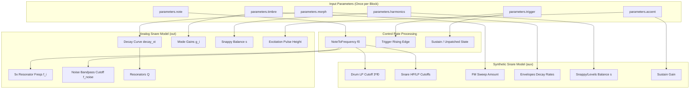
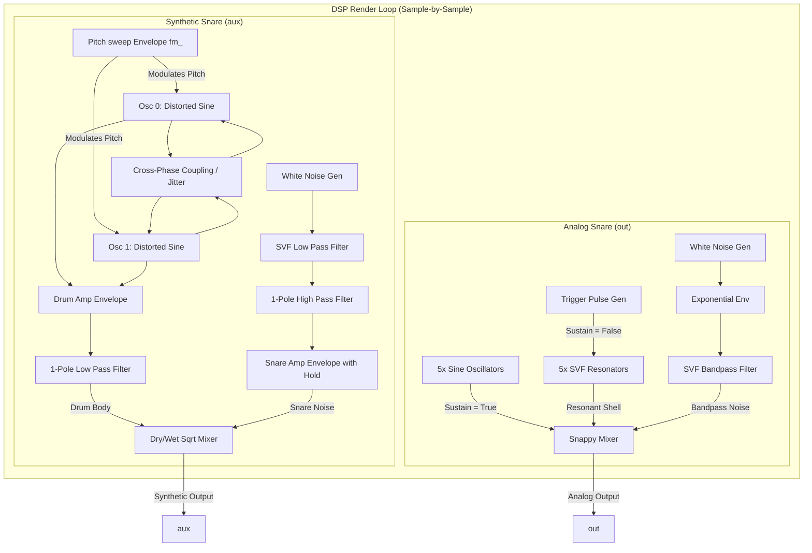

# Snare Drum Engine

This document covers the DSP analysis of the
[SnareDrumEngine](https://github.com/arachnegl/eurorack/blob/master/plaits/dsp/engine/snare_drum_engine.h) class.

---

### Control Rate Flow Diagram



---

### DSP Loop Flow Diagram



---

### Core DSP & Synthesis Techniques

The `SnareDrumEngine` generates two distinct flavors of snare drums concurrently:
- **Analog Snare (`out`)**: A physical-modelling/analog-circuit reconstruction based on the classic Roland TR-808 snare drum.
- **Synthetic Snare (`aux`)**: A digital/FM oscillator-based model inspired by the design and coupling characteristics of the Roland TR-909 snare drum.

#### 1. TR-808 Snare Drum Model (AnalogSnareDrum)

The TR-808 snare drum model splits the sound into a skin tone component (the shell) and a noise component (the snappy wires).

##### A. Tonal Shell Synthesis
In the TR-808 hardware, the drum skin shell is generated by two bandpass-configured Twin-T bridge circuits excited by a brief trigger pulse. In [AnalogSnareDrum](file:///Users/greg/src/eurorack/plaits/dsp/drums/analog_snare_drum.h), this is modeled by five state-variable filter (SVF) resonators tuned to the partials of the drum shell:
$$f_i = \min(f_0 \cdot c_i, 0.499) \quad \text{where } c = [1.0, 2.0, 3.18, 4.16, 5.62]$$

* **Excitation Pulse**: On trigger, a pulse $p(t)$ is generated with duration $1\text{ ms}$ ($P_{\text{width}} = 10^{-3} \cdot F_s$ samples) and amplitude scaled by `accent`:
  $$A_{\text{pulse}} = 3.0 + 7.0 \times \text{accent}$$
* **Pulse Shaping**: To mimic the analog circuitry, the excitation pulse is high-pass filtered for the fundamental resonator and passed directly to the rest:
  $$e_0(t) = (p(t) - p_{\text{lp}}(t)) + 0.006 \cdot p(t)$$
  $$e_i(t) = 0.026 \cdot p(t) \quad (i > 0)$$
  where $p_{\text{lp}}(t)$ is low-pass filtered by a first-order one-pole filter with a coefficient of $0.75$:
  $$p_{\text{lp}}(t) = 0.75 \cdot p_{\text{lp}}(t-1) + 0.25 \cdot p(t)$$
* **Decay and Q Scaling**: The decay control $d$ is mapped to a non-linear scale $d_{\text{xt}}$ to yield wider decay ranges:
  $$d_{\text{xt}} = d \cdot (1.0 + d \cdot (d - 1.0))$$
  $$q = 2000.0 \cdot 2^{84 \cdot d_{\text{xt}} / 12}$$
  The quality factor $Q_i$ of each SVF resonator is scaled with frequency:
  $$Q_0 = 1.0 + f_0 \cdot q$$
  $$Q_i = 1.0 + f_i \cdot \frac{q}{4} \quad (i > 0)$$
* **Interpolated Mode Gains**: The `tone` (timbre) parameter interpolates the gains $g_i$ of the modes:
  * **808 Style (tone < 2/3)**: Only modes 0 and 1 are active:
    $$t' = 1.5 \cdot \text{tone}$$
    $$g_0 = 1.5 + 4.5 \cdot (1.0 - t')^2$$
    $$g_1 = 2.0 \cdot t' + 0.15$$
    $$g_2 = g_3 = g_4 = 0$$
  * **Extended Mode (tone >= 2/3)**: All 5 modes are active to generate complex acoustic snare/bell sounds:
    $$t' = 3.0 \cdot (\text{tone} - \frac{2}{3})$$
    $$g_0 = 1.5 - 0.5 \cdot t'$$
    $$g_1 = 2.15 - 0.7 \cdot t'$$
    $$g_2 = t', \quad g_3 = (t')^2, \quad g_4 = (t')^4$$

##### B. White Noise Snap Synthesis
The snappy wires are modeled with half-wave rectified white noise:
$$w_t \sim \text{Uniform}(-1, 1)$$
$$w_t^+ = \max(0, w_t)$$
* **Envelope Decay**: The noise envelope $env_{\text{noise}}$ decays exponentially at a rate $\alpha_{\text{noise}}$:
  $$\alpha_{\text{noise}} = 1.0 - 0.0017 \cdot 2^{-(d \cdot (50.0 + s \cdot 10.0)) / 12}$$
  $$env_{\text{noise}}(t) = env_{\text{noise}}(t-1) \cdot \alpha_{\text{noise}}$$
  where $s$ is the snappy parameter.
* **Filtering**: The noise is bandpass filtered via a `stmlib::Svf` centered at:
  $$f_{\text{noise}} = \min(16.0 \cdot f_0, 0.499)$$
  $$Q_{\text{noise}} = 1.0 + 1.5 \cdot f_{\text{noise}}$$
* **Mixing**: The snappy parameter $s$ controls the dry/wet balance between noise and shell:
  $$y(t) = 2.0 \cdot w_t^+ \cdot env_{\text{noise}}(t) \cdot s' + \text{shell}(t) \cdot (1.0 - s')$$
  where $s' = \text{constrain}(1.1 \cdot s - 0.05, 0.0, 1.0)$.

---

#### 2. TR-909 Snare Drum Model (SyntheticSnareDrum)

The [SyntheticSnareDrum](file:///Users/greg/src/eurorack/plaits/dsp/drums/synthetic_snare_drum.h) uses two wave-shaped oscillators, an FM pitch sweep, and a bandpass noise channel with a dedicated hold phase.

##### A. Distorted Sine Wave-shaper
To mimic the saturation of analog oscillators, the phase is mapped through a rational soft-clipper function:
$$\text{tri}(\phi) = 4 \cdot \min(\phi, 1 - \phi) - 1.3$$
$$\text{DistortedSine}(\phi) = \frac{2 \cdot \text{tri}(\phi)}{1 + |\text{tri}(\phi)|}$$

##### B. Dual-Oscillator Synthesis & FM Pitch Sweep
Two wave-shapers are tuned with a ratio of $1.47$ (matching the TR-909 internal pitch offset):
$$\phi_0(t) = \phi_0(t-1) + f$$
$$\phi_1(t) = \phi_1(t-1) + 1.47 \cdot f$$
On trigger, a pitch sweep envelope $fm(t)$ is set to $1.0$ and decays with a 7 ms time constant:
$$\alpha_{\text{fm}} = 1.0 - \frac{1.0}{0.007 \cdot F_s}$$
$$fm(t) = fm(t-1) \cdot \alpha_{\text{fm}}$$
The instantaneous frequency sweep is controlled by `timbre` (mapped to `fm_amount`):
$$f = f_0 \cdot (1.0 + 4.0 \cdot \text{fm\_amount}^2 \cdot fm(t))$$

##### C. Chaotic Phase Coupling / Jitter
In the TR-909 circuit, the output of the first oscillator couples to and resets the second oscillator via transistor Q40. In software, this is recreated by computing a reset noise amount $R_{\text{amt}}$ from the pitch $f_0$ and the `fm_amount` parameter:
$$R_{\text{amt}} = \left(\text{constrain}((0.125 - f_0) \cdot 8.0, 0.0, 1.0)\right)^2 \cdot \text{fm\_amount}^2$$
$$jitter = 0.025 \cdot R_{\text{amt}} \cdot \left( (\phi_0 > 0.5 ? -1 : 1) + (\phi_1 > 0.5 ? -1 : 1) \right)$$
When $R_{\text{amt}} > 0.1$, the wrapping threshold of the phase registers is offset by $jitter$:
$$\text{wrap\_threshold}_i = 1.0 + jitter$$
This results in chaotic, non-linear phase jumps that introduce sub-bass grit and noise-like textures to the drum body.

##### D. Snare Drum Noise Path & Hold Stage
The noise generator outputs uniform white noise, which is filtered by:
- A `stmlib::Svf` lowpass filter at $f_{\text{max}} = \min(35.0 \cdot f_0, 0.5)$ with $Q = 0.5 + 2.0 \cdot s'$.
- A `stmlib::OnePole` highpass filter at $f_{\text{min}} = \min(10.0 \cdot f_0, 0.5)$.

To capture the snare rattle characteristics, the noise envelope has a **Hold** stage before decaying:
$$t_{\text{hold}} = (0.04 + 0.03 \cdot d) \cdot F_s \text{ samples}$$
During the hold duration (approx. 40 to 70 ms), the snare amplitude envelope does not decay. After the hold duration expires, it decays exponentially:
$$\alpha_{\text{snare}} = 1.0 - \frac{1.0}{0.01 \cdot F_s} \cdot 2^{(-d \cdot 60.0 - s \cdot 7.0)/12}$$
$$env_{\text{snare}}(t) = env_{\text{snare}}(t-1) \cdot \alpha_{\text{snare}}$$
The noise output is further excited by the FM pitch envelope to sharpen the initial transient:
$$\text{snare}(t) = (\text{noise\_filtered}(t) + 0.1) \cdot (env_{\text{snare}}(t) + fm(t)) \cdot \sqrt{s'}$$

---

### Code Analysis

#### A. Header Structure & Engine State ([snare_drum_engine.h](file:///Users/greg/src/eurorack/plaits/dsp/engine/snare_drum_engine.h))

The engine state wraps the two helper snare classes:
```cpp
class SnareDrumEngine : public Engine {
 public:
  ...
  virtual void Init(stmlib::BufferAllocator* allocator);
  virtual void Render(const EngineParameters& parameters,
      float* out,
      float* aux,
      size_t size,
      bool* already_enveloped);

 private:
  AnalogSnareDrum analog_snare_drum_;
  SyntheticSnareDrum synthetic_snare_drum_;
  
  DISALLOW_COPY_AND_ASSIGN(SnareDrumEngine);
};
```

* **AnalogSnareDrum State**: Stores a trigger pulse sample counter, the excitation pulse state, noise envelope value, 5 SVF resonators (`stmlib::Svf`), 1 noise SVF filter, and 5 free-running sine oscillators (`SineOscillator`).
* **SyntheticSnareDrum State**: Stores the 2 phase registers, drum amplitude, snare amplitude, FM envelope state, hold counter, and 3 one-pole/SVF filter instances.

---

#### B. Render Loop Breakdown ([snare_drum_engine.cc](file:///Users/greg/src/eurorack/plaits/dsp/engine/snare_drum_engine.cc))

The engine's `Render` method converts MIDI note numbers to frequencies and splits the render streams:
```cpp
void SnareDrumEngine::Render(
    const EngineParameters& parameters,
    float* out,
    float* aux,
    size_t size,
    bool* already_enveloped) {
  const float f0 = NoteToFrequency(parameters.note);
  
  analog_snare_drum_.Render(
      parameters.trigger & TRIGGER_UNPATCHED,   // sustain mode
      parameters.trigger & TRIGGER_RISING_EDGE, // trigger rising edge
      parameters.accent,                        // velocity / accent
      f0,                                       // frequency
      parameters.timbre,                        // tone timbre parameter
      parameters.morph,                         // decay morph parameter
      parameters.harmonics,                     // snappy harmonics parameter
      out,                                      // Analog Snare output
      size);
  
  synthetic_snare_drum_.Render(
      parameters.trigger & TRIGGER_UNPATCHED,   // sustain mode
      parameters.trigger & TRIGGER_RISING_EDGE, // trigger rising edge
      parameters.accent,                        // velocity / accent
      f0,                                       // frequency
      parameters.timbre,                        // FM sweep amount
      parameters.morph,                         // decay morph parameter
      parameters.harmonics,                     // snappy harmonics parameter
      aux,                                      // Synthetic Snare output
      size);
}
```

##### 1. Inside the AnalogSnareDrum Render Loop:
The exciter pulse shapes the resonator inputs sample-by-sample:
```cpp
while (size--) {
  // Q45 / Q46
  float pulse = 0.0f;
  if (pulse_remaining_samples_) {
    --pulse_remaining_samples_;
    pulse = pulse_remaining_samples_ ? pulse_height_ : pulse_height_ - 1.0f;
    pulse_ = pulse;
  } else {
    pulse_ *= 1.0f - 1.0f / kPulseDecayTime;
    pulse = pulse_;
  }
  
  float sustain_gain_value = sustain_gain.Next();
  
  // R189 / C57 / R190 + C58 / C59 / R197 / R196 / IC14
  ONE_POLE(pulse_lp_, pulse, 0.75f);
  
  float shell = 0.0f;
  for (int i = 0; i < kNumModes; ++i) {
    float excitation = i == 0
        ? (pulse - pulse_lp_) + 0.006f * pulse
        : 0.026f * pulse;
    shell += gain[i] * (sustain
        ? oscillator_[i].Next(f[i]) * sustain_gain_value * 0.25f
        : resonator_[i].Process<stmlib::FILTER_MODE_BAND_PASS>(
              excitation) + excitation * exciter_leak);
  }
  shell = stmlib::SoftClip(shell);
  
  // C56 / R194 / Q48 / C54 / R188 / D54
  float noise = 2.0f * stmlib::Random::GetFloat() - 1.0f;
  if (noise < 0.0f) noise = 0.0f;
  noise_envelope_ *= noise_envelope_decay;
  noise *= (sustain ? sustain_gain_value : noise_envelope_) * snappy * 2.0f;

  // C66 / R201 / C67 / R202 / R203 / Q49
  noise = noise_filter_.Process<stmlib::FILTER_MODE_BAND_PASS>(noise);
  
  // IC13
  *out++ = noise + shell * (1.0f - snappy);
}
```

##### 2. Inside the SyntheticSnareDrum Render Loop:
The phase integration implements the $1.47$ frequency coupling ratio and phase wrapping offset:
```cpp
while (size--) {
  if (sustain) {
    snare_amplitude_ = sustain_gain.Next();
    drum_amplitude_ = snare_amplitude_;
    fm_ = 0.0f;
  } else {
    // Compute all D envelopes.
    drum_amplitude_ *= (drum_amplitude_ > 0.03f || !(size & 1))
        ? drum_decay
        : 1.0f;
    if (hold_counter_) {
      --hold_counter_;
    } else {
      snare_amplitude_ *= snare_decay;
    }
    fm_ *= fm_decay;
  }

  // Intermodulation phase coupling (Roland Q40 circuit emulation)
  float reset_noise = 0.0f;
  float reset_noise_amount = (0.125f - f0) * 8.0f;
  CONSTRAIN(reset_noise_amount, 0.0f, 1.0f);
  reset_noise_amount *= reset_noise_amount;
  reset_noise_amount *= fm_amount;
  reset_noise += phase_[0] > 0.5f ? -1.0f : 1.0f;
  reset_noise += phase_[1] > 0.5f ? -1.0f : 1.0f;
  reset_noise *= reset_noise_amount * 0.025f;

  float f = f0 * (1.0f + fm_amount * (4.0f * fm_));
  phase_[0] += f;
  phase_[1] += f * 1.47f;
  
  if (reset_noise_amount > 0.1f) {
    if (phase_[0] >= 1.0f + reset_noise) {
      phase_[0] = 1.0f - phase_[0];
    }
    if (phase_[1] >= 1.0f + reset_noise) {
      phase_[1] = 1.0f - phase_[1];
    }
  } else {
    if (phase_[0] >= 1.0f) {
      phase_[0] -= 1.0f;
    }
    if (phase_[1] >= 1.0f) {
      phase_[1] -= 1.0f;
    }
  }
  
  float drum = -0.1f;
  drum += DistortedSine(phase_[0]) * 0.60f;
  drum += DistortedSine(phase_[1]) * 0.25f;
  drum *= drum_amplitude_ * drum_level;
  drum = drum_lp_.Process<stmlib::FILTER_MODE_LOW_PASS>(drum);
  
  float noise = stmlib::Random::GetFloat();
  float snare = snare_lp_.Process<stmlib::FILTER_MODE_LOW_PASS>(noise);
  snare = snare_hp_.Process<stmlib::FILTER_MODE_HIGH_PASS>(snare);
  snare = (snare + 0.1f) * (snare_amplitude_ + fm_) * snare_level;
  
  *out++ = snare + drum;
}
```

---

<!-- KaTeX support for mathematical formulas -->
<link rel="stylesheet" href="https://cdn.jsdelivr.net/npm/katex@0.16.8/dist/katex.min.css">
<script defer src="https://cdn.jsdelivr.net/npm/katex@0.16.8/dist/katex.min.js"></script>
<script defer src="https://cdn.jsdelivr.net/npm/katex@0.16.8/dist/contrib/auto-render.min.js"
        onload="renderMathInElement(document.body, {
          delimiters: [
            {left: '$$', right: '$$', display: true},
            {left: '$', right: '$', display: false}
          ]
        });"></script>

<!-- Mermaid JS support for rendering diagrams with Click-to-Zoom Lightbox -->
<script type="module">
  import mermaid from 'https://cdn.jsdelivr.net/npm/mermaid@10/dist/mermaid.esm.min.mjs';
  mermaid.initialize({ startOnLoad: false });
  
  // Inject lightbox styling
  const style = document.createElement('style');
  style.textContent = `
    .mermaid-lightbox {
      position: fixed;
      top: 0;
      left: 0;
      width: 100vw;
      height: 100vh;
      background: rgba(15, 15, 15, 0.9);
      backdrop-filter: blur(8px);
      -webkit-backdrop-filter: blur(8px);
      display: flex;
      align-items: center;
      justify-content: center;
      z-index: 10000;
      opacity: 0;
      transition: opacity 0.2s ease;
      pointer-events: none;
    }
    .mermaid-lightbox.active {
      opacity: 1;
      pointer-events: auto;
    }
    .mermaid-lightbox svg {
      max-width: 90%;
      max-height: 90%;
      width: auto;
      height: auto;
      background: rgba(255, 255, 255, 0.95);
      padding: 20px;
      border-radius: 8px;
      box-shadow: 0 20px 50px rgba(0, 0, 0, 0.3);
    }
    .mermaid-lightbox .close-btn {
      position: absolute;
      top: 20px;
      right: 30px;
      font-size: 40px;
      color: #fff;
      cursor: pointer;
      user-select: none;
      font-family: sans-serif;
    }
    .mermaid-trigger {
      cursor: zoom-in;
      transition: transform 0.2s ease;
    }
    .mermaid-trigger:hover {
      transform: scale(1.01);
    }
  `;
  document.head.appendChild(style);
 
  // Inject lightbox modal elements
  const lightbox = document.createElement('div');
  lightbox.className = 'mermaid-lightbox';
  lightbox.innerHTML = '<span class="close-btn">&times;</span><div class="content"></div>';
  document.body.appendChild(lightbox);
 
  lightbox.addEventListener('click', () => {
    lightbox.classList.remove('active');
  });
 
  // Convert Mermaid code blocks to styled divs
  const codeBlocks = document.querySelectorAll('.language-mermaid code, pre code.language-mermaid');
  codeBlocks.forEach((block) => {
    const container = block.closest('.language-mermaid') || block.parentElement;
    const el = document.createElement('div');
    el.className = 'mermaid mermaid-trigger';
    el.textContent = block.textContent;
    container.replaceWith(el);
  });
  
  // Render and handle lightbox events
  mermaid.run().then(() => {
    document.querySelectorAll('.mermaid-trigger').forEach((trigger) => {
      trigger.addEventListener('click', () => {
        const content = lightbox.querySelector('.content');
        content.innerHTML = trigger.innerHTML;
        lightbox.classList.add('active');
      });
    });
  });
</script>
