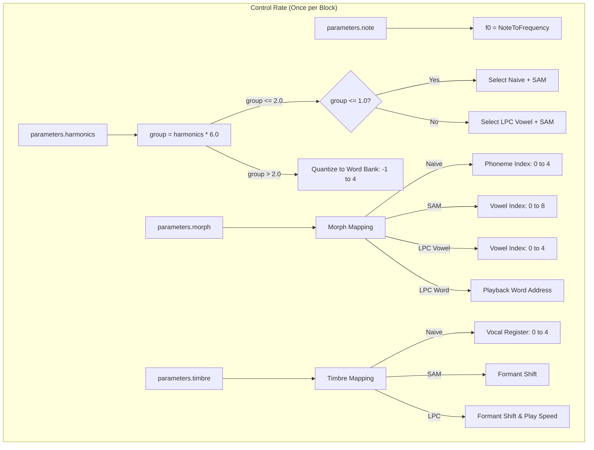
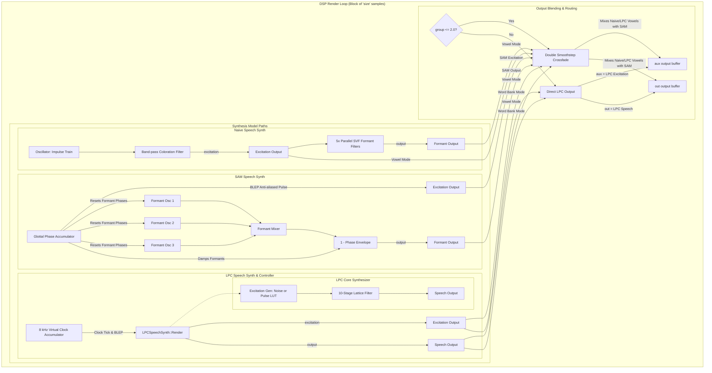

# Speech Engine

This document covers the DSP analysis of the
[SpeechEngine](https://github.com/arachnegl/eurorack/blob/master/plaits/dsp/engine/speech_engine.h) class.

---

### Control Rate Flow Diagram



### DSP Loop Flow Diagram



---

### Core DSP & Synthesis Techniques

The `SpeechEngine` implements three different paradigms of speech synthesis. By mapping parameters dynamically, the engine can transition smoothly between these models or play back classic LPC-10 ROM words.

#### 1. Subtractive Formant Synthesis (Naive Speech Synth)
The formant synthesis model in [NaiveSpeechSynth](file:///Users/greg/src/eurorack/plaits/dsp/speech/naive_speech_synth.h) simulates the vocal tract by filtering a glottal excitation pulse through a parallel bank of five State Variable Filters (SVF):
* **Excitation Source:** An impulse train generator ([Oscillator](file:///Users/greg/src/eurorack/plaits/dsp/oscillator/oscillator.h) configured with `OSCILLATOR_SHAPE_IMPULSE_TRAIN`) generates glottal pulses at frequency $f_0$.
* **Glottal Pulse Coloration:** The excitation is passed through a band-pass filter centered at $800\text{ Hz}$ ($Q = 0.5$) and scaled by $4.0$ to simulate glottal vocal tract coloring.
* **Formant Filter Bank:** Five parallel SVF band-pass filters ($Q = 20.0$) filter the colored excitation. The center frequency $F_i$ (converted from semitones relative to $A_0 = 55\text{ Hz}$) and amplitude $A_i$ of each formant are bilinearly interpolated from a 2D phoneme-vocal register database:
  $$F_i = \text{Lerp}(\text{Lerp}(F_{p0, r0}, F_{p0, r1}, r), \text{Lerp}(F_{p1, r0}, F_{p1, r1}, r), p)$$
  $$A_i = \text{Lerp}(\text{Lerp}(A_{p0, r0}, A_{p0, r1}, r), \text{Lerp}(A_{p1, r0}, A_{p1, r1}, r), p) / 256.0$$
  where $p$ and $r$ are the fractional phoneme and vocal register coordinates. The outputs of the filters are accumulated into the final output:
  $$y[n] = \sum_{i=0}^{4} A_i \cdot y_i[n]$$
* **Click Transients:** When a trigger is received, the pitch frequency is halved for $50\text{ ms}$ (and the first formant filter frequency is halved), generating a transient plosive-like sound.

#### 2. Time-Domain Sine Wave Synthesis (SAM Speech Synth)
Inspired by the Software Automatic Mouth (SAM) algorithm from early 8-bit computers, [SAMSpeechSynth](file:///Users/greg/src/eurorack/plaits/dsp/speech/sam_speech_synth.h) models speech in the time domain:
* **Resonators:** Instead of filtering, formants are synthesized directly using three phase-locked sine wave generators running at formant frequencies $F_1, F_2, F_3$.
* **Phase-Locking:** The formant generators are synchronized with the fundamental frequency phase accumulator $\phi_0$. When $\phi_0$ wraps around to $0.0$, the phases of the three formant generators $\phi_j$ are reset. This replicates the acoustic reset that happens when the glottis closes.
* **Damping Envelope:** The sum of the three sine waves is multiplied by a linear decay envelope $(1 - \phi_0)$ that decays over the glottal cycle, simulating acoustic losses in the vocal tract:
  $$y[n] = (1 - \phi_0[n]) \sum_{j=1}^{3} A_j \sin(\phi_j[n])$$
* **BLEP Residue Anti-Aliasing:** To prevent severe digital aliasing due to sub-sample wraps of the phase accumulator, band-limited step (BLEP) residuals are subtracted during resets.

#### 3. Linear Predictive Coding (LPC-10)
[LPCSpeechSynth](file:///Users/greg/src/eurorack/plaits/dsp/speech/lpc_speech_synth.h) implements a standard 10th-order LPC lattice synthesis filter to model the vocal tract transfer function:
$$H(z) = \frac{G}{1 - \sum_{i=1}^{10} a_i z^{-i}}$$
Lattice synthesis filters are used because their reflection coefficients $k_i$ can be interpolated and quantized without causing stability issues.
* **Lattice Filter Equations:**
  For each sample, the excitation $x[n]$ is fed into the lattice filter as $e_{10}[n]$:
  $$e_{i-1}[n] = e_i[n] - k_{i-1} s_{i-1}[n] \quad \text{for } i = 10, 9, \dots, 1$$
  The output sample is $y[n] = e_0[n]$. The backward prediction error state $s_j$ is then updated for the next sample:
  $$s_{i-1}[n+1] = s_{i-2}[n] + k_{i-2} e_{i-2}[n] \quad \text{for } i = 10, 9, \dots, 2$$
  $$s_0[n+1] = e_0[n]$$
* **Excitation Signal:** The excitation $x[n]$ is:
  * **Voiced:** A pulse from the excitation table `lut_lpc_excitation_pulse` (scaled by `pulse_energy_`), tracked by a phase accumulator with BLEP anti-aliased resets.
  * **Unvoiced:** A white noise generator (scaled by `noise_energy_`).
* **Virtual Clock & BLEP Decimation:** The LPC-10 model runs at a virtual clock rate of $8000\text{ Hz}$. The [LPCSpeechSynthController](file:///Users/greg/src/eurorack/plaits/dsp/speech/lpc_speech_synth_controller.h) accumulates fractional phase steps `rate` to trigger synthesis updates. When a virtual tick occurs, PolyBLEP residuals are added to smooth the transition between the virtual $8\text{ kHz}$ rate and the system sample rate, preventing clock-rate aliasing.

---

### Code Analysis

#### A. Header Structure & Engine State ([speech_engine.h](https://github.com/arachnegl/eurorack/blob/master/plaits/dsp/engine/speech_engine.h))

The engine maintains the state of the three synthesis sub-engines and manages parameter quantization:
* **Hysteresis Quantizer:** `word_bank_quantizer_` is used to map the `harmonics` parameter into discrete indices (LPC word banks $-1 \dots 4$) with hysteresis to prevent jitter.
* **Sub-synthesizers:**
  * `NaiveSpeechSynth naive_speech_synth_`: Subtractive formant synthesis state.
  * `SAMSpeechSynth sam_speech_synth_`: Time-domain formant synthesis state.
  * `LPCSpeechSynthController lpc_speech_synth_controller_`: Handles virtual-clock rendering and parameter mapping for LPC.
  * `LPCSpeechSynthWordBank lpc_speech_synth_word_bank_`: Manages the decoding of the 5 compressed TI ROM word banks.
* **Temporary Buffers:** `temp_buffer_[2]` are allocated during `Init` to store the auxiliary (excitation) and main outputs of the SAM engine for crossfading.
* **Global parameters:** `prosody_amount_` and `speed_` configure the prosodic playback parameters of the LPC voice.

#### B. Render Loop Breakdown ([speech_engine.cc](https://github.com/arachnegl/eurorack/blob/master/plaits/dsp/engine/speech_engine.cc#L59))

The `Render` function splits execution based on the value of `group = parameters.harmonics * 6.0f`.

##### 1. Synthesis Interpolation Mode (`group <= 2.0f`)
In this range, the engine interpolates between `NaiveSpeechSynth` (group $= 0.0$), `SAMSpeechSynth` (group $= 1.0$), and Vowel LPC mode (group $= 2.0$).

```cpp
  if (group <= 2.0f) {
    *already_enveloped = false;
    
    float blend = group;
    if (group <= 1.0f) {
      // Render Naive Formant Synthesis
      naive_speech_synth_.Render(
          parameters.trigger == TRIGGER_RISING_EDGE,
          f0,
          parameters.morph,
          parameters.timbre,
          temp_buffer_[0],
          aux,
          out,
          size);
    } else {
      // Render LPC in Vowel scanning mode (bank = -1)
      lpc_speech_synth_controller_.Render(
          parameters.trigger & TRIGGER_UNPATCHED,
          parameters.trigger & TRIGGER_RISING_EDGE,
          -1,
          f0,
          0.0f,
          0.0f,
          parameters.morph,
          parameters.timbre,
          1.0f,
          aux,
          out,
          size);
      blend = 2.0f - blend;
    }
  
    // SAM is rendered concurrently into temp buffers
    sam_speech_synth_.Render(
        parameters.trigger == TRIGGER_RISING_EDGE,
        f0,
        parameters.morph,
        parameters.timbre,
        temp_buffer_[0],
        temp_buffer_[1],
        size);
    
    // Apply double-smoothstep function to the crossfade blend
    blend *= blend * (3.0f - 2.0f * blend);
    blend *= blend * (3.0f - 2.0f * blend);
    for (size_t i = 0; i < size; ++i) {
      aux[i] += (temp_buffer_[0][i] - aux[i]) * blend;
      out[i] += (temp_buffer_[1][i] - out[i]) * blend;
    }
  }
```

* **Crossfade Curve:** The `blend` parameter undergoes double smoothstepping:
  $$S(S(x)) \quad \text{where } S(x) = x^2(3 - 2x)$$
  This yields a highly smooth, linear power crossfade between the synthesis algorithms.

##### 2. LPC Word Bank Mode (`group > 2.0f`)
In this range, `harmonics` maps to one of the 5 TI ROM word banks.

```cpp
  } else {
    // Quantize group parameter [2.0, 6.0] to a bank index [-1, 4]
    const int word_bank = word_bank_quantizer_.Process(
        (group - 2.0f) * 0.275f) - 1;
    
    // Playback prosody (energy envelope) is triggered only if TRIGGER is patched
    const bool replay_prosody = word_bank >= 0 && \
        !(parameters.trigger & TRIGGER_UNPATCHED);
    
    // Inform the main Plaits class to disable its internal decay envelope
    *already_enveloped = replay_prosody;
    
    lpc_speech_synth_controller_.Render(
        parameters.trigger & TRIGGER_UNPATCHED,
        parameters.trigger & TRIGGER_RISING_EDGE,
        word_bank,
        f0,
        prosody_amount_,
        speed_,
        parameters.morph,
        parameters.timbre,
        replay_prosody ? parameters.accent : 1.0f,
        aux,
        out,
        size);
  }
```

* **Quantizer Scaling:** The input value $(group - 2.0) \times 0.275$ maps $[0.0, 4.0]$ to $[0.0, 1.1]$. The quantizer is initialized with 6 zones (`LPC_SPEECH_SYNTH_NUM_WORD_BANKS + 1`).
* **Bypassing the Envelope:** If `replay_prosody` is true, the internal amplitude envelope of the module is bypassed. The synthesis output will use the natural speech volume envelope decoded from the LPC bitstream. If `replay_prosody` is false (e.g. unpatched trigger), the controller outputs continuous speech sustained at `gain = 1.0f`, allowing the external envelope generator to shape the output.

---

<!-- KaTeX support for mathematical formulas -->
<link rel="stylesheet" href="https://cdn.jsdelivr.net/npm/katex@0.16.8/dist/katex.min.css">
<script defer src="https://cdn.jsdelivr.net/npm/katex@0.16.8/dist/katex.min.js"></script>
<script defer src="https://cdn.jsdelivr.net/npm/katex@0.16.8/dist/contrib/auto-render.min.js"
        onload="renderMathInElement(document.body, {
          delimiters: [
            {left: '$$', right: '$$', display: true},
            {left: '$', right: '$', display: false}
          ]
        });"></script>

<!-- Mermaid JS support for rendering diagrams with Click-to-Zoom Lightbox -->
<script type="module">
  import mermaid from 'https://cdn.jsdelivr.net/npm/mermaid@10/dist/mermaid.esm.min.mjs';
  mermaid.initialize({ startOnLoad: false });
  
  // Inject lightbox styling
  const style = document.createElement('style');
  style.textContent = `
    .mermaid-lightbox {
      position: fixed;
      top: 0;
      left: 0;
      width: 100vw;
      height: 100vh;
      background: rgba(15, 15, 15, 0.9);
      backdrop-filter: blur(8px);
      -webkit-backdrop-filter: blur(8px);
      display: flex;
      align-items: center;
      justify-content: center;
      z-index: 10000;
      opacity: 0;
      transition: opacity 0.2s ease;
      pointer-events: none;
    }
    .mermaid-lightbox.active {
      opacity: 1;
      pointer-events: auto;
    }
    .mermaid-lightbox svg {
      max-width: 90%;
      max-height: 90%;
      width: auto;
      height: auto;
      background: rgba(255, 255, 255, 0.95);
      padding: 20px;
      border-radius: 8px;
      box-shadow: 0 20px 50px rgba(0, 0, 0, 0.3);
    }
    .mermaid-lightbox .close-btn {
      position: absolute;
      top: 20px;
      right: 30px;
      font-size: 40px;
      color: #fff;
      cursor: pointer;
      user-select: none;
      font-family: sans-serif;
    }
    .mermaid-trigger {
      cursor: zoom-in;
      transition: transform 0.2s ease;
    }
    .mermaid-trigger:hover {
      transform: scale(1.01);
    }
  `;
  document.head.appendChild(style);

  // Inject lightbox modal elements
  const lightbox = document.createElement('div');
  lightbox.className = 'mermaid-lightbox';
  lightbox.innerHTML = '<span class="close-btn">&times;</span><div class="content"></div>';
  document.body.appendChild(lightbox);

  lightbox.addEventListener('click', () => {
    lightbox.classList.remove('active');
  });

  // Convert Mermaid code blocks to styled divs
  const codeBlocks = document.querySelectorAll('.language-mermaid code, pre code.language-mermaid');
  codeBlocks.forEach((block) => {
    const container = block.closest('.language-mermaid') || block.parentElement;
    const el = document.createElement('div');
    el.className = 'mermaid mermaid-trigger';
    el.textContent = block.textContent;
    container.replaceWith(el);
  });
  
  // Render and handle lightbox events
  mermaid.run().then(() => {
    document.querySelectorAll('.mermaid-trigger').forEach((trigger) => {
      trigger.addEventListener('click', () => {
        const content = lightbox.querySelector('.content');
        content.innerHTML = trigger.innerHTML;
        lightbox.classList.add('active');
      });
    });
  });
</script>
