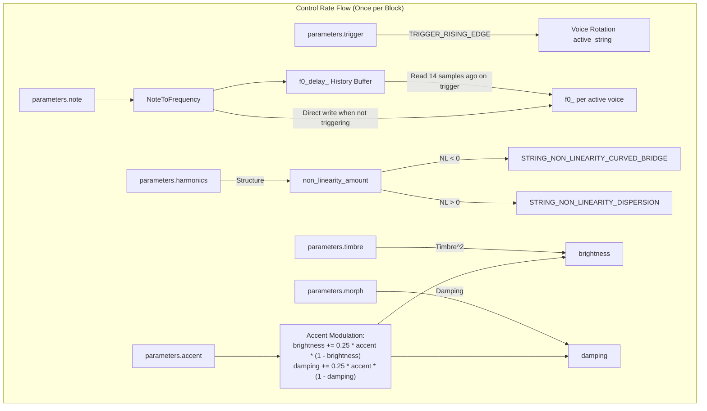
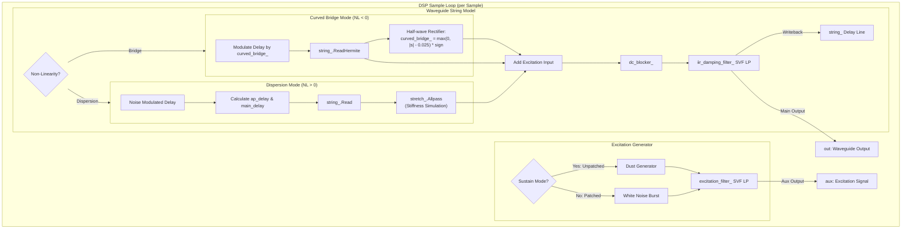

# String Engine

This document covers the DSP analysis of the
[StringEngine](https://github.com/arachnegl/eurorack/blob/master/plaits/dsp/engine/string_engine.h) class.

---

### Control Rate Flow Diagram



### DSP Loop Flow Diagram



---

### Core DSP & Synthesis Techniques

The `StringEngine` implements a **three-voice polyphonic physical modeling synthesizer** based on the **Extended Karplus-Strong (EKS)** waveguide algorithm. It incorporates specialized features from Mutable Instruments *Rings*, including nonlinear string-boundary collisions (curved bridge buzzing), allpass filter-based dispersion (string stiffness), and continuous friction/air-jet excitation models.

#### 1. Pitch Settling Delay & Polyphonic Voice Allocation
To handle analog control voltage (CV) pitch-settling lag without audible glissando or tuning errors, `StringEngine` uses a history-based pitch acquisition scheme:
- A circular history buffer `f0_delay_` (16 samples) stores successive pitch frequency values.
- When a rising edge on the trigger input is detected, the engine increments its round-robin voice index (`active_string_`) to route the note to the next voice.
- The frequency of the new voice is read from the history buffer 14 samples in the past:
  $$f_{0, \text{active}} = \text{f0\_delay\_}.\text{Read}(14)$$
  This ensures that the voice initializes with a fully settled CV pitch value, bypassing transient CV fluctuations.

#### 2. Physical Excitation Models
The excitation signal models the physical interaction that initiates string vibration (e.g., plucking, bowing, blowing). It is generated per voice and low-pass filtered by `excitation_filter_`, a State Variable Filter (SVF).

##### A. Pluck Model (Triggered / Patched Mode)
When the trigger input is patched (`sustain` is false), the exciter generates a finite burst of white noise representing a transient pluck.
- The duration of the noise burst matches exactly one fundamental period of the voice's pitch to maintain balanced excitation energy across the keyboard range:
  $$N_{\text{samples}} = \lfloor \frac{1}{f_0} \rfloor$$
- The cutoff frequency of the SVF is scaled exponentially by `brightness` (which is modulated by the `accent` parameter):
  $$\text{brightness}_{\text{acc}} = \text{brightness} + 0.25 \cdot \text{accent} \cdot (1.0 - \text{brightness})$$
  $$f_{\text{cutoff}} = \min\left(4 f_0 \cdot 2^{(\text{brightness}_{\text{acc}} \cdot (2 - \text{brightness}_{\text{acc}}) - 0.5) \cdot 6}, 0.499\right)$$
  This provides a 6-octave modulation range (centered at $0.5 f_0$ and opening up to $32 f_0$).
- The SVF quality factor $Q$ is set to $0.5$ (critically damped) to prevent ringing in the excitation burst.

##### B. Bow / Blow Model (Continuous / Unpatched Mode)
When the trigger input is unpatched (`sustain` is true), the engine operates in a continuous drone mode. It models continuous friction (bowing) or turbulence (blowing) using a specialized `Dust` noise generator:
- The dust generation rate (density of impulses) is calculated as:
  $$\text{density} = \text{brightness}_{\text{acc}}^2$$
  $$\text{dust\_f} = 0.00005 + 0.99995 \cdot \text{density}^2$$
- The dust generator outputs impulses with energy normalization and accent scaling:
  $$x_{\text{dust}}[n] = \text{Dust}(\text{dust\_f}) \cdot (8.0 - 6.0 \cdot \text{dust\_f}) \cdot \text{accent}$$
- The filter quality factor $Q$ is set to $1.0$ (resonant) to simulate the resonance of a bow hair friction loop or instrument mouthpiece.

The filtered excitation signal is mixed directly into the auxiliary output (`aux`) and injected into the waveguide feedback loop.

#### 3. String Waveguide Model (Extended Karplus-Strong)
The waveguide loop simulates wave propagation along a string using a delay line `string_` of maximum length $N = 1024$. The fundamental delay length is:
$$L = \frac{1}{f_0}$$
where $L$ is constrained to $[4.0, 1020.0]$.

##### A. High-Frequency Damping & Infinite Decay
To simulate high-frequency damping due to internal friction and air resistance, the feedback path includes a low-pass SVF filter `iir_damping_filter_`.
- The damping cutoff frequency (MIDI scale) is computed as:
  $$\text{damping}_{\text{acc}} = \text{damping} + 0.25 \cdot \text{accent} \cdot (1.0 - \text{damping})$$
  $$\text{cutoff}_{\text{midi}} = \min\left(12.0 + \text{damping}_{\text{acc}}^2 \cdot 60.0 + \text{brightness}_{\text{acc}} \cdot 24.0, 84.0\right)$$
  Which is translated to normalized frequency:
  $$f_{\text{damping}} = \min\left(f_0 \cdot 2^{\text{cutoff}_{\text{midi}} / 12}, 0.499\right)$$
- **Infinite Decay Mode:** If $\text{damping}_{\text{acc}} \ge 0.95$, the string transitions into an infinite decay state. A crossfade coefficient $t = 20.0 \cdot (\text{damping}_{\text{acc}} - 0.95)$ opens up the damping filter all the way to Nyquist, allowing the waveguide to sustain indefinitely:
  $$\text{brightness}_{\text{acc}} \leftarrow \text{brightness}_{\text{acc}} + t \cdot (1.0 - \text{brightness}_{\text{acc}})$$
  $$f_{\text{damping}} \leftarrow f_{\text{damping}} + t \cdot (0.4999 - f_{\text{damping}})$$
  $$\text{cutoff}_{\text{midi}} \leftarrow \text{cutoff}_{\text{midi}} + t \cdot (128.0 - \text{cutoff}_{\text{midi}})$$
- **Damping Compensation:** Damping filters introduce phase delay, which detunes the waveguide at high damping settings. To correct this, the target delay length is scaled:
  $$L_{\text{compensated}} = L \cdot \text{damping\_compensation}$$
  where $\text{damping\_compensation}$ is interpolated from the lookup table `lut_svf_shift` using `cutoff_midi`.

##### B. Resampling for Low Frequencies
If the requested frequency $f_0 < 11.7\text{ Hz}$ (where the delay length $L > 1020$ exceeds the buffer limit), the waveguide plays at the lowest possible note. The output is then downsampled/stretched on the fly using a linear interpolator with phase step `src_ratio = delay * f0`.

#### 4. Non-Linear Waveguide Behaviors
The parameter `parameters.harmonics` (renamed `structure`) scales the non-linearity amount $\alpha \in [-1.0, 1.0]$:
- If $\text{structure} < 0.24$: $\alpha = (\text{structure} - 0.24) \cdot 4.166$ (Curved Bridge mode)
- If $\text{structure} > 0.26$: $\alpha = (\text{structure} - 0.26) \cdot 1.35135$ (Dispersion mode)
- Otherwise: $\alpha = 0.0$ (Linear mode)

##### A. Curved Bridge ( buzzing/friction )
This mode models a sitar's flat, curved bridge or buzzing frets.
The delay line reading position is modulated by the previous sample's bridge deflection state:
$$L_{\text{modulated}} = L \cdot (1.0 - \text{curved\_bridge} \cdot \beta)$$
where:
$$\beta = \alpha^2 \cdot 0.01$$
The sample $s$ is read using Hermite fractional delay interpolation:
$$s = \text{string\_ReadHermite}(L_{\text{modulated}})$$
The bridge deflection state `curved_bridge` is updated as:
$$\text{value} = |s| - 0.025$$
$$\text{sign} = \begin{cases} 1.0 & \text{if } s > 0 \\ -1.5 & \text{if } s \le 0 \end{cases}$$
$$\text{curved\_bridge} = 2 \cdot \max(0, \text{value}) \cdot \text{sign}$$
The dead-band threshold of $0.025$ prevents buzzing at low levels. The asymmetric sign factor ($-1.5$ vs $1.0$) causes asymmetric clamping, producing rich even harmonics and buzz.

##### B. Dispersion / Stiffness
This mode models string stiffness, which causes higher-frequency waves to travel faster. It is implemented using an all-pass filter in the feedback path.
The stretch parameters:
$$\text{stretch\_point} = \alpha \cdot (2 - \alpha) \cdot 0.225$$
$$\text{stretch\_correction} = \min\left(\max\left(1.0, \frac{160}{F_s} \cdot L\right), 2.1\right)$$
$$\text{ap\_delay} = L \cdot \text{stretch\_point}$$
$$\text{main\_delay} = L - \text{ap\_delay} \cdot (0.408 - \text{stretch\_point} \cdot 0.308) \cdot \text{stretch\_correction}$$
$$\text{ap\_gain} = \frac{-0.618 \cdot \alpha}{0.15 + \alpha}$$
If $\text{ap\_delay} \ge 4.0$ and $\text{main\_delay} \ge 4.0$:
- Read linearly from delay: $s = \text{string\_.Read}(\text{main\_delay})$
- Process through allpass: $s = \text{stretch\_.Allpass}(s, \text{ap\_delay}, \text{ap\_gain})$
Otherwise:
- Fallback: $s = \text{string\_.ReadHermite}(L)$

##### High-Frequency Jitter / Noise Dispersion
If $\alpha > 0.75$, a low-pass filtered noise modulates the delay length to simulate turbulent air or scrape noise:
$$\text{noise\_amount} = (4 \cdot (\alpha - 0.75))^2 \cdot 0.1$$
$$g = 0.06 + 0.94 \cdot \text{brightness}^2$$
$$\text{dispersion\_noise} \leftarrow \text{dispersion\_noise} + g \cdot (\text{noise} - \text{dispersion\_noise})$$
$$L_{\text{modulated}} = L \cdot (1.0 + \text{dispersion\_noise} \cdot \text{noise\_amount})$$
where $\text{noise} \in [-0.5, 0.5]$ is a random float.

---

### Code Analysis

#### A. Header Structure & Engine State ([string_engine.h](https://github.com/arachnegl/eurorack/blob/master/plaits/dsp/engine/string_engine.h))

The engine state allocates dynamic buffers and sub-components:
* **Voice Array (`voice_`):** `StringVoice voice_[kNumStrings]` (3 voices) provides polyphonic synthesis.
* **Pitch History (`f0_` & `f0_delay_`):** `float f0_[3]` stores the pitch frequency for each voice. `DelayLine<float, 16> f0_delay_` tracks pitch changes to resolve settling issues.
* **Temporary Buffer (`temp_buffer_`):** Shared temporary workspace for audio block processing.
* **Active Voice Index (`active_string_`):** Integer tracking the voice currently responding to triggers.

##### Helper Class States
- **StringVoice ([string_voice.h](https://github.com/arachnegl/eurorack/blob/master/plaits/dsp/physical_modelling/string_voice.h)):**
  - `excitation_filter_`: An `stmlib::Svf` used to low-pass filter the noise burst/dust impulses.
  - `string_`: A `String` object representing the waveguide.
  - `remaining_noise_samples_`: Count of remaining samples for the noise excitation burst.
- **String ([string.h](https://github.com/arachnegl/eurorack/blob/master/plaits/dsp/physical_modelling/string.h)):**
  - `string_`: `DelayLine<float, 1024>` representing the main waveguide delay loop.
  - `stretch_`: `DelayLine<float, 256>` representing the stretch delay line used in the dispersion all-pass filter.
  - `iir_damping_filter_`: An `stmlib::Svf` for high-frequency damping.
  - `dc_blocker_`: An `stmlib::DCBlocker` to prevent DC bias accumulation inside the feedback loop.
  - `delay_`: A float representing the smoothed target delay time.
  - `dispersion_noise_`: A float storing the filtered noise state for noise-induced dispersion.
  - `curved_bridge_`: A float storing the curved bridge deflection feedback variable.
  - `src_phase_` and `out_sample_[2]`: Floats used for linear upsampling/sample-rate conversion when pitches are very low ($f_0 < 11.7\text{ Hz}$).

---

#### B. Render Loop Breakdown ([string_engine.cc](https://github.com/arachnegl/eurorack/blob/master/plaits/dsp/engine/string_engine.cc#L55))

##### 1. Polyphonic Voice Rotation & Pitch Acquisition
When a new note triggers, the engine cycles the active voice and retrieves the CV pitch value from 14 samples ago:
```cpp
if (parameters.trigger & TRIGGER_RISING_EDGE) {
  // Read historical f0 to allow CV settling (14 samples delay).
  f0_[active_string_] = f0_delay_.Read(14);
  active_string_ = (active_string_ + 1) % kNumStrings;
}

const float f0 = NoteToFrequency(parameters.note);
f0_[active_string_] = f0;
f0_delay_.Write(f0);
```

##### 2. Rendering the Voices
The active voice responds to triggers, while all three voices are rendered and accumulated into the outputs:
```cpp
fill(&out[0], &out[size], 0.0f);
fill(&aux[0], &aux[size], 0.0f);

for (int i = 0; i < kNumStrings; ++i) {
  voice_[i].Render(
      parameters.trigger & TRIGGER_UNPATCHED && i == active_string_, // sustain
      parameters.trigger & TRIGGER_RISING_EDGE && i == active_string_, // trigger
      parameters.accent,
      f0_[i],
      parameters.harmonics, // structure
      parameters.timbre * parameters.timbre, // brightness
      parameters.morph, // damping
      temp_buffer_,
      out,
      aux,
      size);
}
```

##### 3. SVF Excitation Filtering & Noise Generation ([string_voice.cc](https://github.com/arachnegl/eurorack/blob/master/plaits/dsp/physical_modelling/string_voice.cc#L53))
Inside `StringVoice::Render`, parameters are scaled by `accent`, and the excitation noise filter is configured:
```cpp
brightness += 0.25f * accent * (1.0f - brightness);
damping += 0.25f * accent * (1.0f - damping);

if (trigger || sustain) {
  const float range = 72.0f;
  const float f = 4.0f * f0;
  const float cutoff = min(
      f * SemitonesToRatio((brightness * (2.0f - brightness) - 0.5f) * range),
      0.499f);
  const float q = sustain ? 1.0f : 0.5f;
  remaining_noise_samples_ = static_cast<size_t>(1.0f / f0);
  excitation_filter_.set_f_q<FREQUENCY_DIRTY>(cutoff, q);
}
```

The noise source is chosen based on sustain mode (continuous `Dust` noise) or pluck mode (burst of white noise):
```cpp
if (sustain) {
  const float dust_f = 0.00005f + 0.99995f * density * density;
  for (size_t i = 0; i < size; ++i) {
    temp[i] = Dust(dust_f) * (8.0f - dust_f * 6.0f) * accent;
  }
} else if (remaining_noise_samples_) {
  size_t noise_samples = min(remaining_noise_samples_, size);
  remaining_noise_samples_ -= noise_samples;
  size_t tail = size - noise_samples;
  float* start = temp;
  while (noise_samples--) {
    *start++ = 2.0f * Random::GetFloat() - 1.0f;
  }
  while (tail--) {
    *start++ = 0.0f;
  }
} else {
  fill(&temp[0], &temp[size], 0.0f);
}
```

##### 4. Nonlinear Waveguide Processing Loop ([string.cc](https://github.com/arachnegl/eurorack/blob/master/plaits/dsp/physical_modelling/string.cc#L81))
In the audio processing loop of `String::ProcessInternal`, the delay is modulated according to the active non-linearity model:
```cpp
while (size--) {
  src_phase_ += src_ratio;
  if (src_phase_ > 1.0f) {
    src_phase_ -= 1.0f;
    
    float delay = delay_modulation.Next();
    float s = 0.0f;
    
    // Non-linearity modulation
    if (non_linearity == STRING_NON_LINEARITY_DISPERSION) {
      float noise = Random::GetFloat() - 0.5f;
      ONE_POLE(dispersion_noise_, noise, noise_filter)
      delay *= 1.0f + dispersion_noise_ * noise_amount;
    } else {
      delay *= 1.0f - curved_bridge_ * bridge_curving;
    }
```

The waveguide output is read using the selected dispersion or linear model, followed by the bridge state update:
```cpp
    if (non_linearity == STRING_NON_LINEARITY_DISPERSION) {
      float ap_delay = delay * stretch_point;
      float main_delay = delay - ap_delay * (0.408f - stretch_point * 0.308f) * stretch_correction;
      if (ap_delay >= 4.0f && main_delay >= 4.0f) {
        s = string_.Read(main_delay);
        s = stretch_.Allpass(s, ap_delay, ap_gain);
      } else {
        s = string_.ReadHermite(delay);
      }
    } else {
      s = string_.ReadHermite(delay);
    }
    
    if (non_linearity == STRING_NON_LINEARITY_CURVED_BRIDGE) {
      float value = fabsf(s) - 0.025f;
      float sign = s > 0.0f ? 1.0f : -1.5f;
      curved_bridge_ = (fabsf(value) + value) * sign;
    }
```

Finally, the excitation input `in` is injected into the feedback loop, processed by the DC blocker and damping filter, and written back to the delay line:
```cpp
    s += *in;
    CONSTRAIN(s, -20.0f, +20.0f);
    
    dc_blocker_.Process(&s, 1);
    s = iir_damping_filter_.Process<FILTER_MODE_LOW_PASS>(s);
    string_.Write(s);

    out_sample_[1] = out_sample_[0];
    out_sample_[0] = s;
  }
  *out++ += Crossfade(out_sample_[1], out_sample_[0], src_phase_);
  in++;
}
```

---

<!-- KaTeX support for mathematical formulas -->
<link rel="stylesheet" href="https://cdn.jsdelivr.net/npm/katex@0.16.8/dist/katex.min.css">
<script defer src="https://cdn.jsdelivr.net/npm/katex@0.16.8/dist/katex.min.js"></script>
<script defer src="https://cdn.jsdelivr.net/npm/katex@0.16.8/dist/contrib/auto-render.min.js"
        onload="renderMathInElement(document.body, {
          delimiters: [
            {left: '$$', right: '$$', display: true},
            {left: '$', right: '$', display: false}
          ]
        });"></script>

<!-- Mermaid JS support for rendering diagrams with Click-to-Zoom Lightbox -->
<script type="module">
  import mermaid from 'https://cdn.jsdelivr.net/npm/mermaid@10/dist/mermaid.esm.min.mjs';
  mermaid.initialize({ startOnLoad: false });
  
  // Inject lightbox styling
  const style = document.createElement('style');
  style.textContent = `
    .mermaid-lightbox {
      position: fixed;
      top: 0;
      left: 0;
      width: 100vw;
      height: 100vh;
      background: rgba(15, 15, 15, 0.9);
      backdrop-filter: blur(8px);
      -webkit-backdrop-filter: blur(8px);
      display: flex;
      align-items: center;
      justify-content: center;
      z-index: 10000;
      opacity: 0;
      transition: opacity 0.2s ease;
      pointer-events: none;
    }
    .mermaid-lightbox.active {
      opacity: 1;
      pointer-events: auto;
    }
    .mermaid-lightbox svg {
      max-width: 90%;
      max-height: 90%;
      width: auto;
      height: auto;
      background: rgba(255, 255, 255, 0.95);
      padding: 20px;
      border-radius: 8px;
      box-shadow: 0 20px 50px rgba(0, 0, 0, 0.3);
    }
    .mermaid-lightbox .close-btn {
      position: absolute;
      top: 20px;
      right: 30px;
      font-size: 40px;
      color: #fff;
      cursor: pointer;
      user-select: none;
      font-family: sans-serif;
    }
    .mermaid-trigger {
      cursor: zoom-in;
      transition: transform 0.2s ease;
    }
    .mermaid-trigger:hover {
      transform: scale(1.01);
    }
  `;
  document.head.appendChild(style);

  // Inject lightbox modal elements
  const lightbox = document.createElement('div');
  lightbox.className = 'mermaid-lightbox';
  lightbox.innerHTML = '<span class="close-btn">&times;</span><div class="content"></div>';
  document.body.appendChild(lightbox);

  lightbox.addEventListener('click', () => {
    lightbox.classList.remove('active');
  });

  // Convert Mermaid code blocks to styled divs
  const codeBlocks = document.querySelectorAll('.language-mermaid code, pre code.language-mermaid');
  codeBlocks.forEach((block) => {
    const container = block.closest('.language-mermaid') || block.parentElement;
    const el = document.createElement('div');
    el.className = 'mermaid mermaid-trigger';
    el.textContent = block.textContent;
    container.replaceWith(el);
  });
  
  // Render and handle lightbox events
  mermaid.run().then(() => {
    document.querySelectorAll('.mermaid-trigger').forEach((trigger) => {
      trigger.addEventListener('click', () => {
        const content = lightbox.querySelector('.content');
        content.innerHTML = trigger.innerHTML;
        lightbox.classList.add('active');
      });
    });
  });
</script>
