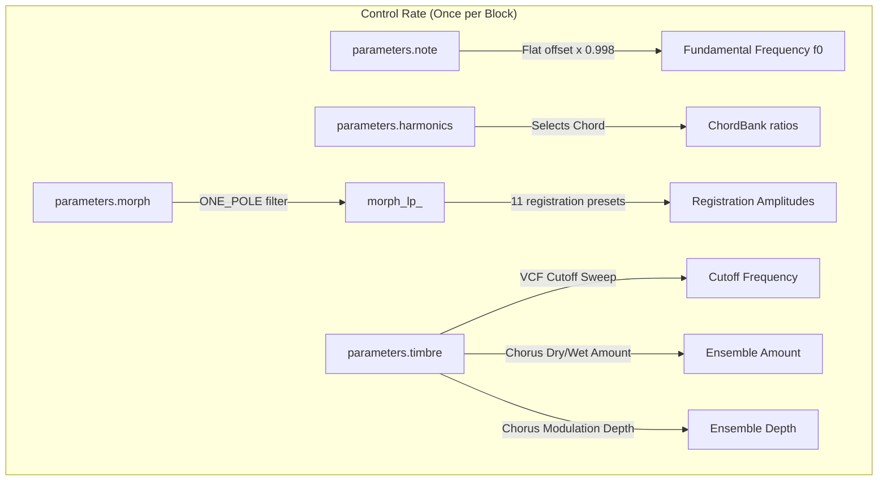
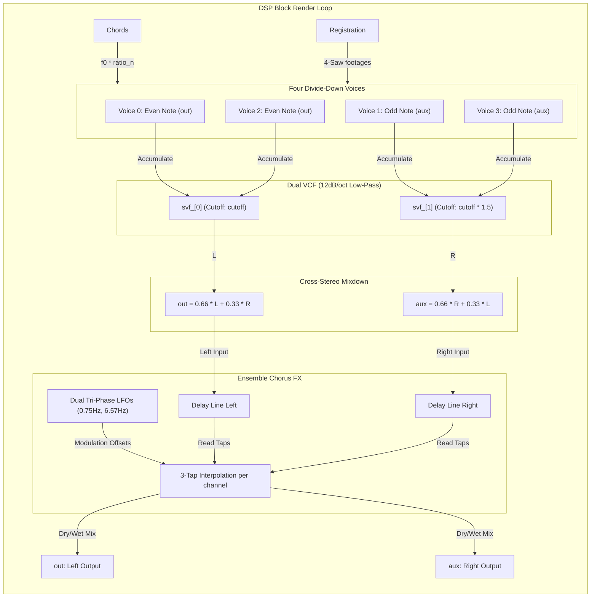

# String Machine Engine

This document covers the DSP analysis of the
[StringMachineEngine](https://github.com/arachnegl/eurorack/blob/master/plaits/dsp/engine2/string_machine_engine.h) class.

---

### Control Rate Flow Diagram



### DSP Loop Flow Diagram



---

### Core DSP & Synthesis Techniques

#### 1. Divide-Down Chord Synthesis
Vintage string machines (e.g., the Solina String Ensemble or Eminent 310) used a top-octave synthesizer (TOS) to generate high-frequency master clocks for the 12 chromatic pitches, then used digital flip-flops to divide the frequencies by powers of two to generate lower octaves. This meant that all octaves of a pitch were perfectly phase-locked.

In [StringMachineEngine](file:///Users/greg/src/eurorack/plaits/dsp/engine2/string_machine_engine.h), this architecture is simulated digitally. Instead of playing independent notes, a [ChordBank](file:///Users/greg/src/eurorack/plaits/dsp/chords/chord_bank.h) selects a 4-note chord based on the `harmonics` parameter. The fundamental frequency $f_0$ is flat-tuned slightly (by $0.998$ or about $-3.5$ cents):

$$f_0 = 0.998 \times \text{NoteToFrequency}(\text{parameters.note})$$

For each note $n \in \{0, 1, 2, 3\}$, the target frequency $f_n$ is:

$$f_n = f_0 \times \text{chord\_ratio}[n]$$

High frequencies are protected from aliasing by dynamically scaling the gain of the voice to 0 as the frequency approaches $6\text{ kHz}$ (at $F_s = 48\text{ kHz}$):

$$g_n = 4.0 - 32.0 \times f_n \quad \text{where } g_n \in [0.0, 1.0]$$

#### 2. Saw-to-Square Algebraic Reconstruction
Vintage string machines generated sawtooth waves and square waves of various octaves (organ footages: 8', 4', 2', 1'). Rendering 4 sawtooths and 3 square waves separately per voice would require 7 phase accumulators per voice, totaling 28 accumulators for the 4 chord voices.

To reduce computational overhead and maintain phase coherence, [StringSynthOscillator](file:///Users/greg/src/eurorack/plaits/dsp/oscillator/string_synth_oscillator.h) employs an algebraic identity to reconstruct square waves from phase-aligned sawtooth waves:

$$\text{Square}(2T) = 2 \times \text{Sawtooth}(2T) - \text{Sawtooth}(T)$$

Where $T$ is the period. In terms of organ footages, where a footage half the size represents double the frequency:

$$\text{Square 8'} = 2 \times \text{Saw 8'} - \text{Saw 4'}$$
$$\text{Square 4'} = 2 \times \text{Saw 4'} - \text{Saw 2'}$$
$$\text{Square 2'} = 2 \times \text{Saw 2'} - \text{Saw 1'}$$

If the desired mixture is:

$$V = \sum_{k=0}^{6} r_k \cdot R_k$$

Where $R_0 \dots R_6$ correspond to $\text{Saw 8'}$, $\text{Square 8'}$, $\text{Saw 4'}$, $\text{Square 4'}$, $\text{Saw 2'}$, $\text{Square 2'}$, and $\text{Saw 1'}$ registers respectively, we can substitute the square equations into $V$ and group terms by the 4 underlying sawtooth waves:

$$V = g_{\text{saw 8'}} \text{Saw 8'} + g_{\text{saw 4'}} \text{Saw 4'} + g_{\text{saw 2'}} \text{Saw 2'} + g_{\text{saw 1'}} \text{Saw 1'}$$

The equivalent gains are:

$$g_{\text{saw 8'}} = (r_0 + 2r_1) \times \text{gain}$$
$$g_{\text{saw 4'}} = (r_2 - r_1 + 2r_3) \times \text{gain}$$
$$g_{\text{saw 2'}} = (r_4 - r_3 + 2r_5) \times \text{gain}$$
$$g_{\text{saw 1'}} = (r_6 - r_5) \times \text{gain}$$

This mathematical reformulation allows all 7 organ registers to be synthesized using only 4 sawtooth waveforms generated from a single phase counter.

#### 3. PolyBLEP Band-Limiting & Joint Discontinuity Correction
To prevent aliasing, [StringSynthOscillator](file:///Users/greg/src/eurorack/plaits/dsp/oscillator/string_synth_oscillator.h) uses PolyBLEP (Polynomial Band-Limited Step) correction. Since all 4 sawtooth footages are generated from a single master phase accumulator (running from 0.0 to 8.0, where 8.0 represents the period of the 8' sawtooth), their step discontinuities occur at predictable boundaries:
* **8' Saw** wraps when the master phase wraps at $8.0$ (discontinuity change: $-g_{\text{saw 8'}}$).
* **4' Saw** wraps at multiples of $4.0$ (discontinuity change: $-g_{\text{saw 4'}}$).
* **2' Saw** wraps at multiples of $2.0$ (discontinuity change: $-g_{\text{saw 2'}}$).
* **1' Saw** wraps at multiples of $1.0$ (discontinuity change: $-g_{\text{saw 1'}}$).

When a wrap boundary is crossed, the fractional time $t$ of the boundary crossing is:

$$t = \frac{\phi \pmod d}{\text{frequency}}$$

Instead of applying four independent PolyBLEP corrections, the oscillator sums the discontinuities of all wrapping footages at the boundary into a single value and performs a single correction step:

$$\text{sample} \leftarrow \text{sample} + \text{discontinuity} \times \left( \text{ThisBlep}(t) + \text{NextBlep}(t) \cdot z^{-1} \right)$$

This combined step reduces the evaluation of expensive PolyBLEP functions to once per control step.

#### 4. Stereo Dispersion, VCF, and Cross-Mixing
To widen the stereo image and prevent phase cancellation, the four voices of the chord are distributed in a stereo field:
* **Even voices** (note 0 and 2) are rendered into the `out` buffer.
* **Odd voices** (note 1 and 3) are rendered into the `aux` buffer.

Both channels then pass through a 2-pole State Variable Filter ([stmlib::NaiveSvf](file:///Users/greg/src/eurorack/stmlib/dsp/filter.h)):
* `svf_[0]` (Left) cutoff is set to:
  
  $$f_{c,0} = 2.2 \times f_0 \times 2^{\frac{120.0 \times \text{timbre}}{12}}$$
  
* `svf_[1]` (Right) cutoff is offset by a factor of 1.5:
  
  $$f_{c,1} = 1.5 \times f_{c,0}$$

The Q factor is fixed at $1.0$. The $1.5\times$ offset in the right filter cutoff creates stereo filter divergence.
Following the filter stage, a cross-mix merges the signals to narrow the hard-panning:

$$\text{out}[i] = 0.66 \times l_i + 0.33 \times r_i$$
$$\text{aux}[i] = 0.66 \times r_i + 0.33 \times l_i$$

#### 5. Solina-Style Ensemble Chorus (Tri-Phase Modulation)
The iconic lushness of vintage string machines is achieved through a multi-voice chorus. The [Ensemble](file:///Users/greg/src/eurorack/plaits/dsp/fx/ensemble.h) effect implements a tri-phase chorus with two LFOs:
* **LFO 1 (Slow)**: $f_{\text{slow}} \approx 0.75\text{ Hz}$
* **LFO 2 (Fast)**: $f_{\text{fast}} \approx 6.57\text{ Hz}$

Each LFO is split into three phases spaced by $120^\circ$ ($0.33$ and $0.66$ of the 32-bit phase space):
* **Phase 1**: $\phi$
* **Phase 2**: $\phi + 1417339207$
* **Phase 3**: $\phi + 2834678415$

Three modulation paths are calculated using a mix of the slow and fast LFOs:

$$m_k(t) = \text{depth} \times (160.0 \times \text{slow}_k + 16.0 \times \text{fast}_k)$$

Where $k \in \{1, 2, 3\}$. The base delay tap offset is 192 samples ($\approx 4\text{ ms}$).
The delay lines are cross-read to yield the stereo wet outputs:
* **Left Wet**: $\frac{1}{3} \left( \text{DelayL}[m_1 + 192] + \text{DelayL}[m_2 + 192] + \text{DelayR}[m_3 + 192] \right)$
* **Right Wet**: $\frac{1}{3} \left( \text{DelayR}[m_1 + 192] + \text{DelayR}[m_2 + 192] + \text{DelayL}[m_3 + 192] \right)$

The `timbre` parameter controls both the dry/wet mixture and the modulation depth:
* $\text{amount} = 2.0 \times |\text{timbre} - 0.5|$ (no chorus at $0.5$, full chorus at $0.0$ and $1.0$).
* $\text{depth} = 0.35 + 0.65 \times \text{timbre}$ (deeper modulation at higher timbre values).
* $\text{dry\_amount} = 1.0 - 0.5 \times \text{amount}$.

---

### Code Analysis

#### A. Header Structure & Engine State ([string_machine_engine.h](https://github.com/arachnegl/eurorack/blob/master/plaits/dsp/engine2/string_machine_engine.h))
The state of the engine includes the Chord Bank, the Ensemble chorus FX engine, and the oscillators/filters:
* `ChordBank chords_`: Manages chord ratios and transitions.
* `Ensemble ensemble_`: Implements the 3-phase chorus effect (delay lines and LFOs).
* `StringSynthOscillator divide_down_voice_[kChordNumNotes]`: Four oscillators (one per chord note).
* `stmlib::NaiveSvf svf_[2]`: Dual VCF filter states.
* `float morph_lp_`: Low-pass filter state for the `morph` parameter.
* `float timbre_lp_`: Low-pass filter state for the `timbre` parameter.

> [!NOTE]
> Although `timbre_lp_` is computed at control rate, the engine reads `parameters.timbre` directly to compute filter cutoff and chorus modulation parameters. This is a leftover or intentional bypass of parameter smoothing.

#### B. Render Loop Breakdown ([string_machine_engine.cc](https://github.com/arachnegl/eurorack/blob/master/plaits/dsp/engine2/string_machine_engine.cc))

```cpp
void StringMachineEngine::Render(
    const EngineParameters& parameters,
    float* out,
    float* aux,
    size_t size,
    bool* already_enveloped) {
  ONE_POLE(morph_lp_, parameters.morph, 0.1f);
  ONE_POLE(timbre_lp_, parameters.timbre, 0.1f);

  chords_.set_chord(parameters.harmonics);

  float harmonics[kChordNumHarmonics * 2 + 2];
  float registration = max(morph_lp_, 0.0f);
  ComputeRegistration(registration, harmonics);
  harmonics[kChordNumHarmonics * 2] = 0.0f;
```
* **Parameter Setup**: The `morph` control is smoothed. The chord selection is quantified and updated in `chords_`.
* **Registration Interpolation**: The `ComputeRegistration` method interpolates between the 11 static registration mixtures, saving the gains into `harmonics`.

```cpp
  fill(&out[0], &out[size], 0.0f);
  fill(&aux[0], &aux[size], 0.0f);
  const float f0 = NoteToFrequency(parameters.note) * 0.998f;
  for (int note = 0; note < kChordNumNotes; ++note) {
    const float note_f0 = f0 * chords_.ratio(note);
    float divide_down_gain = 4.0f - note_f0 * 32.0f;
    CONSTRAIN(divide_down_gain, 0.0f, 1.0f);
    divide_down_voice_[note].Render(
        note_f0,
        harmonics,
        0.25f * divide_down_gain,
        note & 1 ? aux : out,
        size);
  }
```
* **Voice Rendering**:
  * The frequency `note_f0` is calculated for each chord note.
  * `divide_down_gain` attenuates very high notes to prevent digital aliasing.
  * `note & 1 ? aux : out` acts as a hard splitter: even notes are rendered into the `out` buffer, and odd notes are rendered into the `aux` buffer.

```cpp
  // Pass through VCF.
  const float cutoff = 2.2f * f0 * SemitonesToRatio(120.0f * parameters.timbre);
  svf_[0].set_f_q<FREQUENCY_DIRTY>(cutoff, 1.0f);
  svf_[1].set_f_q<FREQUENCY_DIRTY>(cutoff * 1.5f, 1.0f);

  // Mixdown.
  for (size_t i = 0; i < size; ++i) {
    const float l = svf_[0].Process<FILTER_MODE_LOW_PASS>(out[i]);
    const float r = svf_[1].Process<FILTER_MODE_LOW_PASS>(aux[i]);
    out[i] = 0.66f * l + 0.33f * r;
    aux[i] = 0.66f * r + 0.33f * l;
  }
```
* **Filter and Stereo Cross-Mix**:
  * Both channels are low-pass filtered using `svf_` instances. The right SVF (`svf_[1]`) cutoff is offset by $1.5\times$ to create spatial width.
  * The filtered signals `l` and `r` are mixed cross-wise ($2/3$ primary, $1/3$ secondary) to narrow the stereo image and keep the output balanced.

```cpp
  // Ensemble FX.
  const float amount = fabsf(parameters.timbre - 0.5f) * 2.0f;
  const float depth = 0.35f + 0.65f * parameters.timbre;
  ensemble_.set_amount(amount);
  ensemble_.set_depth(depth);
  ensemble_.Process(out, aux, size);
}
```
* **Ensemble Chorus**:
  * `amount` (dry/wet mix) and `depth` are dynamically scaled based on `parameters.timbre`.
  * The chorus modifies the `out` and `aux` buffers in-place, generating the final thick, stereo ensemble output.

---

<!-- KaTeX support for mathematical formulas -->
<link rel="stylesheet" href="https://cdn.jsdelivr.net/npm/katex@0.16.8/dist/katex.min.css">
<script defer src="https://cdn.jsdelivr.net/npm/katex@0.16.8/dist/katex.min.js"></script>
<script defer src="https://cdn.jsdelivr.net/npm/katex@0.16.8/dist/contrib/auto-render.min.js"
        onload="renderMathInElement(document.body, {
          delimiters: [
            {left: '$$', right: '$$', display: true},
            {left: '$', right: '$', display: false}
          ]
        });"></script>

<!-- Mermaid JS support for rendering diagrams with Click-to-Zoom Lightbox -->
<script type="module">
  import mermaid from 'https://cdn.jsdelivr.net/npm/mermaid@10/dist/mermaid.esm.min.mjs';
  mermaid.initialize({ startOnLoad: false });
  
  // Inject lightbox styling
  const style = document.createElement('style');
  style.textContent = `
    .mermaid-lightbox {
      position: fixed;
      top: 0;
      left: 0;
      width: 100vw;
      height: 100vh;
      background: rgba(15, 15, 15, 0.9);
      backdrop-filter: blur(8px);
      -webkit-backdrop-filter: blur(8px);
      display: flex;
      align-items: center;
      justify-content: center;
      z-index: 10000;
      opacity: 0;
      transition: opacity 0.2s ease;
      pointer-events: none;
    }
    .mermaid-lightbox.active {
      opacity: 1;
      pointer-events: auto;
    }
    .mermaid-lightbox svg {
      max-width: 90%;
      max-height: 90%;
      width: auto;
      height: auto;
      background: rgba(255, 255, 255, 0.95);
      padding: 20px;
      border-radius: 8px;
      box-shadow: 0 20px 50px rgba(0, 0, 0, 0.3);
    }
    .mermaid-lightbox .close-btn {
      position: absolute;
      top: 20px;
      right: 30px;
      font-size: 40px;
      color: #fff;
      cursor: pointer;
      user-select: none;
      font-family: sans-serif;
    }
    .mermaid-trigger {
      cursor: zoom-in;
      transition: transform 0.2s ease;
    }
    .mermaid-trigger:hover {
      transform: scale(1.01);
    }
  `;
  document.head.appendChild(style);
 
  // Inject lightbox modal elements
  const lightbox = document.createElement('div');
  lightbox.className = 'mermaid-lightbox';
  lightbox.innerHTML = '<span class="close-btn">&times;</span><div class="content"></div>';
  document.body.appendChild(lightbox);
 
  lightbox.addEventListener('click', () => {
    lightbox.classList.remove('active');
  });
 
  // Convert Mermaid code blocks to styled divs
  const codeBlocks = document.querySelectorAll('.language-mermaid code, pre code.language-mermaid');
  codeBlocks.forEach((block) => {
    const container = block.closest('.language-mermaid') || block.parentElement;
    const el = document.createElement('div');
    el.className = 'mermaid mermaid-trigger';
    el.textContent = block.textContent;
    container.replaceWith(el);
  });
  
  // Render and handle lightbox events
  mermaid.run().then(() => {
    document.querySelectorAll('.mermaid-trigger').forEach((trigger) => {
      trigger.addEventListener('click', () => {
        const content = lightbox.querySelector('.content');
        content.innerHTML = trigger.innerHTML;
        lightbox.classList.add('active');
      });
    });
  });
</script>
