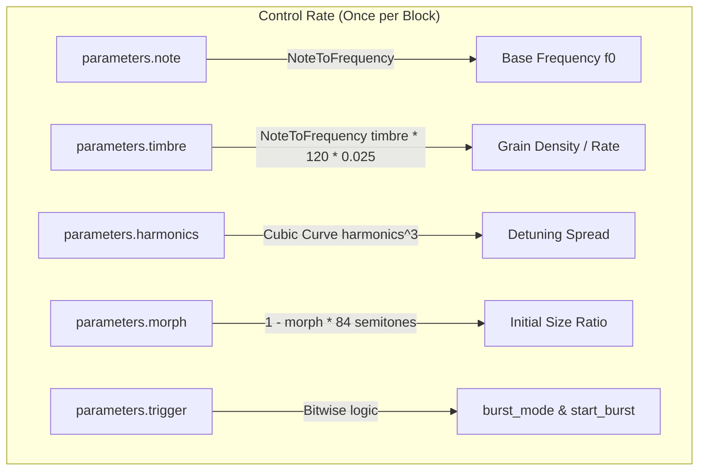

# Swarm Engine

This document covers the DSP analysis of the
[SwarmEngine](https://github.com/arachnegl/eurorack/blob/master/plaits/dsp/engine/swarm_engine.h) class.

---

### Control Rate Flow Diagram



### DSP Loop Flow Diagram

```mermaid
graph TD
    subgraph dsp_render ["DSP Render Loop (Once per Block)"]
        Init["Clear out[] and aux[] buffers"] --> LoopStart["Loop through i = 0 to 7 (8 Swarm Voices)"]
        
        subgraph voice_processing ["SwarmVoice[i] Render Step"]
            StepEnv["envelope_.Step(density, burst_mode, start_burst)"]
            
            %% Amplitude Calculation %%
            CalcAmp["amplitude = envelope_.amplitude(size_ratio) / 8"]
            
            %% Frequency Calculation %%
            GetExpo["expo_amount = envelope_.frequency(size_ratio)"]
            CalcExpo["f_expo = f0 * SemitonesToRatio(48 * expo_amount * spread * rank_i)"]
            CalcLin["linear_amount = rank_i * (rank_i + 0.01) * spread * 0.25"]
            CalcF["f_voice = f_expo * (1 + linear_amount)"]
            
            %% Oscillator Rendering %%
            RenderSaw["saw_.Render(f_voice, amplitude, out, size)"]
            RenderSine["sine_.Render(f_voice, amplitude, aux, size)"]
        end
        
        LoopStart --> StepEnv
        StepEnv --> CalcAmp
        CalcAmp --> GetExpo
        GetExpo --> CalcExpo
        CalcExpo --> CalcLin
        CalcLin --> CalcF
        CalcF --> RenderSaw
        CalcF --> RenderSine
        
        RenderSine --> UpdateRatio["size_ratio *= 0.97"]
        UpdateRatio --> LoopEnd{"i < 7?"}
        LoopEnd -->|Yes| LoopStart
        LoopEnd -->|No| Finished["out[] (Accumulated Saws), aux[] (Accumulated Sines)"]
    end
```



---

### Core DSP & Synthesis Techniques

#### 1. Voice Allocation and Ranks
The swarm engine simulates $N = 8$ detuned voices. Each voice is assigned a normalized index or "rank" $r_i$ for $i \in \{0, 1, \dots, N-1\}$:
$$r_i = \frac{i - \frac{N-1}{2}}{\frac{N-1}{2}} = \frac{i - 3.5}{3.5}$$
This maps the voice ranks linearly in $[-1.0, 1.0]$:
$$r \in \{-1.0, -0.714, -0.429, -0.143, 0.143, 0.429, 0.714, 1.0\}$$

#### 2. Stochastic Grain Envelope & Modulation
The `GrainEnvelope` class generates stochastic envelopes and pitch modulators for each voice. The phase $\phi_g$ of the grain envelope increments by:
$$\Delta \phi_g = \text{density} \cdot f_{\text{mod}}$$
Where the control-rate `density` is computed from the `timbre` parameter as:
$$\text{density} = f_{\text{MIDI}}(120.0 \cdot \text{timbre}) \cdot 0.025 \cdot L_{\text{block}}$$
where $L_{\text{block}}$ is the block size.
When $\phi_g \ge 1.0$, the grain wraps around, triggering a randomization step:
* **Target update**:
  $$y_{\text{from}} \leftarrow y_{\text{from}} + y_{\text{interval}}$$
  $$y_{\text{interval}} \leftarrow U(0, 1) - y_{\text{from}}$$
  This means the new starting value is the previous ending value, and a new random target value is selected from a uniform distribution $U(0, 1)$.
* **Rate modifier randomization**:
  - In continuous/glissando mode (`burst_mode = false`):
    $$f_{\text{mod}} \leftarrow 0.5 + 1.5 \cdot U(0, 1)$$
  - In burst mode (`burst_mode = true`), $f_{\text{mod}}$ decays on each trigger:
    $$f_{\text{mod}} \leftarrow f_{\text{mod}} \cdot (0.8 + 0.2 \cdot U(0, 1))$$
    This models a decelerating sequence of bursts.

#### 3. Pitch Modulation and Distribution
The `morph` parameter controls the transition between a discrete "grain cloud" (amplitude-windowed, constant pitch per grain) and a "swarm of glissandi" (continuous pitch glides, constant amplitude).
* **Glissando Mode ($\text{size\_ratio} < 1.0$)**:
  The pitch offset $f_{\text{expo}}$ varies continuously with grain phase:
  $$f_{\text{expo}}(\phi_g) = 2 \cdot (y_{\text{from}} + y_{\text{interval}} \cdot \phi_g) - 1.0 \quad \in [-1.0, 1.0]$$
* **Grain Cloud Mode ($\text{size\_ratio} \ge 1.0$)**:
  The pitch offset is constant during the grain's lifetime:
  $$f_{\text{expo}} = y_{\text{from}} \quad \in [0.0, 1.0]$$

The detuning frequency for voice $i$ is calculated using a hybrid exponential and linear detuning model:
* **Exponential Pitch Spread**:
  $$\text{spread} = \text{harmonics}^3$$
  $$f_{\text{expo\_scale}} = 2^{\frac{48.0 \cdot f_{\text{expo}} \cdot \text{spread} \cdot r_i}{12}} = 2^{4.0 \cdot f_{\text{expo}} \cdot \text{spread} \cdot r_i}$$
  This scales the frequency exponentially by up to $\pm 4$ octaves (48 semitones).
* **Linear Unison Detuning**:
  $$f_{\text{linear\_scale}} = 1.0 + r_i (r_i + 0.01) \cdot \text{spread} \cdot 0.25$$
  This adds a small positive quadratic detuning offset, which spreads the oscillators in the frequency domain.
* **Combined Frequency**:
  $$f_i = f_0 \cdot f_{\text{expo\_scale}} \cdot f_{\text{linear\_scale}}$$

#### 4. Amplitude Windowing and Smoothing
* **Glissando Mode ($\text{size\_ratio} < 1.0$)**:
  $$\text{target\_amplitude} = 1.0$$
* **Grain Cloud Mode ($\text{size\_ratio} \ge 1.0$)**:
  $$\psi = (\phi_g - 0.5) \cdot \text{size\_ratio}$$
  $$\bar{\psi} = \max(-1.0, \min(1.0, \psi))$$
  $$\text{target\_amplitude} = 0.5 \cdot \left(\sin\left(2\pi \cdot (0.5 \bar{\psi} + 1.25)\right) + 1.0\right)$$
  This provides a smooth, bell-shaped window.
* **Smoothing**:
  To smooth the transition between the two modes, a one-pole low-pass filter is applied:
  $$\text{amplitude}[n] = \text{amplitude}[n-1] + \alpha \cdot (\text{target\_amplitude} - \text{amplitude}[n-1])$$
  where $\alpha = 0.5 - \text{filter\_coefficient}$. If a boundary transition is crossed (i.e. $(\text{size\_ratio} \ge 1.0) \oplus (\text{previous\_size\_ratio} \ge 1.0)$), `filter_coefficient` is reset to $0.5$, forcing $\alpha = 0.0$ initially, and then slowly opening the filter to smooth out transients.

#### 5. Band-Limited Sawtooth Synthesis (PolyBLEP)
The `AdditiveSawOscillator` implements a first-order PolyBLEP (Polynomial Band-Limited Step) algorithm to eliminate aliasing when the saw wave wraps.
For a step change of $-1$ at fractional offset $t = \phi_{\text{wrapped}} / f$, the corrections subtracted from the phase accumulator are:
$$\text{ThisBlepSample}(t) = t - \frac{t^2}{2} - 0.5 \quad \text{for the current sample}$$
$$\text{NextBlepSample}(t) = \frac{t^2}{2} \quad \text{for the next sample}$$

#### 6. Fast Magic Circle Sine Oscillator
The auxiliary channel renders a swarm of sines using the `FastSineOscillator`.
It implements a coupled form digital oscillator (the Magic Circle):
$$x[n] = x[n-1] + \epsilon \cdot y[n-1]$$
$$y[n] = y[n-1] - \epsilon \cdot x[n]$$
The coefficient $\epsilon = 2\sin(\pi f)$ is approximated using a 3rd-order polynomial:
$$\epsilon \approx \theta \cdot \left(2.0 - \frac{1.92}{6} \theta^2\right) \quad \text{where } \theta = \pi f$$
Stability is maintained by normalizing the state vector $(x, y)$ using Carmack's fast inverse square root:
$$\text{norm} = x^2 + y^2$$
$$\text{scale} = \text{rsqrt}(norm) \approx \frac{1}{\sqrt{norm}}$$
$$x \leftarrow x \cdot \text{scale}, \quad y \leftarrow y \cdot \text{scale}$$

---

### Code Analysis

#### A. Header Structure & Engine State ([swarm_engine.h](https://github.com/arachnegl/eurorack/blob/master/plaits/dsp/engine/swarm_engine.h))

The engine states and helpers are defined in `swarm_engine.h`:
* **`GrainEnvelope` Class**:
  Tracks grain boundaries, phase accumulation, duration randomizations, and amplitude/frequency interpolation logic.
  ```cpp
  float from_;
  float interval_;
  float phase_;
  float fm_;
  float amplitude_;
  float previous_size_ratio_;
  float filter_coefficient_;
  ```
* **`AdditiveSawOscillator` Class**:
  A PolyBLEP saw generator tracking the phase accumulator and interpolation states.
  ```cpp
  float phase_;
  float next_sample_;
  float frequency_;
  float gain_;
  ```
* **`SwarmVoice` Class**:
  Binds a voice rank, a `GrainEnvelope`, an `AdditiveSawOscillator`, and a `FastSineOscillator` together.
  ```cpp
  float rank_;
  GrainEnvelope envelope_;
  AdditiveSawOscillator saw_;
  FastSineOscillator sine_;
  ```
* **`SwarmEngine` Class**:
  Derived from `Engine`, it holds an array of `SwarmVoice` objects allocated dynamically.
  ```cpp
  SwarmVoice* swarm_voice_;
  ```

#### B. Render Loop Breakdown ([swarm_engine.cc](https://github.com/arachnegl/eurorack/blob/master/plaits/dsp/engine/swarm_engine.cc))

##### 1. Parameter Mapping (Control Rate)
```cpp
const float f0 = NoteToFrequency(parameters.note);
const float control_rate = static_cast<float>(size);
const float density = NoteToFrequency(parameters.timbre * 120.0f) * \
    0.025f * control_rate;
const float spread = parameters.harmonics * parameters.harmonics * \
    parameters.harmonics;
float size_ratio = 0.25f * SemitonesToRatio(
    (1.0f - parameters.morph) * 84.0f);

const bool burst_mode = !(parameters.trigger & TRIGGER_UNPATCHED);
const bool start_burst = parameters.trigger & TRIGGER_RISING_EDGE;
```
* **`density`**: The `timbre` parameter maps to grain rate. Note that `density` represents the phase increment per block size.
* **`spread`**: Harmonics scales detuning spread with a cubic response curve ($x^3$).
* **`size_ratio`**: Morph is mapped to grain envelope size. When morph is 1, size ratio is minimal (producing continuous glissandi); when morph is 0, size ratio is maximal (producing discrete, short grains).

##### 2. Voice Accumulator Loop
```cpp
fill(&out[0], &out[size], 0.0f);
fill(&aux[0], &aux[size], 0.0f);

for (int i = 0; i < kNumSwarmVoices; ++i) {
  swarm_voice_[i].Render(
      f0,
      density,
      burst_mode,
      start_burst,
      spread,
      size_ratio,
      out,
      aux,
      size);
  size_ratio *= 0.97f;
}
```
* **`size_ratio *= 0.97f`**: Each subsequent voice has a slightly smaller size ratio, causing a natural diversity of grain durations across the swarm.
* **`out` & `aux` Accumulation**: The final output buffers accumulate the rendered voices additively.

##### 3. Voice Render Logic (`SwarmVoice::Render`)
```cpp
envelope_.Step(density, burst_mode, start_burst);

const float scale = 1.0f / kNumSwarmVoices;
const float amplitude = envelope_.amplitude(size_ratio) * scale;

const float expo_amount = envelope_.frequency(size_ratio);
f0 *= stmlib::SemitonesToRatio(48.0f * expo_amount * spread * rank_);

const float linear_amount = rank_ * (rank_ + 0.01f) * spread * 0.25f;
f0 *= 1.0f + linear_amount;

saw_.Render(f0, amplitude, saw, size);
sine_.Render(f0, amplitude, sine, size);
```
* **Pitch Shifting**: The frequency `f0` is modified first exponentially using `stmlib::SemitonesToRatio` scaled by the voice's rank and grain envelope pitch output. It is then detuned linearly by the quadratic term `linear_amount` based on rank and spread.
* **Dual Output**: The saw oscillator renders into the main output buffer (`saw` / `out`), while the fast sine oscillator renders into the aux buffer (`sine` / `aux`).

##### 4. Grain Envelope Update Loop
```cpp
inline void Step(float rate, bool burst_mode, bool start_burst) {
  bool randomize = false;
  if (start_burst) {
    phase_ = 0.5f;
    fm_ = 16.0f;
    randomize = true;
  } else {
    phase_ += rate * fm_;
    if (phase_ >= 1.0f) {
      phase_ -= static_cast<float>(static_cast<int>(phase_));
      randomize = true;
    }
  }
  
  if (randomize) {
    from_ += interval_;
    interval_ = stmlib::Random::GetFloat() - from_;
    // Randomize the duration of the grain.
    if (burst_mode) {
      fm_ *= 0.8f + 0.2f * stmlib::Random::GetFloat();
    } else {
      fm_ = 0.5f + 1.5f * stmlib::Random::GetFloat();
    }
  }
}
```
* **Phase Wrapping**: When `phase_ >= 1.0f`, the grain boundary is reached. The starting point is updated to the previous target, a new target is generated, and the speed modifier `fm_` is randomized.

##### 5. PolyBLEP Sawtooth Generation
```cpp
while (size--) {
  float this_sample = next_sample;
  next_sample = 0.0f;

  const float frequency = fm.Next();
  phase += frequency;

  if (phase >= 1.0f) {
    phase -= 1.0f;
    float t = phase / frequency;
    this_sample -= stmlib::ThisBlepSample(t);
    next_sample -= stmlib::NextBlepSample(t);
  }

  next_sample += phase;
  *out++ += (2.0f * this_sample - 1.0f) * gain.Next();
}
```
* **Aliasing Correction**: When `phase >= 1.0f` wraps, the discontinuity at boundary fraction $t$ is smoothed out by subtracting `ThisBlepSample` and `NextBlepSample` coefficients from the phase values, achieving anti-aliased synthesis.

##### 6. Fast Sine Coupled Generation
```cpp
while (size--) {
  const float e = epsilon.Next();
  x += e * y;
  y -= e * x;
  if (mode == ADDITIVE) {
    *out++ += am.Next() * x;
  }
  ...
}
```
* **State Updates**: Updates $x$ and $y$ using coupled feedback, which naturally produces quadrature sinewaves. The parameter interpolator `epsilon` updates the step size parameter $\epsilon = 2\sin(\pi f)$ dynamically per sample.

---

<!-- KaTeX support for mathematical formulas -->
<link rel="stylesheet" href="https://cdn.jsdelivr.net/npm/katex@0.16.8/dist/katex.min.css">
<script defer src="https://cdn.jsdelivr.net/npm/katex@0.16.8/dist/katex.min.js"></script>
<script defer src="https://cdn.jsdelivr.net/npm/katex@0.16.8/dist/contrib/auto-render.min.js"
        onload="renderMathInElement(document.body, {
          delimiters: [
            {left: '$$', right: '$$', display: true},
            {left: '$', right: '$', display: false}
          ]
        });"></script>

<!-- Mermaid JS support for rendering diagrams with Click-to-Zoom Lightbox -->
<script type="module">
  import mermaid from 'https://cdn.jsdelivr.net/npm/mermaid@10/dist/mermaid.esm.min.mjs';
  mermaid.initialize({ startOnLoad: false });
  
  // Inject lightbox styling
  const style = document.createElement('style');
  style.textContent = `
    .mermaid-lightbox {
      position: fixed;
      top: 0;
      left: 0;
      width: 100vw;
      height: 100vh;
      background: rgba(15, 15, 15, 0.9);
      backdrop-filter: blur(8px);
      -webkit-backdrop-filter: blur(8px);
      display: flex;
      align-items: center;
      justify-content: center;
      z-index: 10000;
      opacity: 0;
      transition: opacity 0.2s ease;
      pointer-events: none;
    }
    .mermaid-lightbox.active {
      opacity: 1;
      pointer-events: auto;
    }
    .mermaid-lightbox svg {
      max-width: 90%;
      max-height: 90%;
      width: auto;
      height: auto;
      background: rgba(255, 255, 255, 0.95);
      padding: 20px;
      border-radius: 8px;
      box-shadow: 0 20px 50px rgba(0, 0, 0, 0.3);
    }
    .mermaid-lightbox .close-btn {
      position: absolute;
      top: 20px;
      right: 30px;
      font-size: 40px;
      color: #fff;
      cursor: pointer;
      user-select: none;
      font-family: sans-serif;
      line-height: 1;
    }
    .mermaid-trigger {
      cursor: zoom-in;
      transition: transform 0.2s ease;
    }
    .mermaid-trigger:hover {
      transform: scale(1.01);
    }
  `;
  document.head.appendChild(style);
 
  // Inject lightbox modal elements
  const lightbox = document.createElement('div');
  lightbox.className = 'mermaid-lightbox';
  lightbox.innerHTML = '<span class="close-btn">&times;</span><div class="content"></div>';
  document.body.appendChild(lightbox);
 
  lightbox.addEventListener('click', () => {
    lightbox.classList.remove('active');
  });
 
  // Convert Mermaid code blocks to styled divs
  const codeBlocks = document.querySelectorAll('.language-mermaid code, pre code.language-mermaid');
  codeBlocks.forEach((block) => {
    const container = block.closest('.language-mermaid') || block.parentElement;
    const el = document.createElement('div');
    el.className = 'mermaid mermaid-trigger';
    el.textContent = block.textContent;
    container.replaceWith(el);
  });
  
  // Render and handle lightbox events
  mermaid.run().then(() => {
    document.querySelectorAll('.mermaid-trigger').forEach((trigger) => {
      trigger.addEventListener('click', () => {
        const content = lightbox.querySelector('.content');
        content.innerHTML = trigger.innerHTML;
        lightbox.classList.add('active');
      });
    });
  });
</script>
