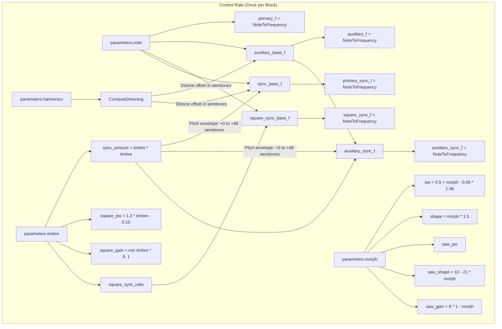
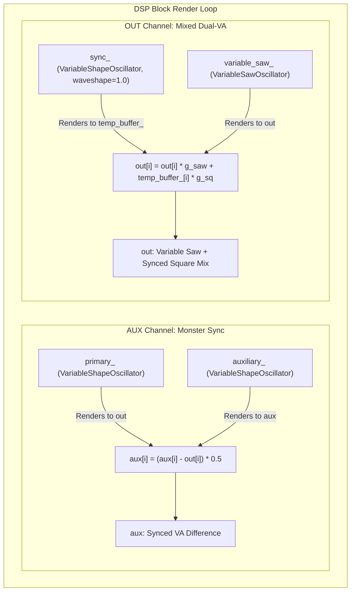

# Virtual Analog Engine

This document covers the DSP analysis of the
[VirtualAnalogEngine](https://github.com/arachnegl/eurorack/blob/master/plaits/dsp/engine/virtual_analog_engine.h) class.

---

### Control Rate Flow Diagram



### DSP Loop Flow Diagram



---

### Core DSP & Synthesis Techniques

The `VirtualAnalogEngine` generates classic subtractive analog synthesizer timbres using band-limited virtual analog (VA) oscillators. It features two output paths: a main output channel (`out`) producing a mix of a variable saw/notch wave and a hard-synced square wave, and an auxiliary output channel (`aux`) producing a "monster sync" sound generated by the difference of two hard-synced variable-shape oscillators.

#### 1. PolyBLEP Band-Limiting
In digital synthesis, rendering geometric waveforms like saw, square, or triangle waves by stepping phase accumulator values naively produces infinite high-frequency harmonics. Harmonics that exceed the Nyquist frequency ($F_s / 2$) fold back into the audible spectrum, creating metallic, non-harmonic distortions known as **aliasing**.

To prevent this, the engine's oscillators employ **PolyBLEP (Polynomial Band-Limited Step)** interpolation. This technique locates the exact sub-sample timing of a waveform transition (discontinuity) and adds a localized polynomial correction to the current and subsequent samples, acting as an anti-aliasing filter:

When a step discontinuity of height $D$ occurs at a fractional sample offset $t \in [0, 1)$ between the previous and current sample, the correction is:
$$x[n] \leftarrow x[n] + D \cdot h_{\text{blep}}(t)$$
$$x[n+1] \leftarrow x[n+1] + D \cdot h_{\text{blep\_next}}(t)$$

Where the first-order PolyBLEP residuals are defined as:
$$\text{ThisBlepSample}(t) = \frac{1}{2} t^2$$
$$\text{NextBlepSample}(t) = -\frac{1}{2} (1 - t)^2$$

For triangle waves and saw waves with notches, there is also a discontinuity in the waveform's first derivative (a "kink" or slope change). The engine corrects these using **Integrated PolyBLEP** residuals:
$$\text{NextIntegratedBlepSample}(t) = \frac{3}{16} - \frac{1}{2} t + \frac{3}{8} t^2 - \frac{1}{16} t^4$$
$$\text{ThisIntegratedBlepSample}(t) = \text{NextIntegratedBlepSample}(1 - t)$$

These corrections are added to smooth out the corners of triangle waveforms and prevent high-frequency aliasing.

#### 2. Equal-Tempered Snap-to-Interval Detuning
The detuning offset of the auxiliary oscillator is mapped using the `ComputeDetuning` helper method, which quantizes the `harmonics` parameter into musical intervals (perfect fifths, octaves, etc.).

```cpp
float VirtualAnalogEngine::ComputeDetuning(float detune) const {
  detune = 2.05f * detune - 1.025f;
  CONSTRAIN(detune, -1.0f, 1.0f);
  
  float sign = detune < 0.0f ? -1.0f : 1.0f;
  detune = detune * sign * 3.9999f;
  MAKE_INTEGRAL_FRACTIONAL(detune);
  
  float a = intervals[detune_integral];
  float b = intervals[detune_integral + 1];
  return (a + (b - a) * Squash(Squash(detune_fractional))) * sign;
}
```

The scale of intervals is defined as:
$$\text{intervals} = [0.0, 7.01, 12.01, 19.01, 24.01]\text{ semitones}$$
These correspond to Unison, Perfect Fifth, Octave, Octave + Perfect Fifth, and Double Octave. 

To make it easy to tune precisely to these intervals without locking the user out of smooth transitions, the fractional part of detuning is squashed twice using the smoothstep function:
$$\text{Squash}(x) = x^2 (3 - 2x)$$
$$\text{detune\_fractional\_smoothed} = \text{Squash}(\text{Squash}(x))$$
This double-squashing creates flat plateaus around the exact integer interval steps while leaving a steep transition zone between them.

#### 3. Variable Shape Oscillator
The class `VariableShapeOscillator` morphs continuously between a Triangle wave, a Saw wave, and a Square wave:
*   **Waveshape morphing:** The waveshape parameter $W \in [0.0, 1.0]$ sets the mixture:
    *   $\text{triangle\_amount} = \max(1.0 - 2W, 0)$
    *   $\text{square\_amount} = \max(2(W - 0.5), 0)$
    *   The remainder represents the saw wave amount.
*   **Pulse Width:** Both triangle and square wave modes have variable slopes / duty cycle controlled by $pw \in (0.0, 1.0)$. The rising and falling slopes are defined as:
    $$\text{slope\_up} = \frac{1}{pw}$$
    $$\text{slope\_down} = \frac{1}{1 - pw}$$

#### 4. Variable Saw Oscillator
The `VariableSawOscillator` implements a saw wave with morphable slope and notch options:
*   At $W = 1.0$ (`saw_shape = 1.0`), it acts as a triangle wave with adjustable slope.
*   At $W < 1.0$, it transitions to a saw wave containing a phase-cancellation notch of depth $0.2$. The notch offset follows the pulse width parameter, yielding an phase-modulated comb filtering texture.

#### 5. Hard Sync Modulation
Hard sync resets the phase of a "slave" oscillator to $0.0$ whenever a "master" oscillator completes its cycle (phase wraps around $1.0$). 

```cpp
if (enable_sync) {
  master_phase_ += master_frequency;
  if (master_phase_ >= 1.0f) {
    master_phase_ -= 1.0f;
    reset_time = master_phase_ / master_frequency;
    
    float slave_phase_at_reset = slave_phase_ + (1.0f - reset_time) * slave_frequency;
    reset = true;
    ...
    float value = ComputeNaiveSample(slave_phase_at_reset, ...);
    this_sample -= value * stmlib::ThisBlepSample(reset_time);
    next_sample -= value * stmlib::NextBlepSample(reset_time);
  }
}
```
Because the phase reset is a sharp step discontinuity occurring at a sub-sample point $t = \text{reset\_time}$, a PolyBLEP correction is calculated using the slave oscillator's naive amplitude at the reset instant ($V_{\text{naive}}$) and applied to avoid digital clicks.

#### 6. Dual-Mode Synthesis Architecture (Variants)
The codebase includes three implementation variants, compiled by setting `VA_VARIANT` in `virtual_analog_engine.h`:
*   **Variant 0:** Two independent variable waveshape oscillators. `out` outputs their average, and `aux` outputs the average of the primary and a synced auxiliary oscillator.
*   **Variant 1:** Renders two variable waveshapes. `aux` is the auxiliary oscillator. `out` crossfades between detuned sum, unison, and hard-sync waves based on the `timbre` parameter.
*   **Variant 2 (Active Default):** 
    *   `out` is a mixed sum of `variable_saw_` (detuned) and `sync_` square wave.
    *   `aux` is the difference between primary and auxiliary oscillators, both hard-synced to a pitch swept up to +4 octaves by `timbre * timbre`.

---

### Code Analysis

#### A. Header Structure & Engine State
The engine is declared in [virtual_analog_engine.h](https://github.com/arachnegl/eurorack/blob/master/plaits/dsp/engine/virtual_analog_engine.h):

```cpp
class VirtualAnalogEngine : public Engine {
 private:
  float ComputeDetuning(float detune) const;
  
  VariableShapeOscillator primary_;
  VariableShapeOscillator auxiliary_;

  VariableShapeOscillator sync_;
  VariableSawOscillator variable_saw_;

  float auxiliary_amount_;
  float xmod_amount_;
  float* temp_buffer_;
  
  DISALLOW_COPY_AND_ASSIGN(VirtualAnalogEngine);
};
```
*   `primary_` and `auxiliary_` render the synced waves on the `aux` output.
*   `sync_` and `variable_saw_` render the square and saw/notch waves on the main `out` output.
*   `auxiliary_amount_` and `xmod_amount_` store parameter interpolation states across blocks.
*   `temp_buffer_` is dynamically allocated in `Init` to temporarily store the square wave outputs during block processing.

---

#### B. Render Loop Breakdown
The synthesis logic resides in `Render` under `VA_VARIANT 2` in [virtual_analog_engine.cc](https://github.com/arachnegl/eurorack/blob/master/plaits/dsp/engine/virtual_analog_engine.cc#L166):

##### 1. Parameter Modulation & Target Pitch Mapping
```cpp
const float sync_amount = parameters.timbre * parameters.timbre;
const float auxiliary_detune = ComputeDetuning(parameters.harmonics);
const float primary_f = NoteToFrequency(parameters.note);
const float auxiliary_f = NoteToFrequency(parameters.note + auxiliary_detune);
const float primary_sync_f = NoteToFrequency(
    parameters.note + sync_amount * 48.0f);
const float auxiliary_sync_f = NoteToFrequency(
    parameters.note + auxiliary_detune + sync_amount * 48.0f);

float shape = parameters.morph * 1.5f;
CONSTRAIN(shape, 0.0f, 1.0f);

float pw = 0.5f + (parameters.morph - 0.66f) * 1.46f;
CONSTRAIN(pw, 0.5f, 0.995f);
```
*   `sync_amount` is squared to concentrate the sync pitch sweep at the upper range of the control.
*   `primary_sync_f` and `auxiliary_sync_f` define the hard-synced oscillator slave frequencies, swept up to $+48.0$ semitones (4 octaves).
*   `pw` and `shape` parameters are derived from `morph` and constrained to legal ranges.

##### 2. Synced AUX Output Generation
```cpp
// Render monster sync to AUX.
primary_.Render(primary_f, primary_sync_f, pw, shape, out, size);
auxiliary_.Render(auxiliary_f, auxiliary_sync_f, pw, shape, aux, size);
for (size_t i = 0; i < size; ++i) {
  aux[i] = (aux[i] - out[i]) * 0.5f;
}
```
*   `primary_` uses the base note `primary_f` as master frequency and `primary_sync_f` as slave frequency, writing to `out` as a temporary scratchpad.
*   `auxiliary_` uses the detuned note `auxiliary_f` as master frequency and `auxiliary_sync_f` as slave, writing to `aux`.
*   The final `aux` sample is computed as $0.5 \times (\text{auxiliary} - \text{primary})$, creating a detuned hard-sync composite signal.

##### 3. Main OUT Waveform Rendering
Next, the engine calculates the parameters for the square wave (`sync_`) and the saw wave (`variable_saw_`):

```cpp
float square_pw = 1.3f * parameters.timbre - 0.15f;
CONSTRAIN(square_pw, 0.005f, 0.5f);

const float square_sync_ratio = parameters.timbre < 0.5f
    ? 0.0f
    : (parameters.timbre - 0.5f) * (parameters.timbre - 0.5f) * 4.0f * 48.0f;

const float square_gain = min(parameters.timbre * 8.0f, 1.0f);

float saw_pw = parameters.morph < 0.5f
    ? parameters.morph + 0.5f
    : 1.0f - (parameters.morph - 0.5f) * 2.0f;
saw_pw *= 1.1f;
CONSTRAIN(saw_pw, 0.005f, 1.0f);
  
float saw_shape = 10.0f - 21.0f * parameters.morph;
CONSTRAIN(saw_shape, 0.0f, 1.0f);

float saw_gain = 8.0f * (1.0f - parameters.morph);
CONSTRAIN(saw_gain, 0.02f, 1.0f);

const float square_sync_f = NoteToFrequency(
    parameters.note + square_sync_ratio);
```
*   **Square PW:** Controlled by `timbre`, constrained within $[0.005, 0.5]$.
*   **Square Sync:** If `timbre >= 0.5`, the square wave is hard-synced, with its slave frequency `square_sync_f` swept up exponentially.
*   **Saw PW & Shape:** Morph controls both the notch position (`saw_pw`) and the saw-to-triangle ratio (`saw_shape`).
*   **Gain scaling:** `saw_gain` fades out at high morph values, and `square_gain` fades out at low timbre values.

##### 4. Oscillator Generation & Gain Interpolation Mix
```cpp
sync_.Render(
    primary_f, square_sync_f, square_pw, 1.0f, temp_buffer_, size);
variable_saw_.Render(auxiliary_f, saw_pw, saw_shape, out, size);

float norm = 1.0f / (std::max(square_gain, saw_gain));

ParameterInterpolator square_gain_modulation(
    &auxiliary_amount_,
    square_gain * 0.3f * norm,
    size);

ParameterInterpolator saw_gain_modulation(
    &xmod_amount_,
    saw_gain * 0.5f * norm,
    size);

for (size_t i = 0; i < size; ++i) {
  out[i] = out[i] * saw_gain_modulation.Next() + \
      square_gain_modulation.Next() * temp_buffer_[i];
}
```
*   `sync_` generates the square wave (waveshape parameter = 1.0) into `temp_buffer_`.
*   `variable_saw_` generates the detuned saw/notch/triangle wave directly into `out` (overwriting the previous primary synced signal).
*   `norm` ensures the maximum output level remains normalized regardless of individual oscillator gains.
*   Two `ParameterInterpolator` instances smooth out any gain clicks across the audio block.
*   The final `out` signal is the sum of the scaled oscillators.

---

<!-- KaTeX support for mathematical formulas -->
<link rel="stylesheet" href="https://cdn.jsdelivr.net/npm/katex@0.16.8/dist/katex.min.css">
<script defer src="https://cdn.jsdelivr.net/npm/katex@0.16.8/dist/katex.min.js"></script>
<script defer src="https://cdn.jsdelivr.net/npm/katex@0.16.8/dist/contrib/auto-render.min.js"
        onload="renderMathInElement(document.body, {
          delimiters: [
            {left: '$$', right: '$$', display: true},
            {left: '$', right: '$', display: false}
          ]
        });"></script>

<!-- Mermaid JS support for rendering diagrams with Click-to-Zoom Lightbox -->
<script type="module">
  import mermaid from 'https://cdn.jsdelivr.net/npm/mermaid@10/dist/mermaid.esm.min.mjs';
  mermaid.initialize({ startOnLoad: false });
  
  // Inject lightbox styling
  const style = document.createElement('style');
  style.textContent = `
    .mermaid-lightbox {
      position: fixed;
      top: 0;
      left: 0;
      width: 100vw;
      height: 100vh;
      background: rgba(15, 15, 15, 0.9);
      backdrop-filter: blur(8px);
      -webkit-backdrop-filter: blur(8px);
      display: flex;
      align-items: center;
      justify-content: center;
      z-index: 10000;
      opacity: 0;
      transition: opacity 0.2s ease;
      pointer-events: none;
    }
    .mermaid-lightbox.active {
      opacity: 1;
      pointer-events: auto;
    }
    .mermaid-lightbox svg {
      max-width: 90%;
      max-height: 90%;
      width: auto;
      height: auto;
      background: rgba(255, 255, 255, 0.95);
      padding: 20px;
      border-radius: 8px;
      box-shadow: 0 20px 50px rgba(0, 0, 0, 0.3);
    }
    .mermaid-lightbox .close-btn {
      position: absolute;
      top: 20px;
      right: 30px;
      font-size: 40px;
      color: #fff;
      cursor: pointer;
      user-select: none;
      font-family: sans-serif;
    }
    .mermaid-trigger {
      cursor: zoom-in;
      transition: transform 0.2s ease;
    }
    .mermaid-trigger:hover {
      transform: scale(1.01);
    }
  `;
  document.head.appendChild(style);

  // Inject lightbox modal elements
  const lightbox = document.createElement('div');
  lightbox.className = 'mermaid-lightbox';
  lightbox.innerHTML = '<span class="close-btn">&times;</span><div class="content"></div>';
  document.body.appendChild(lightbox);

  lightbox.addEventListener('click', () => {
    lightbox.classList.remove('active');
  });

  // Convert Mermaid code blocks to styled divs
  const codeBlocks = document.querySelectorAll('.language-mermaid code, pre code.language-mermaid');
  codeBlocks.forEach((block) => {
    const container = block.closest('.language-mermaid') || block.parentElement;
    const el = document.createElement('div');
    el.className = 'mermaid mermaid-trigger';
    el.textContent = block.textContent;
    container.replaceWith(el);
  });
  
  // Render and handle lightbox events
  mermaid.run().then(() => {
    document.querySelectorAll('.mermaid-trigger').forEach((trigger) => {
      trigger.addEventListener('click', () => {
        const content = lightbox.querySelector('.content');
        content.innerHTML = trigger.innerHTML;
        lightbox.classList.add('active');
      });
    });
  });
</script>
