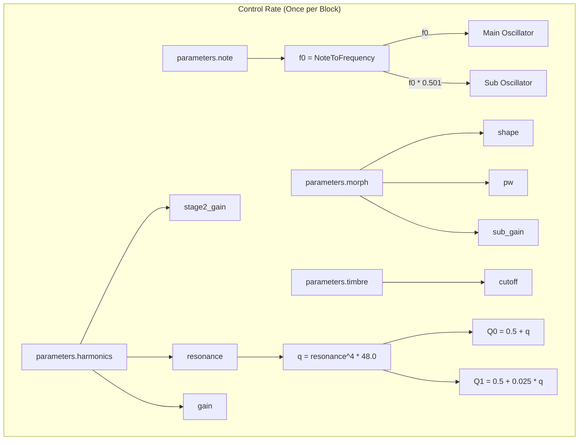
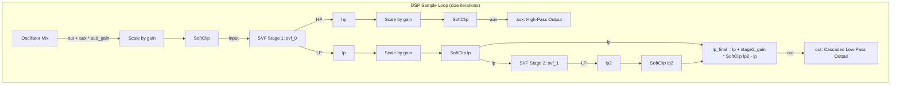

# Virtual Analog VCF Engine

This document covers the DSP analysis of the
[VirtualAnalogVCFEngine](https://github.com/arachnegl/eurorack/blob/master/plaits/dsp/engine2/virtual_analog_vcf_engine.h) class.

---

### Control Rate Flow Diagram



### DSP Loop Flow Diagram



---

### Core DSP & Synthesis Techniques

The `VirtualAnalogVCFEngine` implements a classic virtual analog voice architecture consisting of a morphable main oscillator, a square sub-oscillator, and a multi-stage voltage-controlled filter (VCF). It utilizes zero-delay feedback state variable filters (SVFs) and soft-clipping saturation to emulate vintage analog circuitry.

#### 1. Variable Shape & Sub Oscillator
The engine relies on two `VariableShapeOscillator` instances:
* **Main Oscillator (`oscillator_`):** Generates a band-limited waveform morphing between a sawtooth and a square/pulse wave, determined by the `shape` parameter.
  * When `parameters.morph` scales, the target oscillator shape changes:
    $$\text{shape} = \text{Constrain}\left(2 \cdot (\text{morph} - 0.25) + 0.5, 0.5, 1.0\right)$$
  * Since $\text{shape} \ge 0.5$, the oscillator remains in the saw-to-pulse range:
    $$\text{triangle\_amount} = 0.0$$
    $$\text{square\_amount} = 2 \cdot (\text{shape} - 0.5)$$
    $$\text{saw\_amount} = 1.0 - \text{square\_amount}$$
  * The pulse width ($\text{pw}$) of the square component is driven by `morph`:
    $$\text{pw} = \begin{cases}
    2 \cdot (\text{morph} - 0.5) + 0.5 & \text{morph} \le 0.75 \\
    2.5 - 2 \cdot \text{morph} & \text{morph} > 0.75
    \end{cases}$$
    $$\text{pw} \leftarrow \text{Constrain}(\text{pw}, 0.5, 0.98)$$
* **Sub-Oscillator (`sub_oscillator_`):** Generates a square wave (waveshape = $1.0$, pw = $0.5$) running at approximately one octave below the main oscillator:
  $$f_{\text{sub}} = 0.501 \cdot f_0$$
  The slight offset ($0.501$ instead of $0.5$) introduces a slow, organic phase beating between the main and sub-oscillators, preventing static phase cancellation and adding analog character.
* **Sub-Oscillator Volume:** Sub-bass is blended into the signal at the extremes of the morph control:
  $$\text{sub\_gain} = 5.0 \cdot \max(|\text{morph} - 0.5| - 0.3, 0.0)$$
  This means the sub-oscillator is silent when `morph` is in the range $[0.2, 0.8]$, and reaches full amplitude at `morph` = $0.0$ or $1.0$.

#### 2. Zero-Delay Feedback (ZDF) State Variable Filter (SVF)
The engine shapes the combined oscillator signals using two State Variable Filters (`stmlib::Svf`). The filters are implemented using a trapezoidal integration scheme to eliminate the artificial one-sample delay in digital feedback loops.

For a normalized cutoff frequency $f_c \in (0, 0.5)$ and resonance quality factor $Q$, the filter coefficients are:
$$g = \tan(\pi f_c)$$
$$r = \frac{1}{Q}$$
$$h = \frac{1}{1 + r \cdot g + g^2}$$

To avoid evaluating the computationally heavy `tanf` function at sample-rate, the engine sets coefficients using `FREQUENCY_FAST` which relies on a fast rational approximation of the tangent function.

The internal states of the two integrators ($s_1$, $s_2$) are updated per sample. The intermediate high-pass ($hp$), band-pass ($bp$), and low-pass ($lp$) outputs are calculated as:
$$hp[n] = \left(x[n] - (r + g) s_1[n-1] - s_2[n-1]\right) \cdot h$$
$$bp[n] = g \cdot hp[n] + s_1[n-1]$$
$$lp[n] = g \cdot bp[n] + s_2[n-1]$$

After computing the outputs, the integrator states are updated for the next iteration:
$$s_1[n] = 2 \cdot g \cdot hp[n] + s_1[n-1]$$
$$s_2[n] = 2 \cdot g \cdot bp[n] + s_2[n-1]$$

#### 3. Cascaded Filter & Slope Morphing
The filter network cascades two 2-pole SVFs to achieve a morphable slope between a 2-pole ($12\text{ dB/octave}$) and 4-pole ($24\text{ dB/octave}$) low-pass filter:
1. The primary filter (`svf_[0]`) has a highly-resonant quality factor $Q_0 = 0.5 + q$.
2. The secondary filter (`svf_[1]`) has a highly-damped quality factor $Q_1 = 0.5 + 0.025 \cdot q$. Tuning the second stage to a low resonance prevents the cascaded structure from generating harsh double-resonance peaks.
3. The overall low-pass output is computed by interpolating between the first-stage output ($lp_1$) and the second-stage output ($lp_2$):
   $$lp_{\text{final}} = lp_1 + \text{stage2\_gain} \cdot \left(\text{SoftClip}(lp_2) - lp_1\right)$$
   Where `stage2_gain` is scaled by the `harmonics` parameter:
   $$\text{stage2\_gain} = \text{Constrain}\left(1.0 - (\text{harmonics} - 0.4) \cdot 4.0, 0.0, 1.0\right)$$
   * For $\text{harmonics} \le 0.4$, $\text{stage2\_gain} = 1.0$, resulting in a **4-pole low-pass filter**.
   * For $\text{harmonics} \ge 0.65$, $\text{stage2\_gain} = 0.0$, resulting in a **2-pole low-pass filter**.
   * For $\text{harmonics} \in (0.4, 0.65)$, the filter slope morphs continuously between 12dB/octave and 24dB/octave.

#### 4. Resonance, Drive, and Self-Oscillation
The resonance `resonance` is mapped symmetrically around the center of the `harmonics` parameter:
$$\text{resonance} = 2.667 \cdot \max(|\text{harmonics} - 0.5| - 0.125, 0.0)$$
$$\text{q} = \text{resonance}^4 \cdot 48.0$$

* In the middle region ($\text{harmonics} \in [0.375, 0.625]$), resonance is zero, resulting in clean, non-resonant filtering.
* As `harmonics` approaches $0.0$ or $1.0$, resonance increases exponentially, reaching $q = 48.0$.
* At $q = 48.0$, the first stage Q-factor is $48.5$. With sufficient input drive, the filter goes into self-oscillation, generating a clean, stable sine wave at the cutoff frequency.

To keep the levels balanced, the filter input gain `gain` acts dynamically:
$$\text{gain} = \text{Constrain}(\text{harmonics} - 0.55, 0.7 - 0.3 \cdot \text{resonance}^2, 1.0)$$
As resonance increases to $1.0$, the lower bound of `gain` falls to $0.4$. This lower gain value prevents the self-oscillating peak from dominating or clipping, while keeping the output volume consistent.

#### 5. Distributed Soft-Clipping Saturation
To mimic the warm overdrive characteristics of analog hardware, non-linear soft-clipping (`SoftClip`) is applied at multiple points:
1. **Input Mix:** Saturation is applied to the combined main and sub-oscillators before they reach the filter stage.
   $$\text{input} = \text{SoftClip}((\text{out} + \text{aux} \cdot \text{sub\_gain}) \cdot \text{gain})$$
2. **Inter-Stage Filter:** The output of `svf_[0]` is driven and saturated before entering the second filter stage.
   $$lp_1 \leftarrow \text{SoftClip}(lp_1 \cdot \text{gain})$$
3. **Stage 2 Lowpass & Aux Outputs:** Saturated outputs prevent digital clipping and introduce pleasant odd-harmonic distortion when driven hard.

---

### Code Analysis

#### A. Header Structure & Engine State ([virtual_analog_vcf_engine.h](https://github.com/arachnegl/eurorack/blob/master/plaits/dsp/engine2/virtual_analog_vcf_engine.h))

```cpp
class VirtualAnalogVCFEngine : public Engine {
 private:
  stmlib::Svf svf_[2];
  VariableShapeOscillator oscillator_;
  VariableShapeOscillator sub_oscillator_;
  
  float previous_cutoff_;
  float previous_stage2_gain_;
  float previous_q_;
  float previous_gain_;
  float previous_sub_gain_;
  
  DISALLOW_COPY_AND_ASSIGN(VirtualAnalogVCFEngine);
};
```
* `svf_[2]`: Array containing the two State Variable Filter stages.
* `oscillator_` and `sub_oscillator_`: The primary and sub-octave Virtual Analog oscillators.
* `previous_*`: State variables used to smooth parameter values between render blocks.

---

#### B. Render Loop Breakdown ([virtual_analog_vcf_engine.cc](https://github.com/arachnegl/eurorack/blob/master/plaits/dsp/engine2/virtual_analog_vcf_engine.cc))

##### 1. Parameter Mapping & Oscillator Rendering
```cpp
// 1. Convert base note to frequency
const float f0 = NoteToFrequency(parameters.note);

// 2. Map morph parameter to main oscillator waveshape
float shape = (parameters.morph - 0.25f) * 2.0f + 0.5f;
CONSTRAIN(shape, 0.5f, 1.0f);

// 3. Map morph parameter to main oscillator pulse width
float pw = (parameters.morph - 0.5f) * 2.0f + 0.5f;
if (parameters.morph > 0.75f) {
  pw = 2.5f - parameters.morph * 2.0f;
}
CONSTRAIN(pw, 0.5f, 0.98f);

// 4. Calculate sub-oscillator gain
float sub_gain = max(fabsf(parameters.morph - 0.5f) - 0.3f, 0.0f) * 5.0f;

// 5. Render band-limited main and sub-oscillators
oscillator_.Render(f0, pw, shape, out, size);
sub_oscillator_.Render(f0 * 0.501f, 0.5f, 1.0f, aux, size);
```
* **Notes:**
  * `f0` is the primary pitch frequency.
  * The main oscillator renders directly into `out`, and the sub-oscillator renders into `aux`.
  * The sub-oscillator is detuned by `0.501f` to introduce organic phase beating.

##### 2. Filter Cutoff and Resonance Calculation
```cpp
// 1. Calculate filter cutoff (ranges from -24 to +96 semitones relative to f0)
const float cutoff = f0 * SemitonesToRatio(
    (parameters.timbre - 0.2f) * 120.0f);

// 2. Calculate cascade blending gain
float stage2_gain = 1.0f - (parameters.harmonics - 0.4f) * 4.0f;
CONSTRAIN(stage2_gain, 0.0f, 1.0f);

// 3. Compute filter resonance (symmetrical about harmonics = 0.5)
const float resonance = 2.667f * \
    max(fabsf(parameters.harmonics - 0.5f) - 0.125f, 0.0f);
const float resonance_sqr = resonance * resonance;
const float q = resonance_sqr * resonance_sqr * 48.0f;

// 4. Compute drive gain factor
float gain = (parameters.harmonics - 0.7f) + 0.85f;
CONSTRAIN(gain, 0.7f - resonance_sqr * 0.3f, 1.0f);
```

##### 3. Block Smoothing & Sample-by-Sample Loop
```cpp
// 1. Set up parameter interpolation across the block size
ParameterInterpolator sub_gain_modulation(
    &previous_sub_gain_, sub_gain, size);
ParameterInterpolator cutoff_modulation(
    &previous_cutoff_, cutoff, size);
ParameterInterpolator stage2_gain_modulation(
    &previous_stage2_gain_, stage2_gain, size);
ParameterInterpolator q_modulation(
    &previous_q_, q, size);
ParameterInterpolator gain_modulation(&previous_gain_, gain, size);

// 2. Perform sample processing loop
for (size_t i = 0; i < size; ++i) {
  // Constrain cutoff below Nyquist/2 (0.25) to preserve filter stability
  const float cutoff = min(cutoff_modulation.Next(), 0.25f);
  const float q = q_modulation.Next();
  const float stage2_gain = stage2_gain_modulation.Next();

  // Set filter coefficients using the fast tangent solver
  svf_[0].set_f_q<FREQUENCY_FAST>(cutoff, 0.5f + q);
  svf_[1].set_f_q<FREQUENCY_FAST>(cutoff, 0.5f + 0.025f * q);
  
  const float gain = gain_modulation.Next();
  
  // Mix oscillators, apply drive gain, and soft-clip
  const float input = SoftClip(
      (out[i] + aux[i] * sub_gain_modulation.Next()) * gain);
  
  float lp, hp;
  // Stage 1 filter processing
  svf_[0].Process<FILTER_MODE_LOW_PASS, FILTER_MODE_HIGH_PASS>(
      input, &lp, &hp);

  // Drive and saturate stage 1 Low-Pass output
  lp = SoftClip(lp * gain);
  
  // Cascade into Stage 2 and interpolate based on stage2_gain
  lp += stage2_gain * \
      (SoftClip(svf_[1].Process<FILTER_MODE_LOW_PASS>(lp)) - lp);
  
  // Write final Low-Pass to out, and High-Pass to aux
  out[i] = lp;
  aux[i] = SoftClip(hp * gain);
}
```

---

<!-- KaTeX support for mathematical formulas -->
<link rel="stylesheet" href="https://cdn.jsdelivr.net/npm/katex@0.16.8/dist/katex.min.css">
<script defer src="https://cdn.jsdelivr.net/npm/katex@0.16.8/dist/katex.min.js"></script>
<script defer src="https://cdn.jsdelivr.net/npm/katex@0.16.8/dist/contrib/auto-render.min.js"
        onload="renderMathInElement(document.body, {
          delimiters: [
            {left: '$$', right: '$$', display: true},
            {left: '$', right: '$', display: false}
          ]
        });"></script>

<!-- Mermaid JS support for rendering diagrams with Click-to-Zoom Lightbox -->
<script type="module">
  import mermaid from 'https://cdn.jsdelivr.net/npm/mermaid@10/dist/mermaid.esm.min.mjs';
  mermaid.initialize({ startOnLoad: false });
  
  // Inject lightbox styling
  const style = document.createElement('style');
  style.textContent = `
    .mermaid-lightbox {
      position: fixed;
      top: 0;
      left: 0;
      width: 100vw;
      height: 100vh;
      background: rgba(15, 15, 15, 0.9);
      backdrop-filter: blur(8px);
      -webkit-backdrop-filter: blur(8px);
      display: flex;
      align-items: center;
      justify-content: center;
      z-index: 10000;
      opacity: 0;
      transition: opacity 0.2s ease;
      pointer-events: none;
    }
    .mermaid-lightbox.active {
      opacity: 1;
      pointer-events: auto;
    }
    .mermaid-lightbox svg {
      max-width: 90%;
      max-height: 90%;
      width: auto;
      height: auto;
      background: rgba(255, 255, 255, 0.95);
      padding: 20px;
      border-radius: 8px;
      box-shadow: 0 20px 50px rgba(0, 0, 0, 0.3);
    }
    .mermaid-lightbox .close-btn {
      position: absolute;
      top: 20px;
      right: 30px;
      font-size: 40px;
      color: #fff;
      cursor: pointer;
      user-select: none;
      font-family: sans-serif;
    }
    .mermaid-trigger {
      cursor: zoom-in;
      transition: transform 0.2s ease;
    }
    .mermaid-trigger:hover {
      transform: scale(1.01);
    }
  `;
  document.head.appendChild(style);

  // Inject lightbox modal elements
  const lightbox = document.createElement('div');
  lightbox.className = 'mermaid-lightbox';
  lightbox.innerHTML = '<span class="close-btn">&times;</span><div class="content"></div>';
  document.body.appendChild(lightbox);

  lightbox.addEventListener('click', () => {
    lightbox.classList.remove('active');
  });

  // Convert Mermaid code blocks to styled divs
  const codeBlocks = document.querySelectorAll('.language-mermaid code, pre code.language-mermaid');
  codeBlocks.forEach((block) => {
    const container = block.closest('.language-mermaid') || block.parentElement;
    const el = document.createElement('div');
    el.className = 'mermaid mermaid-trigger';
    el.textContent = block.textContent;
    container.replaceWith(el);
  });
  
  // Render and handle lightbox events
  mermaid.run().then(() => {
    document.querySelectorAll('.mermaid-trigger').forEach((trigger) => {
      trigger.addEventListener('click', () => {
        const content = lightbox.querySelector('.content');
        content.innerHTML = trigger.innerHTML;
        lightbox.classList.add('active');
      });
    });
  });
</script>
