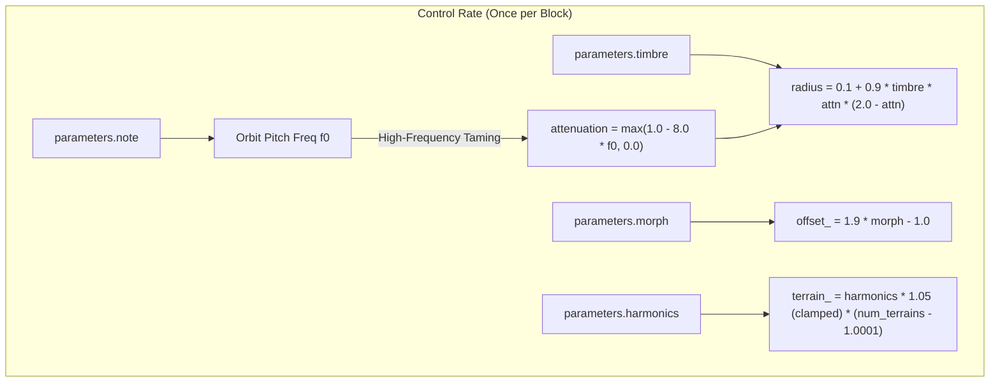
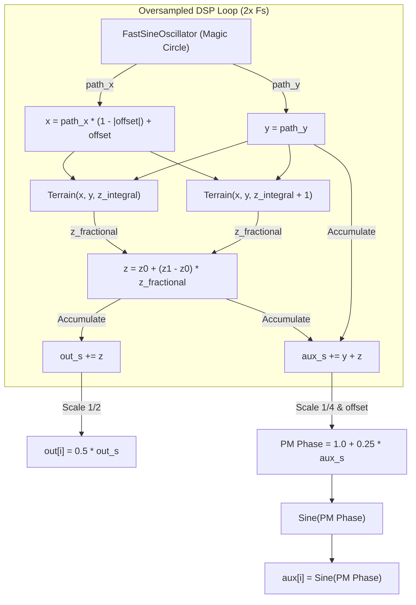

# Wave Terrain Engine

This document covers the DSP analysis of the
[WaveTerrainEngine](https://github.com/arachnegl/eurorack/blob/master/plaits/dsp/engine2/wave_terrain_engine.h) class.

---

### Control Rate Flow Diagram



### DSP Loop Flow Diagram



---

### Core DSP & Synthesis Techniques

#### 1. Wave Terrain Synthesis Concept
Wave Terrain Synthesis is a 2D sound generation method where a 1D output signal is obtained by evaluating a two-variable function $z = f(x, y)$ along a trajectory or orbit $(x(t), y(t))$ over time:
$$s(t) = f(x(t), y(t))$$
The spectrum of the resulting audio depends on:
* The topological features of the 2D surface $f(x, y)$.
* The geometric path, speed, and size of the orbit $(x(t), y(t))$.

#### 2. Quadrature Orbit Generation & Coordinate Scanning
The `WaveTerrainEngine` evaluates the terrain along an elliptical orbit. The trajectory coordinates are generated at 2x oversampling using a `FastSineOscillator` in quadrature mode:
$$\begin{aligned}
x_{\text{orbit}}(t) &= R \cos(\omega t) \\
y_{\text{orbit}}(t) &= R \sin(\omega t)
\end{aligned}$$
where $\omega = \pi f_0$ (scaled by $0.5$ to account for 2x oversampling) and $R$ is the orbit radius.

To navigate the terrain, the coordinates are scaled and shifted:
$$\begin{aligned}
x(t) &= x_{\text{orbit}}(t) \cdot (1 - |x_{\text{offset}}|) + x_{\text{offset}} \\
y(t) &= y_{\text{orbit}}(t)
\end{aligned}$$
The scaling factor $(1 - |x_{\text{offset}}|)$ ensures that the X-coordinate is compressed as it is shifted towards the boundaries, keeping $x(t) \in [-1.0, 1.0]$. The parameter `parameters.morph` controls $x_{\text{offset}} \in [-1.0, +0.9]$, acting as a scan offset.

#### 3. Anti-Aliasing & High-Frequency Taming
Scanning complex mathematical terrains can generate high-frequency components that exceed the Nyquist limit, causing aliasing. To mitigate this:
1. **Oversampling:** The internal DSP loop runs at $2 \times F_s$, and the final output is downsampled using a 2-sample box filter.
2. **Orbit Radius Shrunk at High Frequencies:** As the fundamental pitch $f_0$ rises, the orbit's radius $R$ is dynamically attenuated:
   $$\begin{aligned}
   \text{attenuation} &= \max(1.0 - 8.0 f_0, 0.0) \\
   R &= 0.1 + 0.9 \cdot \text{timbre} \cdot \text{attenuation} \cdot (2.0 - \text{attenuation})
   \end{aligned}$$
   At high pitches, $R$ shrinks to $0.1$. This limits the orbital excursion, scanning only a tiny, nearly-linear region of the terrain, which dampens high-frequency harmonics and prevents aliasing.

#### 4. Analytical Terrain Functions ($T_0$ to $T_4$)
The engine contains 5 analytical surfaces computed on-the-fly:

* **Terrain 0 (Distorted Wave & Cross-Modulated Sine):**
  $$T_0(x, y) = 0.57 \left[ \text{Squash}\left(\sin(8x), 2.0\right) - \sin(4xy + 2\pi y) \right]$$
  where $\text{Squash}(u, a) = \frac{a u}{1 + |a u|}$ represents a soft-clipping function.
* **Terrain 1 (Radial Cross-Modulation):**
  $$T_1(x, y) = \sin\left[ \frac{\sin(4(x + y))}{0.2 + (xy)^2} \right]$$
* **Terrain 2 (High-Frequency Ring Modulation):**
  $$T_2(x, y) = \sin\left[ \frac{\sin(15xy)}{0.35 + (xy)^2} \right]$$
* **Terrain 3 (Soft Hyperbolic Ridge):**
  $$T_3(x, y) = \sin\left[ \frac{40xy}{2.0 + 5.0 |(x - 0.25)(y + 0.25)|} \right]$$
* **Terrain 4 (Dual Lorentzian Peaks):**
  $$T_4(x, y) = \sin\left[ \frac{1}{0.17 + |y - 0.25|} + \frac{3}{0.35 + |(x + 0.5)(y + 1.5)|} \right]$$

*Note: In the C++ code, arguments to the `Sine` helper are offset by $k = 4.0$ to ensure positive inputs, which does not affect the phase since `Sine` wraps every $1.0$ cycle ($2\pi$ radians).*

#### 5. Wavetable Terrain Lookups ($T_5, T_6, T_7$)
Terrains 5, 6, and 7 interpret Plaits' integrated wavetables (`wav_integrated_waves`) as 2D height maps (where bank index represents the Z-axis, wave index represents the X-axis, and wave phase/sample represents the Y-axis):
* The $X$ coordinate maps to the wave index within a bank: $wt = (x + 1.0) \cdot 31.5 \in [0, 63]$.
* The $Y$ coordinate maps to the phase index within the wave: $sample = (y + 1.0) \cdot 64.0 \in [0, 128]$.

Because the wavetables are stored in an integrated format for other engines, this engine differentiates them on-the-fly to retrieve the original waveform shape. Differentiating while performing linear interpolation is achieved via:
$$\text{InterpolateIntegratedWave}(I, n, t) = (I[n+1] - I[n]) + (I[n+2] - 2I[n+1] + I[n]) \cdot t$$
This is scaled by $1/1024$ to map the values to a normal range.

#### 6. User Terrain Lookup ($T_8$)
When a custom 64x64 user terrain buffer `user_terrain_` (signed 8-bit integers) is loaded via `LoadUserData`, it is exposed as Terrain index 8. The engine performs bilinear interpolation over the grid:
$$\begin{aligned}
x_c &= (x + 1.0) \cdot 31.0 \\
y_c &= (y + 1.0) \cdot 31.0
\end{aligned}$$
Values are interpolated using standard linear interpolation (`InterpolateWave`) first along the X-axis for rows $y_c$ and $y_c + 1$, and then along the Y-axis. The output is scaled by $1/128.0$.

#### 7. Phase-Modulated Auxiliary Output
While the main output `out` decimates the terrain height $z$, the auxiliary output `aux` is generated using phase modulation:
$$\text{aux}[i] = \text{Sine}\left(1.0 + 0.25 \sum_{j=0}^{1} (y_{2i+j} + z_{2i+j})\right)$$
This phase-modulates a carrier sine wave with the combination of the orbit's Y coordinate (the fundamental quadrature frequency) and the terrain height $z$ (the harmonics). This yields a complex, waveshaped version of the signal.

---

### Code Analysis

#### A. Header Structure & Engine State ([wave_terrain_engine.h](https://github.com/arachnegl/eurorack/blob/master/plaits/dsp/engine2/wave_terrain_engine.h))
The class `WaveTerrainEngine` contains minimal member variables:
* **`FastSineOscillator path_`**: A coupled-state (Magic Circle) quadrature oscillator that outputs $X$ and $Y$ coordinates for the orbital trajectory.
* **`float offset_`**: State variable tracking the X-axis coordinate shift.
* **`float terrain_`**: State variable tracking the active terrain index.
* **`float* temp_buffer_`**: Allocation for holding oversampled X/Y path coordinates (size: `kMaxBlockSize * 4`).
* **`const int8_t* user_terrain_`**: Pointer to the optional custom 64x64 user terrain buffer.

#### B. Render Loop Breakdown ([wave_terrain_engine.cc](https://github.com/arachnegl/eurorack/blob/master/plaits/dsp/engine2/wave_terrain_engine.cc))

##### Parameter Interpolators & Orbit Setup
At the start of `Render`, the engine calculates parameter scaling and initializes linear interpolators to smooth parameter updates over the block size:
```cpp
const float f0 = NoteToFrequency(parameters.note);
const float attenuation = max(1.0f - 8.0f * f0, 0.0f);
const float radius = 0.1f + 0.9f * parameters.timbre * attenuation * \
    (2.0f - attenuation);

// Generates sin and cos coordinates into path_x and path_y buffers at 2x oversampling.
path_.RenderQuadrature(
    f0 * kScale, radius, path_x, path_y, size * kOversampling);

ParameterInterpolator offset(&offset_, 1.9f * parameters.morph - 1.0f, size);
int num_terrains = user_terrain_ ? 9 : 8;
ParameterInterpolator terrain(
    &terrain_,
    min(parameters.harmonics * 1.05f, 1.0f) * float(num_terrains - 1.0001f),
    size);
```

##### Oversampled Processing Loop
The main loop steps through the output block, evaluating 2 oversampled points for each output sample:
```cpp
size_t ij = 0;
for (size_t i = 0; i < size; ++i) {
  const float x_offset = offset.Next();
  
  const float z = terrain.Next();
  MAKE_INTEGRAL_FRACTIONAL(z);

  float out_s = 0.0f;
  float aux_s = 0.0f;
  
  for (size_t j = 0; j < kOversampling; ++j) {
    const float x = path_x[ij] * (1.0f - fabsf(x_offset)) + x_offset;
    const float y = path_y[ij];
    ++ij;
    
    // Linearly interpolate between the two closest terrains
    const float z0 = Terrain(x, y, z_integral);
    const float z1 = Terrain(x, y, z_integral + 1);
    const float z = (z0 + (z1 - z0) * z_fractional);
    
    out_s += z;
    aux_s += y + z;
  }
  // Decimation and Output assignment
  out[i] = kScale * out_s;
  aux[i] = Sine(1.0f + 0.5f * kScale * aux_s);
}
```

##### On-The-Fly Wavetable Differentiation
`TerrainLookupWT` extracts samples from the integrated wavetable and differentiates them:
```cpp
template<typename T>
inline float InterpolateIntegratedWave(
    const T* table,
    int32_t index_integral,
    float index_fractional) {
  float a = static_cast<float>(table[index_integral]);
  float b = static_cast<float>(table[index_integral + 1]);
  float c = static_cast<float>(table[index_integral + 2]);
  float t = index_fractional;
  return (b - a) + (c - b - b + a) * t;
}
```
This recovers the original slope (waveform value) from the integrated table by taking the difference between consecutive points and interpolating between them.

---

<!-- KaTeX support for mathematical formulas -->
<link rel="stylesheet" href="https://cdn.jsdelivr.net/npm/katex@0.16.8/dist/katex.min.css">
<script defer src="https://cdn.jsdelivr.net/npm/katex@0.16.8/dist/katex.min.js"></script>
<script defer src="https://cdn.jsdelivr.net/npm/katex@0.16.8/dist/contrib/auto-render.min.js"
        onload="renderMathInElement(document.body, {
          delimiters: [
            {left: '$$', right: '$$', display: true},
            {left: '$', right: '$', display: false}
          ]
        });"></script>

<!-- Mermaid JS support for rendering diagrams with Click-to-Zoom Lightbox -->
<script type="module">
  import mermaid from 'https://cdn.jsdelivr.net/npm/mermaid@10/dist/mermaid.esm.min.mjs';
  mermaid.initialize({ startOnLoad: false });
  
  // Inject lightbox styling
  const style = document.createElement('style');
  style.textContent = `
    .mermaid-lightbox {
      position: fixed;
      top: 0;
      left: 0;
      width: 100vw;
      height: 100vh;
      background: rgba(15, 15, 15, 0.9);
      backdrop-filter: blur(8px);
      -webkit-backdrop-filter: blur(8px);
      display: flex;
      align-items: center;
      justify-content: center;
      z-index: 10000;
      opacity: 0;
      transition: opacity 0.2s ease;
      pointer-events: none;
    }
    .mermaid-lightbox.active {
      opacity: 1;
      pointer-events: auto;
    }
    .mermaid-lightbox svg {
      max-width: 90%;
      max-height: 90%;
      width: auto;
      height: auto;
      background: rgba(255, 255, 255, 0.95);
      padding: 20px;
      border-radius: 8px;
      box-shadow: 0 20px 50px rgba(0, 0, 0, 0.3);
    }
    .mermaid-lightbox .close-btn {
      position: absolute;
      top: 20px;
      right: 30px;
      font-size: 40px;
      color: #fff;
      cursor: pointer;
      user-select: none;
      font-family: sans-serif;
    }
    .mermaid-trigger {
      cursor: zoom-in;
      transition: transform 0.2s ease;
    }
    .mermaid-trigger:hover {
      transform: scale(1.01);
    }
  `;
  document.head.appendChild(style);

  // Inject lightbox modal elements
  const lightbox = document.createElement('div');
  lightbox.className = 'mermaid-lightbox';
  lightbox.innerHTML = '<span class="close-btn">&times;</span><div class="content"></div>';
  document.body.appendChild(lightbox);

  lightbox.addEventListener('click', () => {
    lightbox.classList.remove('active');
  });

  // Convert Mermaid code blocks to styled divs
  const codeBlocks = document.querySelectorAll('.language-mermaid code, pre code.language-mermaid');
  codeBlocks.forEach((block) => {
    const container = block.closest('.language-mermaid') || block.parentElement;
    const el = document.createElement('div');
    el.className = 'mermaid mermaid-trigger';
    el.textContent = block.textContent;
    container.replaceWith(el);
  });
  
  // Render and handle lightbox events
  mermaid.run().then(() => {
    document.querySelectorAll('.mermaid-trigger').forEach((trigger) => {
      trigger.addEventListener('click', () => {
        const content = lightbox.querySelector('.content');
        content.innerHTML = trigger.innerHTML;
        lightbox.classList.add('active');
      });
    });
  });
</script>
