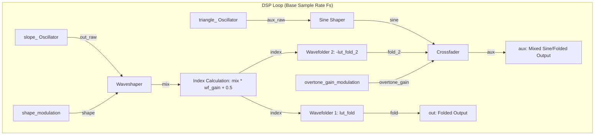

# Waveshaping Engine

This document covers the DSP analysis of the
[WaveshapingEngine](https://github.com/arachnegl/eurorack/blob/master/plaits/dsp/engine/waveshaping_engine.h) class.

---

### Control Rate Flow Diagram

```mermaid
graph TD
    subgraph control_rate ["Control Rate (Once per Block)"]
        Note[parameters.note] --> F0[f0 = NoteToFrequency]
        Morph[parameters.morph] --> PW[pw = morph * 0.45 + 0.5]
        Morph --> Slope[slope = 3.0 + 5.0 * |morph - 0.5|]
        
        %% Bandwidth limitation / Taming %%
        F0 & Slope --> Tame_Shape[shape_amount_attenuation = Tame]
        Harmonics[parameters.harmonics] --> ShapeAmt[shape_amount = 2.0 * |harmonics - 0.5|]
        
        %% Shape modulation target %%
        Harmonics & Tame_Shape --> ShapeMod[shape_target = 0.5 + harmonics-0.5 * shape_amount_attenuation]
        
        %% Folder gain taming %%
        F0 & Slope & ShapeAmt & Tame_Shape --> Tame_Folder[wavefolder_gain_attenuation = Tame]
        Timbre[parameters.timbre] --> WF_Gain_Target[wf_gain_target = 0.03 + 0.46 * timbre * wavefolder_gain_attenuation]
        
        %% Overtone mix %%
        Timbre --> Overtone[overtone_gain_target = 1 - 1-timbre^4]
    end
```

### DSP Loop Flow Diagram



---

### Core DSP & Synthesis Techniques

The `WaveshapingEngine` implements a classic west-coast synthesis voice consisting of a morphable slope generator (asymmetric triangle oscillator) routed through a multi-stage **waveshaper** and a dual-channel **wavefolder**. Unlike standard digital waveshapers that rely on heavy oversampling, `WaveshapingEngine` operates at the native sample rate $F_s$, utilizing a unique **dynamic bandwidth-limiting tamer** (`Tame`) to prevent aliasing.

#### 1. Morphable Slope Generator & Phase-Shifted Sine

The synthesis starts with two bandlimited oscillators using the `Oscillator` helper class:
* **Primary Path (`out`)**: Renders a slope wave (`OSCILLATOR_SHAPE_SLOPE`) with a fundamental frequency $f_0$ and pulse width $\text{pw}$ controlled by `parameters.morph`:
  $$\text{pw} = 0.45 \cdot \text{morph} + 0.5$$
  This sweeps the waveform from a symmetric triangle wave ($\text{pw} = 0.5$) to a highly asymmetric ramp wave ($\text{pw} = 0.95$). Asymmetry introduces even harmonics into the raw source.
* **Auxiliary Path (`aux`)**: Renders a perfectly symmetric triangle wave ($\text{pw} = 0.5$) at $f_0$. This triangle wave is subsequently shaped into a smooth sine wave:
  $$S(t) = -\sin\left(\frac{\pi}{2} T(t)\right)$$
  where $T(t) \in [-1, 1]$ is the triangle wave.

Both oscillators utilize integrated PolyBLEP (Band-Limited Step) methods to round off the sharp corners of the triangle/slope shapes, ensuring the raw source signals contain no aliasing before non-linear processing.

#### 2. Dynamic Bandwidth Taming (Anti-Aliasing)

Non-linear waveshaping and wavefolding generate infinite high-frequency sidebands. To avoid digital folding (aliasing) at the Nyquist frequency without using CPU-intensive oversampling, the engine dynamically attenuates the waveshaping depth and wavefolding gain using a custom `Tame` function:

$$\text{Tame}(f_0, h, O) = \left[\text{clamp}\left(1 - \frac{f_0 \cdot h - f_{max}}{0.5 - f_{max}}, 0, 1\right)\right]^3$$

Where:
* $f_0$ is the fundamental frequency normalized to the sample rate ($f_0 = \frac{f_{\text{fund}}}{F_s}$).
* $h$ is an estimate of the spectral richness (harmonics multiplier).
* $O$ is the target harmonic order to protect ($16.0$ for waveshaping, $12.0$ for wavefolding).
* $f_{max} = \frac{0.5}{O}$ is the maximum fundamental frequency before the $O$-th harmonic exceeds Nyquist ($0.5$).

The function returns a gain reduction factor in $[0.0, 1.0]$. When $f_0 \cdot h \le f_{max}$, no taming is needed (returns $1.0$). When $f_0 \cdot h \ge 0.5$ (Nyquist), the parameter is fully attenuated to $0.0$ to prevent any aliasing. The cubic curve smooths out the attenuation profile.

* **Waveshaper Taming**:
  The harmonics multiplier is $\text{slope} = 3.0 + 5.0 \cdot |\text{morph} - 0.5|$, ranging from $3.0$ (symmetric triangle) to $5.5$ (asymmetric ramp). The waveshaping depth is attenuated via:
  $$A_{\text{shape}} = \text{Tame}(f_0, \text{slope}, 16.0)$$
* **Wavefolder Taming**:
  The folder gain is attenuated using an expanded spectral richness estimate that accounts for the harmonics added by the waveshaper:
  $$h_{\text{folder}} = \text{slope} \cdot (3.0 + 5.0 \cdot \text{shape\_amount} \cdot A_{\text{shape}})$$
  $$A_{\text{folder}} = \text{Tame}(f_0, h_{\text{folder}}, 12.0)$$

This feedback-free feedforward bandwidth estimator makes the synth extremely bright at low pitches while automatically smoothing into clean, alias-free sine/triangle waves at higher pitches.

#### 3. Waveshaping (Five-Table Interpolation)

The waveshaper maps the slope signal $x \in [-1, 1]$ to a shaped signal $x_{\text{shaped}}$ by interpolating between five distinct 16-bit shaper tables stored in the lookup array `lookup_table_i16_table`:
1. `lut_ws_inverse_tan` (Index 0): Inverse tangent saturation.
2. `lut_ws_inverse_sin` (Index 1): Inverse sine saturation.
3. `lut_ws_linear` (Index 2): Identity pass-through.
4. `lut_ws_bump` (Index 3): Single fold / bump.
5. `lut_ws_double_bump` (Index 4, 5): Double fold / bump.

The interpolation target $\text{shape}$ is swept by the `harmonics` parameter:
$$\text{shape} = [0.5 + (\text{harmonics} - 0.5) \cdot A_{\text{shape}}] \cdot 3.9999$$
Let $S_{int} = \lfloor \text{shape} \rfloor$ and $S_{frac} = \text{shape} - S_{int}$. The engine selects shaper tables $T_1 = \text{lookup\_table\_i16\_table}[S_{int}]$ and $T_2 = \text{lookup\_table\_i16\_table}[S_{int}+1]$.
The input index $I_x = 127.0 \cdot x + 128.0$ is mapped to $[1.0, 255.0]$ (with safety mask `& 255`). The fractional part is used to linearly interpolate within both tables, and $S_{frac}$ crossfades between the two tables:
$$\text{mix} = \text{LinearInterpolate}(T_1, I_x) \cdot (1 - S_{frac}) + \text{LinearInterpolate}(T_2, I_x) \cdot S_{frac}$$

#### 4. Wavefolding & Diode Clipping Simulation (Hermite Cubic Interpolation)

The wavefolder drives the shaped output $\text{mix}$ through two independent folder curves using Hermite cubic interpolation to avoid the high-frequency clicking of linear lookup tables.
$$\text{index} = \text{mix} \cdot g_{\text{folder}} + 0.5$$
where the folder gain $g_{\text{folder}} = 0.03 + 0.46 \cdot \text{timbre} \cdot A_{\text{folder}}$.
* **First Wavefolder (`fold`)**: Interpolates from `lut_fold` + 1.
* **Second Wavefolder (`fold_2`)**: Interpolates from `lut_fold_2` + 1 and negates the result.

The tables represent diode clipping networks that fold the waveform back on itself when it exceeds the clipping threshold, generating rich, metallic spectra.

#### 5. Auxiliary Path Crossfader

The auxiliary output crossfades between the clean shaped sine wave $S(t)$ and the negated second wavefolder output $\text{fold}_2(t)$:
$$\text{aux}(t) = S(t) + (\text{fold}_2(t) - S(t)) \cdot G(\text{timbre})$$
The crossfade gain $G(\text{timbre})$ uses a bowed 4th-order response:
$$G(T) = 1 - (1 - T)^4$$
This allows the auxiliary channel to gain high-frequency harmonics rapidly early in the range of the `timbre` knob, while the main channel `out` folders scale more gradually.

---

### Code Analysis

#### A. Header Structure & Engine State ([waveshaping_engine.h](https://github.com/arachnegl/eurorack/blob/master/plaits/dsp/engine/waveshaping_engine.h))

The engine maintains a minimal footprint, utilizing two oscillators and smoothing variables:
* **Oscillators**:
  - `slope_`: The primary morphable slope oscillator.
  - `triangle_`: The auxiliary symmetric triangle oscillator.
* **Smoothing State Variables**:
  - `previous_shape_`: Remembers the waveshaper blending parameter for control-rate smoothing.
  - `previous_wavefolder_gain_`: Remembers the wavefolder index scaling factor.
  - `previous_overtone_gain_`: Remembers the aux path crossfade index.

#### B. Render Loop Breakdown ([waveshaping_engine.cc](https://github.com/arachnegl/eurorack/blob/master/plaits/dsp/engine/waveshaping_engine.cc))

Let's walk through the core steps of the `Render` function:

##### 1. Parameter Mapping & Source Oscillations
The pitch is translated to a fundamental frequency $f_0$. The `morph` parameter scales the pulse width `pw` of the primary slope generator.
```cpp
const float root = parameters.note;
const float f0 = NoteToFrequency(root);
const float pw = parameters.morph * 0.45f + 0.5f;

// Start from bandlimited slope signal.
slope_.Render<OSCILLATOR_SHAPE_SLOPE>(f0, pw, out, size);
triangle_.Render<OSCILLATOR_SHAPE_SLOPE>(f0, 0.5f, aux, size);
```

##### 2. Bandwidth Attenuation Calculations
The engine estimates the spectral centroid (`slope`) and waveshape richness (`shape_amount`), then computes the anti-aliasing attenuation factors using `Tame`.
```cpp
const float slope = 3.0f + fabsf(parameters.morph - 0.5f) * 5.0f;
const float shape_amount = fabsf(parameters.harmonics - 0.5f) * 2.0f;
const float shape_amount_attenuation = Tame(f0, slope, 16.0f);
const float wavefolder_gain = parameters.timbre;
const float wavefolder_gain_attenuation = Tame(
    f0,
    slope * (3.0f + shape_amount * shape_amount_attenuation * 5.0f),
    12.0f);
```

##### 3. Parameter Interpolators
To prevent clicking, the control parameters are smoothed across the buffer block using first-order linear `ParameterInterpolator`s.
```cpp
ParameterInterpolator shape_modulation(
    &previous_shape_,
    0.5f + (parameters.harmonics - 0.5f) * shape_amount_attenuation,
    size);
ParameterInterpolator wf_gain_modulation(
    &previous_wavefolder_gain_,
    0.03f + 0.46f * wavefolder_gain * wavefolder_gain_attenuation,
    size);
const float overtone_gain = parameters.timbre * (2.0f - parameters.timbre);
ParameterInterpolator overtone_gain_modulation(
    &previous_overtone_gain_,
    overtone_gain * (2.0f - overtone_gain),
    size);
```

##### 4. DSP Render Loop
The render loop processes the audio samples one-by-one at the base sample rate $F_s$:
```cpp
for (size_t i = 0; i < size; ++i) {
  // Waveshaper blend index
  float shape = shape_modulation.Next() * 3.9999f;
  MAKE_INTEGRAL_FRACTIONAL(shape);
  
  const int16_t* shape_1 = lookup_table_i16_table[shape_integral];
  const int16_t* shape_2 = lookup_table_i16_table[shape_integral + 1];
  
  // Lookup index for the input signal
  float ws_index = 127.0f * out[i] + 128.0f;
  MAKE_INTEGRAL_FRACTIONAL(ws_index)
  ws_index_integral &= 255;
  
  // Interpolate inside shaper table 1
  float x0 = static_cast<float>(shape_1[ws_index_integral]) / 32768.0f;
  float x1 = static_cast<float>(shape_1[ws_index_integral + 1]) / 32768.0f;
  float x = x0 + (x1 - x0) * ws_index_fractional;

  // Interpolate inside shaper table 2
  float y0 = static_cast<float>(shape_2[ws_index_integral]) / 32768.0f;
  float y1 = static_cast<float>(shape_2[ws_index_integral + 1]) / 32768.0f;
  float y = y0 + (y1 - y0) * ws_index_fractional;
  
  // Crossfade between shapers
  float mix = x + (y - x) * shape_fractional;
  
  // Wavefolding gain scaling
  float index = mix * wf_gain_modulation.Next() + 0.5f;
  
  // Hermite interpolation for wavefolders
  float fold = InterpolateHermite(lut_fold + 1, index, 512.0f);
  float fold_2 = -InterpolateHermite(lut_fold_2 + 1, index, 512.0f);
  
  // Convert aux triangle wave to clean sine wave
  float sine = Sine(aux[i] * 0.25f + 0.5f);
  
  // Write outputs
  out[i] = fold;
  aux[i] = sine + (fold_2 - sine) * overtone_gain_modulation.Next();
}
```

---

<!-- KaTeX support for mathematical formulas -->
<link rel="stylesheet" href="https://cdn.jsdelivr.net/npm/katex@0.16.8/dist/katex.min.css">
<script defer src="https://cdn.jsdelivr.net/npm/katex@0.16.8/dist/katex.min.js"></script>
<script defer src="https://cdn.jsdelivr.net/npm/katex@0.16.8/dist/contrib/auto-render.min.js"
        onload="renderMathInElement(document.body, {
          delimiters: [
            {left: '$$', right: '$$', display: true},
            {left: '$', right: '$', display: false}
          ]
        });"></script>

<!-- Mermaid JS support for rendering diagrams with Click-to-Zoom Lightbox -->
<script type="module">
  import mermaid from 'https://cdn.jsdelivr.net/npm/mermaid@10/dist/mermaid.esm.min.mjs';
  mermaid.initialize({ startOnLoad: false });
  
  // Inject lightbox styling
  const style = document.createElement('style');
  style.textContent = `
    .mermaid-lightbox {
      position: fixed;
      top: 0;
      left: 0;
      width: 100vw;
      height: 100vh;
      background: rgba(15, 15, 15, 0.9);
      backdrop-filter: blur(8px);
      -webkit-backdrop-filter: blur(8px);
      display: flex;
      align-items: center;
      justify-content: center;
      z-index: 10000;
      opacity: 0;
      transition: opacity 0.2s ease;
      pointer-events: none;
    }
    .mermaid-lightbox.active {
      opacity: 1;
      pointer-events: auto;
    }
    .mermaid-lightbox svg {
      max-width: 90%;
      max-height: 90%;
      width: auto;
      height: auto;
      background: rgba(255, 255, 255, 0.95);
      padding: 20px;
      border-radius: 8px;
      box-shadow: 0 20px 50px rgba(0, 0, 0, 0.3);
    }
    .mermaid-lightbox .close-btn {
      position: absolute;
      top: 20px;
      right: 30px;
      font-size: 40px;
      color: #fff;
      cursor: pointer;
      user-select: none;
      font-family: sans-serif;
    }
    .mermaid-trigger {
      cursor: zoom-in;
      transition: transform 0.2s ease;
    }
    .mermaid-trigger:hover {
      transform: scale(1.01);
    }
  `;
  document.head.appendChild(style);

  // Inject lightbox modal elements
  const lightbox = document.createElement('div');
  lightbox.className = 'mermaid-lightbox';
  lightbox.innerHTML = '<span class="close-btn">&times;</span><div class="content"></div>';
  document.body.appendChild(lightbox);

  lightbox.addEventListener('click', () => {
    lightbox.classList.remove('active');
  });

  // Convert Mermaid code blocks to styled divs
  const codeBlocks = document.querySelectorAll('.language-mermaid code, pre code.language-mermaid');
  codeBlocks.forEach((block) => {
    const container = block.closest('.language-mermaid') || block.parentElement;
    const el = document.createElement('div');
    el.className = 'mermaid mermaid-trigger';
    el.textContent = block.textContent;
    container.replaceWith(el);
  });
  
  // Render and handle lightbox events
  mermaid.run().then(() => {
    document.querySelectorAll('.mermaid-trigger').forEach((trigger) => {
      trigger.addEventListener('click', () => {
        const content = lightbox.querySelector('.content');
        content.innerHTML = trigger.innerHTML;
        lightbox.classList.add('active');
      });
    });
  });
</script>
