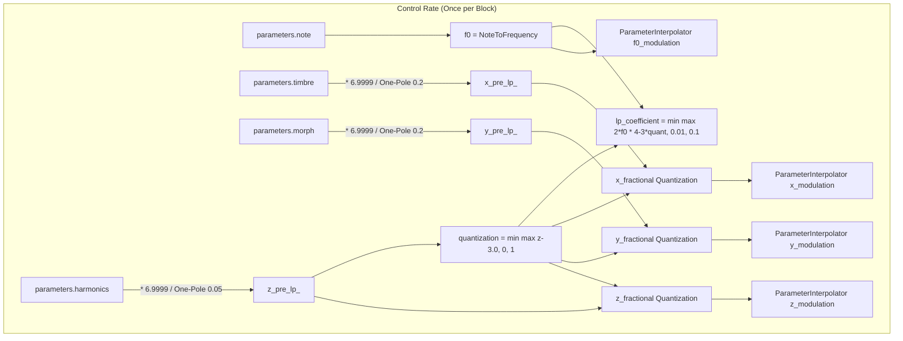

# Wavetable Engine

This document covers the DSP analysis of the
[WavetableEngine](https://github.com/arachnegl/eurorack/blob/master/plaits/dsp/engine/wavetable_engine.h) class.

---

### Control Rate Flow Diagram



---

### DSP Loop Flow Diagram

```mermaid
graph TD
    subgraph dsp_loop ["DSP Sample Loop (Once per sample)"]
        f0_Val[f0_modulation.Next]
        X_Val[x_modulation.Next]
        Y_Val[y_modulation.Next]
        Z_Val[z_modulation.Next]
        
        X_Val --> X_Filter[ONE_POLE x_lp_]
        Y_Val --> Y_Filter[ONE_POLE y_lp_]
        Z_Val --> Z_Filter[ONE_POLE z_lp_]
        
        X_Filter --> Split_XYZ[Split into Integral / Fractional]
        Y_Filter --> Split_XYZ
        Z_Filter --> Split_XYZ
        
        f0_Val --> Phase_Acc[phase_ += f0]
        Phase_Acc --> Split_Phase[Split phase*128 into p_integral / p_fractional]
        
        Split_XYZ --> Mirror_Z[Symmetric Z-Fold: z = 7 - z if >= 4]
        
        Mirror_Z & Split_Phase & Split_XYZ --> Read_Corners[Read 8 Corner Waves via Hermite Interpolation]
        
        Read_Corners --> Interp_X[Interpolate 4 pairs along X]
        Interp_X --> Interp_Y[Interpolate 2 pairs along Y]
        Interp_Y --> Interp_Z[Interpolate 1 pair along Z]
        
        Interp_Z --> Mix_Raw[Raw Mix]
        
        f0_Val --> Calc_Filters[Calculate Cutoff & Gain]
        
        Mix_Raw & Calc_Filters --> Diff[Differentiator]
        Diff --> Scale_Gain[Scale by Gain]
        Scale_Gain --> Main_Out[out: Main Output]
        Scale_Gain --> Crush[5-bit Amplitude Quantizer]
        Crush --> Aux_Out[aux: Lo-Fi Output]
    end
```



---

### Core DSP & Synthesis Techniques

#### 1. 3D Wave Terrain Interpolation
The `WavetableEngine` scans a 3D grid consisting of 4 banks of 64 waveforms each, structured as an $8 \times 8 \times 4$ wave terrain:
* **X-axis (Timbre):** Scans the columns of the $8 \times 8$ grid.
* **Y-axis (Morph):** Scans the rows of the $8 \times 8$ grid.
* **Z-axis (Harmonics):** Selects and interpolates between banks.

To calculate the waveform value at coordinate $(x, y, z)$ and phase $\phi$:
1. **Phase Hermite Interpolation:** For each of the 8 grid corners surrounding $(x, y, z)$, the sample is read from the integrated wavetable using cubic Hermite interpolation in the time domain:
   $$x_{p} = (((a \cdot f) - b_{\text{neg}}) \cdot f + c) \cdot f + x_0$$
   where $f$ is the fractional phase, and $x_{-1}, x_0, x_1, x_2$ are consecutive wavetable samples.
2. **Spatial Trilinear Interpolation:**
   * **X-axis Interpolation:**
     $$xy_0z_0 = x_{0y0z0} + (x_{1y0z0} - x_{0y0z0}) \cdot x_{\text{fractional}}$$
     $$xy_1z_0 = x_{0y1z0} + (x_{1y1z0} - x_{0y1z0}) \cdot x_{\text{fractional}}$$
     $$xy_0z_1 = x_{0y0z1} + (x_{1y0z1} - x_{0y0z1}) \cdot x_{\text{fractional}}$$
     $$xy_1z_1 = x_{0y1z1} + (x_{1y1z1} - x_{0y1z1}) \cdot x_{\text{fractional}}$$
   * **Y-axis Interpolation:**
     $$xyz_0 = xy_0z_0 + (xy_1z_0 - xy_0z_0) \cdot y_{\text{fractional}}$$
     $$xyz_1 = xy_0z_1 + (xy_1z_1 - xy_0z_1) \cdot y_{\text{fractional}}$$
   * **Z-axis Interpolation:**
     $$\text{mix}_{\text{raw}} = xyz_0 + (xyz_1 - xyz_0) \cdot z_{\text{fractional}}$$

#### 2. Symmetric Z-Axis Traversal
Rather than a simple linear sweep that stops at the end of the wavetable banks, the $Z$ coordinate wraps back on itself to create a continuous, smooth round trip.
For $z \in [0, 6.9999]$, the integral index $z\_integral \in \{0, \dots, 6\}$ maps to bank indices $z_0$ and $z_1$:
* **If $z\_integral < 4$:**
  $$z_0 = z\_integral$$
  $$z_1 = z\_integral + 1$$
* **If $z\_integral \ge 4$:**
  $$z_0 = 7 - z\_integral$$
  $$z_1 = 7 - (z\_integral + 1)$$
This folds the Z-axis scanning path symmetrically:
$$\text{Bank } 0 \to 1 \to 2 \to 3 \to 3 \to 2 \to 1 \to 0$$
This layout spans the three built-in wavetable banks (Banks 0, 1, 2) and the user-customizable bank (Bank 3).

#### 3. Dynamic Coordinate Quantization
In the second half of the Z-axis sweep ($Z > 3.0$), coordinate quantization is gradually activated:
$$\text{quantization} = \min(\max(z - 3.0, 0.0), 1.0)$$
When active, the fractional parts of the spatial coordinates are run through a steep step-clamping function:
$$f_{\text{clamp}}(a) = \text{constrain}\left(16(a - 0.5), -0.5, 0.5\right) + 0.5$$
The fractional coordinates are then updated:
$$a_{\text{fractional}} \leftarrow a_{\text{fractional}} + \text{quantization} \cdot \left(f_{\text{clamp}}(a_{\text{fractional}}) - a_{\text{fractional}}\right)$$
For $\text{quantization} = 1.0$, this restricts the fractional coordinate to the narrow transition range $[0.46875, 0.53125]$. Inside this range, the transition is linear and very steep (slope of 16); outside it, the fractional coordinate is rounded to either $0.0$ or $1.0$. This creates a stepping/quantized effect where the engine jumps discretely between adjacent waveforms.

To prevent clicks during these sharp steps, the coordinate smoothing filter's cutoff is adjusted based on the quantization level and the pitch $f_0$:
$$\text{lp\_coefficient} = \min\left(\max\left(2 f_0 (4 - 3 \times \text{quantization}), 0.01\right), 0.1\right)$$
* Without quantization ($\text{quantization} = 0$), the coefficient is higher (up to $8 f_0$, capped at 0.1), allowing fast tracking of cv/knob movements.
* With quantization ($\text{quantization} = 1$), the coefficient is reduced to $2 f_0$ (capped at 0.1), which applies a slower, pitch-synchronous low-pass filter to the coordinates to smooth out the transition clicks.

#### 4. Band-Limiting via Differentiated Integrated Wavetables
Instead of storing multiple mip-mapped wavetables at different resolutions, `WavetableEngine` stores a single high-resolution integrated wavetable.
If $x(t)$ is the desired waveform, the table stores $y(t) = \int x(t) dt$.
When reading the table, we apply a differentiator to get:
$$\frac{dy}{dt} \approx y(n) - y(n-1) = x(n)$$
To dynamically band-limit the signal, a one-pole low-pass filter is combined with the differentiator:
$$H(z) = \alpha \frac{1 - z^{-1}}{1 - (1-\alpha)z^{-1}}$$
where the coefficient $\alpha$ tracks the pitch $f_0$:
$$\alpha = \text{cutoff} = \min(128 f_0, 1.0)$$
This attenuates all frequencies above the Nyquist frequency dynamically without expensive oversampling.

#### 5. Gain Compensation & High-Frequency Taming
Because the differentiator outputs a signal scaled by $f_0$, we must apply a compensation gain:
$$\text{gain} = \frac{1}{131072 \cdot f_0} \cdot (0.95 - f_0)$$
The term $(0.95 - f_0)$ attenuates the high frequencies at extreme pitches to reduce aliasing.

#### 6. 5-bit Bitcrushed Aux Output
The main output is copied to the auxiliary channel and quantized to 32 steps (5-bit equivalent amplitude quantization):
$$\text{aux} = \frac{\lfloor 32 \cdot \text{mix} \rfloor}{32}$$
This produces a lo-fi, vintage digital texture on the auxiliary output.

---

### Code Analysis

#### A. Header Structure & Engine State ([wavetable_engine.h](https://github.com/arachnegl/eurorack/blob/master/plaits/dsp/engine/wavetable_engine.h))
The state variables of the `WavetableEngine` are:
* **`phase_` (float):** The phase accumulator, wrapping in $[0.0, 1.0)$.
* **`x_pre_lp_`, `y_pre_lp_`, `z_pre_lp_` (float):** The pre-filtered target coordinates.
* **`x_lp_`, `y_lp_`, `z_lp_` (float):** The final filtered coordinates.
* **`previous_x_`, `previous_y_`, `previous_z_`, `previous_f0_` (float):** Keep track of the parameter values of the previous render block to compute the interpolation ramp.
* **`wave_map_` (const int16_t**):** An array mapping a waveform index to the corresponding integrated wavetable.
* **`diff_out_` (Differentiator):** Performs the leak-integrated differentiation of the wavetable signal.

> [!IMPORTANT]
> **Implementation Note / Buffer Allocation Warning:**
> In `Init()`, `wave_map_` is allocated with:
> ```cpp
> wave_map_ = allocator->Allocate<const int16_t*>(kNumWavesPerBank);
> ```
> This allocates `kNumWavesPerBank` (64 pointers) of memory. However, in `LoadUserData()`, the mapping loop writes up to `kNumBanks * kNumWavesPerBank` (256 pointers):
> ```cpp
> for (int bank = 0; bank < kNumBanks; ++bank) {
>   for (int wave = 0; wave < kNumWavesPerBank; ++wave) {
>     int i = bank * kNumWavesPerBank + wave; // Up to 255
>     ...
>     wave_map_[i] = base + size_t(w) * (kTableSize + 4);
>   }
> }
> ```
> This is a known technical quirk in the Plaits firmware: writing 256 pointers into a buffer allocated for 64 pointers overflows into the unused space of the `BufferAllocator` arena. It is safe only because `WavetableEngine` does not allocate any other buffers after `wave_map_`, and all Plaits engines reset the shared allocator before their individual initialization.

---

#### B. Render Loop Breakdown ([wavetable_engine.cc](https://github.com/arachnegl/eurorack/blob/master/plaits/dsp/engine/wavetable_engine.cc#L113))

##### 1. Parameter Mapping & Quantization Setup
```cpp
const float f0 = NoteToFrequency(parameters.note);

ONE_POLE(x_pre_lp_, parameters.timbre * 6.9999f, 0.2f);
ONE_POLE(y_pre_lp_, parameters.morph * 6.9999f, 0.2f);
ONE_POLE(z_pre_lp_, parameters.harmonics * 6.9999f, 0.05f);

const float x = x_pre_lp_;
const float y = y_pre_lp_;
const float z = z_pre_lp_;

const float quantization = min(max(z - 3.0f, 0.0f), 1.0f);
const float lp_coefficient = min(
    max(2.0f * f0 * (4.0f - 3.0f * quantization), 0.01f), 0.1f);

MAKE_INTEGRAL_FRACTIONAL(x);
MAKE_INTEGRAL_FRACTIONAL(y);
MAKE_INTEGRAL_FRACTIONAL(z);

x_fractional += quantization * (Clamp(x_fractional, 16.0f) - x_fractional);
y_fractional += quantization * (Clamp(y_fractional, 16.0f) - y_fractional);
z_fractional += quantization * (Clamp(z_fractional, 16.0f) - z_fractional);
```

##### 2. Block-Rate Interpolation Setup
```cpp
ParameterInterpolator x_modulation(
    &previous_x_, static_cast<float>(x_integral) + x_fractional, size);
ParameterInterpolator y_modulation(
    &previous_y_, static_cast<float>(y_integral) + y_fractional, size);
ParameterInterpolator z_modulation(
    &previous_z_, static_cast<float>(z_integral) + z_fractional, size);

ParameterInterpolator f0_modulation(&previous_f0_, f0, size);
```

##### 3. Core DSP Sample Loop
Inside the sample render loop, parameters are smoothed per-sample, phase is updated, and the symmetric $Z$ bank folding is calculated before performing trilinear spatial interpolation and differentiator-based band-limiting.

```cpp
while (size--) {
  const float f0 = f0_modulation.Next();
  
  const float gain = (1.0f / (f0 * 131072.0f)) * (0.95f - f0);
  const float cutoff = min(kTableSizeF * f0, 1.0f);
  
  ONE_POLE(x_lp_, x_modulation.Next(), lp_coefficient);
  ONE_POLE(y_lp_, y_modulation.Next(), lp_coefficient);
  ONE_POLE(z_lp_, z_modulation.Next(), lp_coefficient);
  
  const float x = x_lp_;
  const float y = y_lp_;
  const float z = z_lp_;

  MAKE_INTEGRAL_FRACTIONAL(x);
  MAKE_INTEGRAL_FRACTIONAL(y);
  MAKE_INTEGRAL_FRACTIONAL(z);

  phase_ += f0;
  if (phase_ >= 1.0f) {
    phase_ -= 1.0f;
  }
  
  const float p = phase_ * kTableSizeF;
  MAKE_INTEGRAL_FRACTIONAL(p);
  
  {
    int x0 = x_integral;
    int x1 = x_integral + 1;
    int y0 = y_integral;
    int y1 = y_integral + 1;
    int z0 = z_integral;
    int z1 = z_integral + 1;
    
    // Symmetric Z-axis folding to wrap banks 0->1->2->3->3->2->1->0
    if (z0 >= 4) {
      z0 = 7 - z0;
    }
    if (z1 >= 4) {
      z1 = 7 - z1;
    }
    
    // Z-Slice 0: Interpolate along X and Y
    float x0y0z0 = ReadWave(x0, y0, z0, p_integral, p_fractional);
    float x1y0z0 = ReadWave(x1, y0, z0, p_integral, p_fractional);
    float xy0z0 = x0y0z0 + (x1y0z0 - x0y0z0) * x_fractional;

    float x0y1z0 = ReadWave(x0, y1, z0, p_integral, p_fractional);
    float x1y1z0 = ReadWave(x1, y1, z0, p_integral, p_fractional);
    float xy1z0 = x0y1z0 + (x1y1z0 - x0y1z0) * x_fractional;

    float xyz0 = xy0z0 + (xy1z0 - xy0z0) * y_fractional;

    // Z-Slice 1: Interpolate along X and Y
    float x0y0z1 = ReadWave(x0, y0, z1, p_integral, p_fractional);
    float x1y0z1 = ReadWave(x1, y0, z1, p_integral, p_fractional);
    float xy0z1 = x0y0z1 + (x1y0z1 - x0y0z1) * x_fractional;

    float x0y1z1 = ReadWave(x0, y1, z1, p_integral, p_fractional);
    float x1y1z1 = ReadWave(x1, y1, z1, p_integral, p_fractional);
    float xy1z1 = x0y1z1 + (x1y1z1 - x0y1z1) * x_fractional;
    
    float xyz1 = xy0z1 + (xy1z1 - xy0z1) * y_fractional;

    // Final trilinear mix between Z-slices
    float mix = xyz0 + (xyz1 - xyz0) * z_fractional;
    
    // Leaky differentiator to restore amplitude and band-limit
    mix = diff_out_.Process(cutoff, mix) * gain;
    
    *out++ = mix;
    
    // Aux output: Bitcrushed (amplitude quantized to 5-bit steps)
    *aux++ = static_cast<float>(static_cast<int>(mix * 32.0f)) / 32.0f;
  }
}
```

---

<!-- KaTeX support for mathematical formulas -->
<link rel="stylesheet" href="https://cdn.jsdelivr.net/npm/katex@0.16.8/dist/katex.min.css">
<script defer src="https://cdn.jsdelivr.net/npm/katex@0.16.8/dist/katex.min.js"></script>
<script defer src="https://cdn.jsdelivr.net/npm/katex@0.16.8/dist/contrib/auto-render.min.js"
        onload="renderMathInElement(document.body, {
          delimiters: [
            {left: '$$', right: '$$', display: true},
            {left: '$', right: '$', display: false}
          ]
        });"></script>

<!-- Mermaid JS support for rendering diagrams with Click-to-Zoom Lightbox -->
<script type="module">
  import mermaid from 'https://cdn.jsdelivr.net/npm/mermaid@10/dist/mermaid.esm.min.mjs';
  mermaid.initialize({ startOnLoad: false });
  
  // Inject lightbox styling
  const style = document.createElement('style');
  style.textContent = `
    .mermaid-lightbox {
      position: fixed;
      top: 0;
      left: 0;
      width: 100vw;
      height: 100vh;
      background: rgba(15, 15, 15, 0.9);
      backdrop-filter: blur(8px);
      -webkit-backdrop-filter: blur(8px);
      display: flex;
      align-items: center;
      justify-content: center;
      z-index: 10000;
      opacity: 0;
      transition: opacity 0.2s ease;
      pointer-events: none;
    }
    .mermaid-lightbox.active {
      opacity: 1;
      pointer-events: auto;
    }
    .mermaid-lightbox svg {
      max-width: 90%;
      max-height: 90%;
      width: auto;
      height: auto;
      background: rgba(255, 255, 255, 0.95);
      padding: 20px;
      border-radius: 8px;
      box-shadow: 0 20px 50px rgba(0, 0, 0, 0.3);
    }
    .mermaid-lightbox .close-btn {
      position: absolute;
      top: 20px;
      right: 30px;
      font-size: 40px;
      color: #fff;
      cursor: pointer;
      user-select: none;
      font-family: sans-serif;
    }
    .mermaid-trigger {
      cursor: zoom-in;
      transition: transform 0.2s ease;
    }
    .mermaid-trigger:hover {
      transform: scale(1.01);
    }
  `;
  document.head.appendChild(style);
 
  // Inject lightbox modal elements
  const lightbox = document.createElement('div');
  lightbox.className = 'mermaid-lightbox';
  lightbox.innerHTML = '<span class="close-btn">&times;</span><div class="content"></div>';
  document.body.appendChild(lightbox);
 
  lightbox.addEventListener('click', () => {
    lightbox.classList.remove('active');
  });
 
  // Convert Mermaid code blocks to styled divs
  const codeBlocks = document.querySelectorAll('.language-mermaid code, pre code.language-mermaid');
  codeBlocks.forEach((block) => {
    const container = block.closest('.language-mermaid') || block.parentElement;
    const el = document.createElement('div');
    el.className = 'mermaid mermaid-trigger';
    el.textContent = block.textContent;
    container.replaceWith(el);
  });
  
  // Render and handle lightbox events
  mermaid.run().then(() => {
    document.querySelectorAll('.mermaid-trigger').forEach((trigger) => {
      trigger.addEventListener('click', () => {
        const content = lightbox.querySelector('.content');
        content.innerHTML = trigger.innerHTML;
        lightbox.classList.add('active');
      });
    });
  });
</script>
