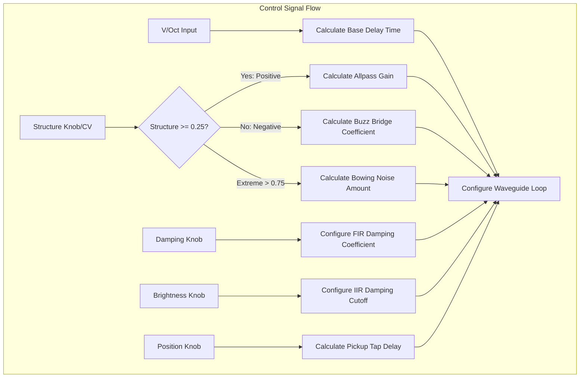
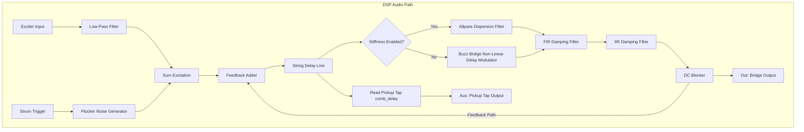

# Inharmonic String

This document covers the **Inharmonic / Modulated String** engine of the
[Rings](https://github.com/arachnegl/eurorack/tree/master/rings) module. 
This engine is selected when the module's model LED is red.

---

## 1. Audio Principles: Waveguide & Dispersion

This engine models physical strings using **Digital Waveguide Synthesis** (where delays represent propagation time and 
filters represent reflection/bridge losses). It extends the basic Karplus-Strong model to simulate string stiffness, 
bowing noise, and sitar-like buzz bridges.

### String Stiffness (Dispersion)
Perfect strings produce integer harmonics. However, stiff strings (like thick steel strings or piano strings) cause 
high-frequency waves to travel faster than low-frequency waves. This is called **dispersion**:
* In waveguide models, dispersion is simulated by inserting **Allpass filters** in the delay feedback loop.
* Positive **Structure** increases this stiffness, making the harmonics go sharp (inharmonic), creating metallic, 
  bell-like decays.

### Sitar "Buzz" Bridge
When a string vibrates against a flat or slightly curved bridge (like the *jawari* bridge on
a sitar), the contact point varies dynamically with the string's displacement.
* This is a non-linear boundary condition.
* Negative **Structure** simulates this buzz bridge, introducing distortion, high-frequency buzz,
  and amplitude-dependent pitch gliding.

### Bowing/Scraping Noise
At extreme settings, high-frequency noise is injected into the delay modulation, simulating the friction of a bow or 
a scraping pick against the string.

---

## 2. Code Implementation

The modulated string is implemented in the [String](https://github.com/arachnegl/eurorack/blob/master/rings/dsp/string.h) class.

### Feedback Loop and Damping
Inside [String::ProcessInternal()](https://github.com/arachnegl/eurorack/blob/master/rings/dsp/string.cc#L72):
- **Karplus-Strong Damping**: Damping and brightness are mapped to a 3-tap FIR filter (`fir_damping_filter_`):
  ```cpp
  float h0 = (1.0f + brightness_) * 0.5f;
  float h1 = (1.0f - brightness_) * 0.25f;
  float y = damping_ * (h0 * x_ + h1 * (x + x__));
  ```
- **IIR Absorption**: An SVF filter (`iir_damping_filter_`) provides secondary lowpass filtering to simulate 
  air absorption.

### Allpass Dispersion and Non-Linearities
- **Stiffness Allpass**: If `dispersion_` is positive, an allpass filter `stretch_` is inserted:
  ```cpp
  float ap_gain = -0.618f * dispersion / (0.15f + fabs(dispersion));
  s = stretch_.Allpass(s, ap_delay, ap_gain);
  ```
- **Buzz Bridge Non-Linearity**: If `dispersion_` is negative, the non-linear feedback term `curved_bridge_` 
  modulates the delay length:
  ```cpp
  float value = fabs(s) - 0.025f;
  float sign = s > 0.0f ? 1.0f : -1.5f;
  curved_bridge_ = (fabs(value) + value) * sign;
  delay *= (1.0f - curved_bridge_ * bridge_curving);
  ```
- **Pickup Tap (Position)**:
  - The main output is taken from the bridge: `out_sample_[0] = s`.
  - The auxiliary output is taken from a tapped location along the delay line: `string_.Read(comb_delay)`. This 
    simulates the pickup position.

---

## 3. Structural Flow Diagrams

### Control Path Diagram


### DSP Audio Path Diagram


---

<!-- KaTeX support for mathematical formulas -->
<link rel="stylesheet" href="https://cdn.jsdelivr.net/npm/katex@0.16.8/dist/katex.min.css">
<script defer src="https://cdn.jsdelivr.net/npm/katex@0.16.8/dist/katex.min.js"></script>
<script defer src="https://cdn.jsdelivr.net/npm/katex@0.16.8/dist/contrib/auto-render.min.js"
        onload="renderMathInElement(document.body, {
          delimiters: [
            {left: '$$', right: '$$', display: true},
            {left: '$', right: '$', display: false}
          ]
        });"></script>

<!-- Mermaid JS support for rendering diagrams with Click-to-Zoom Lightbox -->
<script type="module">
  import mermaid from 'https://cdn.jsdelivr.net/npm/mermaid@10/dist/mermaid.esm.min.mjs';
  mermaid.initialize({ startOnLoad: false });
  
  // Inject lightbox styling
  const style = document.createElement('style');
  style.textContent = `
    .mermaid-lightbox {
      position: fixed;
      top: 0;
      left: 0;
      width: 100vw;
      height: 100vh;
      background: rgba(15, 15, 15, 0.9);
      backdrop-filter: blur(8px);
      -webkit-backdrop-filter: blur(8px);
      display: flex;
      align-items: center;
      justify-content: center;
      z-index: 10000;
      opacity: 0;
      transition: opacity 0.2s ease;
      pointer-events: none;
    }
    .mermaid-lightbox.active {
      opacity: 1;
      pointer-events: auto;
    }
    .mermaid-lightbox svg {
      max-width: 90%;
      max-height: 90%;
      width: auto;
      height: auto;
      background: rgba(255, 255, 255, 0.95);
      padding: 20px;
      border-radius: 8px;
      box-shadow: 0 20px 50px rgba(0, 0, 0, 0.3);
    }
    .mermaid-lightbox .close-btn {
      position: absolute;
      top: 20px;
      right: 30px;
      font-size: 40px;
      color: #fff;
      cursor: pointer;
      user-select: none;
      font-family: sans-serif;
    }
    .mermaid-trigger {
      cursor: zoom-in;
      transition: transform 0.2s ease;
    }
    .mermaid-trigger:hover {
      transform: scale(1.01);
    }
  `;
  document.head.appendChild(style);

  // Inject lightbox modal elements
  const lightbox = document.createElement('div');
  lightbox.className = 'mermaid-lightbox';
  lightbox.innerHTML = '<span class="close-btn">&times;</span><div class="content"></div>';
  document.body.appendChild(lightbox);

  lightbox.addEventListener('click', () => {
    lightbox.classList.remove('active');
  });

  // Convert Mermaid code blocks to styled divs
  const codeBlocks = document.querySelectorAll('.language-mermaid code, pre code.language-mermaid');
  codeBlocks.forEach((block) => {
    const container = block.closest('.language-mermaid') || block.parentElement;
    const el = document.createElement('div');
    el.className = 'mermaid mermaid-trigger';
    el.textContent = block.textContent;
    container.replaceWith(el);
  });
  
  // Render and handle lightbox events
  mermaid.run().then(() => {
    document.querySelectorAll('.mermaid-trigger').forEach((trigger) => {
      trigger.addEventListener('click', () => {
        const content = lightbox.querySelector('.content');
        content.innerHTML = trigger.innerHTML;
        lightbox.classList.add('active');
      });
    });
  });
</script>
