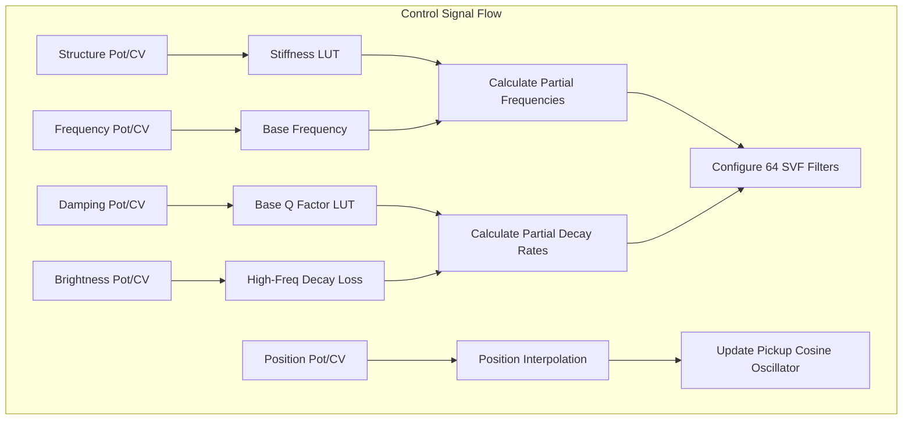
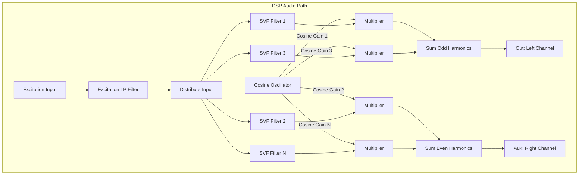

# Modal Resonator

This document covers the **Modal Resonator** engine of the [Rings](https://github.com/arachnegl/eurorack/tree/master/rings) module. 
This engine is selected when the module's model LED is green.

---

## 1. Audio Principles: Modal Synthesis

Modal synthesis is based on the principle that any vibrating physical structure (like a wooden bar, a metal plate,
or a glass bowl) can be represented mathematically as a bank of resonant bandpass filters. 

### Frequency Partials & Inharmonicity
When the object is excited, it vibrates at a set of natural frequencies called **modes** (or partials):
* **Harmonic partials** are integer multiples of the fundamental frequency ($f_0, 2f_0, 3f_0, \dots$), typical of 
  vibrating thin strings.
* **Inharmonic partials** are non-integer multiples of the fundamental frequency, typical of plates, thick bars, 
  and membranes.

The **Structure** parameter shifts these partials:
* At `Structure = 0.5`, the partials are perfectly harmonic (simulating a thin string).
* At `Structure > 0.5`, the partials are stretched out (simulating a stiff bar, pipe, or bell).
* At `Structure < 0.5`, the partials are compressed (simulating a drum head or plate).

### Pickup Position
When a physical instrument vibrates, the position where we listen to it (or place a magnetic pickup) determines 
which harmonics we hear. 
* If the pickup is placed at the exact center (50%) of a string, all even harmonics ($2f_0, 4f_0, \dots$) have a 
  node (zero vibration) at that point and are completely cancelled out.
* By moving the pickup location, we introduce different comb-filter-like notches across the spectrum.

---

## 2. Code Implementation

The modal resonator is implemented in the [Resonator](https://github.com/arachnegl/eurorack/blob/master/rings/dsp/resonator.h) class:
- Filter bank: `stmlib::Svf f_[64]` (an array of 64 State Variable Filters).
- Spacial pickup amplitudes: `stmlib::CosineOscillator` used to compute pick-up gains.

### Parameter Mapping & Filter Computation
Inside [ComputeFilters()](https://github.com/arachnegl/eurorack/blob/master/rings/dsp/resonator.cc#L56):
1. **Stiffness / Structure**: Stretches or compresses the harmonic series using `lut_stiffness`:
   ```cpp
   float stiffness = Interpolate(lut_stiffness, structure_, 256.0f);
   ```
2. **Decay (Damping)**: Maps the decay time to filter quality factor ($Q$) using `lut_4_decades`:
   ```cpp
   float q = 500.0f * Interpolate(lut_4_decades, damping_, 256.0f);
   ```
3. **Brightness**: Attenuates the decay rate of higher frequencies ($Q$ decreases for higher partials):
   ```cpp
   q *= q_loss;
   ```
4. **Filter Update Loop**: Iterates through the filters, setting their center frequency and $Q$:
   ```cpp
   f_[i].set_f_q<FREQUENCY_FAST>(partial_frequency, 1.0f + partial_frequency * q);
   stretch_factor += stiffness;
   ```

### Signal Processing
Inside [Process()](https://github.com/arachnegl/eurorack/blob/master/rings/dsp/resonator.cc#L101):
* An excitation input (pulse or external audio) is sent to all active bandpass filters.
* The output is split into two pickup channels (**Odd** and **Even** modes) using a cosine oscillator:
  ```cpp
  float odd = 0.0f;
  float even = 0.0f;
  for (int32_t i = 0; i < num_modes;) {
    odd += amplitudes.Next() * f_[i++].Process<FILTER_MODE_BAND_PASS>(input);
    even += amplitudes.Next() * f_[i++].Process<FILTER_MODE_BAND_PASS>(input);
  }
  ```

---

## 3. Structural Flow Diagrams

### Control Path Diagram


### DSP Audio Path Diagram


---

<!-- KaTeX support for mathematical formulas -->
<link rel="stylesheet" href="https://cdn.jsdelivr.net/npm/katex@0.16.8/dist/katex.min.css">
<script defer src="https://cdn.jsdelivr.net/npm/katex@0.16.8/dist/katex.min.js"></script>
<script defer src="https://cdn.jsdelivr.net/npm/katex@0.16.8/dist/contrib/auto-render.min.js"
        onload="renderMathInElement(document.body, {
          delimiters: [
            {left: '$$', right: '$$', display: true},
            {left: '$', right: '$', display: false}
          ]
        });"></script>

<!-- Mermaid JS support for rendering diagrams with Click-to-Zoom Lightbox -->
<script type="module">
  import mermaid from 'https://cdn.jsdelivr.net/npm/mermaid@10/dist/mermaid.esm.min.mjs';
  mermaid.initialize({ startOnLoad: false });
  
  // Inject lightbox styling
  const style = document.createElement('style');
  style.textContent = `
    .mermaid-lightbox {
      position: fixed;
      top: 0;
      left: 0;
      width: 100vw;
      height: 100vh;
      background: rgba(15, 15, 15, 0.9);
      backdrop-filter: blur(8px);
      -webkit-backdrop-filter: blur(8px);
      display: flex;
      align-items: center;
      justify-content: center;
      z-index: 10000;
      opacity: 0;
      transition: opacity 0.2s ease;
      pointer-events: none;
    }
    .mermaid-lightbox.active {
      opacity: 1;
      pointer-events: auto;
    }
    .mermaid-lightbox svg {
      max-width: 90%;
      max-height: 90%;
      width: auto;
      height: auto;
      background: rgba(255, 255, 255, 0.95);
      padding: 20px;
      border-radius: 8px;
      box-shadow: 0 20px 50px rgba(0, 0, 0, 0.3);
    }
    .mermaid-lightbox .close-btn {
      position: absolute;
      top: 20px;
      right: 30px;
      font-size: 40px;
      color: #fff;
      cursor: pointer;
      user-select: none;
      font-family: sans-serif;
    }
    .mermaid-trigger {
      cursor: zoom-in;
      transition: transform 0.2s ease;
    }
    .mermaid-trigger:hover {
      transform: scale(1.01);
    }
  `;
  document.head.appendChild(style);

  // Inject lightbox modal elements
  const lightbox = document.createElement('div');
  lightbox.className = 'mermaid-lightbox';
  lightbox.innerHTML = '<span class="close-btn">&times;</span><div class="content"></div>';
  document.body.appendChild(lightbox);

  lightbox.addEventListener('click', () => {
    lightbox.classList.remove('active');
  });

  // Convert Mermaid code blocks to styled divs
  const codeBlocks = document.querySelectorAll('.language-mermaid code, pre code.language-mermaid');
  codeBlocks.forEach((block) => {
    const container = block.closest('.language-mermaid') || block.parentElement;
    const el = document.createElement('div');
    el.className = 'mermaid mermaid-trigger';
    el.textContent = block.textContent;
    container.replaceWith(el);
  });
  
  // Render and handle lightbox events
  mermaid.run().then(() => {
    document.querySelectorAll('.mermaid-trigger').forEach((trigger) => {
      trigger.addEventListener('click', () => {
        const content = lightbox.querySelector('.content');
        content.innerHTML = trigger.innerHTML;
        lightbox.classList.add('active');
      });
    });
  });
</script>
