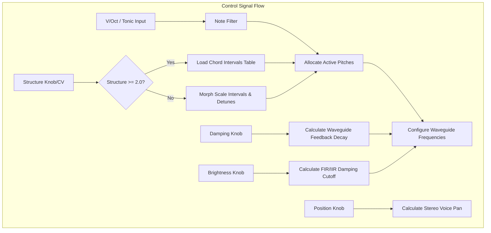
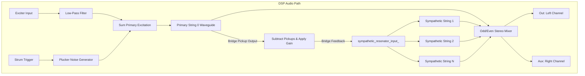

# Sympathetic String

This document covers the **Sympathetic String** engine of the [Rings](https://github.com/arachnegl/eurorack/tree/master/rings) module. 
This engine is selected when the module's model LED is orange.

---

## 1. Audio Principles: Sympathetic Resonance

Sympathetic resonance occurs when strings are acoustically coupled to a shared soundboard or bridge.
When one string is plucked, its vibrations travel through the bridge and excite other strings that
share harmonic frequencies.

### Coupled Waveguide Synthesis
Rings simulates this phenomenon using parallel digital waveguides:
* **Primary String**: Receives the initial excitation signal (either an external audio input or
  an internal trigger noise pluck).
* **Sympathetic Strings**: Receive the output of the other strings as their input, simulating
  the transfer of energy across a shared virtual bridge.

### Chord Morphs & Tuning
The **Structure** knob controls the frequency relationships (tuning) of the sympathetic strings:
* **Scale Morph (Structure < 2.0)**: The strings are tuned to notes from a continuous scale (tonic,
  octaves, fifths, detuned intervals). Turning the knob morphs the strings smoothly.
* **Quantized Chords (Structure >= 2.0)**: The strings are locked to chord configurations (like Octaves,
  Fifths, Minor, Minor 7th, Major 7th, etc.) selected from a predefined chord table.

---

## 2. Code Implementation

Sympathetic resonance is orchestrated by the [Part](https://github.com/arachnegl/eurorack/blob/master/rings/dsp/part.h) class managing multiple parallel
instances of the [String](https://github.com/arachnegl/eurorack/blob/master/rings/dsp/string.h) class.

### Pitch Computation
Inside [ComputeSympatheticStringsNotes()](https://github.com/arachnegl/eurorack/blob/master/rings/dsp/part.cc#L242):
- When `parameter >= 2.0f`, the chord notes are loaded from the `chords` table based on active polyphony:
  ```cpp
  int32_t chord_index = parameter - 2.0f;
  const float* chord = chords[polyphony_ - 1][chord_index];
  for (size_t i = 0; i < num_strings; ++i) {
    destination[i] = chord[i] + note;
  }
  ```
- When `parameter < 2.0f`, notes are interpolated between standard intervals (tonic, octave, fifth)
  with slight detuning.

### Coupled Bridge Feedback
Inside [Part::Process()](https://github.com/arachnegl/eurorack/blob/master/rings/dsp/part.cc#L463):
1. **Voice Allocation**: Active voices are selected and updated with target pitches.
2. **Coupled Excitation**: The feedback input for sympathetic resonance is calculated by subtracting the pickups 
  and scaling the gain:
   ```cpp
   float gain = 0.2f / static_cast<float>(num_strings);
   for (size_t i = 0; i < size; ++i) {
     float sum = out_buffer_[i] - aux_buffer_[i];
     sympathetic_resonator_input_[i] = gain * sum;
   }
   ```
3. **Loop Rendering**: Each coupled string is rendered in [RenderStringVoice()](https://github.com/arachnegl/eurorack/blob/master/rings/dsp/part.cc#L350):
   * String 0 (primary) receives the main excitation input + plucker noise burst.
   * Strings 1 to $N$ receive `sympathetic_resonator_input_` as their excitation source.

---

## 3. Structural Flow Diagrams

### Control Path Diagram


### DSP Audio Path Diagram


---

<!-- KaTeX support for mathematical formulas -->
<link rel="stylesheet" href="https://cdn.jsdelivr.net/npm/katex@0.16.8/dist/katex.min.css">
<script defer src="https://cdn.jsdelivr.net/npm/katex@0.16.8/dist/katex.min.js"></script>
<script defer src="https://cdn.jsdelivr.net/npm/katex@0.16.8/dist/contrib/auto-render.min.js"
        onload="renderMathInElement(document.body, {
          delimiters: [
            {left: '$$', right: '$$', display: true},
            {left: '$', right: '$', display: false}
          ]
        });"></script>

<!-- Mermaid JS support for rendering diagrams with Click-to-Zoom Lightbox -->
<script type="module">
  import mermaid from 'https://cdn.jsdelivr.net/npm/mermaid@10/dist/mermaid.esm.min.mjs';
  mermaid.initialize({ startOnLoad: false });
  
  // Inject lightbox styling
  const style = document.createElement('style');
  style.textContent = `
    .mermaid-lightbox {
      position: fixed;
      top: 0;
      left: 0;
      width: 100vw;
      height: 100vh;
      background: rgba(15, 15, 15, 0.9);
      backdrop-filter: blur(8px);
      -webkit-backdrop-filter: blur(8px);
      display: flex;
      align-items: center;
      justify-content: center;
      z-index: 10000;
      opacity: 0;
      transition: opacity 0.2s ease;
      pointer-events: none;
    }
    .mermaid-lightbox.active {
      opacity: 1;
      pointer-events: auto;
    }
    .mermaid-lightbox svg {
      max-width: 90%;
      max-height: 90%;
      width: auto;
      height: auto;
      background: rgba(255, 255, 255, 0.95);
      padding: 20px;
      border-radius: 8px;
      box-shadow: 0 20px 50px rgba(0, 0, 0, 0.3);
    }
    .mermaid-lightbox .close-btn {
      position: absolute;
      top: 20px;
      right: 30px;
      font-size: 40px;
      color: #fff;
      cursor: pointer;
      user-select: none;
      font-family: sans-serif;
    }
    .mermaid-trigger {
      cursor: zoom-in;
      transition: transform 0.2s ease;
    }
    .mermaid-trigger:hover {
      transform: scale(1.01);
    }
  `;
  document.head.appendChild(style);

  // Inject lightbox modal elements
  const lightbox = document.createElement('div');
  lightbox.className = 'mermaid-lightbox';
  lightbox.innerHTML = '<span class="close-btn">&times;</span><div class="content"></div>';
  document.body.appendChild(lightbox);

  lightbox.addEventListener('click', () => {
    lightbox.classList.remove('active');
  });

  // Convert Mermaid code blocks to styled divs
  const codeBlocks = document.querySelectorAll('.language-mermaid code, pre code.language-mermaid');
  codeBlocks.forEach((block) => {
    const container = block.closest('.language-mermaid') || block.parentElement;
    const el = document.createElement('div');
    el.className = 'mermaid mermaid-trigger';
    el.textContent = block.textContent;
    container.replaceWith(el);
  });
  
  // Render and handle lightbox events
  mermaid.run().then(() => {
    document.querySelectorAll('.mermaid-trigger').forEach((trigger) => {
      trigger.addEventListener('click', () => {
        const content = lightbox.querySelector('.content');
        content.innerHTML = trigger.innerHTML;
        lightbox.classList.add('active');
      });
    });
  });
</script>
